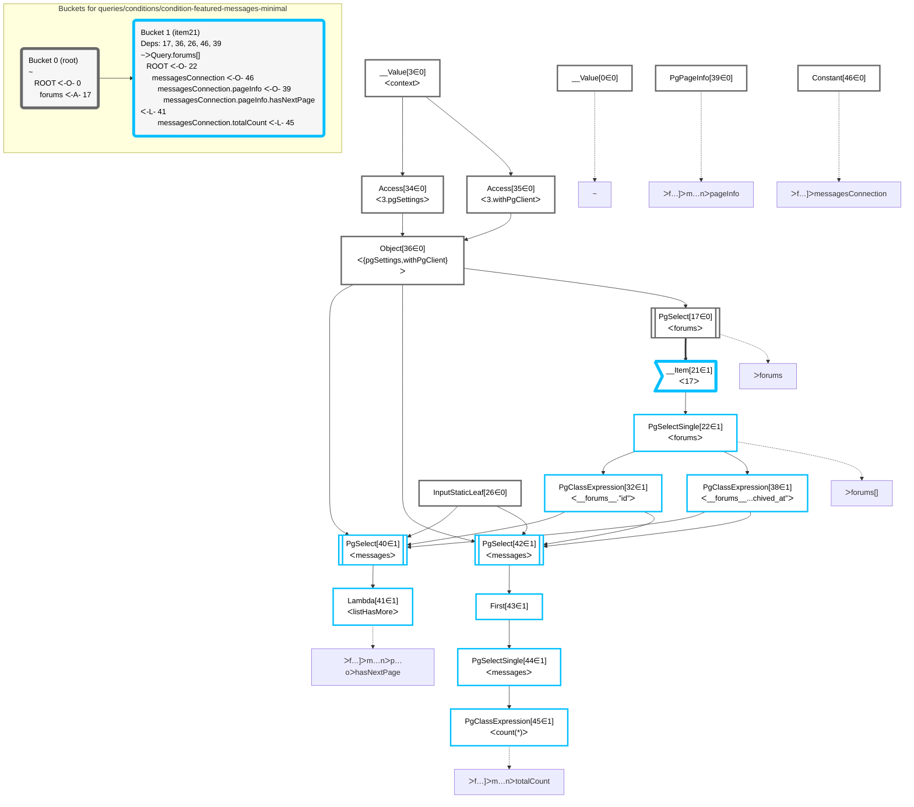

```mermaid
graph TD
    classDef path fill:#eee,stroke:#000,color:#000
    classDef plan fill:#fff,stroke-width:3px,color:#000
    classDef itemplan fill:#fff,stroke-width:6px,color:#000
    classDef sideeffectplan fill:#f00,stroke-width:6px,color:#000
    classDef bucket fill:#f6f6f6,color:#000,stroke-width:6px,text-align:left


    %% define plans
    __Value0["__Value[0∈0]"]:::plan
    Lambda41["Lambda[41∈1]<br />ᐸlistHasMoreᐳ"]:::plan
    PgSelect40[["PgSelect[40∈1]<br />ᐸmessagesᐳ"]]:::plan
    PgClassExpression45["PgClassExpression[45∈1]<br />ᐸcount(*)ᐳ"]:::plan
    PgSelectSingle44["PgSelectSingle[44∈1]<br />ᐸmessagesᐳ"]:::plan
    First43["First[43∈1]"]:::plan
    PgSelect42[["PgSelect[42∈1]<br />ᐸmessagesᐳ"]]:::plan
    PgClassExpression32["PgClassExpression[32∈1]<br />ᐸ__forums__.”id”ᐳ"]:::plan
    PgClassExpression38["PgClassExpression[38∈1]<br />ᐸ__forums__...chived_at”ᐳ"]:::plan
    PgSelectSingle22["PgSelectSingle[22∈1]<br />ᐸforumsᐳ"]:::plan
    __Item21>"__Item[21∈1]<br />ᐸ17ᐳ"]:::itemplan
    PgSelect17[["PgSelect[17∈0]<br />ᐸforumsᐳ"]]:::plan
    Object36["Object[36∈0]<br />ᐸ{pgSettings,withPgClient}ᐳ"]:::plan
    Access34["Access[34∈0]<br />ᐸ3.pgSettingsᐳ"]:::plan
    Access35["Access[35∈0]<br />ᐸ3.withPgClientᐳ"]:::plan
    __Value3["__Value[3∈0]<br />ᐸcontextᐳ"]:::plan
    InputStaticLeaf26["InputStaticLeaf[26∈0]"]:::plan
    Constant46["Constant[46∈0]"]:::plan
    PgPageInfo39["PgPageInfo[39∈0]"]:::plan

    %% plan dependencies
    PgSelect40 --> Lambda41
    Object36 & PgClassExpression32 & InputStaticLeaf26 & PgClassExpression38 --> PgSelect40
    PgSelectSingle44 --> PgClassExpression45
    First43 --> PgSelectSingle44
    PgSelect42 --> First43
    Object36 & PgClassExpression32 & InputStaticLeaf26 & PgClassExpression38 --> PgSelect42
    PgSelectSingle22 --> PgClassExpression32
    PgSelectSingle22 --> PgClassExpression38
    __Item21 --> PgSelectSingle22
    PgSelect17 ==> __Item21
    Object36 --> PgSelect17
    Access34 & Access35 --> Object36
    __Value3 --> Access34
    __Value3 --> Access35

    %% plan-to-path relationships
    P0["~"]
    __Value0 -.-> P0
    P17["ᐳforums"]
    PgSelect17 -.-> P17
    P22["ᐳforums[]"]
    PgSelectSingle22 -.-> P22
    P39["ᐳf…]ᐳm…nᐳpageInfo"]
    PgPageInfo39 -.-> P39
    P41["ᐳf…]ᐳm…nᐳp…oᐳhasNextPage"]
    Lambda41 -.-> P41
    P45["ᐳf…]ᐳm…nᐳtotalCount"]
    PgClassExpression45 -.-> P45
    P46["ᐳf…]ᐳmessagesConnection"]
    Constant46 -.-> P46

    subgraph "Buckets for queries/conditions/condition-featured-messages-minimal"
    Bucket0("Bucket 0 (root)<br />~<br />⠀ROOT ᐸ-O- 0<br />⠀⠀forums ᐸ-A- 17"):::bucket
    classDef bucket0 stroke:#696969
    class Bucket0,__Value0,__Value3,PgSelect17,InputStaticLeaf26,Access34,Access35,Object36,PgPageInfo39,Constant46 bucket0
    Bucket1("Bucket 1 (item21)<br />Deps: 17, 36, 26, 46, 39<br />~ᐳQuery.forums[]<br />⠀ROOT ᐸ-O- 22<br />⠀⠀messagesConnection ᐸ-O- 46<br />⠀⠀⠀messagesConnection.pageInfo ᐸ-O- 39<br />⠀⠀⠀⠀messagesConnection.pageInfo.hasNextPage ᐸ-L- 41<br />⠀⠀⠀messagesConnection.totalCount ᐸ-L- 45"):::bucket
    classDef bucket1 stroke:#00bfff
    class Bucket1,__Item21,PgSelectSingle22,PgClassExpression32,PgClassExpression38,PgSelect40,Lambda41,PgSelect42,First43,PgSelectSingle44,PgClassExpression45 bucket1
    Bucket0 --> Bucket1
    end
```
