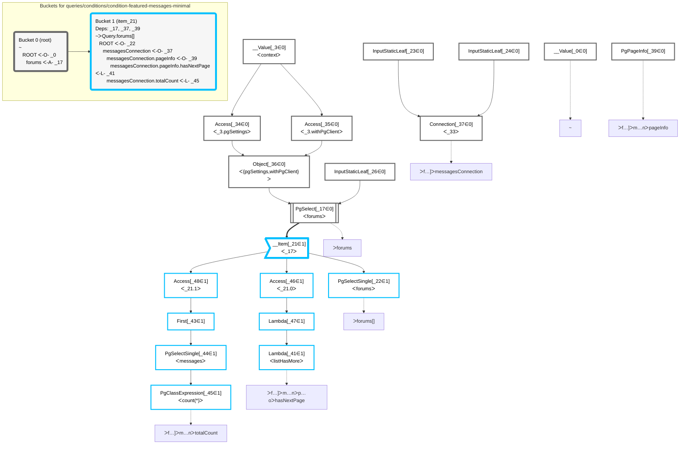

```mermaid
graph TD
    classDef path fill:#eee,stroke:#000,color:#000
    classDef plan fill:#fff,stroke-width:3px,color:#000
    classDef itemplan fill:#fff,stroke-width:6px,color:#000
    classDef sideeffectplan fill:#f00,stroke-width:6px,color:#000
    classDef bucket fill:#f6f6f6,color:#000,stroke-width:6px,text-align:left


    %% define plans
    __Value_0["__Value[_0∈0]"]:::plan
    __Value_3["__Value[_3∈0]<br />ᐸcontextᐳ"]:::plan
    PgSelect_17[["PgSelect[_17∈0]<br />ᐸforumsᐳ"]]:::plan
    __Item_21>"__Item[_21∈1]<br />ᐸ_17ᐳ"]:::itemplan
    PgSelectSingle_22["PgSelectSingle[_22∈1]<br />ᐸforumsᐳ"]:::plan
    InputStaticLeaf_23["InputStaticLeaf[_23∈0]"]:::plan
    InputStaticLeaf_24["InputStaticLeaf[_24∈0]"]:::plan
    InputStaticLeaf_26["InputStaticLeaf[_26∈0]"]:::plan
    Access_34["Access[_34∈0]<br />ᐸ_3.pgSettingsᐳ"]:::plan
    Access_35["Access[_35∈0]<br />ᐸ_3.withPgClientᐳ"]:::plan
    Object_36["Object[_36∈0]<br />ᐸ{pgSettings,withPgClient}ᐳ"]:::plan
    Connection_37["Connection[_37∈0]<br />ᐸ_33ᐳ"]:::plan
    PgPageInfo_39["PgPageInfo[_39∈0]"]:::plan
    Lambda_41["Lambda[_41∈1]<br />ᐸlistHasMoreᐳ"]:::plan
    First_43["First[_43∈1]"]:::plan
    PgSelectSingle_44["PgSelectSingle[_44∈1]<br />ᐸmessagesᐳ"]:::plan
    PgClassExpression_45["PgClassExpression[_45∈1]<br />ᐸcount(*)ᐳ"]:::plan
    Access_46["Access[_46∈1]<br />ᐸ_21.0ᐳ"]:::plan
    Lambda_47["Lambda[_47∈1]"]:::plan
    Access_48["Access[_48∈1]<br />ᐸ_21.1ᐳ"]:::plan

    %% plan dependencies
    Object_36 --> PgSelect_17
    InputStaticLeaf_26 --> PgSelect_17
    PgSelect_17 ==> __Item_21
    __Item_21 --> PgSelectSingle_22
    __Value_3 --> Access_34
    __Value_3 --> Access_35
    Access_34 --> Object_36
    Access_35 --> Object_36
    InputStaticLeaf_23 --> Connection_37
    InputStaticLeaf_24 --> Connection_37
    Lambda_47 --> Lambda_41
    Access_48 --> First_43
    First_43 --> PgSelectSingle_44
    PgSelectSingle_44 --> PgClassExpression_45
    __Item_21 --> Access_46
    Access_46 --> Lambda_47
    __Item_21 --> Access_48

    %% plan-to-path relationships
    P_0["~"]
    __Value_0 -.-> P_0
    P_17["ᐳforums"]
    PgSelect_17 -.-> P_17
    P_22["ᐳforums[]"]
    PgSelectSingle_22 -.-> P_22
    P_37["ᐳf…]ᐳmessagesConnection"]
    Connection_37 -.-> P_37
    P_39["ᐳf…]ᐳm…nᐳpageInfo"]
    PgPageInfo_39 -.-> P_39
    P_41["ᐳf…]ᐳm…nᐳp…oᐳhasNextPage"]
    Lambda_41 -.-> P_41
    P_45["ᐳf…]ᐳm…nᐳtotalCount"]
    PgClassExpression_45 -.-> P_45

    %% allocate buckets
    classDef bucket0 stroke:#696969
    class __Value_0,__Value_3,PgSelect_17,InputStaticLeaf_23,InputStaticLeaf_24,InputStaticLeaf_26,Access_34,Access_35,Object_36,Connection_37,PgPageInfo_39 bucket0
    classDef bucket1 stroke:#00bfff
    class __Item_21,PgSelectSingle_22,Lambda_41,First_43,PgSelectSingle_44,PgClassExpression_45,Access_46,Lambda_47,Access_48 bucket1

    subgraph "Buckets for queries/conditions/condition-featured-messages-minimal"
    Bucket0("Bucket 0 (root)<br />~<br />⠀ROOT ᐸ-O- _0<br />⠀⠀forums ᐸ-A- _17"):::bucket
    style Bucket0 stroke:#696969
    Bucket1("Bucket 1 (item_21)<br />Deps: _17, _37, _39<br />~ᐳQuery.forums[]<br />⠀ROOT ᐸ-O- _22<br />⠀⠀messagesConnection ᐸ-O- _37<br />⠀⠀⠀messagesConnection.pageInfo ᐸ-O- _39<br />⠀⠀⠀⠀messagesConnection.pageInfo.hasNextPage ᐸ-L- _41<br />⠀⠀⠀messagesConnection.totalCount ᐸ-L- _45"):::bucket
    style Bucket1 stroke:#00bfff
    Bucket0 --> Bucket1
    end
```
