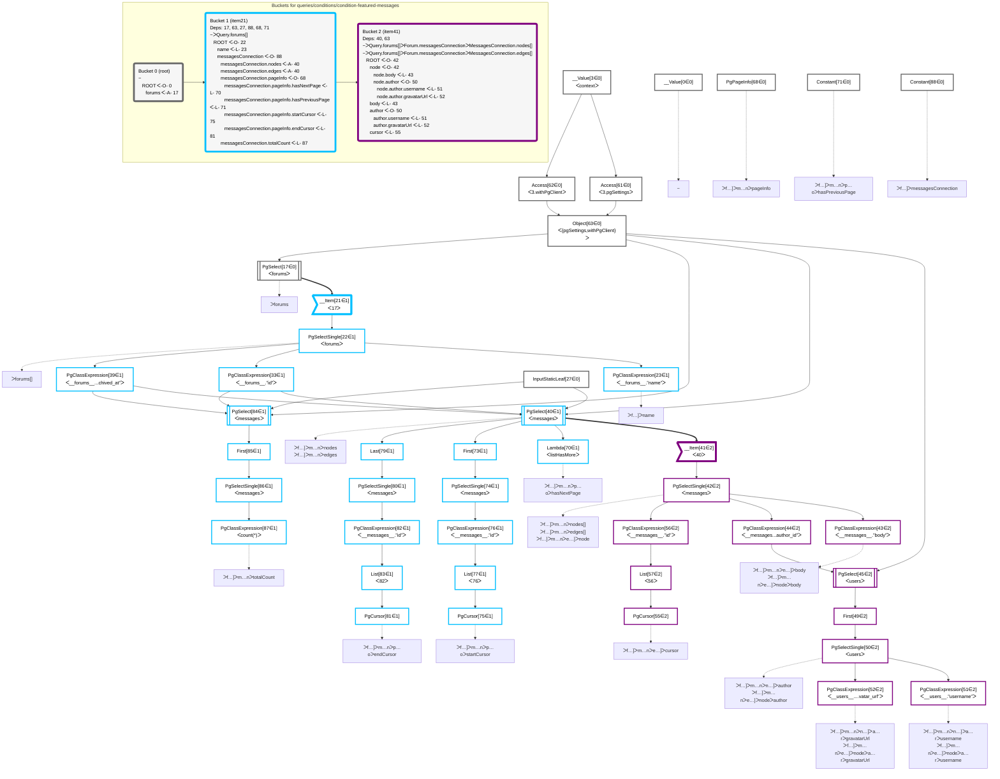

```mermaid
graph TD
    classDef path fill:#eee,stroke:#000,color:#000
    classDef plan fill:#fff,stroke-width:3px,color:#000
    classDef itemplan fill:#fff,stroke-width:6px,color:#000
    classDef sideeffectplan fill:#f00,stroke-width:6px,color:#000
    classDef bucket fill:#f6f6f6,color:#000,stroke-width:6px,text-align:left


    %% define plans
    __Value0["__Value[0∈0]"]:::plan
    PgClassExpression23["PgClassExpression[23∈1]<br />ᐸ__forums__.”name”ᐳ"]:::plan
    PgClassExpression43["PgClassExpression[43∈2]<br />ᐸ__messages__.”body”ᐳ"]:::plan
    PgClassExpression51["PgClassExpression[51∈2]<br />ᐸ__users__.”username”ᐳ"]:::plan
    PgClassExpression52["PgClassExpression[52∈2]<br />ᐸ__users__....vatar_url”ᐳ"]:::plan
    PgSelectSingle50["PgSelectSingle[50∈2]<br />ᐸusersᐳ"]:::plan
    First49["First[49∈2]"]:::plan
    PgSelect45[["PgSelect[45∈2]<br />ᐸusersᐳ"]]:::plan
    PgClassExpression44["PgClassExpression[44∈2]<br />ᐸ__messages...author_id”ᐳ"]:::plan
    PgCursor55["PgCursor[55∈2]"]:::plan
    List57["List[57∈2]<br />ᐸ56ᐳ"]:::plan
    PgClassExpression56["PgClassExpression[56∈2]<br />ᐸ__messages__.”id”ᐳ"]:::plan
    PgSelectSingle42["PgSelectSingle[42∈2]<br />ᐸmessagesᐳ"]:::plan
    __Item41>"__Item[41∈2]<br />ᐸ40ᐳ"]:::itemplan
    Lambda70["Lambda[70∈1]<br />ᐸlistHasMoreᐳ"]:::plan
    PgCursor75["PgCursor[75∈1]"]:::plan
    List77["List[77∈1]<br />ᐸ76ᐳ"]:::plan
    PgClassExpression76["PgClassExpression[76∈1]<br />ᐸ__messages__.”id”ᐳ"]:::plan
    PgSelectSingle74["PgSelectSingle[74∈1]<br />ᐸmessagesᐳ"]:::plan
    First73["First[73∈1]"]:::plan
    PgCursor81["PgCursor[81∈1]"]:::plan
    List83["List[83∈1]<br />ᐸ82ᐳ"]:::plan
    PgClassExpression82["PgClassExpression[82∈1]<br />ᐸ__messages__.”id”ᐳ"]:::plan
    PgSelectSingle80["PgSelectSingle[80∈1]<br />ᐸmessagesᐳ"]:::plan
    Last79["Last[79∈1]"]:::plan
    PgSelect40[["PgSelect[40∈1]<br />ᐸmessagesᐳ"]]:::plan
    PgClassExpression87["PgClassExpression[87∈1]<br />ᐸcount(*)ᐳ"]:::plan
    PgSelectSingle86["PgSelectSingle[86∈1]<br />ᐸmessagesᐳ"]:::plan
    First85["First[85∈1]"]:::plan
    PgSelect84[["PgSelect[84∈1]<br />ᐸmessagesᐳ"]]:::plan
    PgClassExpression33["PgClassExpression[33∈1]<br />ᐸ__forums__.”id”ᐳ"]:::plan
    PgClassExpression39["PgClassExpression[39∈1]<br />ᐸ__forums__...chived_at”ᐳ"]:::plan
    PgSelectSingle22["PgSelectSingle[22∈1]<br />ᐸforumsᐳ"]:::plan
    __Item21>"__Item[21∈1]<br />ᐸ17ᐳ"]:::itemplan
    PgSelect17[["PgSelect[17∈0]<br />ᐸforumsᐳ"]]:::plan
    Object63["Object[63∈0]<br />ᐸ{pgSettings,withPgClient}ᐳ"]:::plan
    Access61["Access[61∈0]<br />ᐸ3.pgSettingsᐳ"]:::plan
    Access62["Access[62∈0]<br />ᐸ3.withPgClientᐳ"]:::plan
    __Value3["__Value[3∈0]<br />ᐸcontextᐳ"]:::plan
    InputStaticLeaf27["InputStaticLeaf[27∈0]"]:::plan
    Constant88["Constant[88∈0]"]:::plan
    PgPageInfo68["PgPageInfo[68∈0]"]:::plan
    Constant71["Constant[71∈0]"]:::plan

    %% plan dependencies
    PgSelectSingle22 --> PgClassExpression23
    PgSelectSingle42 --> PgClassExpression43
    PgSelectSingle50 --> PgClassExpression51
    PgSelectSingle50 --> PgClassExpression52
    First49 --> PgSelectSingle50
    PgSelect45 --> First49
    Object63 & PgClassExpression44 --> PgSelect45
    PgSelectSingle42 --> PgClassExpression44
    List57 --> PgCursor55
    PgClassExpression56 --> List57
    PgSelectSingle42 --> PgClassExpression56
    __Item41 --> PgSelectSingle42
    PgSelect40 ==> __Item41
    PgSelect40 --> Lambda70
    List77 --> PgCursor75
    PgClassExpression76 --> List77
    PgSelectSingle74 --> PgClassExpression76
    First73 --> PgSelectSingle74
    PgSelect40 --> First73
    List83 --> PgCursor81
    PgClassExpression82 --> List83
    PgSelectSingle80 --> PgClassExpression82
    Last79 --> PgSelectSingle80
    PgSelect40 --> Last79
    Object63 & PgClassExpression33 & InputStaticLeaf27 & PgClassExpression39 --> PgSelect40
    PgSelectSingle86 --> PgClassExpression87
    First85 --> PgSelectSingle86
    PgSelect84 --> First85
    Object63 & PgClassExpression33 & InputStaticLeaf27 & PgClassExpression39 --> PgSelect84
    PgSelectSingle22 --> PgClassExpression33
    PgSelectSingle22 --> PgClassExpression39
    __Item21 --> PgSelectSingle22
    PgSelect17 ==> __Item21
    Object63 --> PgSelect17
    Access61 & Access62 --> Object63
    __Value3 --> Access61
    __Value3 --> Access62

    %% plan-to-path relationships
    P0["~"]
    __Value0 -.-> P0
    P17["ᐳforums"]
    PgSelect17 -.-> P17
    P22["ᐳforums[]"]
    PgSelectSingle22 -.-> P22
    P23["ᐳf…]ᐳname"]
    PgClassExpression23 -.-> P23
    P40["ᐳf…]ᐳm…nᐳnodes<br />ᐳf…]ᐳm…nᐳedges"]
    PgSelect40 -.-> P40
    P42["ᐳf…]ᐳm…nᐳnodes[]<br />ᐳf…]ᐳm…nᐳedges[]<br />ᐳf…]ᐳm…nᐳe…]ᐳnode"]
    PgSelectSingle42 -.-> P42
    P43["ᐳf…]ᐳm…nᐳn…]ᐳbody<br />ᐳf…]ᐳm…nᐳe…]ᐳnodeᐳbody"]
    PgClassExpression43 -.-> P43
    P50["ᐳf…]ᐳm…nᐳn…]ᐳauthor<br />ᐳf…]ᐳm…nᐳe…]ᐳnodeᐳauthor"]
    PgSelectSingle50 -.-> P50
    P51["ᐳf…]ᐳm…nᐳn…]ᐳa…rᐳusername<br />ᐳf…]ᐳm…nᐳe…]ᐳnodeᐳa…rᐳusername"]
    PgClassExpression51 -.-> P51
    P52["ᐳf…]ᐳm…nᐳn…]ᐳa…rᐳgravatarUrl<br />ᐳf…]ᐳm…nᐳe…]ᐳnodeᐳa…rᐳgravatarUrl"]
    PgClassExpression52 -.-> P52
    P55["ᐳf…]ᐳm…nᐳe…]ᐳcursor"]
    PgCursor55 -.-> P55
    P68["ᐳf…]ᐳm…nᐳpageInfo"]
    PgPageInfo68 -.-> P68
    P70["ᐳf…]ᐳm…nᐳp…oᐳhasNextPage"]
    Lambda70 -.-> P70
    P71["ᐳf…]ᐳm…nᐳp…oᐳhasPreviousPage"]
    Constant71 -.-> P71
    P75["ᐳf…]ᐳm…nᐳp…oᐳstartCursor"]
    PgCursor75 -.-> P75
    P81["ᐳf…]ᐳm…nᐳp…oᐳendCursor"]
    PgCursor81 -.-> P81
    P87["ᐳf…]ᐳm…nᐳtotalCount"]
    PgClassExpression87 -.-> P87
    P88["ᐳf…]ᐳmessagesConnection"]
    Constant88 -.-> P88

    subgraph "Buckets for queries/conditions/condition-featured-messages"
    Bucket0("Bucket 0 (root)<br />~<br />⠀ROOT ᐸ-O- 0<br />⠀⠀forums ᐸ-A- 17"):::bucket
    classDef bucket0 stroke:#696969
    class Bucket0,__Value0,__Value3,PgSelect17,InputStaticLeaf27,Access61,Access62,Object63,PgPageInfo68,Constant71,Constant88 bucket0
    Bucket1("Bucket 1 (item21)<br />Deps: 17, 63, 27, 88, 68, 71<br />~ᐳQuery.forums[]<br />⠀ROOT ᐸ-O- 22<br />⠀⠀name ᐸ-L- 23<br />⠀⠀messagesConnection ᐸ-O- 88<br />⠀⠀⠀messagesConnection.nodes ᐸ-A- 40<br />⠀⠀⠀messagesConnection.edges ᐸ-A- 40<br />⠀⠀⠀messagesConnection.pageInfo ᐸ-O- 68<br />⠀⠀⠀⠀messagesConnection.pageInfo.hasNextPage ᐸ-L- 70<br />⠀⠀⠀⠀messagesConnection.pageInfo.hasPreviousPage ᐸ-L- 71<br />⠀⠀⠀⠀messagesConnection.pageInfo.startCursor ᐸ-L- 75<br />⠀⠀⠀⠀messagesConnection.pageInfo.endCursor ᐸ-L- 81<br />⠀⠀⠀messagesConnection.totalCount ᐸ-L- 87"):::bucket
    classDef bucket1 stroke:#00bfff
    class Bucket1,__Item21,PgSelectSingle22,PgClassExpression23,PgClassExpression33,PgClassExpression39,PgSelect40,Lambda70,First73,PgSelectSingle74,PgCursor75,PgClassExpression76,List77,Last79,PgSelectSingle80,PgCursor81,PgClassExpression82,List83,PgSelect84,First85,PgSelectSingle86,PgClassExpression87 bucket1
    Bucket2("Bucket 2 (item41)<br />Deps: 40, 63<br />~ᐳQuery.forums[]ᐳForum.messagesConnectionᐳMessagesConnection.nodes[]<br />~ᐳQuery.forums[]ᐳForum.messagesConnectionᐳMessagesConnection.edges[]<br />⠀ROOT ᐸ-O- 42<br />⠀⠀node ᐸ-O- 42<br />⠀⠀⠀node.body ᐸ-L- 43<br />⠀⠀⠀node.author ᐸ-O- 50<br />⠀⠀⠀⠀node.author.username ᐸ-L- 51<br />⠀⠀⠀⠀node.author.gravatarUrl ᐸ-L- 52<br />⠀⠀body ᐸ-L- 43<br />⠀⠀author ᐸ-O- 50<br />⠀⠀⠀author.username ᐸ-L- 51<br />⠀⠀⠀author.gravatarUrl ᐸ-L- 52<br />⠀⠀cursor ᐸ-L- 55"):::bucket
    classDef bucket2 stroke:#7f007f
    class Bucket2,__Item41,PgSelectSingle42,PgClassExpression43,PgClassExpression44,PgSelect45,First49,PgSelectSingle50,PgClassExpression51,PgClassExpression52,PgCursor55,PgClassExpression56,List57 bucket2
    Bucket0 --> Bucket1
    Bucket1 --> Bucket2
    end
```
