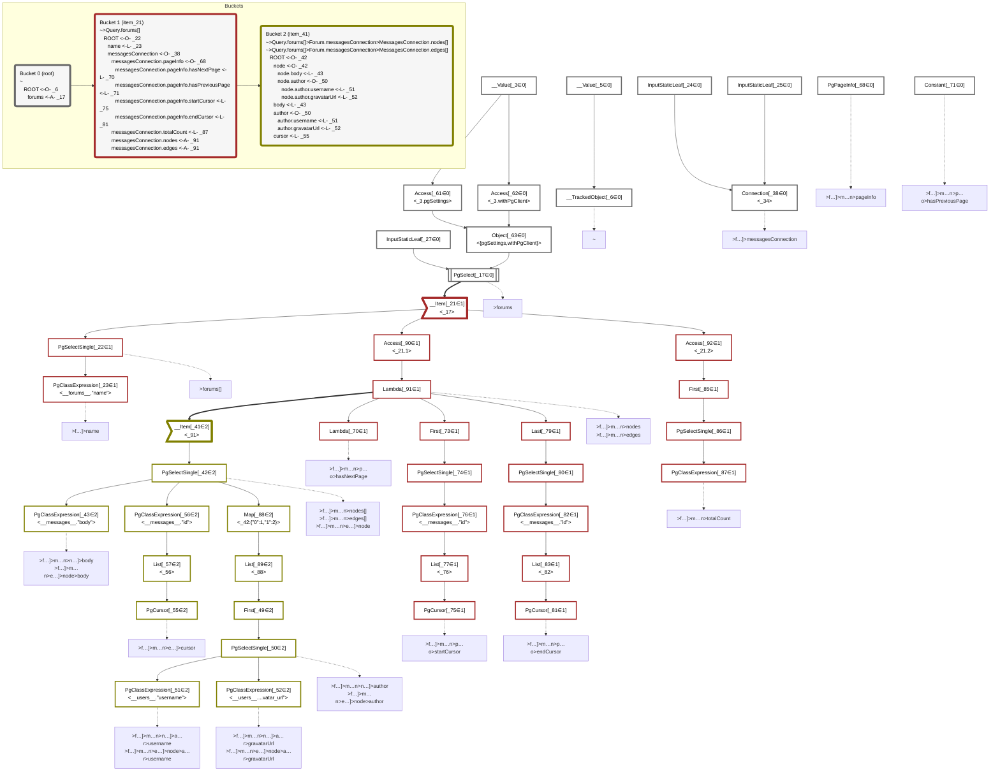

```mermaid
graph TD
    classDef path fill:#eee,stroke:#000,color:#000
    classDef plan fill:#fff,stroke-width:3px,color:#000
    classDef itemplan fill:#fff,stroke-width:6px,color:#000
    classDef sideeffectplan fill:#f00,stroke-width:6px,color:#000
    classDef bucket fill:#f6f6f6,color:#000,stroke-width:6px,text-align:left


    %% define plans
    __Value_3["__Value[_3∈0]<br /><context>"]:::plan
    __Value_5["__Value[_5∈0]<br /><rootValue>"]:::plan
    __TrackedObject_6["__TrackedObject[_6∈0]"]:::plan
    PgSelect_17[["PgSelect[_17∈0]<br /><forums>"]]:::plan
    __Item_21>"__Item[_21∈1]<br /><_17>"]:::itemplan
    PgSelectSingle_22["PgSelectSingle[_22∈1]<br /><forums>"]:::plan
    PgClassExpression_23["PgClassExpression[_23∈1]<br /><__forums__.”name”>"]:::plan
    InputStaticLeaf_24["InputStaticLeaf[_24∈0]"]:::plan
    InputStaticLeaf_25["InputStaticLeaf[_25∈0]"]:::plan
    InputStaticLeaf_27["InputStaticLeaf[_27∈0]"]:::plan
    Connection_38["Connection[_38∈0]<br /><_34>"]:::plan
    __Item_41>"__Item[_41∈2]<br /><_91>"]:::itemplan
    PgSelectSingle_42["PgSelectSingle[_42∈2]<br /><messages>"]:::plan
    PgClassExpression_43["PgClassExpression[_43∈2]<br /><__messages__.”body”>"]:::plan
    First_49["First[_49∈2]"]:::plan
    PgSelectSingle_50["PgSelectSingle[_50∈2]<br /><users>"]:::plan
    PgClassExpression_51["PgClassExpression[_51∈2]<br /><__users__.”username”>"]:::plan
    PgClassExpression_52["PgClassExpression[_52∈2]<br /><__users__....vatar_url”>"]:::plan
    PgCursor_55["PgCursor[_55∈2]"]:::plan
    PgClassExpression_56["PgClassExpression[_56∈2]<br /><__messages__.”id”>"]:::plan
    List_57["List[_57∈2]<br /><_56>"]:::plan
    Access_61["Access[_61∈0]<br /><_3.pgSettings>"]:::plan
    Access_62["Access[_62∈0]<br /><_3.withPgClient>"]:::plan
    Object_63["Object[_63∈0]<br /><{pgSettings,withPgClient}>"]:::plan
    PgPageInfo_68["PgPageInfo[_68∈0]"]:::plan
    Lambda_70["Lambda[_70∈1]<br /><listHasMore>"]:::plan
    Constant_71["Constant[_71∈0]"]:::plan
    First_73["First[_73∈1]"]:::plan
    PgSelectSingle_74["PgSelectSingle[_74∈1]<br /><messages>"]:::plan
    PgCursor_75["PgCursor[_75∈1]"]:::plan
    PgClassExpression_76["PgClassExpression[_76∈1]<br /><__messages__.”id”>"]:::plan
    List_77["List[_77∈1]<br /><_76>"]:::plan
    Last_79["Last[_79∈1]"]:::plan
    PgSelectSingle_80["PgSelectSingle[_80∈1]<br /><messages>"]:::plan
    PgCursor_81["PgCursor[_81∈1]"]:::plan
    PgClassExpression_82["PgClassExpression[_82∈1]<br /><__messages__.”id”>"]:::plan
    List_83["List[_83∈1]<br /><_82>"]:::plan
    First_85["First[_85∈1]"]:::plan
    PgSelectSingle_86["PgSelectSingle[_86∈1]<br /><messages>"]:::plan
    PgClassExpression_87["PgClassExpression[_87∈1]<br /><count(*)>"]:::plan
    Map_88["Map[_88∈2]<br /><_42:{”0”:1,”1”:2}>"]:::plan
    List_89["List[_89∈2]<br /><_88>"]:::plan
    Access_90["Access[_90∈1]<br /><_21.1>"]:::plan
    Lambda_91["Lambda[_91∈1]"]:::plan
    Access_92["Access[_92∈1]<br /><_21.2>"]:::plan

    %% plan dependencies
    __Value_5 --> __TrackedObject_6
    Object_63 --> PgSelect_17
    InputStaticLeaf_27 --> PgSelect_17
    PgSelect_17 ==> __Item_21
    __Item_21 --> PgSelectSingle_22
    PgSelectSingle_22 --> PgClassExpression_23
    InputStaticLeaf_24 --> Connection_38
    InputStaticLeaf_25 --> Connection_38
    Lambda_91 ==> __Item_41
    __Item_41 --> PgSelectSingle_42
    PgSelectSingle_42 --> PgClassExpression_43
    List_89 --> First_49
    First_49 --> PgSelectSingle_50
    PgSelectSingle_50 --> PgClassExpression_51
    PgSelectSingle_50 --> PgClassExpression_52
    List_57 --> PgCursor_55
    PgSelectSingle_42 --> PgClassExpression_56
    PgClassExpression_56 --> List_57
    __Value_3 --> Access_61
    __Value_3 --> Access_62
    Access_61 --> Object_63
    Access_62 --> Object_63
    Lambda_91 --> Lambda_70
    Lambda_91 --> First_73
    First_73 --> PgSelectSingle_74
    List_77 --> PgCursor_75
    PgSelectSingle_74 --> PgClassExpression_76
    PgClassExpression_76 --> List_77
    Lambda_91 --> Last_79
    Last_79 --> PgSelectSingle_80
    List_83 --> PgCursor_81
    PgSelectSingle_80 --> PgClassExpression_82
    PgClassExpression_82 --> List_83
    Access_92 --> First_85
    First_85 --> PgSelectSingle_86
    PgSelectSingle_86 --> PgClassExpression_87
    PgSelectSingle_42 --> Map_88
    Map_88 --> List_89
    __Item_21 --> Access_90
    Access_90 --> Lambda_91
    __Item_21 --> Access_92

    %% plan-to-path relationships
    P_6["~"]
    __TrackedObject_6 -.-> P_6
    P_17[">forums"]
    PgSelect_17 -.-> P_17
    P_22[">forums[]"]
    PgSelectSingle_22 -.-> P_22
    P_23[">f…]>name"]
    PgClassExpression_23 -.-> P_23
    P_38[">f…]>messagesConnection"]
    Connection_38 -.-> P_38
    P_42[">f…]>m…n>nodes[]<br />>f…]>m…n>edges[]<br />>f…]>m…n>e…]>node"]
    PgSelectSingle_42 -.-> P_42
    P_43[">f…]>m…n>n…]>body<br />>f…]>m…n>e…]>node>body"]
    PgClassExpression_43 -.-> P_43
    P_50[">f…]>m…n>n…]>author<br />>f…]>m…n>e…]>node>author"]
    PgSelectSingle_50 -.-> P_50
    P_51[">f…]>m…n>n…]>a…r>username<br />>f…]>m…n>e…]>node>a…r>username"]
    PgClassExpression_51 -.-> P_51
    P_52[">f…]>m…n>n…]>a…r>gravatarUrl<br />>f…]>m…n>e…]>node>a…r>gravatarUrl"]
    PgClassExpression_52 -.-> P_52
    P_55[">f…]>m…n>e…]>cursor"]
    PgCursor_55 -.-> P_55
    P_68[">f…]>m…n>pageInfo"]
    PgPageInfo_68 -.-> P_68
    P_70[">f…]>m…n>p…o>hasNextPage"]
    Lambda_70 -.-> P_70
    P_71[">f…]>m…n>p…o>hasPreviousPage"]
    Constant_71 -.-> P_71
    P_75[">f…]>m…n>p…o>startCursor"]
    PgCursor_75 -.-> P_75
    P_81[">f…]>m…n>p…o>endCursor"]
    PgCursor_81 -.-> P_81
    P_87[">f…]>m…n>totalCount"]
    PgClassExpression_87 -.-> P_87
    P_91[">f…]>m…n>nodes<br />>f…]>m…n>edges"]
    Lambda_91 -.-> P_91

    %% allocate buckets
    classDef bucket0 stroke:#696969
    class __Value_3,__Value_5,__TrackedObject_6,PgSelect_17,InputStaticLeaf_24,InputStaticLeaf_25,InputStaticLeaf_27,Connection_38,Access_61,Access_62,Object_63,PgPageInfo_68,Constant_71 bucket0
    classDef bucket1 stroke:#a52a2a
    class __Item_21,PgSelectSingle_22,PgClassExpression_23,Lambda_70,First_73,PgSelectSingle_74,PgCursor_75,PgClassExpression_76,List_77,Last_79,PgSelectSingle_80,PgCursor_81,PgClassExpression_82,List_83,First_85,PgSelectSingle_86,PgClassExpression_87,Access_90,Lambda_91,Access_92 bucket1
    classDef bucket2 stroke:#808000
    class __Item_41,PgSelectSingle_42,PgClassExpression_43,First_49,PgSelectSingle_50,PgClassExpression_51,PgClassExpression_52,PgCursor_55,PgClassExpression_56,List_57,Map_88,List_89 bucket2

    subgraph Buckets
    Bucket0("Bucket 0 (root)<br />~<br />⠀ROOT <-O- _6<br />⠀⠀forums <-A- _17"):::bucket
    style Bucket0 stroke:#696969
    Bucket1("Bucket 1 (item_21)<br />~>Query.forums[]<br />⠀ROOT <-O- _22<br />⠀⠀name <-L- _23<br />⠀⠀messagesConnection <-O- _38<br />⠀⠀⠀messagesConnection.pageInfo <-O- _68<br />⠀⠀⠀⠀messagesConnection.pageInfo.hasNextPage <-L- _70<br />⠀⠀⠀⠀messagesConnection.pageInfo.hasPreviousPage <-L- _71<br />⠀⠀⠀⠀messagesConnection.pageInfo.startCursor <-L- _75<br />⠀⠀⠀⠀messagesConnection.pageInfo.endCursor <-L- _81<br />⠀⠀⠀messagesConnection.totalCount <-L- _87<br />⠀⠀⠀messagesConnection.nodes <-A- _91<br />⠀⠀⠀messagesConnection.edges <-A- _91"):::bucket
    style Bucket1 stroke:#a52a2a
    Bucket0 --> Bucket1
    Bucket2("Bucket 2 (item_41)<br />~>Query.forums[]>Forum.messagesConnection>MessagesConnection.nodes[]<br />~>Query.forums[]>Forum.messagesConnection>MessagesConnection.edges[]<br />⠀ROOT <-O- _42<br />⠀⠀node <-O- _42<br />⠀⠀⠀node.body <-L- _43<br />⠀⠀⠀node.author <-O- _50<br />⠀⠀⠀⠀node.author.username <-L- _51<br />⠀⠀⠀⠀node.author.gravatarUrl <-L- _52<br />⠀⠀body <-L- _43<br />⠀⠀author <-O- _50<br />⠀⠀⠀author.username <-L- _51<br />⠀⠀⠀author.gravatarUrl <-L- _52<br />⠀⠀cursor <-L- _55"):::bucket
    style Bucket2 stroke:#808000
    Bucket1 --> Bucket2
    end
```
