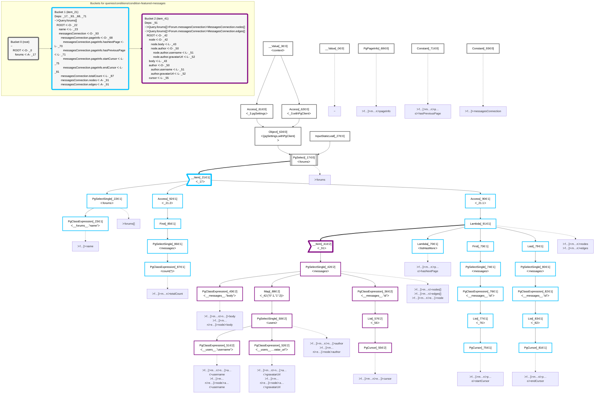

```mermaid
graph TD
    classDef path fill:#eee,stroke:#000,color:#000
    classDef plan fill:#fff,stroke-width:3px,color:#000
    classDef itemplan fill:#fff,stroke-width:6px,color:#000
    classDef sideeffectplan fill:#f00,stroke-width:6px,color:#000
    classDef bucket fill:#f6f6f6,color:#000,stroke-width:6px,text-align:left


    %% define plans
    __Value_0["__Value[_0∈0]"]:::plan
    PgClassExpression_23["PgClassExpression[_23∈1]<br />ᐸ__forums__.”name”ᐳ"]:::plan
    PgSelectSingle_22["PgSelectSingle[_22∈1]<br />ᐸforumsᐳ"]:::plan
    PgClassExpression_87["PgClassExpression[_87∈1]<br />ᐸcount(*)ᐳ"]:::plan
    PgSelectSingle_86["PgSelectSingle[_86∈1]<br />ᐸmessagesᐳ"]:::plan
    First_85["First[_85∈1]"]:::plan
    Access_92["Access[_92∈1]<br />ᐸ_21.2ᐳ"]:::plan
    PgClassExpression_43["PgClassExpression[_43∈2]<br />ᐸ__messages__.”body”ᐳ"]:::plan
    PgClassExpression_51["PgClassExpression[_51∈2]<br />ᐸ__users__.”username”ᐳ"]:::plan
    PgClassExpression_52["PgClassExpression[_52∈2]<br />ᐸ__users__....vatar_url”ᐳ"]:::plan
    PgSelectSingle_50["PgSelectSingle[_50∈2]<br />ᐸusersᐳ"]:::plan
    Map_88["Map[_88∈2]<br />ᐸ_42:{”0”:1,”1”:2}ᐳ"]:::plan
    PgCursor_55["PgCursor[_55∈2]"]:::plan
    List_57["List[_57∈2]<br />ᐸ_56ᐳ"]:::plan
    PgClassExpression_56["PgClassExpression[_56∈2]<br />ᐸ__messages__.”id”ᐳ"]:::plan
    PgSelectSingle_42["PgSelectSingle[_42∈2]<br />ᐸmessagesᐳ"]:::plan
    __Item_41>"__Item[_41∈2]<br />ᐸ_91ᐳ"]:::itemplan
    Lambda_70["Lambda[_70∈1]<br />ᐸlistHasMoreᐳ"]:::plan
    PgCursor_75["PgCursor[_75∈1]"]:::plan
    List_77["List[_77∈1]<br />ᐸ_76ᐳ"]:::plan
    PgClassExpression_76["PgClassExpression[_76∈1]<br />ᐸ__messages__.”id”ᐳ"]:::plan
    PgSelectSingle_74["PgSelectSingle[_74∈1]<br />ᐸmessagesᐳ"]:::plan
    First_73["First[_73∈1]"]:::plan
    PgCursor_81["PgCursor[_81∈1]"]:::plan
    List_83["List[_83∈1]<br />ᐸ_82ᐳ"]:::plan
    PgClassExpression_82["PgClassExpression[_82∈1]<br />ᐸ__messages__.”id”ᐳ"]:::plan
    PgSelectSingle_80["PgSelectSingle[_80∈1]<br />ᐸmessagesᐳ"]:::plan
    Last_79["Last[_79∈1]"]:::plan
    Lambda_91["Lambda[_91∈1]"]:::plan
    Access_90["Access[_90∈1]<br />ᐸ_21.1ᐳ"]:::plan
    __Item_21>"__Item[_21∈1]<br />ᐸ_17ᐳ"]:::itemplan
    PgSelect_17[["PgSelect[_17∈0]<br />ᐸforumsᐳ"]]:::plan
    Object_63["Object[_63∈0]<br />ᐸ{pgSettings,withPgClient}ᐳ"]:::plan
    Access_61["Access[_61∈0]<br />ᐸ_3.pgSettingsᐳ"]:::plan
    Access_62["Access[_62∈0]<br />ᐸ_3.withPgClientᐳ"]:::plan
    __Value_3["__Value[_3∈0]<br />ᐸcontextᐳ"]:::plan
    InputStaticLeaf_27["InputStaticLeaf[_27∈0]"]:::plan
    Constant_93["Constant[_93∈0]"]:::plan
    PgPageInfo_68["PgPageInfo[_68∈0]"]:::plan
    Constant_71["Constant[_71∈0]"]:::plan

    %% plan dependencies
    PgSelectSingle_22 --> PgClassExpression_23
    __Item_21 --> PgSelectSingle_22
    PgSelectSingle_86 --> PgClassExpression_87
    First_85 --> PgSelectSingle_86
    Access_92 --> First_85
    __Item_21 --> Access_92
    PgSelectSingle_42 --> PgClassExpression_43
    PgSelectSingle_50 --> PgClassExpression_51
    PgSelectSingle_50 --> PgClassExpression_52
    Map_88 --> PgSelectSingle_50
    PgSelectSingle_42 --> Map_88
    List_57 --> PgCursor_55
    PgClassExpression_56 --> List_57
    PgSelectSingle_42 --> PgClassExpression_56
    __Item_41 --> PgSelectSingle_42
    Lambda_91 ==> __Item_41
    Lambda_91 --> Lambda_70
    List_77 --> PgCursor_75
    PgClassExpression_76 --> List_77
    PgSelectSingle_74 --> PgClassExpression_76
    First_73 --> PgSelectSingle_74
    Lambda_91 --> First_73
    List_83 --> PgCursor_81
    PgClassExpression_82 --> List_83
    PgSelectSingle_80 --> PgClassExpression_82
    Last_79 --> PgSelectSingle_80
    Lambda_91 --> Last_79
    Access_90 --> Lambda_91
    __Item_21 --> Access_90
    PgSelect_17 ==> __Item_21
    Object_63 & InputStaticLeaf_27 --> PgSelect_17
    Access_61 & Access_62 --> Object_63
    __Value_3 --> Access_61
    __Value_3 --> Access_62

    %% plan-to-path relationships
    P_0["~"]
    __Value_0 -.-> P_0
    P_17["ᐳforums"]
    PgSelect_17 -.-> P_17
    P_22["ᐳforums[]"]
    PgSelectSingle_22 -.-> P_22
    P_23["ᐳf…]ᐳname"]
    PgClassExpression_23 -.-> P_23
    P_42["ᐳf…]ᐳm…nᐳnodes[]<br />ᐳf…]ᐳm…nᐳedges[]<br />ᐳf…]ᐳm…nᐳe…]ᐳnode"]
    PgSelectSingle_42 -.-> P_42
    P_43["ᐳf…]ᐳm…nᐳn…]ᐳbody<br />ᐳf…]ᐳm…nᐳe…]ᐳnodeᐳbody"]
    PgClassExpression_43 -.-> P_43
    P_50["ᐳf…]ᐳm…nᐳn…]ᐳauthor<br />ᐳf…]ᐳm…nᐳe…]ᐳnodeᐳauthor"]
    PgSelectSingle_50 -.-> P_50
    P_51["ᐳf…]ᐳm…nᐳn…]ᐳa…rᐳusername<br />ᐳf…]ᐳm…nᐳe…]ᐳnodeᐳa…rᐳusername"]
    PgClassExpression_51 -.-> P_51
    P_52["ᐳf…]ᐳm…nᐳn…]ᐳa…rᐳgravatarUrl<br />ᐳf…]ᐳm…nᐳe…]ᐳnodeᐳa…rᐳgravatarUrl"]
    PgClassExpression_52 -.-> P_52
    P_55["ᐳf…]ᐳm…nᐳe…]ᐳcursor"]
    PgCursor_55 -.-> P_55
    P_68["ᐳf…]ᐳm…nᐳpageInfo"]
    PgPageInfo_68 -.-> P_68
    P_70["ᐳf…]ᐳm…nᐳp…oᐳhasNextPage"]
    Lambda_70 -.-> P_70
    P_71["ᐳf…]ᐳm…nᐳp…oᐳhasPreviousPage"]
    Constant_71 -.-> P_71
    P_75["ᐳf…]ᐳm…nᐳp…oᐳstartCursor"]
    PgCursor_75 -.-> P_75
    P_81["ᐳf…]ᐳm…nᐳp…oᐳendCursor"]
    PgCursor_81 -.-> P_81
    P_87["ᐳf…]ᐳm…nᐳtotalCount"]
    PgClassExpression_87 -.-> P_87
    P_91["ᐳf…]ᐳm…nᐳnodes<br />ᐳf…]ᐳm…nᐳedges"]
    Lambda_91 -.-> P_91
    P_93["ᐳf…]ᐳmessagesConnection"]
    Constant_93 -.-> P_93

    subgraph "Buckets for queries/conditions/condition-featured-messages"
    Bucket0("Bucket 0 (root)<br />~<br />⠀ROOT ᐸ-O- _0<br />⠀⠀forums ᐸ-A- _17"):::bucket
    classDef bucket0 stroke:#696969
    class Bucket0,__Value_0,__Value_3,PgSelect_17,InputStaticLeaf_27,Access_61,Access_62,Object_63,PgPageInfo_68,Constant_71,Constant_93 bucket0
    Bucket1("Bucket 1 (item_21)<br />Deps: _17, _93, _68, _71<br />~ᐳQuery.forums[]<br />⠀ROOT ᐸ-O- _22<br />⠀⠀name ᐸ-L- _23<br />⠀⠀messagesConnection ᐸ-O- _93<br />⠀⠀⠀messagesConnection.pageInfo ᐸ-O- _68<br />⠀⠀⠀⠀messagesConnection.pageInfo.hasNextPage ᐸ-L- _70<br />⠀⠀⠀⠀messagesConnection.pageInfo.hasPreviousPage ᐸ-L- _71<br />⠀⠀⠀⠀messagesConnection.pageInfo.startCursor ᐸ-L- _75<br />⠀⠀⠀⠀messagesConnection.pageInfo.endCursor ᐸ-L- _81<br />⠀⠀⠀messagesConnection.totalCount ᐸ-L- _87<br />⠀⠀⠀messagesConnection.nodes ᐸ-A- _91<br />⠀⠀⠀messagesConnection.edges ᐸ-A- _91"):::bucket
    classDef bucket1 stroke:#00bfff
    class Bucket1,__Item_21,PgSelectSingle_22,PgClassExpression_23,Lambda_70,First_73,PgSelectSingle_74,PgCursor_75,PgClassExpression_76,List_77,Last_79,PgSelectSingle_80,PgCursor_81,PgClassExpression_82,List_83,First_85,PgSelectSingle_86,PgClassExpression_87,Access_90,Lambda_91,Access_92 bucket1
    Bucket2("Bucket 2 (item_41)<br />Deps: _91<br />~ᐳQuery.forums[]ᐳForum.messagesConnectionᐳMessagesConnection.nodes[]<br />~ᐳQuery.forums[]ᐳForum.messagesConnectionᐳMessagesConnection.edges[]<br />⠀ROOT ᐸ-O- _42<br />⠀⠀node ᐸ-O- _42<br />⠀⠀⠀node.body ᐸ-L- _43<br />⠀⠀⠀node.author ᐸ-O- _50<br />⠀⠀⠀⠀node.author.username ᐸ-L- _51<br />⠀⠀⠀⠀node.author.gravatarUrl ᐸ-L- _52<br />⠀⠀body ᐸ-L- _43<br />⠀⠀author ᐸ-O- _50<br />⠀⠀⠀author.username ᐸ-L- _51<br />⠀⠀⠀author.gravatarUrl ᐸ-L- _52<br />⠀⠀cursor ᐸ-L- _55"):::bucket
    classDef bucket2 stroke:#7f007f
    class Bucket2,__Item_41,PgSelectSingle_42,PgClassExpression_43,PgSelectSingle_50,PgClassExpression_51,PgClassExpression_52,PgCursor_55,PgClassExpression_56,List_57,Map_88 bucket2
    Bucket0 --> Bucket1
    Bucket1 --> Bucket2
    end
```
