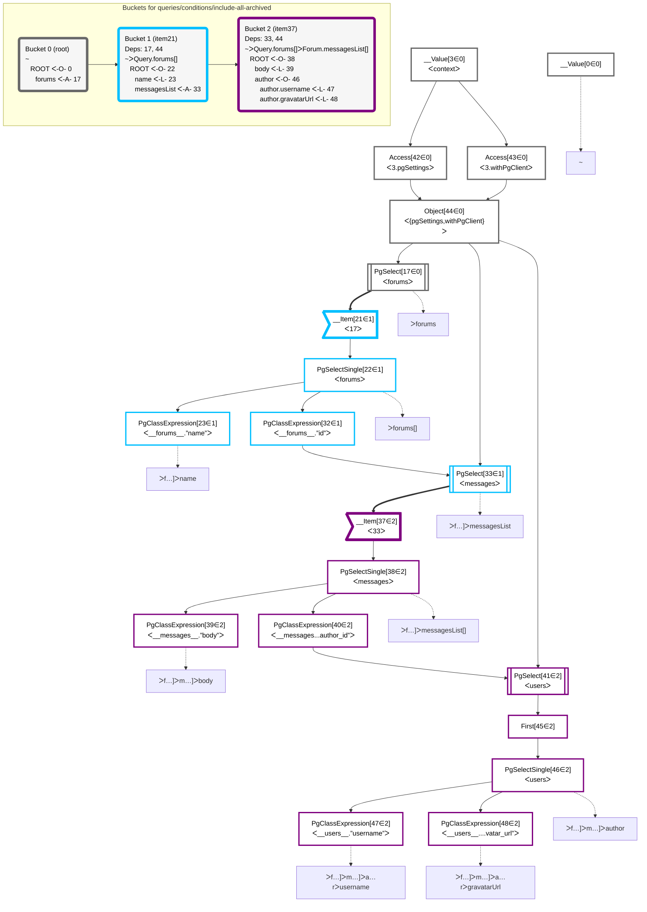

```mermaid
graph TD
    classDef path fill:#eee,stroke:#000,color:#000
    classDef plan fill:#fff,stroke-width:3px,color:#000
    classDef itemplan fill:#fff,stroke-width:6px,color:#000
    classDef sideeffectplan fill:#f00,stroke-width:6px,color:#000
    classDef bucket fill:#f6f6f6,color:#000,stroke-width:6px,text-align:left


    %% define plans
    __Value0["__Value[0∈0]"]:::plan
    __Value3["__Value[3∈0]<br />ᐸcontextᐳ"]:::plan
    Access42["Access[42∈0]<br />ᐸ3.pgSettingsᐳ"]:::plan
    Access43["Access[43∈0]<br />ᐸ3.withPgClientᐳ"]:::plan
    Object44["Object[44∈0]<br />ᐸ{pgSettings,withPgClient}ᐳ"]:::plan
    PgSelect17[["PgSelect[17∈0]<br />ᐸforumsᐳ"]]:::plan
    __Item21>"__Item[21∈1]<br />ᐸ17ᐳ"]:::itemplan
    PgSelectSingle22["PgSelectSingle[22∈1]<br />ᐸforumsᐳ"]:::plan
    PgClassExpression23["PgClassExpression[23∈1]<br />ᐸ__forums__.”name”ᐳ"]:::plan
    PgClassExpression32["PgClassExpression[32∈1]<br />ᐸ__forums__.”id”ᐳ"]:::plan
    PgSelect33[["PgSelect[33∈1]<br />ᐸmessagesᐳ"]]:::plan
    __Item37>"__Item[37∈2]<br />ᐸ33ᐳ"]:::itemplan
    PgSelectSingle38["PgSelectSingle[38∈2]<br />ᐸmessagesᐳ"]:::plan
    PgClassExpression39["PgClassExpression[39∈2]<br />ᐸ__messages__.”body”ᐳ"]:::plan
    PgClassExpression40["PgClassExpression[40∈2]<br />ᐸ__messages...author_id”ᐳ"]:::plan
    PgSelect41[["PgSelect[41∈2]<br />ᐸusersᐳ"]]:::plan
    First45["First[45∈2]"]:::plan
    PgSelectSingle46["PgSelectSingle[46∈2]<br />ᐸusersᐳ"]:::plan
    PgClassExpression47["PgClassExpression[47∈2]<br />ᐸ__users__.”username”ᐳ"]:::plan
    PgClassExpression48["PgClassExpression[48∈2]<br />ᐸ__users__....vatar_url”ᐳ"]:::plan

    %% plan dependencies
    __Value3 --> Access42
    __Value3 --> Access43
    Access42 & Access43 --> Object44
    Object44 --> PgSelect17
    PgSelect17 ==> __Item21
    __Item21 --> PgSelectSingle22
    PgSelectSingle22 --> PgClassExpression23
    PgSelectSingle22 --> PgClassExpression32
    Object44 & PgClassExpression32 --> PgSelect33
    PgSelect33 ==> __Item37
    __Item37 --> PgSelectSingle38
    PgSelectSingle38 --> PgClassExpression39
    PgSelectSingle38 --> PgClassExpression40
    Object44 & PgClassExpression40 --> PgSelect41
    PgSelect41 --> First45
    First45 --> PgSelectSingle46
    PgSelectSingle46 --> PgClassExpression47
    PgSelectSingle46 --> PgClassExpression48

    %% plan-to-path relationships
    P0["~"]
    __Value0 -.-> P0
    P17["ᐳforums"]
    PgSelect17 -.-> P17
    P22["ᐳforums[]"]
    PgSelectSingle22 -.-> P22
    P23["ᐳf…]ᐳname"]
    PgClassExpression23 -.-> P23
    P33["ᐳf…]ᐳmessagesList"]
    PgSelect33 -.-> P33
    P38["ᐳf…]ᐳmessagesList[]"]
    PgSelectSingle38 -.-> P38
    P39["ᐳf…]ᐳm…]ᐳbody"]
    PgClassExpression39 -.-> P39
    P46["ᐳf…]ᐳm…]ᐳauthor"]
    PgSelectSingle46 -.-> P46
    P47["ᐳf…]ᐳm…]ᐳa…rᐳusername"]
    PgClassExpression47 -.-> P47
    P48["ᐳf…]ᐳm…]ᐳa…rᐳgravatarUrl"]
    PgClassExpression48 -.-> P48

    subgraph "Buckets for queries/conditions/include-all-archived"
    Bucket0("Bucket 0 (root)<br />~<br />⠀ROOT ᐸ-O- 0<br />⠀⠀forums ᐸ-A- 17"):::bucket
    classDef bucket0 stroke:#696969
    class Bucket0,__Value0,__Value3,PgSelect17,Access42,Access43,Object44 bucket0
    Bucket1("Bucket 1 (item21)<br />Deps: 17, 44<br />~ᐳQuery.forums[]<br />⠀ROOT ᐸ-O- 22<br />⠀⠀name ᐸ-L- 23<br />⠀⠀messagesList ᐸ-A- 33"):::bucket
    classDef bucket1 stroke:#00bfff
    class Bucket1,__Item21,PgSelectSingle22,PgClassExpression23,PgClassExpression32,PgSelect33 bucket1
    Bucket2("Bucket 2 (item37)<br />Deps: 33, 44<br />~ᐳQuery.forums[]ᐳForum.messagesList[]<br />⠀ROOT ᐸ-O- 38<br />⠀⠀body ᐸ-L- 39<br />⠀⠀author ᐸ-O- 46<br />⠀⠀⠀author.username ᐸ-L- 47<br />⠀⠀⠀author.gravatarUrl ᐸ-L- 48"):::bucket
    classDef bucket2 stroke:#7f007f
    class Bucket2,__Item37,PgSelectSingle38,PgClassExpression39,PgClassExpression40,PgSelect41,First45,PgSelectSingle46,PgClassExpression47,PgClassExpression48 bucket2
    Bucket0 --> Bucket1
    Bucket1 --> Bucket2
    end
```
