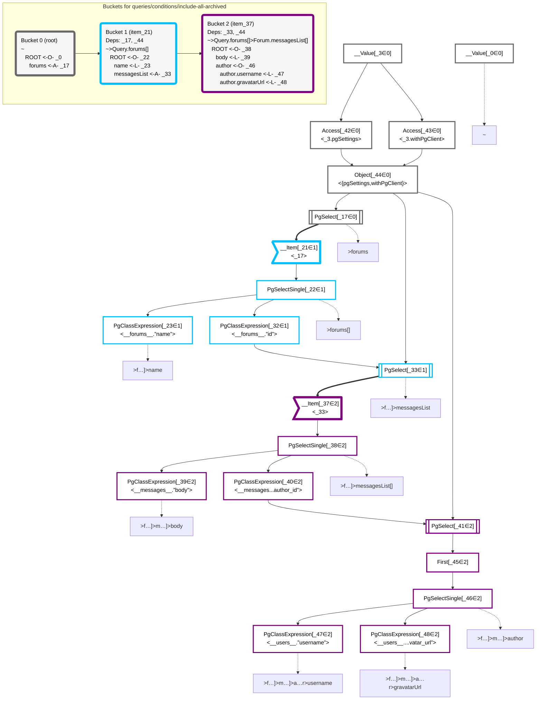

```mermaid
graph TD
    classDef path fill:#eee,stroke:#000,color:#000
    classDef plan fill:#fff,stroke-width:3px,color:#000
    classDef itemplan fill:#fff,stroke-width:6px,color:#000
    classDef sideeffectplan fill:#f00,stroke-width:6px,color:#000
    classDef bucket fill:#f6f6f6,color:#000,stroke-width:6px,text-align:left


    %% define plans
    __Value_0["__Value[_0∈0]"]:::plan
    __Value_3["__Value[_3∈0]<br /><context>"]:::plan
    PgSelect_17[["PgSelect[_17∈0]<br /><forums>"]]:::plan
    __Item_21>"__Item[_21∈1]<br /><_17>"]:::itemplan
    PgSelectSingle_22["PgSelectSingle[_22∈1]<br /><forums>"]:::plan
    PgClassExpression_23["PgClassExpression[_23∈1]<br /><__forums__.”name”>"]:::plan
    PgClassExpression_32["PgClassExpression[_32∈1]<br /><__forums__.”id”>"]:::plan
    PgSelect_33[["PgSelect[_33∈1]<br /><messages>"]]:::plan
    __Item_37>"__Item[_37∈2]<br /><_33>"]:::itemplan
    PgSelectSingle_38["PgSelectSingle[_38∈2]<br /><messages>"]:::plan
    PgClassExpression_39["PgClassExpression[_39∈2]<br /><__messages__.”body”>"]:::plan
    PgClassExpression_40["PgClassExpression[_40∈2]<br /><__messages...author_id”>"]:::plan
    PgSelect_41[["PgSelect[_41∈2]<br /><users>"]]:::plan
    Access_42["Access[_42∈0]<br /><_3.pgSettings>"]:::plan
    Access_43["Access[_43∈0]<br /><_3.withPgClient>"]:::plan
    Object_44["Object[_44∈0]<br /><{pgSettings,withPgClient}>"]:::plan
    First_45["First[_45∈2]"]:::plan
    PgSelectSingle_46["PgSelectSingle[_46∈2]<br /><users>"]:::plan
    PgClassExpression_47["PgClassExpression[_47∈2]<br /><__users__.”username”>"]:::plan
    PgClassExpression_48["PgClassExpression[_48∈2]<br /><__users__....vatar_url”>"]:::plan

    %% plan dependencies
    Object_44 --> PgSelect_17
    PgSelect_17 ==> __Item_21
    __Item_21 --> PgSelectSingle_22
    PgSelectSingle_22 --> PgClassExpression_23
    PgSelectSingle_22 --> PgClassExpression_32
    Object_44 --> PgSelect_33
    PgClassExpression_32 --> PgSelect_33
    PgSelect_33 ==> __Item_37
    __Item_37 --> PgSelectSingle_38
    PgSelectSingle_38 --> PgClassExpression_39
    PgSelectSingle_38 --> PgClassExpression_40
    Object_44 --> PgSelect_41
    PgClassExpression_40 --> PgSelect_41
    __Value_3 --> Access_42
    __Value_3 --> Access_43
    Access_42 --> Object_44
    Access_43 --> Object_44
    PgSelect_41 --> First_45
    First_45 --> PgSelectSingle_46
    PgSelectSingle_46 --> PgClassExpression_47
    PgSelectSingle_46 --> PgClassExpression_48

    %% plan-to-path relationships
    P_0["~"]
    __Value_0 -.-> P_0
    P_17[">forums"]
    PgSelect_17 -.-> P_17
    P_22[">forums[]"]
    PgSelectSingle_22 -.-> P_22
    P_23[">f…]>name"]
    PgClassExpression_23 -.-> P_23
    P_33[">f…]>messagesList"]
    PgSelect_33 -.-> P_33
    P_38[">f…]>messagesList[]"]
    PgSelectSingle_38 -.-> P_38
    P_39[">f…]>m…]>body"]
    PgClassExpression_39 -.-> P_39
    P_46[">f…]>m…]>author"]
    PgSelectSingle_46 -.-> P_46
    P_47[">f…]>m…]>a…r>username"]
    PgClassExpression_47 -.-> P_47
    P_48[">f…]>m…]>a…r>gravatarUrl"]
    PgClassExpression_48 -.-> P_48

    %% allocate buckets
    classDef bucket0 stroke:#696969
    class __Value_0,__Value_3,PgSelect_17,Access_42,Access_43,Object_44 bucket0
    classDef bucket1 stroke:#00bfff
    class __Item_21,PgSelectSingle_22,PgClassExpression_23,PgClassExpression_32,PgSelect_33 bucket1
    classDef bucket2 stroke:#7f007f
    class __Item_37,PgSelectSingle_38,PgClassExpression_39,PgClassExpression_40,PgSelect_41,First_45,PgSelectSingle_46,PgClassExpression_47,PgClassExpression_48 bucket2

    subgraph "Buckets for queries/conditions/include-all-archived"
    Bucket0("Bucket 0 (root)<br />~<br />⠀ROOT <-O- _0<br />⠀⠀forums <-A- _17"):::bucket
    style Bucket0 stroke:#696969
    Bucket1("Bucket 1 (item_21)<br />Deps: _17, _44<br />~>Query.forums[]<br />⠀ROOT <-O- _22<br />⠀⠀name <-L- _23<br />⠀⠀messagesList <-A- _33"):::bucket
    style Bucket1 stroke:#00bfff
    Bucket0 --> Bucket1
    Bucket2("Bucket 2 (item_37)<br />Deps: _33, _44<br />~>Query.forums[]>Forum.messagesList[]<br />⠀ROOT <-O- _38<br />⠀⠀body <-L- _39<br />⠀⠀author <-O- _46<br />⠀⠀⠀author.username <-L- _47<br />⠀⠀⠀author.gravatarUrl <-L- _48"):::bucket
    style Bucket2 stroke:#7f007f
    Bucket1 --> Bucket2
    end
```
