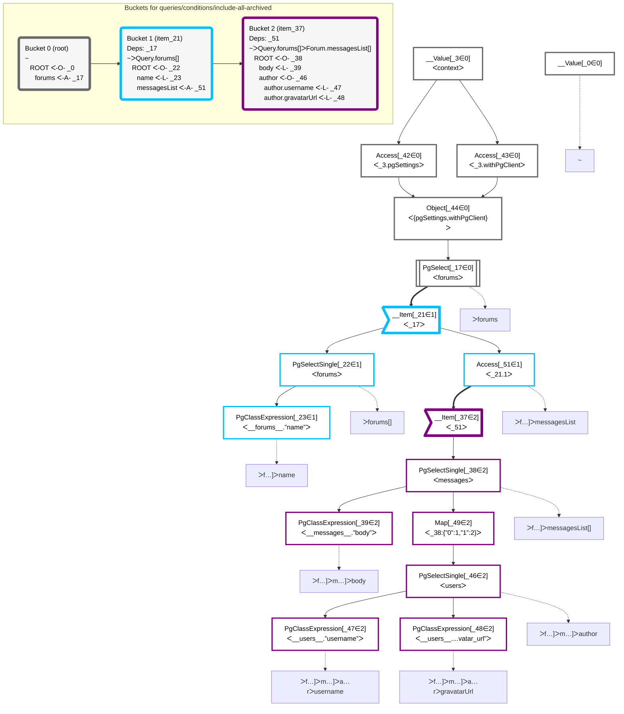

```mermaid
graph TD
    classDef path fill:#eee,stroke:#000,color:#000
    classDef plan fill:#fff,stroke-width:3px,color:#000
    classDef itemplan fill:#fff,stroke-width:6px,color:#000
    classDef sideeffectplan fill:#f00,stroke-width:6px,color:#000
    classDef bucket fill:#f6f6f6,color:#000,stroke-width:6px,text-align:left


    %% define plans
    __Value_0["__Value[_0∈0]"]:::plan
    __Value_3["__Value[_3∈0]<br />ᐸcontextᐳ"]:::plan
    PgSelect_17[["PgSelect[_17∈0]<br />ᐸforumsᐳ"]]:::plan
    __Item_21>"__Item[_21∈1]<br />ᐸ_17ᐳ"]:::itemplan
    PgSelectSingle_22["PgSelectSingle[_22∈1]<br />ᐸforumsᐳ"]:::plan
    PgClassExpression_23["PgClassExpression[_23∈1]<br />ᐸ__forums__.”name”ᐳ"]:::plan
    __Item_37>"__Item[_37∈2]<br />ᐸ_51ᐳ"]:::itemplan
    PgSelectSingle_38["PgSelectSingle[_38∈2]<br />ᐸmessagesᐳ"]:::plan
    PgClassExpression_39["PgClassExpression[_39∈2]<br />ᐸ__messages__.”body”ᐳ"]:::plan
    Access_42["Access[_42∈0]<br />ᐸ_3.pgSettingsᐳ"]:::plan
    Access_43["Access[_43∈0]<br />ᐸ_3.withPgClientᐳ"]:::plan
    Object_44["Object[_44∈0]<br />ᐸ{pgSettings,withPgClient}ᐳ"]:::plan
    PgSelectSingle_46["PgSelectSingle[_46∈2]<br />ᐸusersᐳ"]:::plan
    PgClassExpression_47["PgClassExpression[_47∈2]<br />ᐸ__users__.”username”ᐳ"]:::plan
    PgClassExpression_48["PgClassExpression[_48∈2]<br />ᐸ__users__....vatar_url”ᐳ"]:::plan
    Map_49["Map[_49∈2]<br />ᐸ_38:{”0”:1,”1”:2}ᐳ"]:::plan
    Access_51["Access[_51∈1]<br />ᐸ_21.1ᐳ"]:::plan

    %% plan dependencies
    Object_44 --> PgSelect_17
    PgSelect_17 ==> __Item_21
    __Item_21 --> PgSelectSingle_22
    PgSelectSingle_22 --> PgClassExpression_23
    Access_51 ==> __Item_37
    __Item_37 --> PgSelectSingle_38
    PgSelectSingle_38 --> PgClassExpression_39
    __Value_3 --> Access_42
    __Value_3 --> Access_43
    Access_42 & Access_43 --> Object_44
    Map_49 --> PgSelectSingle_46
    PgSelectSingle_46 --> PgClassExpression_47
    PgSelectSingle_46 --> PgClassExpression_48
    PgSelectSingle_38 --> Map_49
    __Item_21 --> Access_51

    %% plan-to-path relationships
    P_0["~"]
    __Value_0 -.-> P_0
    P_17["ᐳforums"]
    PgSelect_17 -.-> P_17
    P_22["ᐳforums[]"]
    PgSelectSingle_22 -.-> P_22
    P_23["ᐳf…]ᐳname"]
    PgClassExpression_23 -.-> P_23
    P_38["ᐳf…]ᐳmessagesList[]"]
    PgSelectSingle_38 -.-> P_38
    P_39["ᐳf…]ᐳm…]ᐳbody"]
    PgClassExpression_39 -.-> P_39
    P_46["ᐳf…]ᐳm…]ᐳauthor"]
    PgSelectSingle_46 -.-> P_46
    P_47["ᐳf…]ᐳm…]ᐳa…rᐳusername"]
    PgClassExpression_47 -.-> P_47
    P_48["ᐳf…]ᐳm…]ᐳa…rᐳgravatarUrl"]
    PgClassExpression_48 -.-> P_48
    P_51["ᐳf…]ᐳmessagesList"]
    Access_51 -.-> P_51

    %% allocate buckets
    classDef bucket0 stroke:#696969
    class __Value_0,__Value_3,PgSelect_17,Access_42,Access_43,Object_44 bucket0
    classDef bucket1 stroke:#00bfff
    class __Item_21,PgSelectSingle_22,PgClassExpression_23,Access_51 bucket1
    classDef bucket2 stroke:#7f007f
    class __Item_37,PgSelectSingle_38,PgClassExpression_39,PgSelectSingle_46,PgClassExpression_47,PgClassExpression_48,Map_49 bucket2

    subgraph "Buckets for queries/conditions/include-all-archived"
    Bucket0("Bucket 0 (root)<br />~<br />⠀ROOT ᐸ-O- _0<br />⠀⠀forums ᐸ-A- _17"):::bucket
    style Bucket0 stroke:#696969
    Bucket1("Bucket 1 (item_21)<br />Deps: _17<br />~ᐳQuery.forums[]<br />⠀ROOT ᐸ-O- _22<br />⠀⠀name ᐸ-L- _23<br />⠀⠀messagesList ᐸ-A- _51"):::bucket
    style Bucket1 stroke:#00bfff
    Bucket2("Bucket 2 (item_37)<br />Deps: _51<br />~ᐳQuery.forums[]ᐳForum.messagesList[]<br />⠀ROOT ᐸ-O- _38<br />⠀⠀body ᐸ-L- _39<br />⠀⠀author ᐸ-O- _46<br />⠀⠀⠀author.username ᐸ-L- _47<br />⠀⠀⠀author.gravatarUrl ᐸ-L- _48"):::bucket
    style Bucket2 stroke:#7f007f
    Bucket0 --> Bucket1
    Bucket1 --> Bucket2
    end
```
