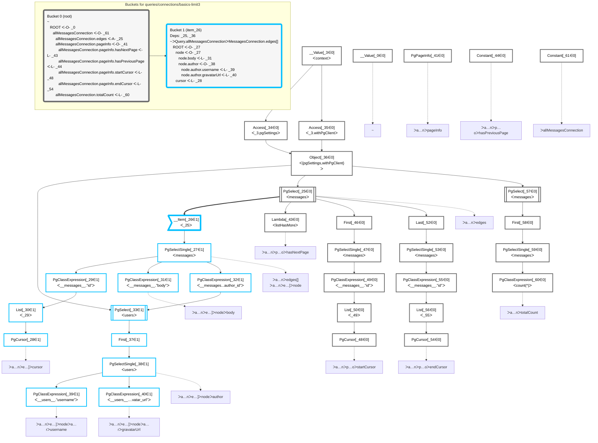

```mermaid
graph TD
    classDef path fill:#eee,stroke:#000,color:#000
    classDef plan fill:#fff,stroke-width:3px,color:#000
    classDef itemplan fill:#fff,stroke-width:6px,color:#000
    classDef sideeffectplan fill:#f00,stroke-width:6px,color:#000
    classDef bucket fill:#f6f6f6,color:#000,stroke-width:6px,text-align:left


    %% define plans
    __Value_0["__Value[_0∈0]"]:::plan
    PgCursor_28["PgCursor[_28∈1]"]:::plan
    List_30["List[_30∈1]<br />ᐸ_29ᐳ"]:::plan
    PgClassExpression_29["PgClassExpression[_29∈1]<br />ᐸ__messages__.”id”ᐳ"]:::plan
    PgClassExpression_31["PgClassExpression[_31∈1]<br />ᐸ__messages__.”body”ᐳ"]:::plan
    PgClassExpression_39["PgClassExpression[_39∈1]<br />ᐸ__users__.”username”ᐳ"]:::plan
    PgClassExpression_40["PgClassExpression[_40∈1]<br />ᐸ__users__....vatar_url”ᐳ"]:::plan
    PgSelectSingle_38["PgSelectSingle[_38∈1]<br />ᐸusersᐳ"]:::plan
    First_37["First[_37∈1]"]:::plan
    PgSelect_33[["PgSelect[_33∈1]<br />ᐸusersᐳ"]]:::plan
    PgClassExpression_32["PgClassExpression[_32∈1]<br />ᐸ__messages...author_id”ᐳ"]:::plan
    PgSelectSingle_27["PgSelectSingle[_27∈1]<br />ᐸmessagesᐳ"]:::plan
    __Item_26>"__Item[_26∈1]<br />ᐸ_25ᐳ"]:::itemplan
    Lambda_43["Lambda[_43∈0]<br />ᐸlistHasMoreᐳ"]:::plan
    PgCursor_48["PgCursor[_48∈0]"]:::plan
    List_50["List[_50∈0]<br />ᐸ_49ᐳ"]:::plan
    PgClassExpression_49["PgClassExpression[_49∈0]<br />ᐸ__messages__.”id”ᐳ"]:::plan
    PgSelectSingle_47["PgSelectSingle[_47∈0]<br />ᐸmessagesᐳ"]:::plan
    First_46["First[_46∈0]"]:::plan
    PgCursor_54["PgCursor[_54∈0]"]:::plan
    List_56["List[_56∈0]<br />ᐸ_55ᐳ"]:::plan
    PgClassExpression_55["PgClassExpression[_55∈0]<br />ᐸ__messages__.”id”ᐳ"]:::plan
    PgSelectSingle_53["PgSelectSingle[_53∈0]<br />ᐸmessagesᐳ"]:::plan
    Last_52["Last[_52∈0]"]:::plan
    PgSelect_25[["PgSelect[_25∈0]<br />ᐸmessagesᐳ"]]:::plan
    PgClassExpression_60["PgClassExpression[_60∈0]<br />ᐸcount(*)ᐳ"]:::plan
    PgSelectSingle_59["PgSelectSingle[_59∈0]<br />ᐸmessagesᐳ"]:::plan
    First_58["First[_58∈0]"]:::plan
    PgSelect_57[["PgSelect[_57∈0]<br />ᐸmessagesᐳ"]]:::plan
    Object_36["Object[_36∈0]<br />ᐸ{pgSettings,withPgClient}ᐳ"]:::plan
    Access_34["Access[_34∈0]<br />ᐸ_3.pgSettingsᐳ"]:::plan
    Access_35["Access[_35∈0]<br />ᐸ_3.withPgClientᐳ"]:::plan
    __Value_3["__Value[_3∈0]<br />ᐸcontextᐳ"]:::plan
    Constant_61["Constant[_61∈0]"]:::plan
    PgPageInfo_41["PgPageInfo[_41∈0]"]:::plan
    Constant_44["Constant[_44∈0]"]:::plan

    %% plan dependencies
    List_30 --> PgCursor_28
    PgClassExpression_29 --> List_30
    PgSelectSingle_27 --> PgClassExpression_29
    PgSelectSingle_27 --> PgClassExpression_31
    PgSelectSingle_38 --> PgClassExpression_39
    PgSelectSingle_38 --> PgClassExpression_40
    First_37 --> PgSelectSingle_38
    PgSelect_33 --> First_37
    Object_36 & PgClassExpression_32 --> PgSelect_33
    PgSelectSingle_27 --> PgClassExpression_32
    __Item_26 --> PgSelectSingle_27
    PgSelect_25 ==> __Item_26
    PgSelect_25 --> Lambda_43
    List_50 --> PgCursor_48
    PgClassExpression_49 --> List_50
    PgSelectSingle_47 --> PgClassExpression_49
    First_46 --> PgSelectSingle_47
    PgSelect_25 --> First_46
    List_56 --> PgCursor_54
    PgClassExpression_55 --> List_56
    PgSelectSingle_53 --> PgClassExpression_55
    Last_52 --> PgSelectSingle_53
    PgSelect_25 --> Last_52
    Object_36 --> PgSelect_25
    PgSelectSingle_59 --> PgClassExpression_60
    First_58 --> PgSelectSingle_59
    PgSelect_57 --> First_58
    Object_36 --> PgSelect_57
    Access_34 & Access_35 --> Object_36
    __Value_3 --> Access_34
    __Value_3 --> Access_35

    %% plan-to-path relationships
    P_0["~"]
    __Value_0 -.-> P_0
    P_25["ᐳa…nᐳedges"]
    PgSelect_25 -.-> P_25
    P_27["ᐳa…nᐳedges[]<br />ᐳa…nᐳe…]ᐳnode"]
    PgSelectSingle_27 -.-> P_27
    P_28["ᐳa…nᐳe…]ᐳcursor"]
    PgCursor_28 -.-> P_28
    P_31["ᐳa…nᐳe…]ᐳnodeᐳbody"]
    PgClassExpression_31 -.-> P_31
    P_38["ᐳa…nᐳe…]ᐳnodeᐳauthor"]
    PgSelectSingle_38 -.-> P_38
    P_39["ᐳa…nᐳe…]ᐳnodeᐳa…rᐳusername"]
    PgClassExpression_39 -.-> P_39
    P_40["ᐳa…nᐳe…]ᐳnodeᐳa…rᐳgravatarUrl"]
    PgClassExpression_40 -.-> P_40
    P_41["ᐳa…nᐳpageInfo"]
    PgPageInfo_41 -.-> P_41
    P_43["ᐳa…nᐳp…oᐳhasNextPage"]
    Lambda_43 -.-> P_43
    P_44["ᐳa…nᐳp…oᐳhasPreviousPage"]
    Constant_44 -.-> P_44
    P_48["ᐳa…nᐳp…oᐳstartCursor"]
    PgCursor_48 -.-> P_48
    P_54["ᐳa…nᐳp…oᐳendCursor"]
    PgCursor_54 -.-> P_54
    P_60["ᐳa…nᐳtotalCount"]
    PgClassExpression_60 -.-> P_60
    P_61["ᐳallMessagesConnection"]
    Constant_61 -.-> P_61

    subgraph "Buckets for queries/connections/basics-limit3"
    Bucket0("Bucket 0 (root)<br />~<br />⠀ROOT ᐸ-O- _0<br />⠀⠀allMessagesConnection ᐸ-O- _61<br />⠀⠀⠀allMessagesConnection.edges ᐸ-A- _25<br />⠀⠀⠀allMessagesConnection.pageInfo ᐸ-O- _41<br />⠀⠀⠀⠀allMessagesConnection.pageInfo.hasNextPage ᐸ-L- _43<br />⠀⠀⠀⠀allMessagesConnection.pageInfo.hasPreviousPage ᐸ-L- _44<br />⠀⠀⠀⠀allMessagesConnection.pageInfo.startCursor ᐸ-L- _48<br />⠀⠀⠀⠀allMessagesConnection.pageInfo.endCursor ᐸ-L- _54<br />⠀⠀⠀allMessagesConnection.totalCount ᐸ-L- _60"):::bucket
    classDef bucket0 stroke:#696969
    class Bucket0,__Value_0,__Value_3,PgSelect_25,Access_34,Access_35,Object_36,PgPageInfo_41,Lambda_43,Constant_44,First_46,PgSelectSingle_47,PgCursor_48,PgClassExpression_49,List_50,Last_52,PgSelectSingle_53,PgCursor_54,PgClassExpression_55,List_56,PgSelect_57,First_58,PgSelectSingle_59,PgClassExpression_60,Constant_61 bucket0
    Bucket1("Bucket 1 (item_26)<br />Deps: _25, _36<br />~ᐳQuery.allMessagesConnectionᐳMessagesConnection.edges[]<br />⠀ROOT ᐸ-O- _27<br />⠀⠀node ᐸ-O- _27<br />⠀⠀⠀node.body ᐸ-L- _31<br />⠀⠀⠀node.author ᐸ-O- _38<br />⠀⠀⠀⠀node.author.username ᐸ-L- _39<br />⠀⠀⠀⠀node.author.gravatarUrl ᐸ-L- _40<br />⠀⠀cursor ᐸ-L- _28"):::bucket
    classDef bucket1 stroke:#00bfff
    class Bucket1,__Item_26,PgSelectSingle_27,PgCursor_28,PgClassExpression_29,List_30,PgClassExpression_31,PgClassExpression_32,PgSelect_33,First_37,PgSelectSingle_38,PgClassExpression_39,PgClassExpression_40 bucket1
    Bucket0 --> Bucket1
    end
```
