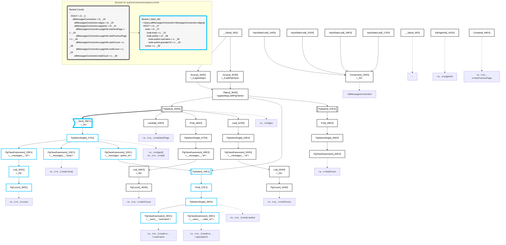

```mermaid
graph TD
    classDef path fill:#eee,stroke:#000,color:#000
    classDef plan fill:#fff,stroke-width:3px,color:#000
    classDef itemplan fill:#fff,stroke-width:6px,color:#000
    classDef sideeffectplan fill:#f00,stroke-width:6px,color:#000
    classDef bucket fill:#f6f6f6,color:#000,stroke-width:6px,text-align:left


    %% define plans
    __Value_0["__Value[_0∈0]"]:::plan
    __Value_3["__Value[_3∈0]<br /><context>"]:::plan
    InputStaticLeaf_14["InputStaticLeaf[_14∈0]"]:::plan
    InputStaticLeaf_15["InputStaticLeaf[_15∈0]"]:::plan
    InputStaticLeaf_16["InputStaticLeaf[_16∈0]"]:::plan
    InputStaticLeaf_17["InputStaticLeaf[_17∈0]"]:::plan
    Connection_24["Connection[_24∈0]<br /><_20>"]:::plan
    PgSelect_25[["PgSelect[_25∈0]<br /><messages>"]]:::plan
    __Item_26>"__Item[_26∈1]<br /><_25>"]:::itemplan
    PgSelectSingle_27["PgSelectSingle[_27∈1]<br /><messages>"]:::plan
    PgCursor_28["PgCursor[_28∈1]"]:::plan
    PgClassExpression_29["PgClassExpression[_29∈1]<br /><__messages__.”id”>"]:::plan
    List_30["List[_30∈1]<br /><_29>"]:::plan
    PgClassExpression_31["PgClassExpression[_31∈1]<br /><__messages__.”body”>"]:::plan
    PgClassExpression_32["PgClassExpression[_32∈1]<br /><__messages...author_id”>"]:::plan
    PgSelect_33[["PgSelect[_33∈1]<br /><users>"]]:::plan
    Access_34["Access[_34∈0]<br /><_3.pgSettings>"]:::plan
    Access_35["Access[_35∈0]<br /><_3.withPgClient>"]:::plan
    Object_36["Object[_36∈0]<br /><{pgSettings,withPgClient}>"]:::plan
    First_37["First[_37∈1]"]:::plan
    PgSelectSingle_38["PgSelectSingle[_38∈1]<br /><users>"]:::plan
    PgClassExpression_39["PgClassExpression[_39∈1]<br /><__users__.”username”>"]:::plan
    PgClassExpression_40["PgClassExpression[_40∈1]<br /><__users__....vatar_url”>"]:::plan
    PgPageInfo_41["PgPageInfo[_41∈0]"]:::plan
    Lambda_43["Lambda[_43∈0]<br /><listHasMore>"]:::plan
    Constant_44["Constant[_44∈0]"]:::plan
    First_46["First[_46∈0]"]:::plan
    PgSelectSingle_47["PgSelectSingle[_47∈0]<br /><messages>"]:::plan
    PgCursor_48["PgCursor[_48∈0]"]:::plan
    PgClassExpression_49["PgClassExpression[_49∈0]<br /><__messages__.”id”>"]:::plan
    List_50["List[_50∈0]<br /><_49>"]:::plan
    Last_52["Last[_52∈0]"]:::plan
    PgSelectSingle_53["PgSelectSingle[_53∈0]<br /><messages>"]:::plan
    PgCursor_54["PgCursor[_54∈0]"]:::plan
    PgClassExpression_55["PgClassExpression[_55∈0]<br /><__messages__.”id”>"]:::plan
    List_56["List[_56∈0]<br /><_55>"]:::plan
    PgSelect_57[["PgSelect[_57∈0]<br /><messages>"]]:::plan
    First_58["First[_58∈0]"]:::plan
    PgSelectSingle_59["PgSelectSingle[_59∈0]<br /><messages>"]:::plan
    PgClassExpression_60["PgClassExpression[_60∈0]<br /><count(*)>"]:::plan

    %% plan dependencies
    InputStaticLeaf_14 --> Connection_24
    InputStaticLeaf_15 --> Connection_24
    InputStaticLeaf_16 --> Connection_24
    InputStaticLeaf_17 --> Connection_24
    Object_36 --> PgSelect_25
    PgSelect_25 ==> __Item_26
    __Item_26 --> PgSelectSingle_27
    List_30 --> PgCursor_28
    PgSelectSingle_27 --> PgClassExpression_29
    PgClassExpression_29 --> List_30
    PgSelectSingle_27 --> PgClassExpression_31
    PgSelectSingle_27 --> PgClassExpression_32
    Object_36 --> PgSelect_33
    PgClassExpression_32 --> PgSelect_33
    __Value_3 --> Access_34
    __Value_3 --> Access_35
    Access_34 --> Object_36
    Access_35 --> Object_36
    PgSelect_33 --> First_37
    First_37 --> PgSelectSingle_38
    PgSelectSingle_38 --> PgClassExpression_39
    PgSelectSingle_38 --> PgClassExpression_40
    PgSelect_25 --> Lambda_43
    PgSelect_25 --> First_46
    First_46 --> PgSelectSingle_47
    List_50 --> PgCursor_48
    PgSelectSingle_47 --> PgClassExpression_49
    PgClassExpression_49 --> List_50
    PgSelect_25 --> Last_52
    Last_52 --> PgSelectSingle_53
    List_56 --> PgCursor_54
    PgSelectSingle_53 --> PgClassExpression_55
    PgClassExpression_55 --> List_56
    Object_36 --> PgSelect_57
    PgSelect_57 --> First_58
    First_58 --> PgSelectSingle_59
    PgSelectSingle_59 --> PgClassExpression_60

    %% plan-to-path relationships
    P_0["~"]
    __Value_0 -.-> P_0
    P_24[">allMessagesConnection"]
    Connection_24 -.-> P_24
    P_25[">a…n>edges"]
    PgSelect_25 -.-> P_25
    P_27[">a…n>edges[]<br />>a…n>e…]>node"]
    PgSelectSingle_27 -.-> P_27
    P_28[">a…n>e…]>cursor"]
    PgCursor_28 -.-> P_28
    P_31[">a…n>e…]>node>body"]
    PgClassExpression_31 -.-> P_31
    P_38[">a…n>e…]>node>author"]
    PgSelectSingle_38 -.-> P_38
    P_39[">a…n>e…]>node>a…r>username"]
    PgClassExpression_39 -.-> P_39
    P_40[">a…n>e…]>node>a…r>gravatarUrl"]
    PgClassExpression_40 -.-> P_40
    P_41[">a…n>pageInfo"]
    PgPageInfo_41 -.-> P_41
    P_43[">a…n>p…o>hasNextPage"]
    Lambda_43 -.-> P_43
    P_44[">a…n>p…o>hasPreviousPage"]
    Constant_44 -.-> P_44
    P_48[">a…n>p…o>startCursor"]
    PgCursor_48 -.-> P_48
    P_54[">a…n>p…o>endCursor"]
    PgCursor_54 -.-> P_54
    P_60[">a…n>totalCount"]
    PgClassExpression_60 -.-> P_60

    %% allocate buckets
    classDef bucket0 stroke:#696969
    class __Value_0,__Value_3,InputStaticLeaf_14,InputStaticLeaf_15,InputStaticLeaf_16,InputStaticLeaf_17,Connection_24,PgSelect_25,Access_34,Access_35,Object_36,PgPageInfo_41,Lambda_43,Constant_44,First_46,PgSelectSingle_47,PgCursor_48,PgClassExpression_49,List_50,Last_52,PgSelectSingle_53,PgCursor_54,PgClassExpression_55,List_56,PgSelect_57,First_58,PgSelectSingle_59,PgClassExpression_60 bucket0
    classDef bucket1 stroke:#00bfff
    class __Item_26,PgSelectSingle_27,PgCursor_28,PgClassExpression_29,List_30,PgClassExpression_31,PgClassExpression_32,PgSelect_33,First_37,PgSelectSingle_38,PgClassExpression_39,PgClassExpression_40 bucket1

    subgraph "Buckets for queries/connections/basics-limit3"
    Bucket0("Bucket 0 (root)<br />~<br />⠀ROOT <-O- _0<br />⠀⠀allMessagesConnection <-O- _24<br />⠀⠀⠀allMessagesConnection.edges <-A- _25<br />⠀⠀⠀allMessagesConnection.pageInfo <-O- _41<br />⠀⠀⠀⠀allMessagesConnection.pageInfo.hasNextPage <-L- _43<br />⠀⠀⠀⠀allMessagesConnection.pageInfo.hasPreviousPage <-L- _44<br />⠀⠀⠀⠀allMessagesConnection.pageInfo.startCursor <-L- _48<br />⠀⠀⠀⠀allMessagesConnection.pageInfo.endCursor <-L- _54<br />⠀⠀⠀allMessagesConnection.totalCount <-L- _60"):::bucket
    style Bucket0 stroke:#696969
    Bucket1("Bucket 1 (item_26)<br />~>Query.allMessagesConnection>MessagesConnection.edges[]<br />⠀ROOT <-O- _27<br />⠀⠀node <-O- _27<br />⠀⠀⠀node.body <-L- _31<br />⠀⠀⠀node.author <-O- _38<br />⠀⠀⠀⠀node.author.username <-L- _39<br />⠀⠀⠀⠀node.author.gravatarUrl <-L- _40<br />⠀⠀cursor <-L- _28"):::bucket
    style Bucket1 stroke:#00bfff
    Bucket0 --> Bucket1
    end
```
