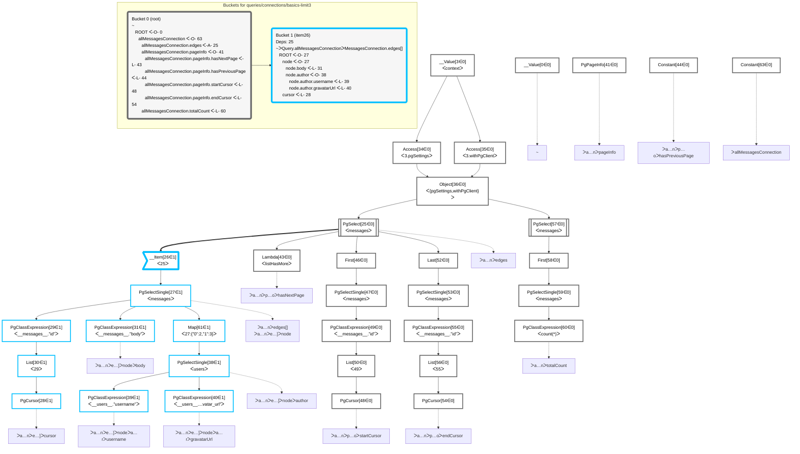

```mermaid
graph TD
    classDef path fill:#eee,stroke:#000,color:#000
    classDef plan fill:#fff,stroke-width:3px,color:#000
    classDef itemplan fill:#fff,stroke-width:6px,color:#000
    classDef sideeffectplan fill:#f00,stroke-width:6px,color:#000
    classDef bucket fill:#f6f6f6,color:#000,stroke-width:6px,text-align:left


    %% define plans
    __Value0["__Value[0∈0]"]:::plan
    PgCursor28["PgCursor[28∈1]"]:::plan
    List30["List[30∈1]<br />ᐸ29ᐳ"]:::plan
    PgClassExpression29["PgClassExpression[29∈1]<br />ᐸ__messages__.”id”ᐳ"]:::plan
    PgClassExpression31["PgClassExpression[31∈1]<br />ᐸ__messages__.”body”ᐳ"]:::plan
    PgClassExpression39["PgClassExpression[39∈1]<br />ᐸ__users__.”username”ᐳ"]:::plan
    PgClassExpression40["PgClassExpression[40∈1]<br />ᐸ__users__....vatar_url”ᐳ"]:::plan
    PgSelectSingle38["PgSelectSingle[38∈1]<br />ᐸusersᐳ"]:::plan
    Map61["Map[61∈1]<br />ᐸ27:{”0”:2,”1”:3}ᐳ"]:::plan
    PgSelectSingle27["PgSelectSingle[27∈1]<br />ᐸmessagesᐳ"]:::plan
    __Item26>"__Item[26∈1]<br />ᐸ25ᐳ"]:::itemplan
    Lambda43["Lambda[43∈0]<br />ᐸlistHasMoreᐳ"]:::plan
    PgCursor48["PgCursor[48∈0]"]:::plan
    List50["List[50∈0]<br />ᐸ49ᐳ"]:::plan
    PgClassExpression49["PgClassExpression[49∈0]<br />ᐸ__messages__.”id”ᐳ"]:::plan
    PgSelectSingle47["PgSelectSingle[47∈0]<br />ᐸmessagesᐳ"]:::plan
    First46["First[46∈0]"]:::plan
    PgCursor54["PgCursor[54∈0]"]:::plan
    List56["List[56∈0]<br />ᐸ55ᐳ"]:::plan
    PgClassExpression55["PgClassExpression[55∈0]<br />ᐸ__messages__.”id”ᐳ"]:::plan
    PgSelectSingle53["PgSelectSingle[53∈0]<br />ᐸmessagesᐳ"]:::plan
    Last52["Last[52∈0]"]:::plan
    PgSelect25[["PgSelect[25∈0]<br />ᐸmessagesᐳ"]]:::plan
    PgClassExpression60["PgClassExpression[60∈0]<br />ᐸcount(*)ᐳ"]:::plan
    PgSelectSingle59["PgSelectSingle[59∈0]<br />ᐸmessagesᐳ"]:::plan
    First58["First[58∈0]"]:::plan
    PgSelect57[["PgSelect[57∈0]<br />ᐸmessagesᐳ"]]:::plan
    Object36["Object[36∈0]<br />ᐸ{pgSettings,withPgClient}ᐳ"]:::plan
    Access34["Access[34∈0]<br />ᐸ3.pgSettingsᐳ"]:::plan
    Access35["Access[35∈0]<br />ᐸ3.withPgClientᐳ"]:::plan
    __Value3["__Value[3∈0]<br />ᐸcontextᐳ"]:::plan
    Constant63["Constant[63∈0]"]:::plan
    PgPageInfo41["PgPageInfo[41∈0]"]:::plan
    Constant44["Constant[44∈0]"]:::plan

    %% plan dependencies
    List30 --> PgCursor28
    PgClassExpression29 --> List30
    PgSelectSingle27 --> PgClassExpression29
    PgSelectSingle27 --> PgClassExpression31
    PgSelectSingle38 --> PgClassExpression39
    PgSelectSingle38 --> PgClassExpression40
    Map61 --> PgSelectSingle38
    PgSelectSingle27 --> Map61
    __Item26 --> PgSelectSingle27
    PgSelect25 ==> __Item26
    PgSelect25 --> Lambda43
    List50 --> PgCursor48
    PgClassExpression49 --> List50
    PgSelectSingle47 --> PgClassExpression49
    First46 --> PgSelectSingle47
    PgSelect25 --> First46
    List56 --> PgCursor54
    PgClassExpression55 --> List56
    PgSelectSingle53 --> PgClassExpression55
    Last52 --> PgSelectSingle53
    PgSelect25 --> Last52
    Object36 --> PgSelect25
    PgSelectSingle59 --> PgClassExpression60
    First58 --> PgSelectSingle59
    PgSelect57 --> First58
    Object36 --> PgSelect57
    Access34 & Access35 --> Object36
    __Value3 --> Access34
    __Value3 --> Access35

    %% plan-to-path relationships
    P0["~"]
    __Value0 -.-> P0
    P25["ᐳa…nᐳedges"]
    PgSelect25 -.-> P25
    P27["ᐳa…nᐳedges[]<br />ᐳa…nᐳe…]ᐳnode"]
    PgSelectSingle27 -.-> P27
    P28["ᐳa…nᐳe…]ᐳcursor"]
    PgCursor28 -.-> P28
    P31["ᐳa…nᐳe…]ᐳnodeᐳbody"]
    PgClassExpression31 -.-> P31
    P38["ᐳa…nᐳe…]ᐳnodeᐳauthor"]
    PgSelectSingle38 -.-> P38
    P39["ᐳa…nᐳe…]ᐳnodeᐳa…rᐳusername"]
    PgClassExpression39 -.-> P39
    P40["ᐳa…nᐳe…]ᐳnodeᐳa…rᐳgravatarUrl"]
    PgClassExpression40 -.-> P40
    P41["ᐳa…nᐳpageInfo"]
    PgPageInfo41 -.-> P41
    P43["ᐳa…nᐳp…oᐳhasNextPage"]
    Lambda43 -.-> P43
    P44["ᐳa…nᐳp…oᐳhasPreviousPage"]
    Constant44 -.-> P44
    P48["ᐳa…nᐳp…oᐳstartCursor"]
    PgCursor48 -.-> P48
    P54["ᐳa…nᐳp…oᐳendCursor"]
    PgCursor54 -.-> P54
    P60["ᐳa…nᐳtotalCount"]
    PgClassExpression60 -.-> P60
    P63["ᐳallMessagesConnection"]
    Constant63 -.-> P63

    subgraph "Buckets for queries/connections/basics-limit3"
    Bucket0("Bucket 0 (root)<br />~<br />⠀ROOT ᐸ-O- 0<br />⠀⠀allMessagesConnection ᐸ-O- 63<br />⠀⠀⠀allMessagesConnection.edges ᐸ-A- 25<br />⠀⠀⠀allMessagesConnection.pageInfo ᐸ-O- 41<br />⠀⠀⠀⠀allMessagesConnection.pageInfo.hasNextPage ᐸ-L- 43<br />⠀⠀⠀⠀allMessagesConnection.pageInfo.hasPreviousPage ᐸ-L- 44<br />⠀⠀⠀⠀allMessagesConnection.pageInfo.startCursor ᐸ-L- 48<br />⠀⠀⠀⠀allMessagesConnection.pageInfo.endCursor ᐸ-L- 54<br />⠀⠀⠀allMessagesConnection.totalCount ᐸ-L- 60"):::bucket
    classDef bucket0 stroke:#696969
    class Bucket0,__Value0,__Value3,PgSelect25,Access34,Access35,Object36,PgPageInfo41,Lambda43,Constant44,First46,PgSelectSingle47,PgCursor48,PgClassExpression49,List50,Last52,PgSelectSingle53,PgCursor54,PgClassExpression55,List56,PgSelect57,First58,PgSelectSingle59,PgClassExpression60,Constant63 bucket0
    Bucket1("Bucket 1 (item26)<br />Deps: 25<br />~ᐳQuery.allMessagesConnectionᐳMessagesConnection.edges[]<br />⠀ROOT ᐸ-O- 27<br />⠀⠀node ᐸ-O- 27<br />⠀⠀⠀node.body ᐸ-L- 31<br />⠀⠀⠀node.author ᐸ-O- 38<br />⠀⠀⠀⠀node.author.username ᐸ-L- 39<br />⠀⠀⠀⠀node.author.gravatarUrl ᐸ-L- 40<br />⠀⠀cursor ᐸ-L- 28"):::bucket
    classDef bucket1 stroke:#00bfff
    class Bucket1,__Item26,PgSelectSingle27,PgCursor28,PgClassExpression29,List30,PgClassExpression31,PgSelectSingle38,PgClassExpression39,PgClassExpression40,Map61 bucket1
    Bucket0 --> Bucket1
    end
```
