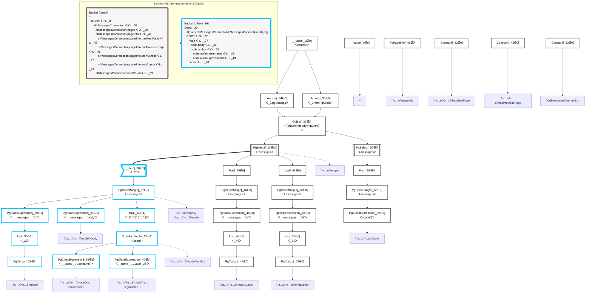

```mermaid
graph TD
    classDef path fill:#eee,stroke:#000,color:#000
    classDef plan fill:#fff,stroke-width:3px,color:#000
    classDef itemplan fill:#fff,stroke-width:6px,color:#000
    classDef sideeffectplan fill:#f00,stroke-width:6px,color:#000
    classDef bucket fill:#f6f6f6,color:#000,stroke-width:6px,text-align:left


    %% define plans
    __Value_0["__Value[_0∈0]"]:::plan
    PgCursor_28["PgCursor[_28∈1]"]:::plan
    List_30["List[_30∈1]<br />ᐸ_29ᐳ"]:::plan
    PgClassExpression_29["PgClassExpression[_29∈1]<br />ᐸ__messages__.”id”ᐳ"]:::plan
    PgClassExpression_31["PgClassExpression[_31∈1]<br />ᐸ__messages__.”body”ᐳ"]:::plan
    PgClassExpression_39["PgClassExpression[_39∈1]<br />ᐸ__users__.”username”ᐳ"]:::plan
    PgClassExpression_40["PgClassExpression[_40∈1]<br />ᐸ__users__....vatar_url”ᐳ"]:::plan
    PgSelectSingle_38["PgSelectSingle[_38∈1]<br />ᐸusersᐳ"]:::plan
    Map_60["Map[_60∈1]<br />ᐸ_27:{”0”:2,”1”:3}ᐳ"]:::plan
    PgSelectSingle_27["PgSelectSingle[_27∈1]<br />ᐸmessagesᐳ"]:::plan
    __Item_26>"__Item[_26∈1]<br />ᐸ_20ᐳ"]:::itemplan
    PgCursor_47["PgCursor[_47∈0]"]:::plan
    List_49["List[_49∈0]<br />ᐸ_48ᐳ"]:::plan
    PgClassExpression_48["PgClassExpression[_48∈0]<br />ᐸ__messages__.”id”ᐳ"]:::plan
    PgSelectSingle_46["PgSelectSingle[_46∈0]<br />ᐸmessagesᐳ"]:::plan
    First_45["First[_45∈0]"]:::plan
    PgCursor_53["PgCursor[_53∈0]"]:::plan
    List_55["List[_55∈0]<br />ᐸ_54ᐳ"]:::plan
    PgClassExpression_54["PgClassExpression[_54∈0]<br />ᐸ__messages__.”id”ᐳ"]:::plan
    PgSelectSingle_52["PgSelectSingle[_52∈0]<br />ᐸmessagesᐳ"]:::plan
    Last_51["Last[_51∈0]"]:::plan
    PgSelect_20[["PgSelect[_20∈0]<br />ᐸmessagesᐳ"]]:::plan
    PgClassExpression_59["PgClassExpression[_59∈0]<br />ᐸcount(*)ᐳ"]:::plan
    PgSelectSingle_58["PgSelectSingle[_58∈0]<br />ᐸmessagesᐳ"]:::plan
    First_57["First[_57∈0]"]:::plan
    PgSelect_56[["PgSelect[_56∈0]<br />ᐸmessagesᐳ"]]:::plan
    Object_36["Object[_36∈0]<br />ᐸ{pgSettings,withPgClient}ᐳ"]:::plan
    Access_34["Access[_34∈0]<br />ᐸ_3.pgSettingsᐳ"]:::plan
    Access_35["Access[_35∈0]<br />ᐸ_3.withPgClientᐳ"]:::plan
    __Value_3["__Value[_3∈0]<br />ᐸcontextᐳ"]:::plan
    Constant_62["Constant[_62∈0]"]:::plan
    PgPageInfo_41["PgPageInfo[_41∈0]"]:::plan
    Constant_42["Constant[_42∈0]"]:::plan
    Constant_43["Constant[_43∈0]"]:::plan

    %% plan dependencies
    List_30 --> PgCursor_28
    PgClassExpression_29 --> List_30
    PgSelectSingle_27 --> PgClassExpression_29
    PgSelectSingle_27 --> PgClassExpression_31
    PgSelectSingle_38 --> PgClassExpression_39
    PgSelectSingle_38 --> PgClassExpression_40
    Map_60 --> PgSelectSingle_38
    PgSelectSingle_27 --> Map_60
    __Item_26 --> PgSelectSingle_27
    PgSelect_20 ==> __Item_26
    List_49 --> PgCursor_47
    PgClassExpression_48 --> List_49
    PgSelectSingle_46 --> PgClassExpression_48
    First_45 --> PgSelectSingle_46
    PgSelect_20 --> First_45
    List_55 --> PgCursor_53
    PgClassExpression_54 --> List_55
    PgSelectSingle_52 --> PgClassExpression_54
    Last_51 --> PgSelectSingle_52
    PgSelect_20 --> Last_51
    Object_36 --> PgSelect_20
    PgSelectSingle_58 --> PgClassExpression_59
    First_57 --> PgSelectSingle_58
    PgSelect_56 --> First_57
    Object_36 --> PgSelect_56
    Access_34 & Access_35 --> Object_36
    __Value_3 --> Access_34
    __Value_3 --> Access_35

    %% plan-to-path relationships
    P_0["~"]
    __Value_0 -.-> P_0
    P_20["ᐳa…nᐳedges"]
    PgSelect_20 -.-> P_20
    P_27["ᐳa…nᐳedges[]<br />ᐳa…nᐳe…]ᐳnode"]
    PgSelectSingle_27 -.-> P_27
    P_28["ᐳa…nᐳe…]ᐳcursor"]
    PgCursor_28 -.-> P_28
    P_31["ᐳa…nᐳe…]ᐳnodeᐳbody"]
    PgClassExpression_31 -.-> P_31
    P_38["ᐳa…nᐳe…]ᐳnodeᐳauthor"]
    PgSelectSingle_38 -.-> P_38
    P_39["ᐳa…nᐳe…]ᐳnodeᐳa…rᐳusername"]
    PgClassExpression_39 -.-> P_39
    P_40["ᐳa…nᐳe…]ᐳnodeᐳa…rᐳgravatarUrl"]
    PgClassExpression_40 -.-> P_40
    P_41["ᐳa…nᐳpageInfo"]
    PgPageInfo_41 -.-> P_41
    P_42["ᐳa…nᐳp…oᐳhasNextPage"]
    Constant_42 -.-> P_42
    P_43["ᐳa…nᐳp…oᐳhasPreviousPage"]
    Constant_43 -.-> P_43
    P_47["ᐳa…nᐳp…oᐳstartCursor"]
    PgCursor_47 -.-> P_47
    P_53["ᐳa…nᐳp…oᐳendCursor"]
    PgCursor_53 -.-> P_53
    P_59["ᐳa…nᐳtotalCount"]
    PgClassExpression_59 -.-> P_59
    P_62["ᐳallMessagesConnection"]
    Constant_62 -.-> P_62

    subgraph "Buckets for queries/connections/basics"
    Bucket0("Bucket 0 (root)<br />~<br />⠀ROOT ᐸ-O- _0<br />⠀⠀allMessagesConnection ᐸ-O- _62<br />⠀⠀⠀allMessagesConnection.edges ᐸ-A- _20<br />⠀⠀⠀allMessagesConnection.pageInfo ᐸ-O- _41<br />⠀⠀⠀⠀allMessagesConnection.pageInfo.hasNextPage ᐸ-L- _42<br />⠀⠀⠀⠀allMessagesConnection.pageInfo.hasPreviousPage ᐸ-L- _43<br />⠀⠀⠀⠀allMessagesConnection.pageInfo.startCursor ᐸ-L- _47<br />⠀⠀⠀⠀allMessagesConnection.pageInfo.endCursor ᐸ-L- _53<br />⠀⠀⠀allMessagesConnection.totalCount ᐸ-L- _59"):::bucket
    classDef bucket0 stroke:#696969
    class Bucket0,__Value_0,__Value_3,PgSelect_20,Access_34,Access_35,Object_36,PgPageInfo_41,Constant_42,Constant_43,First_45,PgSelectSingle_46,PgCursor_47,PgClassExpression_48,List_49,Last_51,PgSelectSingle_52,PgCursor_53,PgClassExpression_54,List_55,PgSelect_56,First_57,PgSelectSingle_58,PgClassExpression_59,Constant_62 bucket0
    Bucket1("Bucket 1 (item_26)<br />Deps: _20<br />~ᐳQuery.allMessagesConnectionᐳMessagesConnection.edges[]<br />⠀ROOT ᐸ-O- _27<br />⠀⠀node ᐸ-O- _27<br />⠀⠀⠀node.body ᐸ-L- _31<br />⠀⠀⠀node.author ᐸ-O- _38<br />⠀⠀⠀⠀node.author.username ᐸ-L- _39<br />⠀⠀⠀⠀node.author.gravatarUrl ᐸ-L- _40<br />⠀⠀cursor ᐸ-L- _28"):::bucket
    classDef bucket1 stroke:#00bfff
    class Bucket1,__Item_26,PgSelectSingle_27,PgCursor_28,PgClassExpression_29,List_30,PgClassExpression_31,PgSelectSingle_38,PgClassExpression_39,PgClassExpression_40,Map_60 bucket1
    Bucket0 --> Bucket1
    end
```
