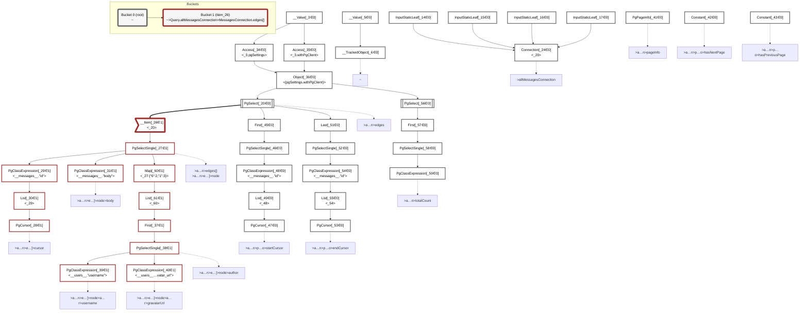

```mermaid
graph TD
    classDef path fill:#eee,stroke:#000,color:#000
    classDef plan fill:#fff,stroke-width:3px,color:#000
    classDef itemplan fill:#fff,stroke-width:6px,color:#000
    classDef sideeffectplan fill:#f00,stroke-width:6px,color:#000
    classDef bucket fill:#f6f6f6,color:#000,stroke-width:6px


    %% define plans
    __Value_3["__Value[_3∈0]<br /><context>"]:::plan
    __Value_5["__Value[_5∈0]<br /><rootValue>"]:::plan
    __TrackedObject_6["__TrackedObject[_6∈0]"]:::plan
    InputStaticLeaf_14["InputStaticLeaf[_14∈0]"]:::plan
    InputStaticLeaf_15["InputStaticLeaf[_15∈0]"]:::plan
    InputStaticLeaf_16["InputStaticLeaf[_16∈0]"]:::plan
    InputStaticLeaf_17["InputStaticLeaf[_17∈0]"]:::plan
    PgSelect_20[["PgSelect[_20∈0]<br /><messages>"]]:::plan
    Connection_24["Connection[_24∈0]<br /><_20>"]:::plan
    __Item_26>"__Item[_26∈1]<br /><_20>"]:::itemplan
    PgSelectSingle_27["PgSelectSingle[_27∈1]<br /><messages>"]:::plan
    PgCursor_28["PgCursor[_28∈1]"]:::plan
    PgClassExpression_29["PgClassExpression[_29∈1]<br /><__messages__.”id”>"]:::plan
    List_30["List[_30∈1]<br /><_29>"]:::plan
    PgClassExpression_31["PgClassExpression[_31∈1]<br /><__messages__.”body”>"]:::plan
    Access_34["Access[_34∈0]<br /><_3.pgSettings>"]:::plan
    Access_35["Access[_35∈0]<br /><_3.withPgClient>"]:::plan
    Object_36["Object[_36∈0]<br /><{pgSettings,withPgClient}>"]:::plan
    First_37["First[_37∈1]"]:::plan
    PgSelectSingle_38["PgSelectSingle[_38∈1]<br /><users>"]:::plan
    PgClassExpression_39["PgClassExpression[_39∈1]<br /><__users__.”username”>"]:::plan
    PgClassExpression_40["PgClassExpression[_40∈1]<br /><__users__....vatar_url”>"]:::plan
    PgPageInfo_41["PgPageInfo[_41∈0]"]:::plan
    Constant_42["Constant[_42∈0]"]:::plan
    Constant_43["Constant[_43∈0]"]:::plan
    First_45["First[_45∈0]"]:::plan
    PgSelectSingle_46["PgSelectSingle[_46∈0]<br /><messages>"]:::plan
    PgCursor_47["PgCursor[_47∈0]"]:::plan
    PgClassExpression_48["PgClassExpression[_48∈0]<br /><__messages__.”id”>"]:::plan
    List_49["List[_49∈0]<br /><_48>"]:::plan
    Last_51["Last[_51∈0]"]:::plan
    PgSelectSingle_52["PgSelectSingle[_52∈0]<br /><messages>"]:::plan
    PgCursor_53["PgCursor[_53∈0]"]:::plan
    PgClassExpression_54["PgClassExpression[_54∈0]<br /><__messages__.”id”>"]:::plan
    List_55["List[_55∈0]<br /><_54>"]:::plan
    PgSelect_56[["PgSelect[_56∈0]<br /><messages>"]]:::plan
    First_57["First[_57∈0]"]:::plan
    PgSelectSingle_58["PgSelectSingle[_58∈0]<br /><messages>"]:::plan
    PgClassExpression_59["PgClassExpression[_59∈0]<br /><count(*)>"]:::plan
    Map_60["Map[_60∈1]<br /><_27:{”0”:2,”1”:3}>"]:::plan
    List_61["List[_61∈1]<br /><_60>"]:::plan

    %% plan dependencies
    __Value_5 --> __TrackedObject_6
    Object_36 --> PgSelect_20
    InputStaticLeaf_14 --> Connection_24
    InputStaticLeaf_15 --> Connection_24
    InputStaticLeaf_16 --> Connection_24
    InputStaticLeaf_17 --> Connection_24
    PgSelect_20 ==> __Item_26
    __Item_26 --> PgSelectSingle_27
    List_30 --> PgCursor_28
    PgSelectSingle_27 --> PgClassExpression_29
    PgClassExpression_29 --> List_30
    PgSelectSingle_27 --> PgClassExpression_31
    __Value_3 --> Access_34
    __Value_3 --> Access_35
    Access_34 --> Object_36
    Access_35 --> Object_36
    List_61 --> First_37
    First_37 --> PgSelectSingle_38
    PgSelectSingle_38 --> PgClassExpression_39
    PgSelectSingle_38 --> PgClassExpression_40
    PgSelect_20 --> First_45
    First_45 --> PgSelectSingle_46
    List_49 --> PgCursor_47
    PgSelectSingle_46 --> PgClassExpression_48
    PgClassExpression_48 --> List_49
    PgSelect_20 --> Last_51
    Last_51 --> PgSelectSingle_52
    List_55 --> PgCursor_53
    PgSelectSingle_52 --> PgClassExpression_54
    PgClassExpression_54 --> List_55
    Object_36 --> PgSelect_56
    PgSelect_56 --> First_57
    First_57 --> PgSelectSingle_58
    PgSelectSingle_58 --> PgClassExpression_59
    PgSelectSingle_27 --> Map_60
    Map_60 --> List_61

    %% plan-to-path relationships
    P_6["~"]
    __TrackedObject_6 -.-> P_6
    P_20[">a…n>edges"]
    PgSelect_20 -.-> P_20
    P_24[">allMessagesConnection"]
    Connection_24 -.-> P_24
    P_27[">a…n>edges[]<br />>a…n>e…]>node"]
    PgSelectSingle_27 -.-> P_27
    P_28[">a…n>e…]>cursor"]
    PgCursor_28 -.-> P_28
    P_31[">a…n>e…]>node>body"]
    PgClassExpression_31 -.-> P_31
    P_38[">a…n>e…]>node>author"]
    PgSelectSingle_38 -.-> P_38
    P_39[">a…n>e…]>node>a…r>username"]
    PgClassExpression_39 -.-> P_39
    P_40[">a…n>e…]>node>a…r>gravatarUrl"]
    PgClassExpression_40 -.-> P_40
    P_41[">a…n>pageInfo"]
    PgPageInfo_41 -.-> P_41
    P_42[">a…n>p…o>hasNextPage"]
    Constant_42 -.-> P_42
    P_43[">a…n>p…o>hasPreviousPage"]
    Constant_43 -.-> P_43
    P_47[">a…n>p…o>startCursor"]
    PgCursor_47 -.-> P_47
    P_53[">a…n>p…o>endCursor"]
    PgCursor_53 -.-> P_53
    P_59[">a…n>totalCount"]
    PgClassExpression_59 -.-> P_59

    %% allocate buckets
    classDef bucket0 stroke:#696969
    class __Value_3,__Value_5,__TrackedObject_6,InputStaticLeaf_14,InputStaticLeaf_15,InputStaticLeaf_16,InputStaticLeaf_17,PgSelect_20,Connection_24,Access_34,Access_35,Object_36,PgPageInfo_41,Constant_42,Constant_43,First_45,PgSelectSingle_46,PgCursor_47,PgClassExpression_48,List_49,Last_51,PgSelectSingle_52,PgCursor_53,PgClassExpression_54,List_55,PgSelect_56,First_57,PgSelectSingle_58,PgClassExpression_59 bucket0
    classDef bucket1 stroke:#a52a2a
    class __Item_26,PgSelectSingle_27,PgCursor_28,PgClassExpression_29,List_30,PgClassExpression_31,First_37,PgSelectSingle_38,PgClassExpression_39,PgClassExpression_40,Map_60,List_61 bucket1

    subgraph Buckets
    Bucket0("Bucket 0 (root)<br />~"):::bucket
    style Bucket0 stroke:#696969
    Bucket1("Bucket 1 (item_26)<br />~>Query.allMessagesConnection>MessagesConnection.edges[]"):::bucket
    style Bucket1 stroke:#a52a2a
    Bucket0 --> Bucket1
    end
```
