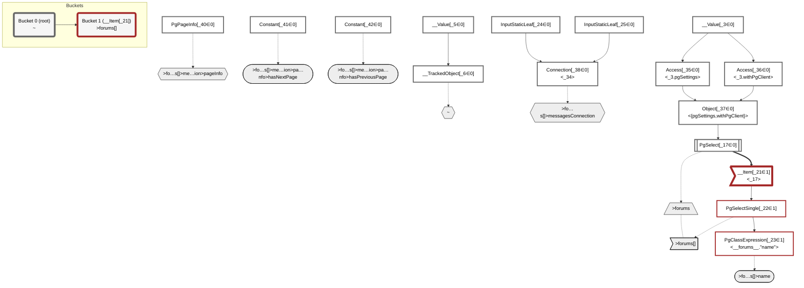

```mermaid
graph TD
    classDef path fill:#eee,stroke:#000,color:#000
    classDef plan fill:#fff,stroke-width:3px,color:#000
    classDef itemplan fill:#fff,stroke-width:6px,color:#000
    classDef sideeffectplan fill:#f00,stroke-width:6px,color:#000
    classDef bucket fill:#f6f6f6,color:#000,stroke-width:6px

    %% subgraph fields
    P1{{"~"}}:::path
    P2[/">forums"\]:::path
    P3>">forums[]"]:::path
    P2 -.- P3
    P4([">fo…s[]>name"]):::path
    %% P3 -.-> P4
    P5{{">fo…s[]>messagesConnection"}}:::path
    P6{{">fo…s[]>me…ion>pageInfo"}}:::path
    P7([">fo…s[]>me…ion>pa…nfo>hasNextPage"]):::path
    %% P6 -.-> P7
    P8([">fo…s[]>me…ion>pa…nfo>hasPreviousPage"]):::path
    %% P6 -.-> P8
    %% P5 -.-> P6
    %% P3 -.-> P5
    %% P1 -.-> P2
    %% end

    %% define plans
    __Value_3["__Value[_3∈0]<br /><context>"]:::plan
    __Value_5["__Value[_5∈0]<br /><rootValue>"]:::plan
    __TrackedObject_6["__TrackedObject[_6∈0]"]:::plan
    PgSelect_17[["PgSelect[_17∈0]<br /><forums>"]]:::plan
    __Item_21>"__Item[_21∈1]<br /><_17>"]:::itemplan
    PgSelectSingle_22["PgSelectSingle[_22∈1]<br /><forums>"]:::plan
    PgClassExpression_23["PgClassExpression[_23∈1]<br /><__forums__.#quot;name#quot;>"]:::plan
    InputStaticLeaf_24["InputStaticLeaf[_24∈0]"]:::plan
    InputStaticLeaf_25["InputStaticLeaf[_25∈0]"]:::plan
    Access_35["Access[_35∈0]<br /><_3.pgSettings>"]:::plan
    Access_36["Access[_36∈0]<br /><_3.withPgClient>"]:::plan
    Object_37["Object[_37∈0]<br /><{pgSettings,withPgClient}>"]:::plan
    Connection_38["Connection[_38∈0]<br /><_34>"]:::plan
    PgPageInfo_40["PgPageInfo[_40∈0]"]:::plan
    Constant_41["Constant[_41∈0]"]:::plan
    Constant_42["Constant[_42∈0]"]:::plan

    %% plan dependencies
    __Value_5 --> __TrackedObject_6
    Object_37 --> PgSelect_17
    PgSelect_17 ==> __Item_21
    __Item_21 --> PgSelectSingle_22
    PgSelectSingle_22 --> PgClassExpression_23
    __Value_3 --> Access_35
    __Value_3 --> Access_36
    Access_35 --> Object_37
    Access_36 --> Object_37
    InputStaticLeaf_24 --> Connection_38
    InputStaticLeaf_25 --> Connection_38

    %% plan-to-path relationships
    __TrackedObject_6 -.-> P1
    PgSelect_17 -.-> P2
    PgSelectSingle_22 -.-> P3
    PgClassExpression_23 -.-> P4
    Connection_38 -.-> P5
    PgPageInfo_40 -.-> P6
    Constant_41 -.-> P7
    Constant_42 -.-> P8

    %% allocate buckets
    classDef bucket0 stroke:#696969
    class __Value_3,__Value_5,__TrackedObject_6,PgSelect_17,InputStaticLeaf_24,InputStaticLeaf_25,Access_35,Access_36,Object_37,Connection_38,PgPageInfo_40,Constant_41,Constant_42 bucket0
    classDef bucket1 stroke:#a52a2a
    class __Item_21,PgSelectSingle_22,PgClassExpression_23 bucket1

    subgraph Buckets
    Bucket0("Bucket 0 (root)<br />~"):::bucket
    style Bucket0 stroke:#696969
    Bucket1("Bucket 1 (__Item[_21])<br />>forums[]"):::bucket
    style Bucket1 stroke:#a52a2a
    Bucket0 --> Bucket1
    end
```
