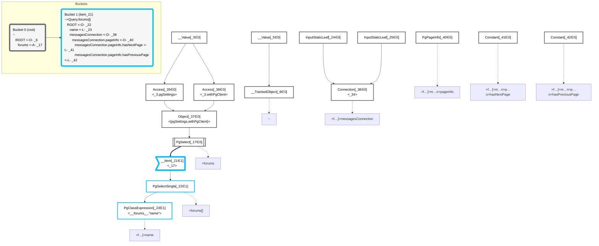

```mermaid
graph TD
    classDef path fill:#eee,stroke:#000,color:#000
    classDef plan fill:#fff,stroke-width:3px,color:#000
    classDef itemplan fill:#fff,stroke-width:6px,color:#000
    classDef sideeffectplan fill:#f00,stroke-width:6px,color:#000
    classDef bucket fill:#f6f6f6,color:#000,stroke-width:6px,text-align:left


    %% define plans
    __Value_3["__Value[_3∈0]<br /><context>"]:::plan
    __Value_5["__Value[_5∈0]<br /><rootValue>"]:::plan
    __TrackedObject_6["__TrackedObject[_6∈0]"]:::plan
    PgSelect_17[["PgSelect[_17∈0]<br /><forums>"]]:::plan
    __Item_21>"__Item[_21∈1]<br /><_17>"]:::itemplan
    PgSelectSingle_22["PgSelectSingle[_22∈1]<br /><forums>"]:::plan
    PgClassExpression_23["PgClassExpression[_23∈1]<br /><__forums__.”name”>"]:::plan
    InputStaticLeaf_24["InputStaticLeaf[_24∈0]"]:::plan
    InputStaticLeaf_25["InputStaticLeaf[_25∈0]"]:::plan
    Access_35["Access[_35∈0]<br /><_3.pgSettings>"]:::plan
    Access_36["Access[_36∈0]<br /><_3.withPgClient>"]:::plan
    Object_37["Object[_37∈0]<br /><{pgSettings,withPgClient}>"]:::plan
    Connection_38["Connection[_38∈0]<br /><_34>"]:::plan
    PgPageInfo_40["PgPageInfo[_40∈0]"]:::plan
    Constant_41["Constant[_41∈0]"]:::plan
    Constant_42["Constant[_42∈0]"]:::plan

    %% plan dependencies
    __Value_5 --> __TrackedObject_6
    Object_37 --> PgSelect_17
    PgSelect_17 ==> __Item_21
    __Item_21 --> PgSelectSingle_22
    PgSelectSingle_22 --> PgClassExpression_23
    __Value_3 --> Access_35
    __Value_3 --> Access_36
    Access_35 --> Object_37
    Access_36 --> Object_37
    InputStaticLeaf_24 --> Connection_38
    InputStaticLeaf_25 --> Connection_38

    %% plan-to-path relationships
    P_6["~"]
    __TrackedObject_6 -.-> P_6
    P_17[">forums"]
    PgSelect_17 -.-> P_17
    P_22[">forums[]"]
    PgSelectSingle_22 -.-> P_22
    P_23[">f…]>name"]
    PgClassExpression_23 -.-> P_23
    P_38[">f…]>messagesConnection"]
    Connection_38 -.-> P_38
    P_40[">f…]>m…n>pageInfo"]
    PgPageInfo_40 -.-> P_40
    P_41[">f…]>m…n>p…o>hasNextPage"]
    Constant_41 -.-> P_41
    P_42[">f…]>m…n>p…o>hasPreviousPage"]
    Constant_42 -.-> P_42

    %% allocate buckets
    classDef bucket0 stroke:#696969
    class __Value_3,__Value_5,__TrackedObject_6,PgSelect_17,InputStaticLeaf_24,InputStaticLeaf_25,Access_35,Access_36,Object_37,Connection_38,PgPageInfo_40,Constant_41,Constant_42 bucket0
    classDef bucket1 stroke:#00bfff
    class __Item_21,PgSelectSingle_22,PgClassExpression_23 bucket1

    subgraph Buckets
    Bucket0("Bucket 0 (root)<br />~<br />⠀ROOT <-O- _6<br />⠀⠀forums <-A- _17"):::bucket
    style Bucket0 stroke:#696969
    Bucket1("Bucket 1 (item_21)<br />~>Query.forums[]<br />⠀ROOT <-O- _22<br />⠀⠀name <-L- _23<br />⠀⠀messagesConnection <-O- _38<br />⠀⠀⠀messagesConnection.pageInfo <-O- _40<br />⠀⠀⠀⠀messagesConnection.pageInfo.hasNextPage <-L- _41<br />⠀⠀⠀⠀messagesConnection.pageInfo.hasPreviousPage <-L- _42"):::bucket
    style Bucket1 stroke:#00bfff
    Bucket0 --> Bucket1
    end
```
