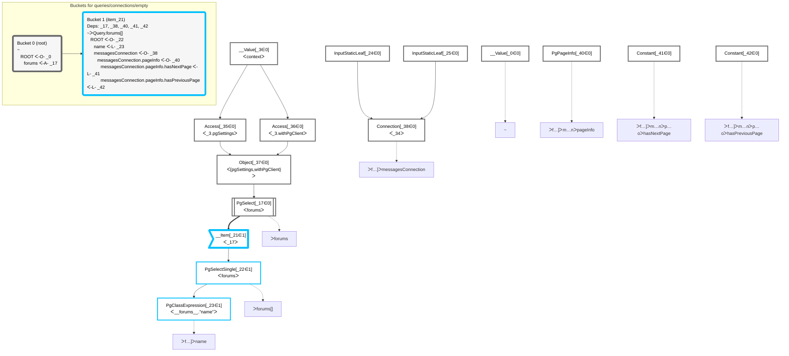

```mermaid
graph TD
    classDef path fill:#eee,stroke:#000,color:#000
    classDef plan fill:#fff,stroke-width:3px,color:#000
    classDef itemplan fill:#fff,stroke-width:6px,color:#000
    classDef sideeffectplan fill:#f00,stroke-width:6px,color:#000
    classDef bucket fill:#f6f6f6,color:#000,stroke-width:6px,text-align:left


    %% define plans
    __Value_0["__Value[_0∈0]"]:::plan
    PgClassExpression_23["PgClassExpression[_23∈1]<br />ᐸ__forums__.”name”ᐳ"]:::plan
    PgSelectSingle_22["PgSelectSingle[_22∈1]<br />ᐸforumsᐳ"]:::plan
    __Item_21>"__Item[_21∈1]<br />ᐸ_17ᐳ"]:::itemplan
    PgSelect_17[["PgSelect[_17∈0]<br />ᐸforumsᐳ"]]:::plan
    Object_37["Object[_37∈0]<br />ᐸ{pgSettings,withPgClient}ᐳ"]:::plan
    Access_35["Access[_35∈0]<br />ᐸ_3.pgSettingsᐳ"]:::plan
    Access_36["Access[_36∈0]<br />ᐸ_3.withPgClientᐳ"]:::plan
    __Value_3["__Value[_3∈0]<br />ᐸcontextᐳ"]:::plan
    Connection_38["Connection[_38∈0]<br />ᐸ_34ᐳ"]:::plan
    InputStaticLeaf_24["InputStaticLeaf[_24∈0]"]:::plan
    InputStaticLeaf_25["InputStaticLeaf[_25∈0]"]:::plan
    PgPageInfo_40["PgPageInfo[_40∈0]"]:::plan
    Constant_41["Constant[_41∈0]"]:::plan
    Constant_42["Constant[_42∈0]"]:::plan

    %% plan dependencies
    PgSelectSingle_22 --> PgClassExpression_23
    __Item_21 --> PgSelectSingle_22
    PgSelect_17 ==> __Item_21
    Object_37 --> PgSelect_17
    Access_35 & Access_36 --> Object_37
    __Value_3 --> Access_35
    __Value_3 --> Access_36
    InputStaticLeaf_24 & InputStaticLeaf_25 --> Connection_38

    %% plan-to-path relationships
    P_0["~"]
    __Value_0 -.-> P_0
    P_17["ᐳforums"]
    PgSelect_17 -.-> P_17
    P_22["ᐳforums[]"]
    PgSelectSingle_22 -.-> P_22
    P_23["ᐳf…]ᐳname"]
    PgClassExpression_23 -.-> P_23
    P_38["ᐳf…]ᐳmessagesConnection"]
    Connection_38 -.-> P_38
    P_40["ᐳf…]ᐳm…nᐳpageInfo"]
    PgPageInfo_40 -.-> P_40
    P_41["ᐳf…]ᐳm…nᐳp…oᐳhasNextPage"]
    Constant_41 -.-> P_41
    P_42["ᐳf…]ᐳm…nᐳp…oᐳhasPreviousPage"]
    Constant_42 -.-> P_42

    subgraph "Buckets for queries/connections/empty"
    Bucket0("Bucket 0 (root)<br />~<br />⠀ROOT ᐸ-O- _0<br />⠀⠀forums ᐸ-A- _17"):::bucket
    classDef bucket0 stroke:#696969
    class Bucket0,__Value_0,__Value_3,PgSelect_17,InputStaticLeaf_24,InputStaticLeaf_25,Access_35,Access_36,Object_37,Connection_38,PgPageInfo_40,Constant_41,Constant_42 bucket0
    Bucket1("Bucket 1 (item_21)<br />Deps: _17, _38, _40, _41, _42<br />~ᐳQuery.forums[]<br />⠀ROOT ᐸ-O- _22<br />⠀⠀name ᐸ-L- _23<br />⠀⠀messagesConnection ᐸ-O- _38<br />⠀⠀⠀messagesConnection.pageInfo ᐸ-O- _40<br />⠀⠀⠀⠀messagesConnection.pageInfo.hasNextPage ᐸ-L- _41<br />⠀⠀⠀⠀messagesConnection.pageInfo.hasPreviousPage ᐸ-L- _42"):::bucket
    classDef bucket1 stroke:#00bfff
    class Bucket1,__Item_21,PgSelectSingle_22,PgClassExpression_23 bucket1
    Bucket0 --> Bucket1
    end
```
