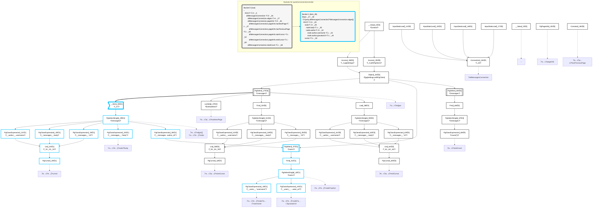

```mermaid
graph TD
    classDef path fill:#eee,stroke:#000,color:#000
    classDef plan fill:#fff,stroke-width:3px,color:#000
    classDef itemplan fill:#fff,stroke-width:6px,color:#000
    classDef sideeffectplan fill:#f00,stroke-width:6px,color:#000
    classDef bucket fill:#f6f6f6,color:#000,stroke-width:6px,text-align:left


    %% define plans
    __Value_0["__Value[_0∈0]"]:::plan
    __Value_3["__Value[_3∈0]<br />ᐸcontextᐳ"]:::plan
    InputStaticLeaf_14["InputStaticLeaf[_14∈0]"]:::plan
    InputStaticLeaf_15["InputStaticLeaf[_15∈0]"]:::plan
    InputStaticLeaf_16["InputStaticLeaf[_16∈0]"]:::plan
    InputStaticLeaf_17["InputStaticLeaf[_17∈0]"]:::plan
    Connection_26["Connection[_26∈0]<br />ᐸ_22ᐳ"]:::plan
    PgSelect_27[["PgSelect[_27∈0]<br />ᐸmessagesᐳ"]]:::plan
    __Item_28>"__Item[_28∈1]<br />ᐸ_27ᐳ"]:::itemplan
    PgSelectSingle_29["PgSelectSingle[_29∈1]<br />ᐸmessagesᐳ"]:::plan
    PgCursor_30["PgCursor[_30∈1]"]:::plan
    PgClassExpression_31["PgClassExpression[_31∈1]<br />ᐸ__author__.usernameᐳ"]:::plan
    PgClassExpression_32["PgClassExpression[_32∈1]<br />ᐸ__messages__.bodyᐳ"]:::plan
    PgClassExpression_33["PgClassExpression[_33∈1]<br />ᐸ__messages__.”id”ᐳ"]:::plan
    List_34["List[_34∈1]<br />ᐸ_31,_32,_33ᐳ"]:::plan
    PgClassExpression_35["PgClassExpression[_35∈1]<br />ᐸ__messages__.”body”ᐳ"]:::plan
    PgClassExpression_36["PgClassExpression[_36∈1]<br />ᐸ__messages...author_id”ᐳ"]:::plan
    PgSelect_37[["PgSelect[_37∈1]<br />ᐸusersᐳ"]]:::plan
    Access_38["Access[_38∈0]<br />ᐸ_3.pgSettingsᐳ"]:::plan
    Access_39["Access[_39∈0]<br />ᐸ_3.withPgClientᐳ"]:::plan
    Object_40["Object[_40∈0]<br />ᐸ{pgSettings,withPgClient}ᐳ"]:::plan
    First_41["First[_41∈1]"]:::plan
    PgSelectSingle_42["PgSelectSingle[_42∈1]<br />ᐸusersᐳ"]:::plan
    PgClassExpression_43["PgClassExpression[_43∈1]<br />ᐸ__users__.”username”ᐳ"]:::plan
    PgClassExpression_44["PgClassExpression[_44∈1]<br />ᐸ__users__....vatar_url”ᐳ"]:::plan
    PgPageInfo_45["PgPageInfo[_45∈0]"]:::plan
    Lambda_47["Lambda[_47∈0]<br />ᐸlistHasMoreᐳ"]:::plan
    Constant_48["Constant[_48∈0]"]:::plan
    First_50["First[_50∈0]"]:::plan
    PgSelectSingle_51["PgSelectSingle[_51∈0]<br />ᐸmessagesᐳ"]:::plan
    PgCursor_52["PgCursor[_52∈0]"]:::plan
    PgClassExpression_53["PgClassExpression[_53∈0]<br />ᐸ__author__.usernameᐳ"]:::plan
    PgClassExpression_54["PgClassExpression[_54∈0]<br />ᐸ__messages__.bodyᐳ"]:::plan
    PgClassExpression_55["PgClassExpression[_55∈0]<br />ᐸ__messages__.”id”ᐳ"]:::plan
    List_56["List[_56∈0]<br />ᐸ_53,_54,_55ᐳ"]:::plan
    Last_58["Last[_58∈0]"]:::plan
    PgSelectSingle_59["PgSelectSingle[_59∈0]<br />ᐸmessagesᐳ"]:::plan
    PgCursor_60["PgCursor[_60∈0]"]:::plan
    PgClassExpression_61["PgClassExpression[_61∈0]<br />ᐸ__author__.usernameᐳ"]:::plan
    PgClassExpression_62["PgClassExpression[_62∈0]<br />ᐸ__messages__.bodyᐳ"]:::plan
    PgClassExpression_63["PgClassExpression[_63∈0]<br />ᐸ__messages__.”id”ᐳ"]:::plan
    List_64["List[_64∈0]<br />ᐸ_61,_62,_63ᐳ"]:::plan
    PgSelect_65[["PgSelect[_65∈0]<br />ᐸmessagesᐳ"]]:::plan
    First_66["First[_66∈0]"]:::plan
    PgSelectSingle_67["PgSelectSingle[_67∈0]<br />ᐸmessagesᐳ"]:::plan
    PgClassExpression_68["PgClassExpression[_68∈0]<br />ᐸcount(*)ᐳ"]:::plan

    %% plan dependencies
    InputStaticLeaf_14 & InputStaticLeaf_15 & InputStaticLeaf_16 & InputStaticLeaf_17 --> Connection_26
    Object_40 --> PgSelect_27
    PgSelect_27 ==> __Item_28
    __Item_28 --> PgSelectSingle_29
    List_34 --> PgCursor_30
    PgSelectSingle_29 --> PgClassExpression_31
    PgSelectSingle_29 --> PgClassExpression_32
    PgSelectSingle_29 --> PgClassExpression_33
    PgClassExpression_31 & PgClassExpression_32 & PgClassExpression_33 --> List_34
    PgSelectSingle_29 --> PgClassExpression_35
    PgSelectSingle_29 --> PgClassExpression_36
    Object_40 & PgClassExpression_36 --> PgSelect_37
    __Value_3 --> Access_38
    __Value_3 --> Access_39
    Access_38 & Access_39 --> Object_40
    PgSelect_37 --> First_41
    First_41 --> PgSelectSingle_42
    PgSelectSingle_42 --> PgClassExpression_43
    PgSelectSingle_42 --> PgClassExpression_44
    PgSelect_27 --> Lambda_47
    PgSelect_27 --> First_50
    First_50 --> PgSelectSingle_51
    List_56 --> PgCursor_52
    PgSelectSingle_51 --> PgClassExpression_53
    PgSelectSingle_51 --> PgClassExpression_54
    PgSelectSingle_51 --> PgClassExpression_55
    PgClassExpression_53 & PgClassExpression_54 & PgClassExpression_55 --> List_56
    PgSelect_27 --> Last_58
    Last_58 --> PgSelectSingle_59
    List_64 --> PgCursor_60
    PgSelectSingle_59 --> PgClassExpression_61
    PgSelectSingle_59 --> PgClassExpression_62
    PgSelectSingle_59 --> PgClassExpression_63
    PgClassExpression_61 & PgClassExpression_62 & PgClassExpression_63 --> List_64
    Object_40 --> PgSelect_65
    PgSelect_65 --> First_66
    First_66 --> PgSelectSingle_67
    PgSelectSingle_67 --> PgClassExpression_68

    %% plan-to-path relationships
    P_0["~"]
    __Value_0 -.-> P_0
    P_26["ᐳallMessagesConnection"]
    Connection_26 -.-> P_26
    P_27["ᐳa…nᐳedges"]
    PgSelect_27 -.-> P_27
    P_29["ᐳa…nᐳedges[]<br />ᐳa…nᐳe…]ᐳnode"]
    PgSelectSingle_29 -.-> P_29
    P_30["ᐳa…nᐳe…]ᐳcursor"]
    PgCursor_30 -.-> P_30
    P_35["ᐳa…nᐳe…]ᐳnodeᐳbody"]
    PgClassExpression_35 -.-> P_35
    P_42["ᐳa…nᐳe…]ᐳnodeᐳauthor"]
    PgSelectSingle_42 -.-> P_42
    P_43["ᐳa…nᐳe…]ᐳnodeᐳa…rᐳusername"]
    PgClassExpression_43 -.-> P_43
    P_44["ᐳa…nᐳe…]ᐳnodeᐳa…rᐳgravatarUrl"]
    PgClassExpression_44 -.-> P_44
    P_45["ᐳa…nᐳpageInfo"]
    PgPageInfo_45 -.-> P_45
    P_47["ᐳa…nᐳp…oᐳhasNextPage"]
    Lambda_47 -.-> P_47
    P_48["ᐳa…nᐳp…oᐳhasPreviousPage"]
    Constant_48 -.-> P_48
    P_52["ᐳa…nᐳp…oᐳstartCursor"]
    PgCursor_52 -.-> P_52
    P_60["ᐳa…nᐳp…oᐳendCursor"]
    PgCursor_60 -.-> P_60
    P_68["ᐳa…nᐳtotalCount"]
    PgClassExpression_68 -.-> P_68

    subgraph "Buckets for queries/connections/order"
    Bucket0("Bucket 0 (root)<br />~<br />⠀ROOT ᐸ-O- _0<br />⠀⠀allMessagesConnection ᐸ-O- _26<br />⠀⠀⠀allMessagesConnection.edges ᐸ-A- _27<br />⠀⠀⠀allMessagesConnection.pageInfo ᐸ-O- _45<br />⠀⠀⠀⠀allMessagesConnection.pageInfo.hasNextPage ᐸ-L- _47<br />⠀⠀⠀⠀allMessagesConnection.pageInfo.hasPreviousPage ᐸ-L- _48<br />⠀⠀⠀⠀allMessagesConnection.pageInfo.startCursor ᐸ-L- _52<br />⠀⠀⠀⠀allMessagesConnection.pageInfo.endCursor ᐸ-L- _60<br />⠀⠀⠀allMessagesConnection.totalCount ᐸ-L- _68"):::bucket
    classDef bucket0 stroke:#696969
    class Bucket0,__Value_0,__Value_3,InputStaticLeaf_14,InputStaticLeaf_15,InputStaticLeaf_16,InputStaticLeaf_17,Connection_26,PgSelect_27,Access_38,Access_39,Object_40,PgPageInfo_45,Lambda_47,Constant_48,First_50,PgSelectSingle_51,PgCursor_52,PgClassExpression_53,PgClassExpression_54,PgClassExpression_55,List_56,Last_58,PgSelectSingle_59,PgCursor_60,PgClassExpression_61,PgClassExpression_62,PgClassExpression_63,List_64,PgSelect_65,First_66,PgSelectSingle_67,PgClassExpression_68 bucket0
    Bucket1("Bucket 1 (item_28)<br />Deps: _27, _40<br />~ᐳQuery.allMessagesConnectionᐳMessagesConnection.edges[]<br />⠀ROOT ᐸ-O- _29<br />⠀⠀node ᐸ-O- _29<br />⠀⠀⠀node.body ᐸ-L- _35<br />⠀⠀⠀node.author ᐸ-O- _42<br />⠀⠀⠀⠀node.author.username ᐸ-L- _43<br />⠀⠀⠀⠀node.author.gravatarUrl ᐸ-L- _44<br />⠀⠀cursor ᐸ-L- _30"):::bucket
    classDef bucket1 stroke:#00bfff
    class Bucket1,__Item_28,PgSelectSingle_29,PgCursor_30,PgClassExpression_31,PgClassExpression_32,PgClassExpression_33,List_34,PgClassExpression_35,PgClassExpression_36,PgSelect_37,First_41,PgSelectSingle_42,PgClassExpression_43,PgClassExpression_44 bucket1
    Bucket0 --> Bucket1
    end
```
