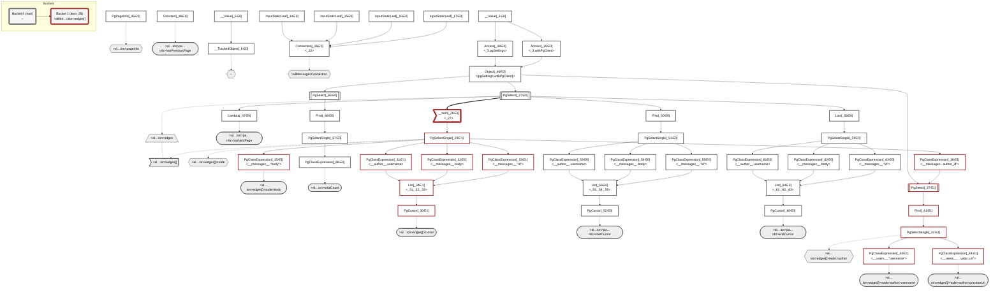

```mermaid
graph TD
    classDef path fill:#eee,stroke:#000,color:#000
    classDef plan fill:#fff,stroke-width:3px,color:#000
    classDef itemplan fill:#fff,stroke-width:6px,color:#000
    classDef sideeffectplan fill:#f00,stroke-width:6px,color:#000
    classDef bucket fill:#f6f6f6,color:#000,stroke-width:6px

    %% subgraph fields
    P1{{"~"}}:::path
    P2{{">allMessagesConnection"}}:::path
    P3[/">al…ion>edges"\]:::path
    P4>">al…ion>edges[]"]:::path
    P3 -.- P4
    P5([">al…ion>edges[]>cursor"]):::path
    %% P4 -.-> P5
    P6{{">al…ion>edges[]>node"}}:::path
    P7([">al…ion>edges[]>node>body"]):::path
    %% P6 -.-> P7
    P8{{">al…ion>edges[]>node>author"}}:::path
    P9([">al…ion>edges[]>node>author>username"]):::path
    %% P8 -.-> P9
    P10([">al…ion>edges[]>node>author>gravatarUrl"]):::path
    %% P8 -.-> P10
    %% P6 -.-> P8
    %% P4 -.-> P6
    %% P2 -.-> P3
    P11{{">al…ion>pageInfo"}}:::path
    P12([">al…ion>pa…nfo>hasNextPage"]):::path
    %% P11 -.-> P12
    P13([">al…ion>pa…nfo>hasPreviousPage"]):::path
    %% P11 -.-> P13
    P14([">al…ion>pa…nfo>startCursor"]):::path
    %% P11 -.-> P14
    P15([">al…ion>pa…nfo>endCursor"]):::path
    %% P11 -.-> P15
    %% P2 -.-> P11
    P16([">al…ion>totalCount"]):::path
    %% P2 -.-> P16
    %% P1 -.-> P2
    %% end

    %% define plans
    __Value_3["__Value[_3∈0]<br /><context>"]:::plan
    __Value_5["__Value[_5∈0]<br /><rootValue>"]:::plan
    __TrackedObject_6["__TrackedObject[_6∈0]"]:::plan
    InputStaticLeaf_14["InputStaticLeaf[_14∈0]"]:::plan
    InputStaticLeaf_15["InputStaticLeaf[_15∈0]"]:::plan
    InputStaticLeaf_16["InputStaticLeaf[_16∈0]"]:::plan
    InputStaticLeaf_17["InputStaticLeaf[_17∈0]"]:::plan
    Connection_26["Connection[_26∈0]<br /><_22>"]:::plan
    PgSelect_27[["PgSelect[_27∈0]<br /><messages>"]]:::plan
    __Item_28>"__Item[_28∈1]<br /><_27>"]:::itemplan
    PgSelectSingle_29["PgSelectSingle[_29∈1]<br /><messages>"]:::plan
    PgCursor_30["PgCursor[_30∈1]"]:::plan
    PgClassExpression_31["PgClassExpression[_31∈1]<br /><__author__.username>"]:::plan
    PgClassExpression_32["PgClassExpression[_32∈1]<br /><__messages__.body>"]:::plan
    PgClassExpression_33["PgClassExpression[_33∈1]<br /><__messages__.#quot;id#quot;>"]:::plan
    List_34["List[_34∈1]<br /><_31,_32,_33>"]:::plan
    PgClassExpression_35["PgClassExpression[_35∈1]<br /><__messages__.#quot;body#quot;>"]:::plan
    PgClassExpression_36["PgClassExpression[_36∈1]<br /><__messages...author_id#quot;>"]:::plan
    PgSelect_37[["PgSelect[_37∈1]<br /><users>"]]:::plan
    Access_38["Access[_38∈0]<br /><_3.pgSettings>"]:::plan
    Access_39["Access[_39∈0]<br /><_3.withPgClient>"]:::plan
    Object_40["Object[_40∈0]<br /><{pgSettings,withPgClient}>"]:::plan
    First_41["First[_41∈1]"]:::plan
    PgSelectSingle_42["PgSelectSingle[_42∈1]<br /><users>"]:::plan
    PgClassExpression_43["PgClassExpression[_43∈1]<br /><__users__.#quot;username#quot;>"]:::plan
    PgClassExpression_44["PgClassExpression[_44∈1]<br /><__users__....vatar_url#quot;>"]:::plan
    PgPageInfo_45["PgPageInfo[_45∈0]"]:::plan
    Lambda_47["Lambda[_47∈0]<br /><listHasMore>"]:::plan
    Constant_48["Constant[_48∈0]"]:::plan
    First_50["First[_50∈0]"]:::plan
    PgSelectSingle_51["PgSelectSingle[_51∈0]<br /><messages>"]:::plan
    PgCursor_52["PgCursor[_52∈0]"]:::plan
    PgClassExpression_53["PgClassExpression[_53∈0]<br /><__author__.username>"]:::plan
    PgClassExpression_54["PgClassExpression[_54∈0]<br /><__messages__.body>"]:::plan
    PgClassExpression_55["PgClassExpression[_55∈0]<br /><__messages__.#quot;id#quot;>"]:::plan
    List_56["List[_56∈0]<br /><_53,_54,_55>"]:::plan
    Last_58["Last[_58∈0]"]:::plan
    PgSelectSingle_59["PgSelectSingle[_59∈0]<br /><messages>"]:::plan
    PgCursor_60["PgCursor[_60∈0]"]:::plan
    PgClassExpression_61["PgClassExpression[_61∈0]<br /><__author__.username>"]:::plan
    PgClassExpression_62["PgClassExpression[_62∈0]<br /><__messages__.body>"]:::plan
    PgClassExpression_63["PgClassExpression[_63∈0]<br /><__messages__.#quot;id#quot;>"]:::plan
    List_64["List[_64∈0]<br /><_61,_62,_63>"]:::plan
    PgSelect_65[["PgSelect[_65∈0]<br /><messages>"]]:::plan
    First_66["First[_66∈0]"]:::plan
    PgSelectSingle_67["PgSelectSingle[_67∈0]<br /><messages>"]:::plan
    PgClassExpression_68["PgClassExpression[_68∈0]<br /><count(*)>"]:::plan

    %% plan dependencies
    __Value_5 --> __TrackedObject_6
    InputStaticLeaf_14 --> Connection_26
    InputStaticLeaf_15 --> Connection_26
    InputStaticLeaf_16 --> Connection_26
    InputStaticLeaf_17 --> Connection_26
    Object_40 --> PgSelect_27
    PgSelect_27 ==> __Item_28
    __Item_28 --> PgSelectSingle_29
    List_34 --> PgCursor_30
    PgSelectSingle_29 --> PgClassExpression_31
    PgSelectSingle_29 --> PgClassExpression_32
    PgSelectSingle_29 --> PgClassExpression_33
    PgClassExpression_31 --> List_34
    PgClassExpression_32 --> List_34
    PgClassExpression_33 --> List_34
    PgSelectSingle_29 --> PgClassExpression_35
    PgSelectSingle_29 --> PgClassExpression_36
    Object_40 --> PgSelect_37
    PgClassExpression_36 --> PgSelect_37
    __Value_3 --> Access_38
    __Value_3 --> Access_39
    Access_38 --> Object_40
    Access_39 --> Object_40
    PgSelect_37 --> First_41
    First_41 --> PgSelectSingle_42
    PgSelectSingle_42 --> PgClassExpression_43
    PgSelectSingle_42 --> PgClassExpression_44
    PgSelect_27 --> Lambda_47
    PgSelect_27 --> First_50
    First_50 --> PgSelectSingle_51
    List_56 --> PgCursor_52
    PgSelectSingle_51 --> PgClassExpression_53
    PgSelectSingle_51 --> PgClassExpression_54
    PgSelectSingle_51 --> PgClassExpression_55
    PgClassExpression_53 --> List_56
    PgClassExpression_54 --> List_56
    PgClassExpression_55 --> List_56
    PgSelect_27 --> Last_58
    Last_58 --> PgSelectSingle_59
    List_64 --> PgCursor_60
    PgSelectSingle_59 --> PgClassExpression_61
    PgSelectSingle_59 --> PgClassExpression_62
    PgSelectSingle_59 --> PgClassExpression_63
    PgClassExpression_61 --> List_64
    PgClassExpression_62 --> List_64
    PgClassExpression_63 --> List_64
    Object_40 --> PgSelect_65
    PgSelect_65 --> First_66
    First_66 --> PgSelectSingle_67
    PgSelectSingle_67 --> PgClassExpression_68

    %% plan-to-path relationships
    __TrackedObject_6 -.-> P1
    Connection_26 -.-> P2
    PgSelect_27 -.-> P3
    PgSelectSingle_29 -.-> P4
    PgCursor_30 -.-> P5
    PgSelectSingle_29 -.-> P6
    PgClassExpression_35 -.-> P7
    PgSelectSingle_42 -.-> P8
    PgClassExpression_43 -.-> P9
    PgClassExpression_44 -.-> P10
    PgPageInfo_45 -.-> P11
    Lambda_47 -.-> P12
    Constant_48 -.-> P13
    PgCursor_52 -.-> P14
    PgCursor_60 -.-> P15
    PgClassExpression_68 -.-> P16

    %% allocate buckets
    classDef bucket0 stroke:#696969
    class __Value_3,__Value_5,__TrackedObject_6,InputStaticLeaf_14,InputStaticLeaf_15,InputStaticLeaf_16,InputStaticLeaf_17,Connection_26,PgSelect_27,Access_38,Access_39,Object_40,PgPageInfo_45,Lambda_47,Constant_48,First_50,PgSelectSingle_51,PgCursor_52,PgClassExpression_53,PgClassExpression_54,PgClassExpression_55,List_56,Last_58,PgSelectSingle_59,PgCursor_60,PgClassExpression_61,PgClassExpression_62,PgClassExpression_63,List_64,PgSelect_65,First_66,PgSelectSingle_67,PgClassExpression_68 bucket0
    classDef bucket1 stroke:#a52a2a
    class __Item_28,PgSelectSingle_29,PgCursor_30,PgClassExpression_31,PgClassExpression_32,PgClassExpression_33,List_34,PgClassExpression_35,PgClassExpression_36,PgSelect_37,First_41,PgSelectSingle_42,PgClassExpression_43,PgClassExpression_44 bucket1

    subgraph Buckets
    Bucket0("Bucket 0 (root)<br />~"):::bucket
    style Bucket0 stroke:#696969
    Bucket1("Bucket 1 (item_28)<br />>allMe…ction>edges[]"):::bucket
    style Bucket1 stroke:#a52a2a
    Bucket0 --> Bucket1
    end
```
