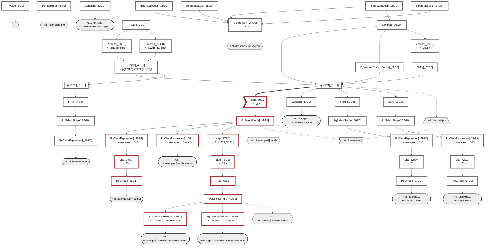

```mermaid
graph TD
    classDef path fill:#eee,stroke:#000,color:#000
    classDef plan fill:#fff,stroke-width:3px,color:#000
    classDef itemplan fill:#fff,stroke-width:6px,color:#000
    classDef sideeffectplan fill:#f00,stroke-width:6px,color:#000

    %% subgraph fields
    P1{{"~"}}:::path
    P2{{">allMessagesConnection"}}:::path
    P3[/">al…ion>edges"\]:::path
    P4>">al…ion>edges[]"]:::path
    P3 -.- P4
    P5([">al…ion>edges[]>cursor"]):::path
    %% P4 -.-> P5
    P6{{">al…ion>edges[]>node"}}:::path
    P7([">al…ion>edges[]>node>body"]):::path
    %% P6 -.-> P7
    P8{{">al…ion>edges[]>node>author"}}:::path
    P9([">al…ion>edges[]>node>author>username"]):::path
    %% P8 -.-> P9
    P10([">al…ion>edges[]>node>author>gravatarUrl"]):::path
    %% P8 -.-> P10
    %% P6 -.-> P8
    %% P4 -.-> P6
    %% P2 -.-> P3
    P11{{">al…ion>pageInfo"}}:::path
    P12([">al…ion>pa…nfo>hasNextPage"]):::path
    %% P11 -.-> P12
    P13([">al…ion>pa…nfo>hasPreviousPage"]):::path
    %% P11 -.-> P13
    P14([">al…ion>pa…nfo>startCursor"]):::path
    %% P11 -.-> P14
    P15([">al…ion>pa…nfo>endCursor"]):::path
    %% P11 -.-> P15
    %% P2 -.-> P11
    P16([">al…ion>totalCount"]):::path
    %% P2 -.-> P16
    %% P1 -.-> P2
    %% end

    %% define plans
    __Value_3["__Value[_3∈0]<br /><context>"]:::plan
    __Value_5["__Value[_5∈0]<br /><rootValue>"]:::plan
    InputStaticLeaf_14["InputStaticLeaf[_14∈0]"]:::plan
    InputStaticLeaf_15["InputStaticLeaf[_15∈0]"]:::plan
    InputStaticLeaf_16["InputStaticLeaf[_16∈0]"]:::plan
    InputStaticLeaf_17["InputStaticLeaf[_17∈0]"]:::plan
    Connection_24["Connection[_24∈0]<br /><_20>"]:::plan
    PgSelect_25[["PgSelect[_25∈0]<br /><messages>"]]:::plan
    Lambda_26["Lambda[_26∈0]<br /><parseCursor>"]:::plan
    PgValidateParsedCursor_27["PgValidateParsedCursor[_27∈0]"]:::plan
    Access_28["Access[_28∈0]<br /><_26.1>"]:::plan
    ToPg_29["ToPg[_29∈0]"]:::plan
    __Item_30>"__Item[_30∈1]<br /><_25>"]:::itemplan
    PgSelectSingle_31["PgSelectSingle[_31∈1]<br /><messages>"]:::plan
    PgCursor_32["PgCursor[_32∈1]"]:::plan
    PgClassExpression_33["PgClassExpression[_33∈1]<br /><__messages__.#quot;id#quot;>"]:::plan
    List_34["List[_34∈1]<br /><_33>"]:::plan
    PgClassExpression_35["PgClassExpression[_35∈1]<br /><__messages__.#quot;body#quot;>"]:::plan
    Access_38["Access[_38∈0]<br /><_3.pgSettings>"]:::plan
    Access_39["Access[_39∈0]<br /><_3.withPgClient>"]:::plan
    Object_40["Object[_40∈0]<br /><{pgSettings,withPgClient}>"]:::plan
    First_41["First[_41∈1]"]:::plan
    PgSelectSingle_42["PgSelectSingle[_42∈1]<br /><users>"]:::plan
    PgClassExpression_43["PgClassExpression[_43∈1]<br /><__users__.#quot;username#quot;>"]:::plan
    PgClassExpression_44["PgClassExpression[_44∈1]<br /><__users__....vatar_url#quot;>"]:::plan
    PgPageInfo_45["PgPageInfo[_45∈0]"]:::plan
    Lambda_48["Lambda[_48∈0]<br /><listHasMore>"]:::plan
    Constant_52["Constant[_52∈0]"]:::plan
    First_55["First[_55∈0]"]:::plan
    PgSelectSingle_56["PgSelectSingle[_56∈0]<br /><messages>"]:::plan
    PgCursor_57["PgCursor[_57∈0]"]:::plan
    PgClassExpression_61["PgClassExpression[_61∈0]<br /><__messages__.#quot;id#quot;>"]:::plan
    List_62["List[_62∈0]<br /><_61>"]:::plan
    Last_65["Last[_65∈0]"]:::plan
    PgSelectSingle_66["PgSelectSingle[_66∈0]<br /><messages>"]:::plan
    PgCursor_67["PgCursor[_67∈0]"]:::plan
    PgClassExpression_71["PgClassExpression[_71∈0]<br /><__messages__.#quot;id#quot;>"]:::plan
    List_72["List[_72∈0]<br /><_71>"]:::plan
    PgSelect_73[["PgSelect[_73∈0]<br /><messages>"]]:::plan
    First_74["First[_74∈0]"]:::plan
    PgSelectSingle_75["PgSelectSingle[_75∈0]<br /><messages>"]:::plan
    PgClassExpression_76["PgClassExpression[_76∈0]<br /><count(*)>"]:::plan
    Map_77["Map[_77∈1]<br /><_31:{#quot;0#quot;:2,#quot;1#quot;:3}>"]:::plan
    List_78["List[_78∈1]<br /><_77>"]:::plan

    %% plan dependencies
    InputStaticLeaf_14 --> Connection_24
    InputStaticLeaf_15 --> Connection_24
    InputStaticLeaf_16 --> Connection_24
    InputStaticLeaf_17 --> Connection_24
    Object_40 --> PgSelect_25
    Lambda_26 --> PgSelect_25
    PgValidateParsedCursor_27 --> PgSelect_25
    ToPg_29 --> PgSelect_25
    InputStaticLeaf_16 --> Lambda_26
    Lambda_26 --> PgValidateParsedCursor_27
    Lambda_26 --> Access_28
    Access_28 --> ToPg_29
    PgSelect_25 ==> __Item_30
    __Item_30 --> PgSelectSingle_31
    List_34 --> PgCursor_32
    PgSelectSingle_31 --> PgClassExpression_33
    PgClassExpression_33 --> List_34
    PgSelectSingle_31 --> PgClassExpression_35
    __Value_3 --> Access_38
    __Value_3 --> Access_39
    Access_38 --> Object_40
    Access_39 --> Object_40
    List_78 --> First_41
    First_41 --> PgSelectSingle_42
    PgSelectSingle_42 --> PgClassExpression_43
    PgSelectSingle_42 --> PgClassExpression_44
    PgSelect_25 --> Lambda_48
    PgSelect_25 --> First_55
    First_55 --> PgSelectSingle_56
    List_62 --> PgCursor_57
    PgSelectSingle_56 --> PgClassExpression_61
    PgClassExpression_61 --> List_62
    PgSelect_25 --> Last_65
    Last_65 --> PgSelectSingle_66
    List_72 --> PgCursor_67
    PgSelectSingle_66 --> PgClassExpression_71
    PgClassExpression_71 --> List_72
    Object_40 --> PgSelect_73
    PgSelect_73 --> First_74
    First_74 --> PgSelectSingle_75
    PgSelectSingle_75 --> PgClassExpression_76
    PgSelectSingle_31 --> Map_77
    Map_77 --> List_78

    %% plan-to-path relationships
    __Value_5 -.-> P1
    Connection_24 -.-> P2
    PgSelect_25 -.-> P3
    PgSelectSingle_31 -.-> P4
    PgCursor_32 -.-> P5
    PgSelectSingle_31 -.-> P6
    PgClassExpression_35 -.-> P7
    PgSelectSingle_42 -.-> P8
    PgClassExpression_43 -.-> P9
    PgClassExpression_44 -.-> P10
    PgPageInfo_45 -.-> P11
    Lambda_48 -.-> P12
    Constant_52 -.-> P13
    PgCursor_57 -.-> P14
    PgCursor_67 -.-> P15
    PgClassExpression_76 -.-> P16

    %% allocate buckets
    classDef bucket0 stroke:#696969
    class __Value_3,__Value_5,InputStaticLeaf_14,InputStaticLeaf_15,InputStaticLeaf_16,InputStaticLeaf_17,Connection_24,PgSelect_25,Lambda_26,PgValidateParsedCursor_27,Access_28,ToPg_29,Access_38,Access_39,Object_40,PgPageInfo_45,Lambda_48,Constant_52,First_55,PgSelectSingle_56,PgCursor_57,PgClassExpression_61,List_62,Last_65,PgSelectSingle_66,PgCursor_67,PgClassExpression_71,List_72,PgSelect_73,First_74,PgSelectSingle_75,PgClassExpression_76 bucket0
    classDef bucket1 stroke:#a52a2a
    class __Item_30,PgSelectSingle_31,PgCursor_32,PgClassExpression_33,List_34,PgClassExpression_35,First_41,PgSelectSingle_42,PgClassExpression_43,PgClassExpression_44,Map_77,List_78 bucket1
```
