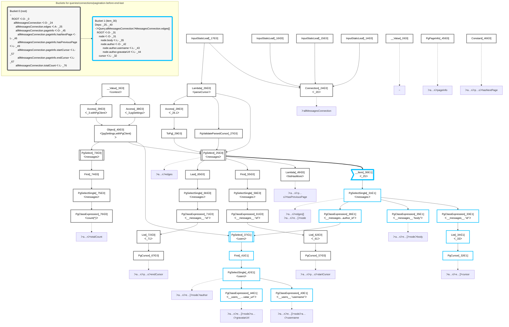

```mermaid
graph TD
    classDef path fill:#eee,stroke:#000,color:#000
    classDef plan fill:#fff,stroke-width:3px,color:#000
    classDef itemplan fill:#fff,stroke-width:6px,color:#000
    classDef sideeffectplan fill:#f00,stroke-width:6px,color:#000
    classDef bucket fill:#f6f6f6,color:#000,stroke-width:6px,text-align:left


    %% define plans
    __Value_0["__Value[_0∈0]"]:::plan
    PgCursor_32["PgCursor[_32∈1]"]:::plan
    List_34["List[_34∈1]<br />ᐸ_33ᐳ"]:::plan
    PgClassExpression_33["PgClassExpression[_33∈1]<br />ᐸ__messages__.”id”ᐳ"]:::plan
    PgClassExpression_35["PgClassExpression[_35∈1]<br />ᐸ__messages__.”body”ᐳ"]:::plan
    PgClassExpression_43["PgClassExpression[_43∈1]<br />ᐸ__users__.”username”ᐳ"]:::plan
    PgClassExpression_44["PgClassExpression[_44∈1]<br />ᐸ__users__....vatar_url”ᐳ"]:::plan
    PgSelectSingle_42["PgSelectSingle[_42∈1]<br />ᐸusersᐳ"]:::plan
    First_41["First[_41∈1]"]:::plan
    PgSelect_37[["PgSelect[_37∈1]<br />ᐸusersᐳ"]]:::plan
    PgClassExpression_36["PgClassExpression[_36∈1]<br />ᐸ__messages...author_id”ᐳ"]:::plan
    PgSelectSingle_31["PgSelectSingle[_31∈1]<br />ᐸmessagesᐳ"]:::plan
    __Item_30>"__Item[_30∈1]<br />ᐸ_25ᐳ"]:::itemplan
    Lambda_49["Lambda[_49∈0]<br />ᐸlistHasMoreᐳ"]:::plan
    PgCursor_57["PgCursor[_57∈0]"]:::plan
    List_62["List[_62∈0]<br />ᐸ_61ᐳ"]:::plan
    PgClassExpression_61["PgClassExpression[_61∈0]<br />ᐸ__messages__.”id”ᐳ"]:::plan
    PgSelectSingle_56["PgSelectSingle[_56∈0]<br />ᐸmessagesᐳ"]:::plan
    First_55["First[_55∈0]"]:::plan
    PgCursor_67["PgCursor[_67∈0]"]:::plan
    List_72["List[_72∈0]<br />ᐸ_71ᐳ"]:::plan
    PgClassExpression_71["PgClassExpression[_71∈0]<br />ᐸ__messages__.”id”ᐳ"]:::plan
    PgSelectSingle_66["PgSelectSingle[_66∈0]<br />ᐸmessagesᐳ"]:::plan
    Last_65["Last[_65∈0]"]:::plan
    PgSelect_25[["PgSelect[_25∈0]<br />ᐸmessagesᐳ"]]:::plan
    PgClassExpression_76["PgClassExpression[_76∈0]<br />ᐸcount(*)ᐳ"]:::plan
    PgSelectSingle_75["PgSelectSingle[_75∈0]<br />ᐸmessagesᐳ"]:::plan
    First_74["First[_74∈0]"]:::plan
    PgSelect_73[["PgSelect[_73∈0]<br />ᐸmessagesᐳ"]]:::plan
    Object_40["Object[_40∈0]<br />ᐸ{pgSettings,withPgClient}ᐳ"]:::plan
    Access_38["Access[_38∈0]<br />ᐸ_3.pgSettingsᐳ"]:::plan
    Access_39["Access[_39∈0]<br />ᐸ_3.withPgClientᐳ"]:::plan
    __Value_3["__Value[_3∈0]<br />ᐸcontextᐳ"]:::plan
    Connection_24["Connection[_24∈0]<br />ᐸ_20ᐳ"]:::plan
    InputStaticLeaf_14["InputStaticLeaf[_14∈0]"]:::plan
    InputStaticLeaf_15["InputStaticLeaf[_15∈0]"]:::plan
    InputStaticLeaf_16["InputStaticLeaf[_16∈0]"]:::plan
    PgValidateParsedCursor_27["PgValidateParsedCursor[_27∈0]"]:::plan
    ToPg_29["ToPg[_29∈0]"]:::plan
    Access_28["Access[_28∈0]<br />ᐸ_26.1ᐳ"]:::plan
    Lambda_26["Lambda[_26∈0]<br />ᐸparseCursorᐳ"]:::plan
    InputStaticLeaf_17["InputStaticLeaf[_17∈0]"]:::plan
    PgPageInfo_45["PgPageInfo[_45∈0]"]:::plan
    Constant_46["Constant[_46∈0]"]:::plan

    %% plan dependencies
    List_34 --> PgCursor_32
    PgClassExpression_33 --> List_34
    PgSelectSingle_31 --> PgClassExpression_33
    PgSelectSingle_31 --> PgClassExpression_35
    PgSelectSingle_42 --> PgClassExpression_43
    PgSelectSingle_42 --> PgClassExpression_44
    First_41 --> PgSelectSingle_42
    PgSelect_37 --> First_41
    Object_40 & PgClassExpression_36 --> PgSelect_37
    PgSelectSingle_31 --> PgClassExpression_36
    __Item_30 --> PgSelectSingle_31
    PgSelect_25 ==> __Item_30
    PgSelect_25 --> Lambda_49
    List_62 --> PgCursor_57
    PgClassExpression_61 --> List_62
    PgSelectSingle_56 --> PgClassExpression_61
    First_55 --> PgSelectSingle_56
    PgSelect_25 --> First_55
    List_72 --> PgCursor_67
    PgClassExpression_71 --> List_72
    PgSelectSingle_66 --> PgClassExpression_71
    Last_65 --> PgSelectSingle_66
    PgSelect_25 --> Last_65
    Object_40 & Lambda_26 & PgValidateParsedCursor_27 & ToPg_29 --> PgSelect_25
    PgSelectSingle_75 --> PgClassExpression_76
    First_74 --> PgSelectSingle_75
    PgSelect_73 --> First_74
    Object_40 --> PgSelect_73
    Access_38 & Access_39 --> Object_40
    __Value_3 --> Access_38
    __Value_3 --> Access_39
    InputStaticLeaf_14 & InputStaticLeaf_15 & InputStaticLeaf_16 & InputStaticLeaf_17 --> Connection_24
    Lambda_26 --> PgValidateParsedCursor_27
    Access_28 --> ToPg_29
    Lambda_26 --> Access_28
    InputStaticLeaf_17 --> Lambda_26

    %% plan-to-path relationships
    P_0["~"]
    __Value_0 -.-> P_0
    P_24["ᐳallMessagesConnection"]
    Connection_24 -.-> P_24
    P_25["ᐳa…nᐳedges"]
    PgSelect_25 -.-> P_25
    P_31["ᐳa…nᐳedges[]<br />ᐳa…nᐳe…]ᐳnode"]
    PgSelectSingle_31 -.-> P_31
    P_32["ᐳa…nᐳe…]ᐳcursor"]
    PgCursor_32 -.-> P_32
    P_35["ᐳa…nᐳe…]ᐳnodeᐳbody"]
    PgClassExpression_35 -.-> P_35
    P_42["ᐳa…nᐳe…]ᐳnodeᐳauthor"]
    PgSelectSingle_42 -.-> P_42
    P_43["ᐳa…nᐳe…]ᐳnodeᐳa…rᐳusername"]
    PgClassExpression_43 -.-> P_43
    P_44["ᐳa…nᐳe…]ᐳnodeᐳa…rᐳgravatarUrl"]
    PgClassExpression_44 -.-> P_44
    P_45["ᐳa…nᐳpageInfo"]
    PgPageInfo_45 -.-> P_45
    P_46["ᐳa…nᐳp…oᐳhasNextPage"]
    Constant_46 -.-> P_46
    P_49["ᐳa…nᐳp…oᐳhasPreviousPage"]
    Lambda_49 -.-> P_49
    P_57["ᐳa…nᐳp…oᐳstartCursor"]
    PgCursor_57 -.-> P_57
    P_67["ᐳa…nᐳp…oᐳendCursor"]
    PgCursor_67 -.-> P_67
    P_76["ᐳa…nᐳtotalCount"]
    PgClassExpression_76 -.-> P_76

    subgraph "Buckets for queries/connections/pagination-before-end-last"
    Bucket0("Bucket 0 (root)<br />~<br />⠀ROOT ᐸ-O- _0<br />⠀⠀allMessagesConnection ᐸ-O- _24<br />⠀⠀⠀allMessagesConnection.edges ᐸ-A- _25<br />⠀⠀⠀allMessagesConnection.pageInfo ᐸ-O- _45<br />⠀⠀⠀⠀allMessagesConnection.pageInfo.hasNextPage ᐸ-L- _46<br />⠀⠀⠀⠀allMessagesConnection.pageInfo.hasPreviousPage ᐸ-L- _49<br />⠀⠀⠀⠀allMessagesConnection.pageInfo.startCursor ᐸ-L- _57<br />⠀⠀⠀⠀allMessagesConnection.pageInfo.endCursor ᐸ-L- _67<br />⠀⠀⠀allMessagesConnection.totalCount ᐸ-L- _76"):::bucket
    classDef bucket0 stroke:#696969
    class Bucket0,__Value_0,__Value_3,InputStaticLeaf_14,InputStaticLeaf_15,InputStaticLeaf_16,InputStaticLeaf_17,Connection_24,PgSelect_25,Lambda_26,PgValidateParsedCursor_27,Access_28,ToPg_29,Access_38,Access_39,Object_40,PgPageInfo_45,Constant_46,Lambda_49,First_55,PgSelectSingle_56,PgCursor_57,PgClassExpression_61,List_62,Last_65,PgSelectSingle_66,PgCursor_67,PgClassExpression_71,List_72,PgSelect_73,First_74,PgSelectSingle_75,PgClassExpression_76 bucket0
    Bucket1("Bucket 1 (item_30)<br />Deps: _25, _40<br />~ᐳQuery.allMessagesConnectionᐳMessagesConnection.edges[]<br />⠀ROOT ᐸ-O- _31<br />⠀⠀node ᐸ-O- _31<br />⠀⠀⠀node.body ᐸ-L- _35<br />⠀⠀⠀node.author ᐸ-O- _42<br />⠀⠀⠀⠀node.author.username ᐸ-L- _43<br />⠀⠀⠀⠀node.author.gravatarUrl ᐸ-L- _44<br />⠀⠀cursor ᐸ-L- _32"):::bucket
    classDef bucket1 stroke:#00bfff
    class Bucket1,__Item_30,PgSelectSingle_31,PgCursor_32,PgClassExpression_33,List_34,PgClassExpression_35,PgClassExpression_36,PgSelect_37,First_41,PgSelectSingle_42,PgClassExpression_43,PgClassExpression_44 bucket1
    Bucket0 --> Bucket1
    end
```
