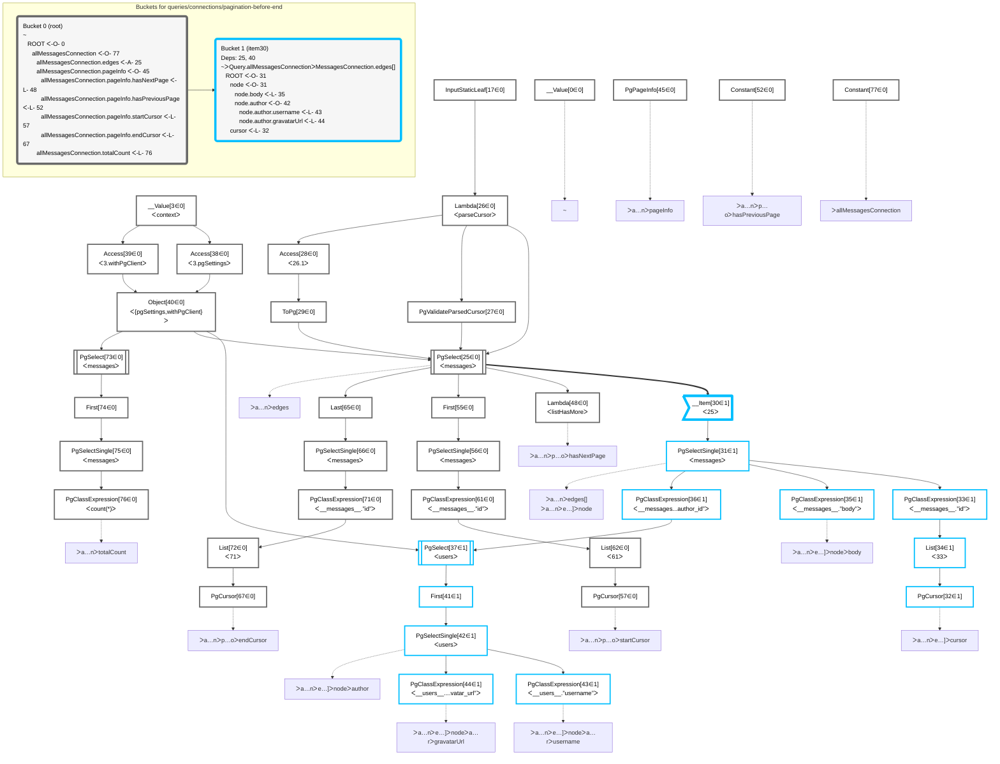

```mermaid
graph TD
    classDef path fill:#eee,stroke:#000,color:#000
    classDef plan fill:#fff,stroke-width:3px,color:#000
    classDef itemplan fill:#fff,stroke-width:6px,color:#000
    classDef sideeffectplan fill:#f00,stroke-width:6px,color:#000
    classDef bucket fill:#f6f6f6,color:#000,stroke-width:6px,text-align:left


    %% define plans
    __Value0["__Value[0∈0]"]:::plan
    PgCursor32["PgCursor[32∈1]"]:::plan
    List34["List[34∈1]<br />ᐸ33ᐳ"]:::plan
    PgClassExpression33["PgClassExpression[33∈1]<br />ᐸ__messages__.”id”ᐳ"]:::plan
    PgClassExpression35["PgClassExpression[35∈1]<br />ᐸ__messages__.”body”ᐳ"]:::plan
    PgClassExpression43["PgClassExpression[43∈1]<br />ᐸ__users__.”username”ᐳ"]:::plan
    PgClassExpression44["PgClassExpression[44∈1]<br />ᐸ__users__....vatar_url”ᐳ"]:::plan
    PgSelectSingle42["PgSelectSingle[42∈1]<br />ᐸusersᐳ"]:::plan
    First41["First[41∈1]"]:::plan
    PgSelect37[["PgSelect[37∈1]<br />ᐸusersᐳ"]]:::plan
    PgClassExpression36["PgClassExpression[36∈1]<br />ᐸ__messages...author_id”ᐳ"]:::plan
    PgSelectSingle31["PgSelectSingle[31∈1]<br />ᐸmessagesᐳ"]:::plan
    __Item30>"__Item[30∈1]<br />ᐸ25ᐳ"]:::itemplan
    Lambda48["Lambda[48∈0]<br />ᐸlistHasMoreᐳ"]:::plan
    PgCursor57["PgCursor[57∈0]"]:::plan
    List62["List[62∈0]<br />ᐸ61ᐳ"]:::plan
    PgClassExpression61["PgClassExpression[61∈0]<br />ᐸ__messages__.”id”ᐳ"]:::plan
    PgSelectSingle56["PgSelectSingle[56∈0]<br />ᐸmessagesᐳ"]:::plan
    First55["First[55∈0]"]:::plan
    PgCursor67["PgCursor[67∈0]"]:::plan
    List72["List[72∈0]<br />ᐸ71ᐳ"]:::plan
    PgClassExpression71["PgClassExpression[71∈0]<br />ᐸ__messages__.”id”ᐳ"]:::plan
    PgSelectSingle66["PgSelectSingle[66∈0]<br />ᐸmessagesᐳ"]:::plan
    Last65["Last[65∈0]"]:::plan
    PgSelect25[["PgSelect[25∈0]<br />ᐸmessagesᐳ"]]:::plan
    PgClassExpression76["PgClassExpression[76∈0]<br />ᐸcount(*)ᐳ"]:::plan
    PgSelectSingle75["PgSelectSingle[75∈0]<br />ᐸmessagesᐳ"]:::plan
    First74["First[74∈0]"]:::plan
    PgSelect73[["PgSelect[73∈0]<br />ᐸmessagesᐳ"]]:::plan
    Object40["Object[40∈0]<br />ᐸ{pgSettings,withPgClient}ᐳ"]:::plan
    Access38["Access[38∈0]<br />ᐸ3.pgSettingsᐳ"]:::plan
    Access39["Access[39∈0]<br />ᐸ3.withPgClientᐳ"]:::plan
    __Value3["__Value[3∈0]<br />ᐸcontextᐳ"]:::plan
    PgValidateParsedCursor27["PgValidateParsedCursor[27∈0]"]:::plan
    ToPg29["ToPg[29∈0]"]:::plan
    Access28["Access[28∈0]<br />ᐸ26.1ᐳ"]:::plan
    Lambda26["Lambda[26∈0]<br />ᐸparseCursorᐳ"]:::plan
    InputStaticLeaf17["InputStaticLeaf[17∈0]"]:::plan
    Constant77["Constant[77∈0]"]:::plan
    PgPageInfo45["PgPageInfo[45∈0]"]:::plan
    Constant52["Constant[52∈0]"]:::plan

    %% plan dependencies
    List34 --> PgCursor32
    PgClassExpression33 --> List34
    PgSelectSingle31 --> PgClassExpression33
    PgSelectSingle31 --> PgClassExpression35
    PgSelectSingle42 --> PgClassExpression43
    PgSelectSingle42 --> PgClassExpression44
    First41 --> PgSelectSingle42
    PgSelect37 --> First41
    Object40 & PgClassExpression36 --> PgSelect37
    PgSelectSingle31 --> PgClassExpression36
    __Item30 --> PgSelectSingle31
    PgSelect25 ==> __Item30
    PgSelect25 --> Lambda48
    List62 --> PgCursor57
    PgClassExpression61 --> List62
    PgSelectSingle56 --> PgClassExpression61
    First55 --> PgSelectSingle56
    PgSelect25 --> First55
    List72 --> PgCursor67
    PgClassExpression71 --> List72
    PgSelectSingle66 --> PgClassExpression71
    Last65 --> PgSelectSingle66
    PgSelect25 --> Last65
    Object40 & Lambda26 & PgValidateParsedCursor27 & ToPg29 --> PgSelect25
    PgSelectSingle75 --> PgClassExpression76
    First74 --> PgSelectSingle75
    PgSelect73 --> First74
    Object40 --> PgSelect73
    Access38 & Access39 --> Object40
    __Value3 --> Access38
    __Value3 --> Access39
    Lambda26 --> PgValidateParsedCursor27
    Access28 --> ToPg29
    Lambda26 --> Access28
    InputStaticLeaf17 --> Lambda26

    %% plan-to-path relationships
    P0["~"]
    __Value0 -.-> P0
    P25["ᐳa…nᐳedges"]
    PgSelect25 -.-> P25
    P31["ᐳa…nᐳedges[]<br />ᐳa…nᐳe…]ᐳnode"]
    PgSelectSingle31 -.-> P31
    P32["ᐳa…nᐳe…]ᐳcursor"]
    PgCursor32 -.-> P32
    P35["ᐳa…nᐳe…]ᐳnodeᐳbody"]
    PgClassExpression35 -.-> P35
    P42["ᐳa…nᐳe…]ᐳnodeᐳauthor"]
    PgSelectSingle42 -.-> P42
    P43["ᐳa…nᐳe…]ᐳnodeᐳa…rᐳusername"]
    PgClassExpression43 -.-> P43
    P44["ᐳa…nᐳe…]ᐳnodeᐳa…rᐳgravatarUrl"]
    PgClassExpression44 -.-> P44
    P45["ᐳa…nᐳpageInfo"]
    PgPageInfo45 -.-> P45
    P48["ᐳa…nᐳp…oᐳhasNextPage"]
    Lambda48 -.-> P48
    P52["ᐳa…nᐳp…oᐳhasPreviousPage"]
    Constant52 -.-> P52
    P57["ᐳa…nᐳp…oᐳstartCursor"]
    PgCursor57 -.-> P57
    P67["ᐳa…nᐳp…oᐳendCursor"]
    PgCursor67 -.-> P67
    P76["ᐳa…nᐳtotalCount"]
    PgClassExpression76 -.-> P76
    P77["ᐳallMessagesConnection"]
    Constant77 -.-> P77

    subgraph "Buckets for queries/connections/pagination-before-end"
    Bucket0("Bucket 0 (root)<br />~<br />⠀ROOT ᐸ-O- 0<br />⠀⠀allMessagesConnection ᐸ-O- 77<br />⠀⠀⠀allMessagesConnection.edges ᐸ-A- 25<br />⠀⠀⠀allMessagesConnection.pageInfo ᐸ-O- 45<br />⠀⠀⠀⠀allMessagesConnection.pageInfo.hasNextPage ᐸ-L- 48<br />⠀⠀⠀⠀allMessagesConnection.pageInfo.hasPreviousPage ᐸ-L- 52<br />⠀⠀⠀⠀allMessagesConnection.pageInfo.startCursor ᐸ-L- 57<br />⠀⠀⠀⠀allMessagesConnection.pageInfo.endCursor ᐸ-L- 67<br />⠀⠀⠀allMessagesConnection.totalCount ᐸ-L- 76"):::bucket
    classDef bucket0 stroke:#696969
    class Bucket0,__Value0,__Value3,InputStaticLeaf17,PgSelect25,Lambda26,PgValidateParsedCursor27,Access28,ToPg29,Access38,Access39,Object40,PgPageInfo45,Lambda48,Constant52,First55,PgSelectSingle56,PgCursor57,PgClassExpression61,List62,Last65,PgSelectSingle66,PgCursor67,PgClassExpression71,List72,PgSelect73,First74,PgSelectSingle75,PgClassExpression76,Constant77 bucket0
    Bucket1("Bucket 1 (item30)<br />Deps: 25, 40<br />~ᐳQuery.allMessagesConnectionᐳMessagesConnection.edges[]<br />⠀ROOT ᐸ-O- 31<br />⠀⠀node ᐸ-O- 31<br />⠀⠀⠀node.body ᐸ-L- 35<br />⠀⠀⠀node.author ᐸ-O- 42<br />⠀⠀⠀⠀node.author.username ᐸ-L- 43<br />⠀⠀⠀⠀node.author.gravatarUrl ᐸ-L- 44<br />⠀⠀cursor ᐸ-L- 32"):::bucket
    classDef bucket1 stroke:#00bfff
    class Bucket1,__Item30,PgSelectSingle31,PgCursor32,PgClassExpression33,List34,PgClassExpression35,PgClassExpression36,PgSelect37,First41,PgSelectSingle42,PgClassExpression43,PgClassExpression44 bucket1
    Bucket0 --> Bucket1
    end
```
