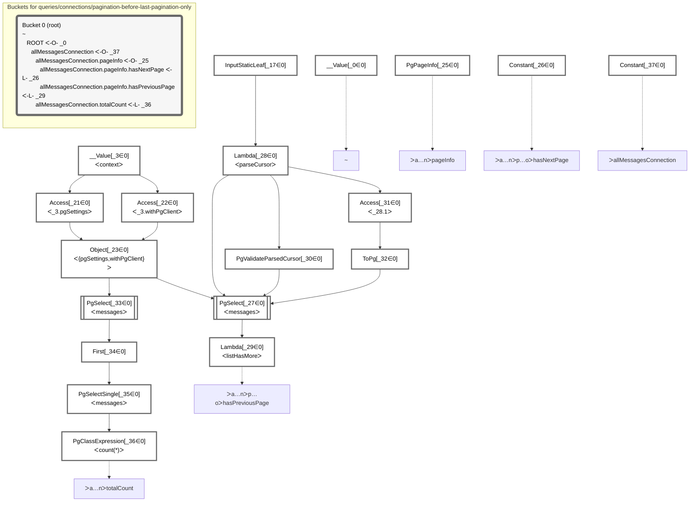

```mermaid
graph TD
    classDef path fill:#eee,stroke:#000,color:#000
    classDef plan fill:#fff,stroke-width:3px,color:#000
    classDef itemplan fill:#fff,stroke-width:6px,color:#000
    classDef sideeffectplan fill:#f00,stroke-width:6px,color:#000
    classDef bucket fill:#f6f6f6,color:#000,stroke-width:6px,text-align:left


    %% define plans
    __Value_0["__Value[_0∈0]"]:::plan
    Lambda_29["Lambda[_29∈0]<br />ᐸlistHasMoreᐳ"]:::plan
    PgSelect_27[["PgSelect[_27∈0]<br />ᐸmessagesᐳ"]]:::plan
    PgClassExpression_36["PgClassExpression[_36∈0]<br />ᐸcount(*)ᐳ"]:::plan
    PgSelectSingle_35["PgSelectSingle[_35∈0]<br />ᐸmessagesᐳ"]:::plan
    First_34["First[_34∈0]"]:::plan
    PgSelect_33[["PgSelect[_33∈0]<br />ᐸmessagesᐳ"]]:::plan
    Object_23["Object[_23∈0]<br />ᐸ{pgSettings,withPgClient}ᐳ"]:::plan
    Access_21["Access[_21∈0]<br />ᐸ_3.pgSettingsᐳ"]:::plan
    Access_22["Access[_22∈0]<br />ᐸ_3.withPgClientᐳ"]:::plan
    __Value_3["__Value[_3∈0]<br />ᐸcontextᐳ"]:::plan
    PgValidateParsedCursor_30["PgValidateParsedCursor[_30∈0]"]:::plan
    ToPg_32["ToPg[_32∈0]"]:::plan
    Access_31["Access[_31∈0]<br />ᐸ_28.1ᐳ"]:::plan
    Lambda_28["Lambda[_28∈0]<br />ᐸparseCursorᐳ"]:::plan
    InputStaticLeaf_17["InputStaticLeaf[_17∈0]"]:::plan
    Constant_37["Constant[_37∈0]"]:::plan
    PgPageInfo_25["PgPageInfo[_25∈0]"]:::plan
    Constant_26["Constant[_26∈0]"]:::plan

    %% plan dependencies
    PgSelect_27 --> Lambda_29
    Object_23 & Lambda_28 & PgValidateParsedCursor_30 & ToPg_32 --> PgSelect_27
    PgSelectSingle_35 --> PgClassExpression_36
    First_34 --> PgSelectSingle_35
    PgSelect_33 --> First_34
    Object_23 --> PgSelect_33
    Access_21 & Access_22 --> Object_23
    __Value_3 --> Access_21
    __Value_3 --> Access_22
    Lambda_28 --> PgValidateParsedCursor_30
    Access_31 --> ToPg_32
    Lambda_28 --> Access_31
    InputStaticLeaf_17 --> Lambda_28

    %% plan-to-path relationships
    P_0["~"]
    __Value_0 -.-> P_0
    P_25["ᐳa…nᐳpageInfo"]
    PgPageInfo_25 -.-> P_25
    P_26["ᐳa…nᐳp…oᐳhasNextPage"]
    Constant_26 -.-> P_26
    P_29["ᐳa…nᐳp…oᐳhasPreviousPage"]
    Lambda_29 -.-> P_29
    P_36["ᐳa…nᐳtotalCount"]
    PgClassExpression_36 -.-> P_36
    P_37["ᐳallMessagesConnection"]
    Constant_37 -.-> P_37

    subgraph "Buckets for queries/connections/pagination-before-last-pagination-only"
    Bucket0("Bucket 0 (root)<br />~<br />⠀ROOT ᐸ-O- _0<br />⠀⠀allMessagesConnection ᐸ-O- _37<br />⠀⠀⠀allMessagesConnection.pageInfo ᐸ-O- _25<br />⠀⠀⠀⠀allMessagesConnection.pageInfo.hasNextPage ᐸ-L- _26<br />⠀⠀⠀⠀allMessagesConnection.pageInfo.hasPreviousPage ᐸ-L- _29<br />⠀⠀⠀allMessagesConnection.totalCount ᐸ-L- _36"):::bucket
    classDef bucket0 stroke:#696969
    class Bucket0,__Value_0,__Value_3,InputStaticLeaf_17,Access_21,Access_22,Object_23,PgPageInfo_25,Constant_26,PgSelect_27,Lambda_28,Lambda_29,PgValidateParsedCursor_30,Access_31,ToPg_32,PgSelect_33,First_34,PgSelectSingle_35,PgClassExpression_36,Constant_37 bucket0
    end
```
