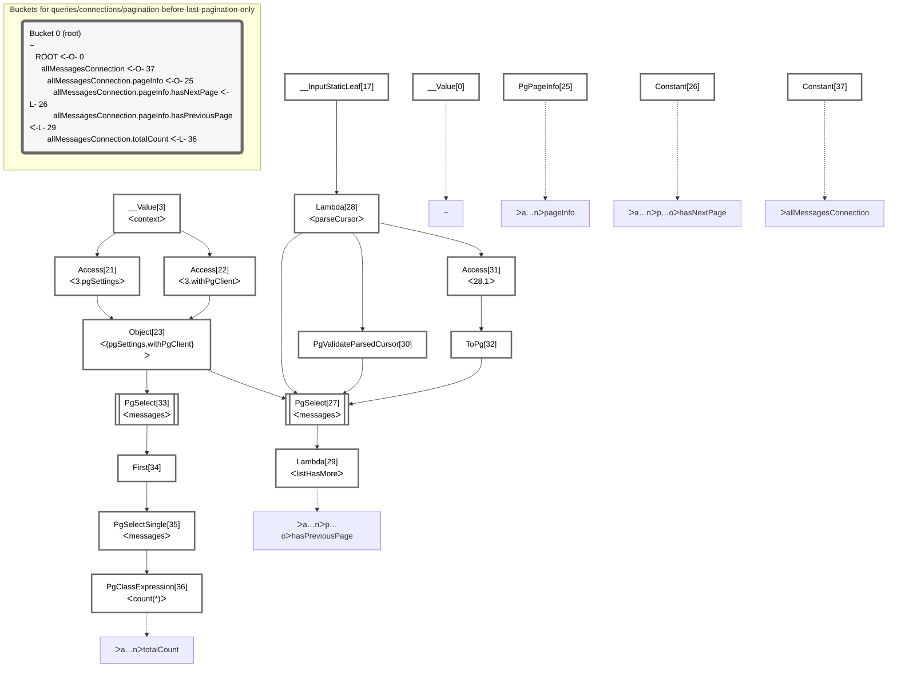

```mermaid
graph TD
    classDef path fill:#eee,stroke:#000,color:#000
    classDef plan fill:#fff,stroke-width:3px,color:#000
    classDef itemplan fill:#fff,stroke-width:6px,color:#000
    classDef sideeffectplan fill:#f00,stroke-width:6px,color:#000
    classDef bucket fill:#f6f6f6,color:#000,stroke-width:6px,text-align:left


    %% define plans
    __Value0["__Value[0]"]:::plan
    __Value3["__Value[3]<br />ᐸcontextᐳ"]:::plan
    __InputStaticLeaf17["__InputStaticLeaf[17]"]:::plan
    Access21["Access[21]<br />ᐸ3.pgSettingsᐳ"]:::plan
    Access22["Access[22]<br />ᐸ3.withPgClientᐳ"]:::plan
    Object23["Object[23]<br />ᐸ{pgSettings,withPgClient}ᐳ"]:::plan
    Constant37["Constant[37]"]:::plan
    PgPageInfo25["PgPageInfo[25]"]:::plan
    Constant26["Constant[26]"]:::plan
    Lambda28["Lambda[28]<br />ᐸparseCursorᐳ"]:::plan
    PgValidateParsedCursor30["PgValidateParsedCursor[30]"]:::plan
    Access31["Access[31]<br />ᐸ28.1ᐳ"]:::plan
    ToPg32["ToPg[32]"]:::plan
    PgSelect27[["PgSelect[27]<br />ᐸmessagesᐳ"]]:::plan
    Lambda29["Lambda[29]<br />ᐸlistHasMoreᐳ"]:::plan
    PgSelect33[["PgSelect[33]<br />ᐸmessagesᐳ"]]:::plan
    First34["First[34]"]:::plan
    PgSelectSingle35["PgSelectSingle[35]<br />ᐸmessagesᐳ"]:::plan
    PgClassExpression36["PgClassExpression[36]<br />ᐸcount(*)ᐳ"]:::plan

    %% plan dependencies
    __Value3 --> Access21
    __Value3 --> Access22
    Access21 & Access22 --> Object23
    __InputStaticLeaf17 --> Lambda28
    Lambda28 --> PgValidateParsedCursor30
    Lambda28 --> Access31
    Access31 --> ToPg32
    Object23 & Lambda28 & PgValidateParsedCursor30 & ToPg32 --> PgSelect27
    PgSelect27 --> Lambda29
    Object23 --> PgSelect33
    PgSelect33 --> First34
    First34 --> PgSelectSingle35
    PgSelectSingle35 --> PgClassExpression36

    %% plan-to-path relationships
    P0["~"]
    __Value0 -.-> P0
    P25["ᐳa…nᐳpageInfo"]
    PgPageInfo25 -.-> P25
    P26["ᐳa…nᐳp…oᐳhasNextPage"]
    Constant26 -.-> P26
    P29["ᐳa…nᐳp…oᐳhasPreviousPage"]
    Lambda29 -.-> P29
    P36["ᐳa…nᐳtotalCount"]
    PgClassExpression36 -.-> P36
    P37["ᐳallMessagesConnection"]
    Constant37 -.-> P37

    subgraph "Buckets for queries/connections/pagination-before-last-pagination-only"
    Bucket0("Bucket 0 (root)<br />~<br />⠀ROOT ᐸ-O- 0<br />⠀⠀allMessagesConnection ᐸ-O- 37<br />⠀⠀⠀allMessagesConnection.pageInfo ᐸ-O- 25<br />⠀⠀⠀⠀allMessagesConnection.pageInfo.hasNextPage ᐸ-L- 26<br />⠀⠀⠀⠀allMessagesConnection.pageInfo.hasPreviousPage ᐸ-L- 29<br />⠀⠀⠀allMessagesConnection.totalCount ᐸ-L- 36"):::bucket
    classDef bucket0 stroke:#696969
    class Bucket0,__Value0,__Value3,__InputStaticLeaf17,Access21,Access22,Object23,PgPageInfo25,Constant26,PgSelect27,Lambda28,Lambda29,PgValidateParsedCursor30,Access31,ToPg32,PgSelect33,First34,PgSelectSingle35,PgClassExpression36,Constant37 bucket0
    end
```
