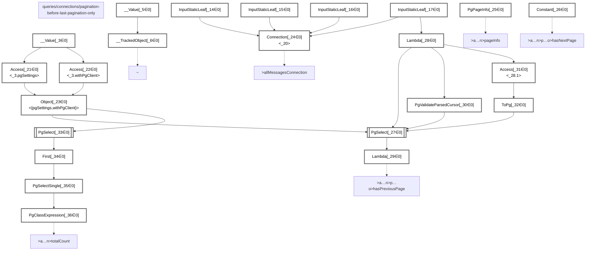

```mermaid
graph TD
    subgraph "queries/connections/pagination-before-last-pagination-only"
    end
    classDef path fill:#eee,stroke:#000,color:#000
    classDef plan fill:#fff,stroke-width:3px,color:#000
    classDef itemplan fill:#fff,stroke-width:6px,color:#000
    classDef sideeffectplan fill:#f00,stroke-width:6px,color:#000
    classDef bucket fill:#f6f6f6,color:#000,stroke-width:6px,text-align:left


    %% define plans
    __Value_3["__Value[_3∈0]<br /><context>"]:::plan
    __Value_5["__Value[_5∈0]<br /><rootValue>"]:::plan
    __TrackedObject_6["__TrackedObject[_6∈0]"]:::plan
    InputStaticLeaf_14["InputStaticLeaf[_14∈0]"]:::plan
    InputStaticLeaf_15["InputStaticLeaf[_15∈0]"]:::plan
    InputStaticLeaf_16["InputStaticLeaf[_16∈0]"]:::plan
    InputStaticLeaf_17["InputStaticLeaf[_17∈0]"]:::plan
    Access_21["Access[_21∈0]<br /><_3.pgSettings>"]:::plan
    Access_22["Access[_22∈0]<br /><_3.withPgClient>"]:::plan
    Object_23["Object[_23∈0]<br /><{pgSettings,withPgClient}>"]:::plan
    Connection_24["Connection[_24∈0]<br /><_20>"]:::plan
    PgPageInfo_25["PgPageInfo[_25∈0]"]:::plan
    Constant_26["Constant[_26∈0]"]:::plan
    PgSelect_27[["PgSelect[_27∈0]<br /><messages>"]]:::plan
    Lambda_28["Lambda[_28∈0]<br /><parseCursor>"]:::plan
    Lambda_29["Lambda[_29∈0]<br /><listHasMore>"]:::plan
    PgValidateParsedCursor_30["PgValidateParsedCursor[_30∈0]"]:::plan
    Access_31["Access[_31∈0]<br /><_28.1>"]:::plan
    ToPg_32["ToPg[_32∈0]"]:::plan
    PgSelect_33[["PgSelect[_33∈0]<br /><messages>"]]:::plan
    First_34["First[_34∈0]"]:::plan
    PgSelectSingle_35["PgSelectSingle[_35∈0]<br /><messages>"]:::plan
    PgClassExpression_36["PgClassExpression[_36∈0]<br /><count(*)>"]:::plan

    %% plan dependencies
    __Value_5 --> __TrackedObject_6
    __Value_3 --> Access_21
    __Value_3 --> Access_22
    Access_21 --> Object_23
    Access_22 --> Object_23
    InputStaticLeaf_14 --> Connection_24
    InputStaticLeaf_15 --> Connection_24
    InputStaticLeaf_16 --> Connection_24
    InputStaticLeaf_17 --> Connection_24
    Object_23 --> PgSelect_27
    Lambda_28 --> PgSelect_27
    PgValidateParsedCursor_30 --> PgSelect_27
    ToPg_32 --> PgSelect_27
    InputStaticLeaf_17 --> Lambda_28
    PgSelect_27 --> Lambda_29
    Lambda_28 --> PgValidateParsedCursor_30
    Lambda_28 --> Access_31
    Access_31 --> ToPg_32
    Object_23 --> PgSelect_33
    PgSelect_33 --> First_34
    First_34 --> PgSelectSingle_35
    PgSelectSingle_35 --> PgClassExpression_36

    %% plan-to-path relationships
    P_6["~"]
    __TrackedObject_6 -.-> P_6
    P_24[">allMessagesConnection"]
    Connection_24 -.-> P_24
    P_25[">a…n>pageInfo"]
    PgPageInfo_25 -.-> P_25
    P_26[">a…n>p…o>hasNextPage"]
    Constant_26 -.-> P_26
    P_29[">a…n>p…o>hasPreviousPage"]
    Lambda_29 -.-> P_29
    P_36[">a…n>totalCount"]
    PgClassExpression_36 -.-> P_36

    %% allocate buckets
    classDef bucket0 stroke:#696969
    class __Value_3,__Value_5,__TrackedObject_6,InputStaticLeaf_14,InputStaticLeaf_15,InputStaticLeaf_16,InputStaticLeaf_17,Access_21,Access_22,Object_23,Connection_24,PgPageInfo_25,Constant_26,PgSelect_27,Lambda_28,Lambda_29,PgValidateParsedCursor_30,Access_31,ToPg_32,PgSelect_33,First_34,PgSelectSingle_35,PgClassExpression_36 bucket0
```
