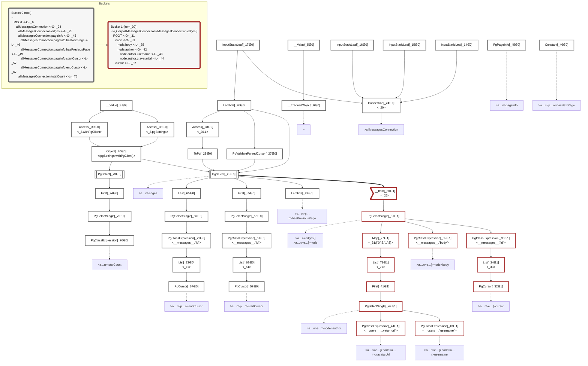

```mermaid
graph TD
    classDef path fill:#eee,stroke:#000,color:#000
    classDef plan fill:#fff,stroke-width:3px,color:#000
    classDef itemplan fill:#fff,stroke-width:6px,color:#000
    classDef sideeffectplan fill:#f00,stroke-width:6px,color:#000
    classDef bucket fill:#f6f6f6,color:#000,stroke-width:6px,text-align:left


    %% define plans
    __Value_3["__Value[_3∈0]<br /><context>"]:::plan
    __Value_5["__Value[_5∈0]<br /><rootValue>"]:::plan
    __TrackedObject_6["__TrackedObject[_6∈0]"]:::plan
    InputStaticLeaf_14["InputStaticLeaf[_14∈0]"]:::plan
    InputStaticLeaf_15["InputStaticLeaf[_15∈0]"]:::plan
    InputStaticLeaf_16["InputStaticLeaf[_16∈0]"]:::plan
    InputStaticLeaf_17["InputStaticLeaf[_17∈0]"]:::plan
    Connection_24["Connection[_24∈0]<br /><_20>"]:::plan
    PgSelect_25[["PgSelect[_25∈0]<br /><messages>"]]:::plan
    Lambda_26["Lambda[_26∈0]<br /><parseCursor>"]:::plan
    PgValidateParsedCursor_27["PgValidateParsedCursor[_27∈0]"]:::plan
    Access_28["Access[_28∈0]<br /><_26.1>"]:::plan
    ToPg_29["ToPg[_29∈0]"]:::plan
    __Item_30>"__Item[_30∈1]<br /><_25>"]:::itemplan
    PgSelectSingle_31["PgSelectSingle[_31∈1]<br /><messages>"]:::plan
    PgCursor_32["PgCursor[_32∈1]"]:::plan
    PgClassExpression_33["PgClassExpression[_33∈1]<br /><__messages__.”id”>"]:::plan
    List_34["List[_34∈1]<br /><_33>"]:::plan
    PgClassExpression_35["PgClassExpression[_35∈1]<br /><__messages__.”body”>"]:::plan
    Access_38["Access[_38∈0]<br /><_3.pgSettings>"]:::plan
    Access_39["Access[_39∈0]<br /><_3.withPgClient>"]:::plan
    Object_40["Object[_40∈0]<br /><{pgSettings,withPgClient}>"]:::plan
    First_41["First[_41∈1]"]:::plan
    PgSelectSingle_42["PgSelectSingle[_42∈1]<br /><users>"]:::plan
    PgClassExpression_43["PgClassExpression[_43∈1]<br /><__users__.”username”>"]:::plan
    PgClassExpression_44["PgClassExpression[_44∈1]<br /><__users__....vatar_url”>"]:::plan
    PgPageInfo_45["PgPageInfo[_45∈0]"]:::plan
    Constant_46["Constant[_46∈0]"]:::plan
    Lambda_49["Lambda[_49∈0]<br /><listHasMore>"]:::plan
    First_55["First[_55∈0]"]:::plan
    PgSelectSingle_56["PgSelectSingle[_56∈0]<br /><messages>"]:::plan
    PgCursor_57["PgCursor[_57∈0]"]:::plan
    PgClassExpression_61["PgClassExpression[_61∈0]<br /><__messages__.”id”>"]:::plan
    List_62["List[_62∈0]<br /><_61>"]:::plan
    Last_65["Last[_65∈0]"]:::plan
    PgSelectSingle_66["PgSelectSingle[_66∈0]<br /><messages>"]:::plan
    PgCursor_67["PgCursor[_67∈0]"]:::plan
    PgClassExpression_71["PgClassExpression[_71∈0]<br /><__messages__.”id”>"]:::plan
    List_72["List[_72∈0]<br /><_71>"]:::plan
    PgSelect_73[["PgSelect[_73∈0]<br /><messages>"]]:::plan
    First_74["First[_74∈0]"]:::plan
    PgSelectSingle_75["PgSelectSingle[_75∈0]<br /><messages>"]:::plan
    PgClassExpression_76["PgClassExpression[_76∈0]<br /><count(*)>"]:::plan
    Map_77["Map[_77∈1]<br /><_31:{”0”:2,”1”:3}>"]:::plan
    List_78["List[_78∈1]<br /><_77>"]:::plan

    %% plan dependencies
    __Value_5 --> __TrackedObject_6
    InputStaticLeaf_14 --> Connection_24
    InputStaticLeaf_15 --> Connection_24
    InputStaticLeaf_16 --> Connection_24
    InputStaticLeaf_17 --> Connection_24
    Object_40 --> PgSelect_25
    Lambda_26 --> PgSelect_25
    PgValidateParsedCursor_27 --> PgSelect_25
    ToPg_29 --> PgSelect_25
    InputStaticLeaf_17 --> Lambda_26
    Lambda_26 --> PgValidateParsedCursor_27
    Lambda_26 --> Access_28
    Access_28 --> ToPg_29
    PgSelect_25 ==> __Item_30
    __Item_30 --> PgSelectSingle_31
    List_34 --> PgCursor_32
    PgSelectSingle_31 --> PgClassExpression_33
    PgClassExpression_33 --> List_34
    PgSelectSingle_31 --> PgClassExpression_35
    __Value_3 --> Access_38
    __Value_3 --> Access_39
    Access_38 --> Object_40
    Access_39 --> Object_40
    List_78 --> First_41
    First_41 --> PgSelectSingle_42
    PgSelectSingle_42 --> PgClassExpression_43
    PgSelectSingle_42 --> PgClassExpression_44
    PgSelect_25 --> Lambda_49
    PgSelect_25 --> First_55
    First_55 --> PgSelectSingle_56
    List_62 --> PgCursor_57
    PgSelectSingle_56 --> PgClassExpression_61
    PgClassExpression_61 --> List_62
    PgSelect_25 --> Last_65
    Last_65 --> PgSelectSingle_66
    List_72 --> PgCursor_67
    PgSelectSingle_66 --> PgClassExpression_71
    PgClassExpression_71 --> List_72
    Object_40 --> PgSelect_73
    PgSelect_73 --> First_74
    First_74 --> PgSelectSingle_75
    PgSelectSingle_75 --> PgClassExpression_76
    PgSelectSingle_31 --> Map_77
    Map_77 --> List_78

    %% plan-to-path relationships
    P_6["~"]
    __TrackedObject_6 -.-> P_6
    P_24[">allMessagesConnection"]
    Connection_24 -.-> P_24
    P_25[">a…n>edges"]
    PgSelect_25 -.-> P_25
    P_31[">a…n>edges[]<br />>a…n>e…]>node"]
    PgSelectSingle_31 -.-> P_31
    P_32[">a…n>e…]>cursor"]
    PgCursor_32 -.-> P_32
    P_35[">a…n>e…]>node>body"]
    PgClassExpression_35 -.-> P_35
    P_42[">a…n>e…]>node>author"]
    PgSelectSingle_42 -.-> P_42
    P_43[">a…n>e…]>node>a…r>username"]
    PgClassExpression_43 -.-> P_43
    P_44[">a…n>e…]>node>a…r>gravatarUrl"]
    PgClassExpression_44 -.-> P_44
    P_45[">a…n>pageInfo"]
    PgPageInfo_45 -.-> P_45
    P_46[">a…n>p…o>hasNextPage"]
    Constant_46 -.-> P_46
    P_49[">a…n>p…o>hasPreviousPage"]
    Lambda_49 -.-> P_49
    P_57[">a…n>p…o>startCursor"]
    PgCursor_57 -.-> P_57
    P_67[">a…n>p…o>endCursor"]
    PgCursor_67 -.-> P_67
    P_76[">a…n>totalCount"]
    PgClassExpression_76 -.-> P_76

    %% allocate buckets
    classDef bucket0 stroke:#696969
    class __Value_3,__Value_5,__TrackedObject_6,InputStaticLeaf_14,InputStaticLeaf_15,InputStaticLeaf_16,InputStaticLeaf_17,Connection_24,PgSelect_25,Lambda_26,PgValidateParsedCursor_27,Access_28,ToPg_29,Access_38,Access_39,Object_40,PgPageInfo_45,Constant_46,Lambda_49,First_55,PgSelectSingle_56,PgCursor_57,PgClassExpression_61,List_62,Last_65,PgSelectSingle_66,PgCursor_67,PgClassExpression_71,List_72,PgSelect_73,First_74,PgSelectSingle_75,PgClassExpression_76 bucket0
    classDef bucket1 stroke:#a52a2a
    class __Item_30,PgSelectSingle_31,PgCursor_32,PgClassExpression_33,List_34,PgClassExpression_35,First_41,PgSelectSingle_42,PgClassExpression_43,PgClassExpression_44,Map_77,List_78 bucket1

    subgraph Buckets
    Bucket0("Bucket 0 (root)<br />~<br />⠀ROOT <-O- _6<br />⠀⠀allMessagesConnection <-O- _24<br />⠀⠀⠀allMessagesConnection.edges <-A- _25<br />⠀⠀⠀allMessagesConnection.pageInfo <-O- _45<br />⠀⠀⠀⠀allMessagesConnection.pageInfo.hasNextPage <-L- _46<br />⠀⠀⠀⠀allMessagesConnection.pageInfo.hasPreviousPage <-L- _49<br />⠀⠀⠀⠀allMessagesConnection.pageInfo.startCursor <-L- _57<br />⠀⠀⠀⠀allMessagesConnection.pageInfo.endCursor <-L- _67<br />⠀⠀⠀allMessagesConnection.totalCount <-L- _76"):::bucket
    style Bucket0 stroke:#696969
    Bucket1("Bucket 1 (item_30)<br />~>Query.allMessagesConnection>MessagesConnection.edges[]<br />⠀ROOT <-O- _31<br />⠀⠀node <-O- _31<br />⠀⠀⠀node.body <-L- _35<br />⠀⠀⠀node.author <-O- _42<br />⠀⠀⠀⠀node.author.username <-L- _43<br />⠀⠀⠀⠀node.author.gravatarUrl <-L- _44<br />⠀⠀cursor <-L- _32"):::bucket
    style Bucket1 stroke:#a52a2a
    Bucket0 --> Bucket1
    end
```
