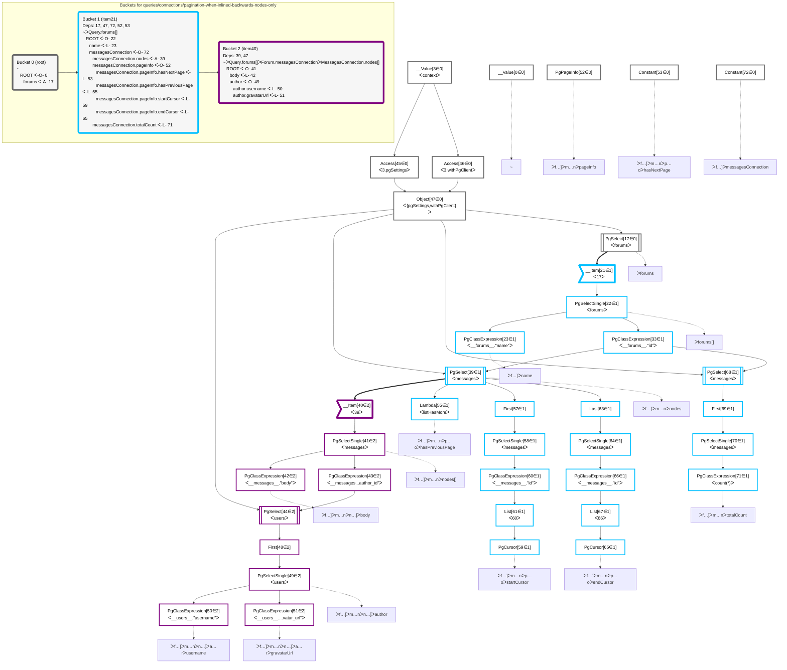

```mermaid
graph TD
    classDef path fill:#eee,stroke:#000,color:#000
    classDef plan fill:#fff,stroke-width:3px,color:#000
    classDef itemplan fill:#fff,stroke-width:6px,color:#000
    classDef sideeffectplan fill:#f00,stroke-width:6px,color:#000
    classDef bucket fill:#f6f6f6,color:#000,stroke-width:6px,text-align:left


    %% define plans
    __Value0["__Value[0∈0]"]:::plan
    PgClassExpression23["PgClassExpression[23∈1]<br />ᐸ__forums__.”name”ᐳ"]:::plan
    PgClassExpression42["PgClassExpression[42∈2]<br />ᐸ__messages__.”body”ᐳ"]:::plan
    PgClassExpression50["PgClassExpression[50∈2]<br />ᐸ__users__.”username”ᐳ"]:::plan
    PgClassExpression51["PgClassExpression[51∈2]<br />ᐸ__users__....vatar_url”ᐳ"]:::plan
    PgSelectSingle49["PgSelectSingle[49∈2]<br />ᐸusersᐳ"]:::plan
    First48["First[48∈2]"]:::plan
    PgSelect44[["PgSelect[44∈2]<br />ᐸusersᐳ"]]:::plan
    PgClassExpression43["PgClassExpression[43∈2]<br />ᐸ__messages...author_id”ᐳ"]:::plan
    PgSelectSingle41["PgSelectSingle[41∈2]<br />ᐸmessagesᐳ"]:::plan
    __Item40>"__Item[40∈2]<br />ᐸ39ᐳ"]:::itemplan
    Lambda55["Lambda[55∈1]<br />ᐸlistHasMoreᐳ"]:::plan
    PgCursor59["PgCursor[59∈1]"]:::plan
    List61["List[61∈1]<br />ᐸ60ᐳ"]:::plan
    PgClassExpression60["PgClassExpression[60∈1]<br />ᐸ__messages__.”id”ᐳ"]:::plan
    PgSelectSingle58["PgSelectSingle[58∈1]<br />ᐸmessagesᐳ"]:::plan
    First57["First[57∈1]"]:::plan
    PgCursor65["PgCursor[65∈1]"]:::plan
    List67["List[67∈1]<br />ᐸ66ᐳ"]:::plan
    PgClassExpression66["PgClassExpression[66∈1]<br />ᐸ__messages__.”id”ᐳ"]:::plan
    PgSelectSingle64["PgSelectSingle[64∈1]<br />ᐸmessagesᐳ"]:::plan
    Last63["Last[63∈1]"]:::plan
    PgSelect39[["PgSelect[39∈1]<br />ᐸmessagesᐳ"]]:::plan
    PgClassExpression71["PgClassExpression[71∈1]<br />ᐸcount(*)ᐳ"]:::plan
    PgSelectSingle70["PgSelectSingle[70∈1]<br />ᐸmessagesᐳ"]:::plan
    First69["First[69∈1]"]:::plan
    PgSelect68[["PgSelect[68∈1]<br />ᐸmessagesᐳ"]]:::plan
    PgClassExpression33["PgClassExpression[33∈1]<br />ᐸ__forums__.”id”ᐳ"]:::plan
    PgSelectSingle22["PgSelectSingle[22∈1]<br />ᐸforumsᐳ"]:::plan
    __Item21>"__Item[21∈1]<br />ᐸ17ᐳ"]:::itemplan
    PgSelect17[["PgSelect[17∈0]<br />ᐸforumsᐳ"]]:::plan
    Object47["Object[47∈0]<br />ᐸ{pgSettings,withPgClient}ᐳ"]:::plan
    Access45["Access[45∈0]<br />ᐸ3.pgSettingsᐳ"]:::plan
    Access46["Access[46∈0]<br />ᐸ3.withPgClientᐳ"]:::plan
    __Value3["__Value[3∈0]<br />ᐸcontextᐳ"]:::plan
    Constant72["Constant[72∈0]"]:::plan
    PgPageInfo52["PgPageInfo[52∈0]"]:::plan
    Constant53["Constant[53∈0]"]:::plan

    %% plan dependencies
    PgSelectSingle22 --> PgClassExpression23
    PgSelectSingle41 --> PgClassExpression42
    PgSelectSingle49 --> PgClassExpression50
    PgSelectSingle49 --> PgClassExpression51
    First48 --> PgSelectSingle49
    PgSelect44 --> First48
    Object47 & PgClassExpression43 --> PgSelect44
    PgSelectSingle41 --> PgClassExpression43
    __Item40 --> PgSelectSingle41
    PgSelect39 ==> __Item40
    PgSelect39 --> Lambda55
    List61 --> PgCursor59
    PgClassExpression60 --> List61
    PgSelectSingle58 --> PgClassExpression60
    First57 --> PgSelectSingle58
    PgSelect39 --> First57
    List67 --> PgCursor65
    PgClassExpression66 --> List67
    PgSelectSingle64 --> PgClassExpression66
    Last63 --> PgSelectSingle64
    PgSelect39 --> Last63
    Object47 & PgClassExpression33 --> PgSelect39
    PgSelectSingle70 --> PgClassExpression71
    First69 --> PgSelectSingle70
    PgSelect68 --> First69
    Object47 & PgClassExpression33 --> PgSelect68
    PgSelectSingle22 --> PgClassExpression33
    __Item21 --> PgSelectSingle22
    PgSelect17 ==> __Item21
    Object47 --> PgSelect17
    Access45 & Access46 --> Object47
    __Value3 --> Access45
    __Value3 --> Access46

    %% plan-to-path relationships
    P0["~"]
    __Value0 -.-> P0
    P17["ᐳforums"]
    PgSelect17 -.-> P17
    P22["ᐳforums[]"]
    PgSelectSingle22 -.-> P22
    P23["ᐳf…]ᐳname"]
    PgClassExpression23 -.-> P23
    P39["ᐳf…]ᐳm…nᐳnodes"]
    PgSelect39 -.-> P39
    P41["ᐳf…]ᐳm…nᐳnodes[]"]
    PgSelectSingle41 -.-> P41
    P42["ᐳf…]ᐳm…nᐳn…]ᐳbody"]
    PgClassExpression42 -.-> P42
    P49["ᐳf…]ᐳm…nᐳn…]ᐳauthor"]
    PgSelectSingle49 -.-> P49
    P50["ᐳf…]ᐳm…nᐳn…]ᐳa…rᐳusername"]
    PgClassExpression50 -.-> P50
    P51["ᐳf…]ᐳm…nᐳn…]ᐳa…rᐳgravatarUrl"]
    PgClassExpression51 -.-> P51
    P52["ᐳf…]ᐳm…nᐳpageInfo"]
    PgPageInfo52 -.-> P52
    P53["ᐳf…]ᐳm…nᐳp…oᐳhasNextPage"]
    Constant53 -.-> P53
    P55["ᐳf…]ᐳm…nᐳp…oᐳhasPreviousPage"]
    Lambda55 -.-> P55
    P59["ᐳf…]ᐳm…nᐳp…oᐳstartCursor"]
    PgCursor59 -.-> P59
    P65["ᐳf…]ᐳm…nᐳp…oᐳendCursor"]
    PgCursor65 -.-> P65
    P71["ᐳf…]ᐳm…nᐳtotalCount"]
    PgClassExpression71 -.-> P71
    P72["ᐳf…]ᐳmessagesConnection"]
    Constant72 -.-> P72

    subgraph "Buckets for queries/connections/pagination-when-inlined-backwards-nodes-only"
    Bucket0("Bucket 0 (root)<br />~<br />⠀ROOT ᐸ-O- 0<br />⠀⠀forums ᐸ-A- 17"):::bucket
    classDef bucket0 stroke:#696969
    class Bucket0,__Value0,__Value3,PgSelect17,Access45,Access46,Object47,PgPageInfo52,Constant53,Constant72 bucket0
    Bucket1("Bucket 1 (item21)<br />Deps: 17, 47, 72, 52, 53<br />~ᐳQuery.forums[]<br />⠀ROOT ᐸ-O- 22<br />⠀⠀name ᐸ-L- 23<br />⠀⠀messagesConnection ᐸ-O- 72<br />⠀⠀⠀messagesConnection.nodes ᐸ-A- 39<br />⠀⠀⠀messagesConnection.pageInfo ᐸ-O- 52<br />⠀⠀⠀⠀messagesConnection.pageInfo.hasNextPage ᐸ-L- 53<br />⠀⠀⠀⠀messagesConnection.pageInfo.hasPreviousPage ᐸ-L- 55<br />⠀⠀⠀⠀messagesConnection.pageInfo.startCursor ᐸ-L- 59<br />⠀⠀⠀⠀messagesConnection.pageInfo.endCursor ᐸ-L- 65<br />⠀⠀⠀messagesConnection.totalCount ᐸ-L- 71"):::bucket
    classDef bucket1 stroke:#00bfff
    class Bucket1,__Item21,PgSelectSingle22,PgClassExpression23,PgClassExpression33,PgSelect39,Lambda55,First57,PgSelectSingle58,PgCursor59,PgClassExpression60,List61,Last63,PgSelectSingle64,PgCursor65,PgClassExpression66,List67,PgSelect68,First69,PgSelectSingle70,PgClassExpression71 bucket1
    Bucket2("Bucket 2 (item40)<br />Deps: 39, 47<br />~ᐳQuery.forums[]ᐳForum.messagesConnectionᐳMessagesConnection.nodes[]<br />⠀ROOT ᐸ-O- 41<br />⠀⠀body ᐸ-L- 42<br />⠀⠀author ᐸ-O- 49<br />⠀⠀⠀author.username ᐸ-L- 50<br />⠀⠀⠀author.gravatarUrl ᐸ-L- 51"):::bucket
    classDef bucket2 stroke:#7f007f
    class Bucket2,__Item40,PgSelectSingle41,PgClassExpression42,PgClassExpression43,PgSelect44,First48,PgSelectSingle49,PgClassExpression50,PgClassExpression51 bucket2
    Bucket0 --> Bucket1
    Bucket1 --> Bucket2
    end
```
