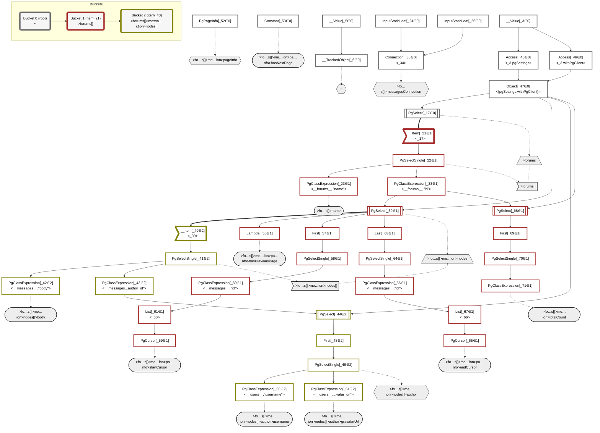

```mermaid
graph TD
    classDef path fill:#eee,stroke:#000,color:#000
    classDef plan fill:#fff,stroke-width:3px,color:#000
    classDef itemplan fill:#fff,stroke-width:6px,color:#000
    classDef sideeffectplan fill:#f00,stroke-width:6px,color:#000
    classDef bucket fill:#f6f6f6,color:#000,stroke-width:6px

    %% subgraph fields
    P1{{"~"}}:::path
    P2[/">forums"\]:::path
    P3>">forums[]"]:::path
    P2 -.- P3
    P4([">fo…s[]>name"]):::path
    %% P3 -.-> P4
    P5{{">fo…s[]>messagesConnection"}}:::path
    P6[/">fo…s[]>me…ion>nodes"\]:::path
    P7>">fo…s[]>me…ion>nodes[]"]:::path
    P6 -.- P7
    P8([">fo…s[]>me…ion>nodes[]>body"]):::path
    %% P7 -.-> P8
    P9{{">fo…s[]>me…ion>nodes[]>author"}}:::path
    P10([">fo…s[]>me…ion>nodes[]>author>username"]):::path
    %% P9 -.-> P10
    P11([">fo…s[]>me…ion>nodes[]>author>gravatarUrl"]):::path
    %% P9 -.-> P11
    %% P7 -.-> P9
    %% P5 -.-> P6
    P12{{">fo…s[]>me…ion>pageInfo"}}:::path
    P13([">fo…s[]>me…ion>pa…nfo>hasNextPage"]):::path
    %% P12 -.-> P13
    P14([">fo…s[]>me…ion>pa…nfo>hasPreviousPage"]):::path
    %% P12 -.-> P14
    P15([">fo…s[]>me…ion>pa…nfo>startCursor"]):::path
    %% P12 -.-> P15
    P16([">fo…s[]>me…ion>pa…nfo>endCursor"]):::path
    %% P12 -.-> P16
    %% P5 -.-> P12
    P17([">fo…s[]>me…ion>totalCount"]):::path
    %% P5 -.-> P17
    %% P3 -.-> P5
    %% P1 -.-> P2
    %% end

    %% define plans
    __Value_3["__Value[_3∈0]<br /><context>"]:::plan
    __Value_5["__Value[_5∈0]<br /><rootValue>"]:::plan
    __TrackedObject_6["__TrackedObject[_6∈0]"]:::plan
    PgSelect_17[["PgSelect[_17∈0]<br /><forums>"]]:::plan
    __Item_21>"__Item[_21∈1]<br /><_17>"]:::itemplan
    PgSelectSingle_22["PgSelectSingle[_22∈1]<br /><forums>"]:::plan
    PgClassExpression_23["PgClassExpression[_23∈1]<br /><__forums__.#quot;name#quot;>"]:::plan
    InputStaticLeaf_24["InputStaticLeaf[_24∈0]"]:::plan
    InputStaticLeaf_25["InputStaticLeaf[_25∈0]"]:::plan
    PgClassExpression_33["PgClassExpression[_33∈1]<br /><__forums__.#quot;id#quot;>"]:::plan
    Connection_38["Connection[_38∈0]<br /><_34>"]:::plan
    PgSelect_39[["PgSelect[_39∈1]<br /><messages>"]]:::plan
    __Item_40>"__Item[_40∈2]<br /><_39>"]:::itemplan
    PgSelectSingle_41["PgSelectSingle[_41∈2]<br /><messages>"]:::plan
    PgClassExpression_42["PgClassExpression[_42∈2]<br /><__messages__.#quot;body#quot;>"]:::plan
    PgClassExpression_43["PgClassExpression[_43∈2]<br /><__messages...author_id#quot;>"]:::plan
    PgSelect_44[["PgSelect[_44∈2]<br /><users>"]]:::plan
    Access_45["Access[_45∈0]<br /><_3.pgSettings>"]:::plan
    Access_46["Access[_46∈0]<br /><_3.withPgClient>"]:::plan
    Object_47["Object[_47∈0]<br /><{pgSettings,withPgClient}>"]:::plan
    First_48["First[_48∈2]"]:::plan
    PgSelectSingle_49["PgSelectSingle[_49∈2]<br /><users>"]:::plan
    PgClassExpression_50["PgClassExpression[_50∈2]<br /><__users__.#quot;username#quot;>"]:::plan
    PgClassExpression_51["PgClassExpression[_51∈2]<br /><__users__....vatar_url#quot;>"]:::plan
    PgPageInfo_52["PgPageInfo[_52∈0]"]:::plan
    Constant_53["Constant[_53∈0]"]:::plan
    Lambda_55["Lambda[_55∈1]<br /><listHasMore>"]:::plan
    First_57["First[_57∈1]"]:::plan
    PgSelectSingle_58["PgSelectSingle[_58∈1]<br /><messages>"]:::plan
    PgCursor_59["PgCursor[_59∈1]"]:::plan
    PgClassExpression_60["PgClassExpression[_60∈1]<br /><__messages__.#quot;id#quot;>"]:::plan
    List_61["List[_61∈1]<br /><_60>"]:::plan
    Last_63["Last[_63∈1]"]:::plan
    PgSelectSingle_64["PgSelectSingle[_64∈1]<br /><messages>"]:::plan
    PgCursor_65["PgCursor[_65∈1]"]:::plan
    PgClassExpression_66["PgClassExpression[_66∈1]<br /><__messages__.#quot;id#quot;>"]:::plan
    List_67["List[_67∈1]<br /><_66>"]:::plan
    PgSelect_68[["PgSelect[_68∈1]<br /><messages>"]]:::plan
    First_69["First[_69∈1]"]:::plan
    PgSelectSingle_70["PgSelectSingle[_70∈1]<br /><messages>"]:::plan
    PgClassExpression_71["PgClassExpression[_71∈1]<br /><count(*)>"]:::plan

    %% plan dependencies
    __Value_5 --> __TrackedObject_6
    Object_47 --> PgSelect_17
    PgSelect_17 ==> __Item_21
    __Item_21 --> PgSelectSingle_22
    PgSelectSingle_22 --> PgClassExpression_23
    PgSelectSingle_22 --> PgClassExpression_33
    InputStaticLeaf_24 --> Connection_38
    InputStaticLeaf_25 --> Connection_38
    Object_47 --> PgSelect_39
    PgClassExpression_33 --> PgSelect_39
    PgSelect_39 ==> __Item_40
    __Item_40 --> PgSelectSingle_41
    PgSelectSingle_41 --> PgClassExpression_42
    PgSelectSingle_41 --> PgClassExpression_43
    Object_47 --> PgSelect_44
    PgClassExpression_43 --> PgSelect_44
    __Value_3 --> Access_45
    __Value_3 --> Access_46
    Access_45 --> Object_47
    Access_46 --> Object_47
    PgSelect_44 --> First_48
    First_48 --> PgSelectSingle_49
    PgSelectSingle_49 --> PgClassExpression_50
    PgSelectSingle_49 --> PgClassExpression_51
    PgSelect_39 --> Lambda_55
    PgSelect_39 --> First_57
    First_57 --> PgSelectSingle_58
    List_61 --> PgCursor_59
    PgSelectSingle_58 --> PgClassExpression_60
    PgClassExpression_60 --> List_61
    PgSelect_39 --> Last_63
    Last_63 --> PgSelectSingle_64
    List_67 --> PgCursor_65
    PgSelectSingle_64 --> PgClassExpression_66
    PgClassExpression_66 --> List_67
    Object_47 --> PgSelect_68
    PgClassExpression_33 --> PgSelect_68
    PgSelect_68 --> First_69
    First_69 --> PgSelectSingle_70
    PgSelectSingle_70 --> PgClassExpression_71

    %% plan-to-path relationships
    __TrackedObject_6 -.-> P1
    PgSelect_17 -.-> P2
    PgSelectSingle_22 -.-> P3
    PgClassExpression_23 -.-> P4
    Connection_38 -.-> P5
    PgSelect_39 -.-> P6
    PgSelectSingle_41 -.-> P7
    PgClassExpression_42 -.-> P8
    PgSelectSingle_49 -.-> P9
    PgClassExpression_50 -.-> P10
    PgClassExpression_51 -.-> P11
    PgPageInfo_52 -.-> P12
    Constant_53 -.-> P13
    Lambda_55 -.-> P14
    PgCursor_59 -.-> P15
    PgCursor_65 -.-> P16
    PgClassExpression_71 -.-> P17

    %% allocate buckets
    classDef bucket0 stroke:#696969
    class __Value_3,__Value_5,__TrackedObject_6,PgSelect_17,InputStaticLeaf_24,InputStaticLeaf_25,Connection_38,Access_45,Access_46,Object_47,PgPageInfo_52,Constant_53 bucket0
    classDef bucket1 stroke:#a52a2a
    class __Item_21,PgSelectSingle_22,PgClassExpression_23,PgClassExpression_33,PgSelect_39,Lambda_55,First_57,PgSelectSingle_58,PgCursor_59,PgClassExpression_60,List_61,Last_63,PgSelectSingle_64,PgCursor_65,PgClassExpression_66,List_67,PgSelect_68,First_69,PgSelectSingle_70,PgClassExpression_71 bucket1
    classDef bucket2 stroke:#808000
    class __Item_40,PgSelectSingle_41,PgClassExpression_42,PgClassExpression_43,PgSelect_44,First_48,PgSelectSingle_49,PgClassExpression_50,PgClassExpression_51 bucket2

    subgraph Buckets
    Bucket0("Bucket 0 (root)<br />~"):::bucket
    style Bucket0 stroke:#696969
    Bucket1("Bucket 1 (item_21)<br />>forums[]"):::bucket
    style Bucket1 stroke:#a52a2a
    Bucket0 --> Bucket1
    Bucket2("Bucket 2 (item_40)<br />>forums[]>messa…ction>nodes[]"):::bucket
    style Bucket2 stroke:#808000
    Bucket1 --> Bucket2
    end
```
