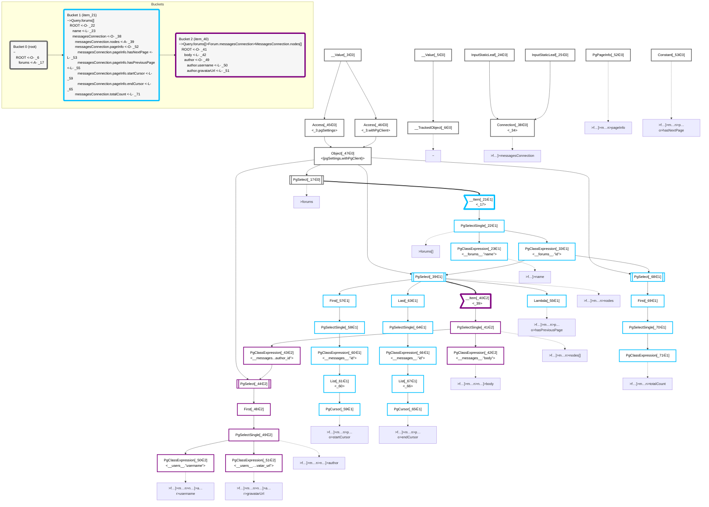

```mermaid
graph TD
    classDef path fill:#eee,stroke:#000,color:#000
    classDef plan fill:#fff,stroke-width:3px,color:#000
    classDef itemplan fill:#fff,stroke-width:6px,color:#000
    classDef sideeffectplan fill:#f00,stroke-width:6px,color:#000
    classDef bucket fill:#f6f6f6,color:#000,stroke-width:6px,text-align:left


    %% define plans
    __Value_3["__Value[_3∈0]<br /><context>"]:::plan
    __Value_5["__Value[_5∈0]<br /><rootValue>"]:::plan
    __TrackedObject_6["__TrackedObject[_6∈0]"]:::plan
    PgSelect_17[["PgSelect[_17∈0]<br /><forums>"]]:::plan
    __Item_21>"__Item[_21∈1]<br /><_17>"]:::itemplan
    PgSelectSingle_22["PgSelectSingle[_22∈1]<br /><forums>"]:::plan
    PgClassExpression_23["PgClassExpression[_23∈1]<br /><__forums__.”name”>"]:::plan
    InputStaticLeaf_24["InputStaticLeaf[_24∈0]"]:::plan
    InputStaticLeaf_25["InputStaticLeaf[_25∈0]"]:::plan
    PgClassExpression_33["PgClassExpression[_33∈1]<br /><__forums__.”id”>"]:::plan
    Connection_38["Connection[_38∈0]<br /><_34>"]:::plan
    PgSelect_39[["PgSelect[_39∈1]<br /><messages>"]]:::plan
    __Item_40>"__Item[_40∈2]<br /><_39>"]:::itemplan
    PgSelectSingle_41["PgSelectSingle[_41∈2]<br /><messages>"]:::plan
    PgClassExpression_42["PgClassExpression[_42∈2]<br /><__messages__.”body”>"]:::plan
    PgClassExpression_43["PgClassExpression[_43∈2]<br /><__messages...author_id”>"]:::plan
    PgSelect_44[["PgSelect[_44∈2]<br /><users>"]]:::plan
    Access_45["Access[_45∈0]<br /><_3.pgSettings>"]:::plan
    Access_46["Access[_46∈0]<br /><_3.withPgClient>"]:::plan
    Object_47["Object[_47∈0]<br /><{pgSettings,withPgClient}>"]:::plan
    First_48["First[_48∈2]"]:::plan
    PgSelectSingle_49["PgSelectSingle[_49∈2]<br /><users>"]:::plan
    PgClassExpression_50["PgClassExpression[_50∈2]<br /><__users__.”username”>"]:::plan
    PgClassExpression_51["PgClassExpression[_51∈2]<br /><__users__....vatar_url”>"]:::plan
    PgPageInfo_52["PgPageInfo[_52∈0]"]:::plan
    Constant_53["Constant[_53∈0]"]:::plan
    Lambda_55["Lambda[_55∈1]<br /><listHasMore>"]:::plan
    First_57["First[_57∈1]"]:::plan
    PgSelectSingle_58["PgSelectSingle[_58∈1]<br /><messages>"]:::plan
    PgCursor_59["PgCursor[_59∈1]"]:::plan
    PgClassExpression_60["PgClassExpression[_60∈1]<br /><__messages__.”id”>"]:::plan
    List_61["List[_61∈1]<br /><_60>"]:::plan
    Last_63["Last[_63∈1]"]:::plan
    PgSelectSingle_64["PgSelectSingle[_64∈1]<br /><messages>"]:::plan
    PgCursor_65["PgCursor[_65∈1]"]:::plan
    PgClassExpression_66["PgClassExpression[_66∈1]<br /><__messages__.”id”>"]:::plan
    List_67["List[_67∈1]<br /><_66>"]:::plan
    PgSelect_68[["PgSelect[_68∈1]<br /><messages>"]]:::plan
    First_69["First[_69∈1]"]:::plan
    PgSelectSingle_70["PgSelectSingle[_70∈1]<br /><messages>"]:::plan
    PgClassExpression_71["PgClassExpression[_71∈1]<br /><count(*)>"]:::plan

    %% plan dependencies
    __Value_5 --> __TrackedObject_6
    Object_47 --> PgSelect_17
    PgSelect_17 ==> __Item_21
    __Item_21 --> PgSelectSingle_22
    PgSelectSingle_22 --> PgClassExpression_23
    PgSelectSingle_22 --> PgClassExpression_33
    InputStaticLeaf_24 --> Connection_38
    InputStaticLeaf_25 --> Connection_38
    Object_47 --> PgSelect_39
    PgClassExpression_33 --> PgSelect_39
    PgSelect_39 ==> __Item_40
    __Item_40 --> PgSelectSingle_41
    PgSelectSingle_41 --> PgClassExpression_42
    PgSelectSingle_41 --> PgClassExpression_43
    Object_47 --> PgSelect_44
    PgClassExpression_43 --> PgSelect_44
    __Value_3 --> Access_45
    __Value_3 --> Access_46
    Access_45 --> Object_47
    Access_46 --> Object_47
    PgSelect_44 --> First_48
    First_48 --> PgSelectSingle_49
    PgSelectSingle_49 --> PgClassExpression_50
    PgSelectSingle_49 --> PgClassExpression_51
    PgSelect_39 --> Lambda_55
    PgSelect_39 --> First_57
    First_57 --> PgSelectSingle_58
    List_61 --> PgCursor_59
    PgSelectSingle_58 --> PgClassExpression_60
    PgClassExpression_60 --> List_61
    PgSelect_39 --> Last_63
    Last_63 --> PgSelectSingle_64
    List_67 --> PgCursor_65
    PgSelectSingle_64 --> PgClassExpression_66
    PgClassExpression_66 --> List_67
    Object_47 --> PgSelect_68
    PgClassExpression_33 --> PgSelect_68
    PgSelect_68 --> First_69
    First_69 --> PgSelectSingle_70
    PgSelectSingle_70 --> PgClassExpression_71

    %% plan-to-path relationships
    P_6["~"]
    __TrackedObject_6 -.-> P_6
    P_17[">forums"]
    PgSelect_17 -.-> P_17
    P_22[">forums[]"]
    PgSelectSingle_22 -.-> P_22
    P_23[">f…]>name"]
    PgClassExpression_23 -.-> P_23
    P_38[">f…]>messagesConnection"]
    Connection_38 -.-> P_38
    P_39[">f…]>m…n>nodes"]
    PgSelect_39 -.-> P_39
    P_41[">f…]>m…n>nodes[]"]
    PgSelectSingle_41 -.-> P_41
    P_42[">f…]>m…n>n…]>body"]
    PgClassExpression_42 -.-> P_42
    P_49[">f…]>m…n>n…]>author"]
    PgSelectSingle_49 -.-> P_49
    P_50[">f…]>m…n>n…]>a…r>username"]
    PgClassExpression_50 -.-> P_50
    P_51[">f…]>m…n>n…]>a…r>gravatarUrl"]
    PgClassExpression_51 -.-> P_51
    P_52[">f…]>m…n>pageInfo"]
    PgPageInfo_52 -.-> P_52
    P_53[">f…]>m…n>p…o>hasNextPage"]
    Constant_53 -.-> P_53
    P_55[">f…]>m…n>p…o>hasPreviousPage"]
    Lambda_55 -.-> P_55
    P_59[">f…]>m…n>p…o>startCursor"]
    PgCursor_59 -.-> P_59
    P_65[">f…]>m…n>p…o>endCursor"]
    PgCursor_65 -.-> P_65
    P_71[">f…]>m…n>totalCount"]
    PgClassExpression_71 -.-> P_71

    %% allocate buckets
    classDef bucket0 stroke:#696969
    class __Value_3,__Value_5,__TrackedObject_6,PgSelect_17,InputStaticLeaf_24,InputStaticLeaf_25,Connection_38,Access_45,Access_46,Object_47,PgPageInfo_52,Constant_53 bucket0
    classDef bucket1 stroke:#00bfff
    class __Item_21,PgSelectSingle_22,PgClassExpression_23,PgClassExpression_33,PgSelect_39,Lambda_55,First_57,PgSelectSingle_58,PgCursor_59,PgClassExpression_60,List_61,Last_63,PgSelectSingle_64,PgCursor_65,PgClassExpression_66,List_67,PgSelect_68,First_69,PgSelectSingle_70,PgClassExpression_71 bucket1
    classDef bucket2 stroke:#7f007f
    class __Item_40,PgSelectSingle_41,PgClassExpression_42,PgClassExpression_43,PgSelect_44,First_48,PgSelectSingle_49,PgClassExpression_50,PgClassExpression_51 bucket2

    subgraph Buckets
    Bucket0("Bucket 0 (root)<br />~<br />⠀ROOT <-O- _6<br />⠀⠀forums <-A- _17"):::bucket
    style Bucket0 stroke:#696969
    Bucket1("Bucket 1 (item_21)<br />~>Query.forums[]<br />⠀ROOT <-O- _22<br />⠀⠀name <-L- _23<br />⠀⠀messagesConnection <-O- _38<br />⠀⠀⠀messagesConnection.nodes <-A- _39<br />⠀⠀⠀messagesConnection.pageInfo <-O- _52<br />⠀⠀⠀⠀messagesConnection.pageInfo.hasNextPage <-L- _53<br />⠀⠀⠀⠀messagesConnection.pageInfo.hasPreviousPage <-L- _55<br />⠀⠀⠀⠀messagesConnection.pageInfo.startCursor <-L- _59<br />⠀⠀⠀⠀messagesConnection.pageInfo.endCursor <-L- _65<br />⠀⠀⠀messagesConnection.totalCount <-L- _71"):::bucket
    style Bucket1 stroke:#00bfff
    Bucket0 --> Bucket1
    Bucket2("Bucket 2 (item_40)<br />~>Query.forums[]>Forum.messagesConnection>MessagesConnection.nodes[]<br />⠀ROOT <-O- _41<br />⠀⠀body <-L- _42<br />⠀⠀author <-O- _49<br />⠀⠀⠀author.username <-L- _50<br />⠀⠀⠀author.gravatarUrl <-L- _51"):::bucket
    style Bucket2 stroke:#7f007f
    Bucket1 --> Bucket2
    end
```
