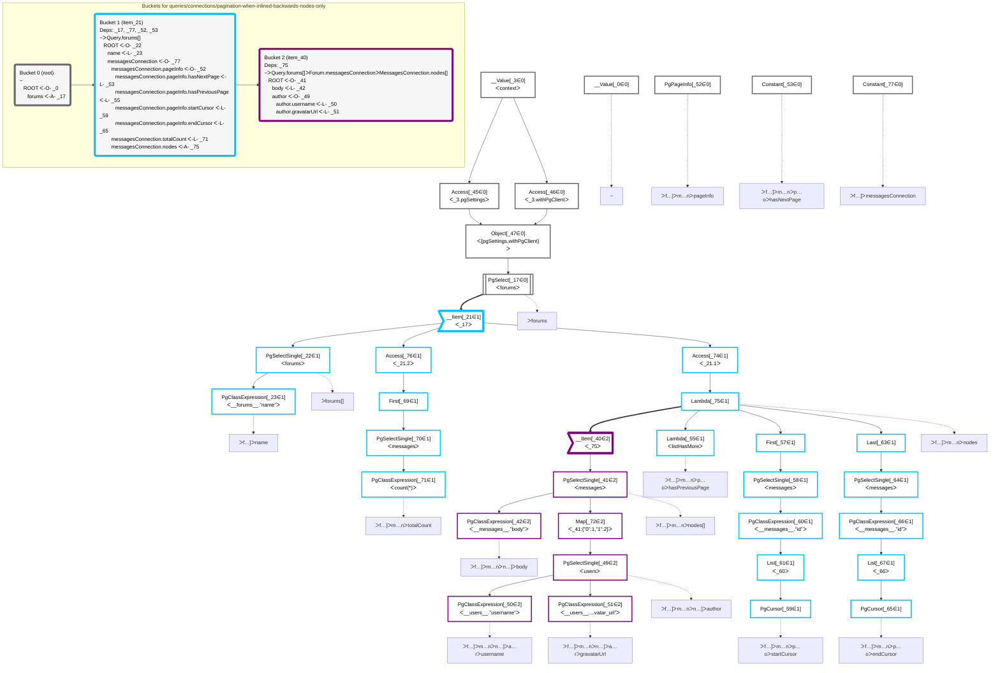

```mermaid
graph TD
    classDef path fill:#eee,stroke:#000,color:#000
    classDef plan fill:#fff,stroke-width:3px,color:#000
    classDef itemplan fill:#fff,stroke-width:6px,color:#000
    classDef sideeffectplan fill:#f00,stroke-width:6px,color:#000
    classDef bucket fill:#f6f6f6,color:#000,stroke-width:6px,text-align:left


    %% define plans
    __Value_0["__Value[_0∈0]"]:::plan
    PgClassExpression_23["PgClassExpression[_23∈1]<br />ᐸ__forums__.”name”ᐳ"]:::plan
    PgSelectSingle_22["PgSelectSingle[_22∈1]<br />ᐸforumsᐳ"]:::plan
    PgClassExpression_71["PgClassExpression[_71∈1]<br />ᐸcount(*)ᐳ"]:::plan
    PgSelectSingle_70["PgSelectSingle[_70∈1]<br />ᐸmessagesᐳ"]:::plan
    First_69["First[_69∈1]"]:::plan
    Access_76["Access[_76∈1]<br />ᐸ_21.2ᐳ"]:::plan
    PgClassExpression_42["PgClassExpression[_42∈2]<br />ᐸ__messages__.”body”ᐳ"]:::plan
    PgClassExpression_50["PgClassExpression[_50∈2]<br />ᐸ__users__.”username”ᐳ"]:::plan
    PgClassExpression_51["PgClassExpression[_51∈2]<br />ᐸ__users__....vatar_url”ᐳ"]:::plan
    PgSelectSingle_49["PgSelectSingle[_49∈2]<br />ᐸusersᐳ"]:::plan
    Map_72["Map[_72∈2]<br />ᐸ_41:{”0”:1,”1”:2}ᐳ"]:::plan
    PgSelectSingle_41["PgSelectSingle[_41∈2]<br />ᐸmessagesᐳ"]:::plan
    __Item_40>"__Item[_40∈2]<br />ᐸ_75ᐳ"]:::itemplan
    Lambda_55["Lambda[_55∈1]<br />ᐸlistHasMoreᐳ"]:::plan
    PgCursor_59["PgCursor[_59∈1]"]:::plan
    List_61["List[_61∈1]<br />ᐸ_60ᐳ"]:::plan
    PgClassExpression_60["PgClassExpression[_60∈1]<br />ᐸ__messages__.”id”ᐳ"]:::plan
    PgSelectSingle_58["PgSelectSingle[_58∈1]<br />ᐸmessagesᐳ"]:::plan
    First_57["First[_57∈1]"]:::plan
    PgCursor_65["PgCursor[_65∈1]"]:::plan
    List_67["List[_67∈1]<br />ᐸ_66ᐳ"]:::plan
    PgClassExpression_66["PgClassExpression[_66∈1]<br />ᐸ__messages__.”id”ᐳ"]:::plan
    PgSelectSingle_64["PgSelectSingle[_64∈1]<br />ᐸmessagesᐳ"]:::plan
    Last_63["Last[_63∈1]"]:::plan
    Lambda_75["Lambda[_75∈1]"]:::plan
    Access_74["Access[_74∈1]<br />ᐸ_21.1ᐳ"]:::plan
    __Item_21>"__Item[_21∈1]<br />ᐸ_17ᐳ"]:::itemplan
    PgSelect_17[["PgSelect[_17∈0]<br />ᐸforumsᐳ"]]:::plan
    Object_47["Object[_47∈0]<br />ᐸ{pgSettings,withPgClient}ᐳ"]:::plan
    Access_45["Access[_45∈0]<br />ᐸ_3.pgSettingsᐳ"]:::plan
    Access_46["Access[_46∈0]<br />ᐸ_3.withPgClientᐳ"]:::plan
    __Value_3["__Value[_3∈0]<br />ᐸcontextᐳ"]:::plan
    Constant_77["Constant[_77∈0]"]:::plan
    PgPageInfo_52["PgPageInfo[_52∈0]"]:::plan
    Constant_53["Constant[_53∈0]"]:::plan

    %% plan dependencies
    PgSelectSingle_22 --> PgClassExpression_23
    __Item_21 --> PgSelectSingle_22
    PgSelectSingle_70 --> PgClassExpression_71
    First_69 --> PgSelectSingle_70
    Access_76 --> First_69
    __Item_21 --> Access_76
    PgSelectSingle_41 --> PgClassExpression_42
    PgSelectSingle_49 --> PgClassExpression_50
    PgSelectSingle_49 --> PgClassExpression_51
    Map_72 --> PgSelectSingle_49
    PgSelectSingle_41 --> Map_72
    __Item_40 --> PgSelectSingle_41
    Lambda_75 ==> __Item_40
    Lambda_75 --> Lambda_55
    List_61 --> PgCursor_59
    PgClassExpression_60 --> List_61
    PgSelectSingle_58 --> PgClassExpression_60
    First_57 --> PgSelectSingle_58
    Lambda_75 --> First_57
    List_67 --> PgCursor_65
    PgClassExpression_66 --> List_67
    PgSelectSingle_64 --> PgClassExpression_66
    Last_63 --> PgSelectSingle_64
    Lambda_75 --> Last_63
    Access_74 --> Lambda_75
    __Item_21 --> Access_74
    PgSelect_17 ==> __Item_21
    Object_47 --> PgSelect_17
    Access_45 & Access_46 --> Object_47
    __Value_3 --> Access_45
    __Value_3 --> Access_46

    %% plan-to-path relationships
    P_0["~"]
    __Value_0 -.-> P_0
    P_17["ᐳforums"]
    PgSelect_17 -.-> P_17
    P_22["ᐳforums[]"]
    PgSelectSingle_22 -.-> P_22
    P_23["ᐳf…]ᐳname"]
    PgClassExpression_23 -.-> P_23
    P_41["ᐳf…]ᐳm…nᐳnodes[]"]
    PgSelectSingle_41 -.-> P_41
    P_42["ᐳf…]ᐳm…nᐳn…]ᐳbody"]
    PgClassExpression_42 -.-> P_42
    P_49["ᐳf…]ᐳm…nᐳn…]ᐳauthor"]
    PgSelectSingle_49 -.-> P_49
    P_50["ᐳf…]ᐳm…nᐳn…]ᐳa…rᐳusername"]
    PgClassExpression_50 -.-> P_50
    P_51["ᐳf…]ᐳm…nᐳn…]ᐳa…rᐳgravatarUrl"]
    PgClassExpression_51 -.-> P_51
    P_52["ᐳf…]ᐳm…nᐳpageInfo"]
    PgPageInfo_52 -.-> P_52
    P_53["ᐳf…]ᐳm…nᐳp…oᐳhasNextPage"]
    Constant_53 -.-> P_53
    P_55["ᐳf…]ᐳm…nᐳp…oᐳhasPreviousPage"]
    Lambda_55 -.-> P_55
    P_59["ᐳf…]ᐳm…nᐳp…oᐳstartCursor"]
    PgCursor_59 -.-> P_59
    P_65["ᐳf…]ᐳm…nᐳp…oᐳendCursor"]
    PgCursor_65 -.-> P_65
    P_71["ᐳf…]ᐳm…nᐳtotalCount"]
    PgClassExpression_71 -.-> P_71
    P_75["ᐳf…]ᐳm…nᐳnodes"]
    Lambda_75 -.-> P_75
    P_77["ᐳf…]ᐳmessagesConnection"]
    Constant_77 -.-> P_77

    subgraph "Buckets for queries/connections/pagination-when-inlined-backwards-nodes-only"
    Bucket0("Bucket 0 (root)<br />~<br />⠀ROOT ᐸ-O- _0<br />⠀⠀forums ᐸ-A- _17"):::bucket
    classDef bucket0 stroke:#696969
    class Bucket0,__Value_0,__Value_3,PgSelect_17,Access_45,Access_46,Object_47,PgPageInfo_52,Constant_53,Constant_77 bucket0
    Bucket1("Bucket 1 (item_21)<br />Deps: _17, _77, _52, _53<br />~ᐳQuery.forums[]<br />⠀ROOT ᐸ-O- _22<br />⠀⠀name ᐸ-L- _23<br />⠀⠀messagesConnection ᐸ-O- _77<br />⠀⠀⠀messagesConnection.pageInfo ᐸ-O- _52<br />⠀⠀⠀⠀messagesConnection.pageInfo.hasNextPage ᐸ-L- _53<br />⠀⠀⠀⠀messagesConnection.pageInfo.hasPreviousPage ᐸ-L- _55<br />⠀⠀⠀⠀messagesConnection.pageInfo.startCursor ᐸ-L- _59<br />⠀⠀⠀⠀messagesConnection.pageInfo.endCursor ᐸ-L- _65<br />⠀⠀⠀messagesConnection.totalCount ᐸ-L- _71<br />⠀⠀⠀messagesConnection.nodes ᐸ-A- _75"):::bucket
    classDef bucket1 stroke:#00bfff
    class Bucket1,__Item_21,PgSelectSingle_22,PgClassExpression_23,Lambda_55,First_57,PgSelectSingle_58,PgCursor_59,PgClassExpression_60,List_61,Last_63,PgSelectSingle_64,PgCursor_65,PgClassExpression_66,List_67,First_69,PgSelectSingle_70,PgClassExpression_71,Access_74,Lambda_75,Access_76 bucket1
    Bucket2("Bucket 2 (item_40)<br />Deps: _75<br />~ᐳQuery.forums[]ᐳForum.messagesConnectionᐳMessagesConnection.nodes[]<br />⠀ROOT ᐸ-O- _41<br />⠀⠀body ᐸ-L- _42<br />⠀⠀author ᐸ-O- _49<br />⠀⠀⠀author.username ᐸ-L- _50<br />⠀⠀⠀author.gravatarUrl ᐸ-L- _51"):::bucket
    classDef bucket2 stroke:#7f007f
    class Bucket2,__Item_40,PgSelectSingle_41,PgClassExpression_42,PgSelectSingle_49,PgClassExpression_50,PgClassExpression_51,Map_72 bucket2
    Bucket0 --> Bucket1
    Bucket1 --> Bucket2
    end
```
