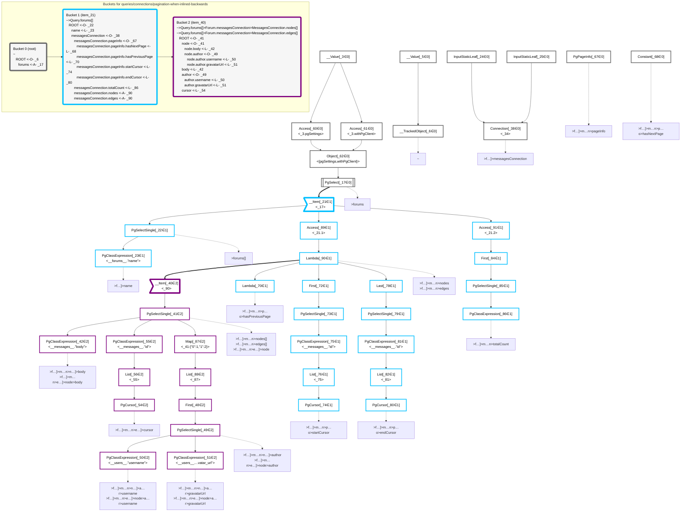

```mermaid
graph TD
    classDef path fill:#eee,stroke:#000,color:#000
    classDef plan fill:#fff,stroke-width:3px,color:#000
    classDef itemplan fill:#fff,stroke-width:6px,color:#000
    classDef sideeffectplan fill:#f00,stroke-width:6px,color:#000
    classDef bucket fill:#f6f6f6,color:#000,stroke-width:6px,text-align:left


    %% define plans
    __Value_3["__Value[_3∈0]<br /><context>"]:::plan
    __Value_5["__Value[_5∈0]<br /><rootValue>"]:::plan
    __TrackedObject_6["__TrackedObject[_6∈0]"]:::plan
    PgSelect_17[["PgSelect[_17∈0]<br /><forums>"]]:::plan
    __Item_21>"__Item[_21∈1]<br /><_17>"]:::itemplan
    PgSelectSingle_22["PgSelectSingle[_22∈1]<br /><forums>"]:::plan
    PgClassExpression_23["PgClassExpression[_23∈1]<br /><__forums__.”name”>"]:::plan
    InputStaticLeaf_24["InputStaticLeaf[_24∈0]"]:::plan
    InputStaticLeaf_25["InputStaticLeaf[_25∈0]"]:::plan
    Connection_38["Connection[_38∈0]<br /><_34>"]:::plan
    __Item_40>"__Item[_40∈2]<br /><_90>"]:::itemplan
    PgSelectSingle_41["PgSelectSingle[_41∈2]<br /><messages>"]:::plan
    PgClassExpression_42["PgClassExpression[_42∈2]<br /><__messages__.”body”>"]:::plan
    First_48["First[_48∈2]"]:::plan
    PgSelectSingle_49["PgSelectSingle[_49∈2]<br /><users>"]:::plan
    PgClassExpression_50["PgClassExpression[_50∈2]<br /><__users__.”username”>"]:::plan
    PgClassExpression_51["PgClassExpression[_51∈2]<br /><__users__....vatar_url”>"]:::plan
    PgCursor_54["PgCursor[_54∈2]"]:::plan
    PgClassExpression_55["PgClassExpression[_55∈2]<br /><__messages__.”id”>"]:::plan
    List_56["List[_56∈2]<br /><_55>"]:::plan
    Access_60["Access[_60∈0]<br /><_3.pgSettings>"]:::plan
    Access_61["Access[_61∈0]<br /><_3.withPgClient>"]:::plan
    Object_62["Object[_62∈0]<br /><{pgSettings,withPgClient}>"]:::plan
    PgPageInfo_67["PgPageInfo[_67∈0]"]:::plan
    Constant_68["Constant[_68∈0]"]:::plan
    Lambda_70["Lambda[_70∈1]<br /><listHasMore>"]:::plan
    First_72["First[_72∈1]"]:::plan
    PgSelectSingle_73["PgSelectSingle[_73∈1]<br /><messages>"]:::plan
    PgCursor_74["PgCursor[_74∈1]"]:::plan
    PgClassExpression_75["PgClassExpression[_75∈1]<br /><__messages__.”id”>"]:::plan
    List_76["List[_76∈1]<br /><_75>"]:::plan
    Last_78["Last[_78∈1]"]:::plan
    PgSelectSingle_79["PgSelectSingle[_79∈1]<br /><messages>"]:::plan
    PgCursor_80["PgCursor[_80∈1]"]:::plan
    PgClassExpression_81["PgClassExpression[_81∈1]<br /><__messages__.”id”>"]:::plan
    List_82["List[_82∈1]<br /><_81>"]:::plan
    First_84["First[_84∈1]"]:::plan
    PgSelectSingle_85["PgSelectSingle[_85∈1]<br /><messages>"]:::plan
    PgClassExpression_86["PgClassExpression[_86∈1]<br /><count(*)>"]:::plan
    Map_87["Map[_87∈2]<br /><_41:{”0”:1,”1”:2}>"]:::plan
    List_88["List[_88∈2]<br /><_87>"]:::plan
    Access_89["Access[_89∈1]<br /><_21.1>"]:::plan
    Lambda_90["Lambda[_90∈1]"]:::plan
    Access_91["Access[_91∈1]<br /><_21.2>"]:::plan

    %% plan dependencies
    __Value_5 --> __TrackedObject_6
    Object_62 --> PgSelect_17
    PgSelect_17 ==> __Item_21
    __Item_21 --> PgSelectSingle_22
    PgSelectSingle_22 --> PgClassExpression_23
    InputStaticLeaf_24 --> Connection_38
    InputStaticLeaf_25 --> Connection_38
    Lambda_90 ==> __Item_40
    __Item_40 --> PgSelectSingle_41
    PgSelectSingle_41 --> PgClassExpression_42
    List_88 --> First_48
    First_48 --> PgSelectSingle_49
    PgSelectSingle_49 --> PgClassExpression_50
    PgSelectSingle_49 --> PgClassExpression_51
    List_56 --> PgCursor_54
    PgSelectSingle_41 --> PgClassExpression_55
    PgClassExpression_55 --> List_56
    __Value_3 --> Access_60
    __Value_3 --> Access_61
    Access_60 --> Object_62
    Access_61 --> Object_62
    Lambda_90 --> Lambda_70
    Lambda_90 --> First_72
    First_72 --> PgSelectSingle_73
    List_76 --> PgCursor_74
    PgSelectSingle_73 --> PgClassExpression_75
    PgClassExpression_75 --> List_76
    Lambda_90 --> Last_78
    Last_78 --> PgSelectSingle_79
    List_82 --> PgCursor_80
    PgSelectSingle_79 --> PgClassExpression_81
    PgClassExpression_81 --> List_82
    Access_91 --> First_84
    First_84 --> PgSelectSingle_85
    PgSelectSingle_85 --> PgClassExpression_86
    PgSelectSingle_41 --> Map_87
    Map_87 --> List_88
    __Item_21 --> Access_89
    Access_89 --> Lambda_90
    __Item_21 --> Access_91

    %% plan-to-path relationships
    P_6["~"]
    __TrackedObject_6 -.-> P_6
    P_17[">forums"]
    PgSelect_17 -.-> P_17
    P_22[">forums[]"]
    PgSelectSingle_22 -.-> P_22
    P_23[">f…]>name"]
    PgClassExpression_23 -.-> P_23
    P_38[">f…]>messagesConnection"]
    Connection_38 -.-> P_38
    P_41[">f…]>m…n>nodes[]<br />>f…]>m…n>edges[]<br />>f…]>m…n>e…]>node"]
    PgSelectSingle_41 -.-> P_41
    P_42[">f…]>m…n>n…]>body<br />>f…]>m…n>e…]>node>body"]
    PgClassExpression_42 -.-> P_42
    P_49[">f…]>m…n>n…]>author<br />>f…]>m…n>e…]>node>author"]
    PgSelectSingle_49 -.-> P_49
    P_50[">f…]>m…n>n…]>a…r>username<br />>f…]>m…n>e…]>node>a…r>username"]
    PgClassExpression_50 -.-> P_50
    P_51[">f…]>m…n>n…]>a…r>gravatarUrl<br />>f…]>m…n>e…]>node>a…r>gravatarUrl"]
    PgClassExpression_51 -.-> P_51
    P_54[">f…]>m…n>e…]>cursor"]
    PgCursor_54 -.-> P_54
    P_67[">f…]>m…n>pageInfo"]
    PgPageInfo_67 -.-> P_67
    P_68[">f…]>m…n>p…o>hasNextPage"]
    Constant_68 -.-> P_68
    P_70[">f…]>m…n>p…o>hasPreviousPage"]
    Lambda_70 -.-> P_70
    P_74[">f…]>m…n>p…o>startCursor"]
    PgCursor_74 -.-> P_74
    P_80[">f…]>m…n>p…o>endCursor"]
    PgCursor_80 -.-> P_80
    P_86[">f…]>m…n>totalCount"]
    PgClassExpression_86 -.-> P_86
    P_90[">f…]>m…n>nodes<br />>f…]>m…n>edges"]
    Lambda_90 -.-> P_90

    %% allocate buckets
    classDef bucket0 stroke:#696969
    class __Value_3,__Value_5,__TrackedObject_6,PgSelect_17,InputStaticLeaf_24,InputStaticLeaf_25,Connection_38,Access_60,Access_61,Object_62,PgPageInfo_67,Constant_68 bucket0
    classDef bucket1 stroke:#00bfff
    class __Item_21,PgSelectSingle_22,PgClassExpression_23,Lambda_70,First_72,PgSelectSingle_73,PgCursor_74,PgClassExpression_75,List_76,Last_78,PgSelectSingle_79,PgCursor_80,PgClassExpression_81,List_82,First_84,PgSelectSingle_85,PgClassExpression_86,Access_89,Lambda_90,Access_91 bucket1
    classDef bucket2 stroke:#7f007f
    class __Item_40,PgSelectSingle_41,PgClassExpression_42,First_48,PgSelectSingle_49,PgClassExpression_50,PgClassExpression_51,PgCursor_54,PgClassExpression_55,List_56,Map_87,List_88 bucket2

    subgraph "Buckets for queries/connections/pagination-when-inlined-backwards"
    Bucket0("Bucket 0 (root)<br />~<br />⠀ROOT <-O- _6<br />⠀⠀forums <-A- _17"):::bucket
    style Bucket0 stroke:#696969
    Bucket1("Bucket 1 (item_21)<br />~>Query.forums[]<br />⠀ROOT <-O- _22<br />⠀⠀name <-L- _23<br />⠀⠀messagesConnection <-O- _38<br />⠀⠀⠀messagesConnection.pageInfo <-O- _67<br />⠀⠀⠀⠀messagesConnection.pageInfo.hasNextPage <-L- _68<br />⠀⠀⠀⠀messagesConnection.pageInfo.hasPreviousPage <-L- _70<br />⠀⠀⠀⠀messagesConnection.pageInfo.startCursor <-L- _74<br />⠀⠀⠀⠀messagesConnection.pageInfo.endCursor <-L- _80<br />⠀⠀⠀messagesConnection.totalCount <-L- _86<br />⠀⠀⠀messagesConnection.nodes <-A- _90<br />⠀⠀⠀messagesConnection.edges <-A- _90"):::bucket
    style Bucket1 stroke:#00bfff
    Bucket0 --> Bucket1
    Bucket2("Bucket 2 (item_40)<br />~>Query.forums[]>Forum.messagesConnection>MessagesConnection.nodes[]<br />~>Query.forums[]>Forum.messagesConnection>MessagesConnection.edges[]<br />⠀ROOT <-O- _41<br />⠀⠀node <-O- _41<br />⠀⠀⠀node.body <-L- _42<br />⠀⠀⠀node.author <-O- _49<br />⠀⠀⠀⠀node.author.username <-L- _50<br />⠀⠀⠀⠀node.author.gravatarUrl <-L- _51<br />⠀⠀body <-L- _42<br />⠀⠀author <-O- _49<br />⠀⠀⠀author.username <-L- _50<br />⠀⠀⠀author.gravatarUrl <-L- _51<br />⠀⠀cursor <-L- _54"):::bucket
    style Bucket2 stroke:#7f007f
    Bucket1 --> Bucket2
    end
```
