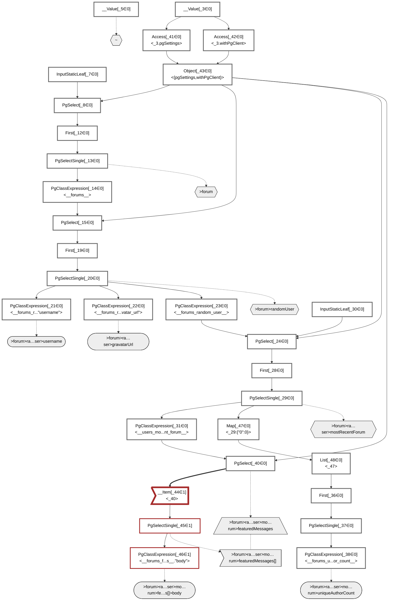

```mermaid
graph TD
    classDef path fill:#eee,stroke:#000,color:#000
    classDef plan fill:#fff,stroke-width:3px,color:#000
    classDef itemplan fill:#fff,stroke-width:6px,color:#000
    classDef sideeffectplan fill:#f00,stroke-width:6px,color:#000

    %% subgraph fields
    P1{{"~"}}:::path
    P2{{">forum"}}:::path
    P3{{">forum>randomUser"}}:::path
    P4([">forum>ra…ser>username"]):::path
    %% P3 -.-> P4
    P5([">forum>ra…ser>gravatarUrl"]):::path
    %% P3 -.-> P5
    P6{{">forum>ra…ser>mostRecentForum"}}:::path
    P7([">forum>ra…ser>mo…rum>uniqueAuthorCount"]):::path
    %% P6 -.-> P7
    P8[/">forum>ra…ser>mo…rum>featuredMessages"\]:::path
    P9>">forum>ra…ser>mo…rum>featuredMessages[]"]:::path
    P8 -.- P9
    P10([">forum>ra…ser>mo…rum>fe…s[]>body"]):::path
    %% P9 -.-> P10
    %% P6 -.-> P8
    %% P3 -.-> P6
    %% P2 -.-> P3
    %% P1 -.-> P2
    %% end

    %% define plans
    __Value_3["__Value[_3∈0]<br /><context>"]:::plan
    __Value_5["__Value[_5∈0]<br /><rootValue>"]:::plan
    InputStaticLeaf_7["InputStaticLeaf[_7∈0]"]:::plan
    PgSelect_8["PgSelect[_8∈0]<br /><forums>"]:::plan
    First_12["First[_12∈0]"]:::plan
    PgSelectSingle_13["PgSelectSingle[_13∈0]<br /><forums>"]:::plan
    PgClassExpression_14["PgClassExpression[_14∈0]<br /><__forums__>"]:::plan
    PgSelect_15["PgSelect[_15∈0]<br /><forums_random_user>"]:::plan
    First_19["First[_19∈0]"]:::plan
    PgSelectSingle_20["PgSelectSingle[_20∈0]<br /><users>"]:::plan
    PgClassExpression_21["PgClassExpression[_21∈0]<br /><__forums_r...#quot;username#quot;>"]:::plan
    PgClassExpression_22["PgClassExpression[_22∈0]<br /><__forums_r...vatar_url#quot;>"]:::plan
    PgClassExpression_23["PgClassExpression[_23∈0]<br /><__forums_random_user__>"]:::plan
    PgSelect_24["PgSelect[_24∈0]<br /><users_most_recent_forum>"]:::plan
    First_28["First[_28∈0]"]:::plan
    PgSelectSingle_29["PgSelectSingle[_29∈0]<br /><users_most_recent_forum>"]:::plan
    InputStaticLeaf_30["InputStaticLeaf[_30∈0]"]:::plan
    PgClassExpression_31["PgClassExpression[_31∈0]<br /><__users_mo...nt_forum__>"]:::plan
    First_36["First[_36∈0]"]:::plan
    PgSelectSingle_37["PgSelectSingle[_37∈0]<br /><forums_unique_author_count>"]:::plan
    PgClassExpression_38["PgClassExpression[_38∈0]<br /><__forums_u...or_count__>"]:::plan
    PgSelect_40["PgSelect[_40∈0]<br /><forums_featured_messages>"]:::plan
    Access_41["Access[_41∈0]<br /><_3.pgSettings>"]:::plan
    Access_42["Access[_42∈0]<br /><_3.withPgClient>"]:::plan
    Object_43["Object[_43∈0]<br /><{pgSettings,withPgClient}>"]:::plan
    __Item_44>"__Item[_44∈1]<br /><_40>"]:::itemplan
    PgSelectSingle_45["PgSelectSingle[_45∈1]<br /><forums_featured_messages>"]:::plan
    PgClassExpression_46["PgClassExpression[_46∈1]<br /><__forums_f...s__.#quot;body#quot;>"]:::plan
    Map_47["Map[_47∈0]<br /><_29:{#quot;0#quot;:0}>"]:::plan
    List_48["List[_48∈0]<br /><_47>"]:::plan

    %% plan dependencies
    Object_43 --> PgSelect_8
    InputStaticLeaf_7 --> PgSelect_8
    PgSelect_8 --> First_12
    First_12 --> PgSelectSingle_13
    PgSelectSingle_13 --> PgClassExpression_14
    Object_43 --> PgSelect_15
    PgClassExpression_14 --> PgSelect_15
    PgSelect_15 --> First_19
    First_19 --> PgSelectSingle_20
    PgSelectSingle_20 --> PgClassExpression_21
    PgSelectSingle_20 --> PgClassExpression_22
    PgSelectSingle_20 --> PgClassExpression_23
    Object_43 --> PgSelect_24
    PgClassExpression_23 --> PgSelect_24
    InputStaticLeaf_30 --> PgSelect_24
    PgSelect_24 --> First_28
    First_28 --> PgSelectSingle_29
    PgSelectSingle_29 --> PgClassExpression_31
    List_48 --> First_36
    First_36 --> PgSelectSingle_37
    PgSelectSingle_37 --> PgClassExpression_38
    Object_43 --> PgSelect_40
    PgClassExpression_31 --> PgSelect_40
    __Value_3 --> Access_41
    __Value_3 --> Access_42
    Access_41 --> Object_43
    Access_42 --> Object_43
    PgSelect_40 ==> __Item_44
    __Item_44 --> PgSelectSingle_45
    PgSelectSingle_45 --> PgClassExpression_46
    PgSelectSingle_29 --> Map_47
    Map_47 --> List_48

    %% plan-to-path relationships
    __Value_5 -.-> P1
    PgSelectSingle_13 -.-> P2
    PgSelectSingle_20 -.-> P3
    PgClassExpression_21 -.-> P4
    PgClassExpression_22 -.-> P5
    PgSelectSingle_29 -.-> P6
    PgClassExpression_38 -.-> P7
    PgSelect_40 -.-> P8
    PgSelectSingle_45 -.-> P9
    PgClassExpression_46 -.-> P10

    %% allocate buckets
    classDef bucket0 stroke:#696969
    class __Value_3,__Value_5,InputStaticLeaf_7,PgSelect_8,First_12,PgSelectSingle_13,PgClassExpression_14,PgSelect_15,First_19,PgSelectSingle_20,PgClassExpression_21,PgClassExpression_22,PgClassExpression_23,PgSelect_24,First_28,PgSelectSingle_29,InputStaticLeaf_30,PgClassExpression_31,First_36,PgSelectSingle_37,PgClassExpression_38,PgSelect_40,Access_41,Access_42,Object_43,Map_47,List_48 bucket0
    classDef bucket1 stroke:#a52a2a
    class __Item_44,PgSelectSingle_45,PgClassExpression_46 bucket1
```
