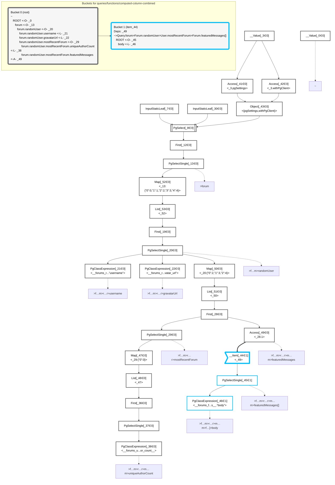

```mermaid
graph TD
    classDef path fill:#eee,stroke:#000,color:#000
    classDef plan fill:#fff,stroke-width:3px,color:#000
    classDef itemplan fill:#fff,stroke-width:6px,color:#000
    classDef sideeffectplan fill:#f00,stroke-width:6px,color:#000
    classDef bucket fill:#f6f6f6,color:#000,stroke-width:6px,text-align:left


    %% define plans
    __Value_0["__Value[_0∈0]"]:::plan
    __Value_3["__Value[_3∈0]<br /><context>"]:::plan
    InputStaticLeaf_7["InputStaticLeaf[_7∈0]"]:::plan
    PgSelect_8[["PgSelect[_8∈0]<br /><forums>"]]:::plan
    First_12["First[_12∈0]"]:::plan
    PgSelectSingle_13["PgSelectSingle[_13∈0]<br /><forums>"]:::plan
    First_19["First[_19∈0]"]:::plan
    PgSelectSingle_20["PgSelectSingle[_20∈0]<br /><users>"]:::plan
    PgClassExpression_21["PgClassExpression[_21∈0]<br /><__forums_r...”username”>"]:::plan
    PgClassExpression_22["PgClassExpression[_22∈0]<br /><__forums_r...vatar_url”>"]:::plan
    First_28["First[_28∈0]"]:::plan
    PgSelectSingle_29["PgSelectSingle[_29∈0]<br /><users_most_recent_forum>"]:::plan
    InputStaticLeaf_30["InputStaticLeaf[_30∈0]"]:::plan
    First_36["First[_36∈0]"]:::plan
    PgSelectSingle_37["PgSelectSingle[_37∈0]<br /><forums_unique_author_count>"]:::plan
    PgClassExpression_38["PgClassExpression[_38∈0]<br /><__forums_u...or_count__>"]:::plan
    Access_41["Access[_41∈0]<br /><_3.pgSettings>"]:::plan
    Access_42["Access[_42∈0]<br /><_3.withPgClient>"]:::plan
    Object_43["Object[_43∈0]<br /><{pgSettings,withPgClient}>"]:::plan
    __Item_44>"__Item[_44∈1]<br /><_49>"]:::itemplan
    PgSelectSingle_45["PgSelectSingle[_45∈1]<br /><forums_featured_messages>"]:::plan
    PgClassExpression_46["PgClassExpression[_46∈1]<br /><__forums_f...s__.”body”>"]:::plan
    Map_47["Map[_47∈0]<br /><_29:{”0”:0}>"]:::plan
    List_48["List[_48∈0]<br /><_47>"]:::plan
    Access_49["Access[_49∈0]<br /><_28.1>"]:::plan
    Map_50["Map[_50∈0]<br /><_20:{”0”:2,”1”:3,”2”:4}>"]:::plan
    List_51["List[_51∈0]<br /><_50>"]:::plan
    Map_52["Map[_52∈0]<br /><_13:{”0”:0,”1”:1,”2”:2,”3”:3,”4”:4}>"]:::plan
    List_53["List[_53∈0]<br /><_52>"]:::plan

    %% plan dependencies
    Object_43 --> PgSelect_8
    InputStaticLeaf_7 --> PgSelect_8
    InputStaticLeaf_30 --> PgSelect_8
    PgSelect_8 --> First_12
    First_12 --> PgSelectSingle_13
    List_53 --> First_19
    First_19 --> PgSelectSingle_20
    PgSelectSingle_20 --> PgClassExpression_21
    PgSelectSingle_20 --> PgClassExpression_22
    List_51 --> First_28
    First_28 --> PgSelectSingle_29
    List_48 --> First_36
    First_36 --> PgSelectSingle_37
    PgSelectSingle_37 --> PgClassExpression_38
    __Value_3 --> Access_41
    __Value_3 --> Access_42
    Access_41 --> Object_43
    Access_42 --> Object_43
    Access_49 ==> __Item_44
    __Item_44 --> PgSelectSingle_45
    PgSelectSingle_45 --> PgClassExpression_46
    PgSelectSingle_29 --> Map_47
    Map_47 --> List_48
    First_28 --> Access_49
    PgSelectSingle_20 --> Map_50
    Map_50 --> List_51
    PgSelectSingle_13 --> Map_52
    Map_52 --> List_53

    %% plan-to-path relationships
    P_0["~"]
    __Value_0 -.-> P_0
    P_13[">forum"]
    PgSelectSingle_13 -.-> P_13
    P_20[">f…m>randomUser"]
    PgSelectSingle_20 -.-> P_20
    P_21[">f…m>r…r>username"]
    PgClassExpression_21 -.-> P_21
    P_22[">f…m>r…r>gravatarUrl"]
    PgClassExpression_22 -.-> P_22
    P_29[">f…m>r…r>mostRecentForum"]
    PgSelectSingle_29 -.-> P_29
    P_38[">f…m>r…r>m…m>uniqueAuthorCount"]
    PgClassExpression_38 -.-> P_38
    P_45[">f…m>r…r>m…m>featuredMessages[]"]
    PgSelectSingle_45 -.-> P_45
    P_46[">f…m>r…r>m…m>f…]>body"]
    PgClassExpression_46 -.-> P_46
    P_49[">f…m>r…r>m…m>featuredMessages"]
    Access_49 -.-> P_49

    %% allocate buckets
    classDef bucket0 stroke:#696969
    class __Value_0,__Value_3,InputStaticLeaf_7,PgSelect_8,First_12,PgSelectSingle_13,First_19,PgSelectSingle_20,PgClassExpression_21,PgClassExpression_22,First_28,PgSelectSingle_29,InputStaticLeaf_30,First_36,PgSelectSingle_37,PgClassExpression_38,Access_41,Access_42,Object_43,Map_47,List_48,Access_49,Map_50,List_51,Map_52,List_53 bucket0
    classDef bucket1 stroke:#00bfff
    class __Item_44,PgSelectSingle_45,PgClassExpression_46 bucket1

    subgraph "Buckets for queries/functions/computed-column-combined"
    Bucket0("Bucket 0 (root)<br />~<br />⠀ROOT <-O- _0<br />⠀⠀forum <-O- _13<br />⠀⠀⠀forum.randomUser <-O- _20<br />⠀⠀⠀⠀forum.randomUser.username <-L- _21<br />⠀⠀⠀⠀forum.randomUser.gravatarUrl <-L- _22<br />⠀⠀⠀⠀forum.randomUser.mostRecentForum <-O- _29<br />⠀⠀⠀⠀⠀forum.randomUser.mostRecentForum.uniqueAuthorCount <-L- _38<br />⠀⠀⠀⠀⠀forum.randomUser.mostRecentForum.featuredMessages <-A- _49"):::bucket
    style Bucket0 stroke:#696969
    Bucket1("Bucket 1 (item_44)<br />Deps: _49<br />~>Query.forum>Forum.randomUser>User.mostRecentForum>Forum.featuredMessages[]<br />⠀ROOT <-O- _45<br />⠀⠀body <-L- _46"):::bucket
    style Bucket1 stroke:#00bfff
    Bucket0 --> Bucket1
    end
```
