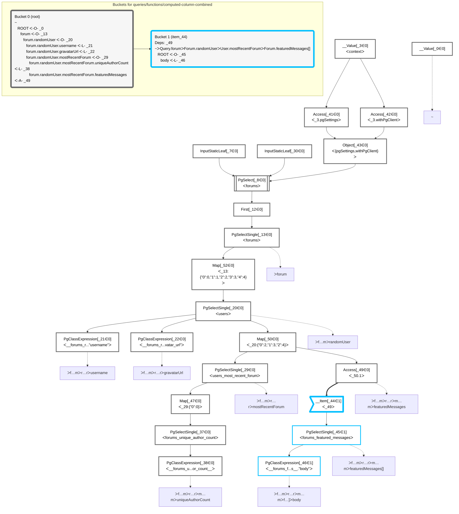

```mermaid
graph TD
    classDef path fill:#eee,stroke:#000,color:#000
    classDef plan fill:#fff,stroke-width:3px,color:#000
    classDef itemplan fill:#fff,stroke-width:6px,color:#000
    classDef sideeffectplan fill:#f00,stroke-width:6px,color:#000
    classDef bucket fill:#f6f6f6,color:#000,stroke-width:6px,text-align:left


    %% define plans
    __Value_0["__Value[_0∈0]"]:::plan
    __Value_3["__Value[_3∈0]<br />ᐸcontextᐳ"]:::plan
    InputStaticLeaf_7["InputStaticLeaf[_7∈0]"]:::plan
    PgSelect_8[["PgSelect[_8∈0]<br />ᐸforumsᐳ"]]:::plan
    First_12["First[_12∈0]"]:::plan
    PgSelectSingle_13["PgSelectSingle[_13∈0]<br />ᐸforumsᐳ"]:::plan
    PgSelectSingle_20["PgSelectSingle[_20∈0]<br />ᐸusersᐳ"]:::plan
    PgClassExpression_21["PgClassExpression[_21∈0]<br />ᐸ__forums_r...”username”ᐳ"]:::plan
    PgClassExpression_22["PgClassExpression[_22∈0]<br />ᐸ__forums_r...vatar_url”ᐳ"]:::plan
    PgSelectSingle_29["PgSelectSingle[_29∈0]<br />ᐸusers_most_recent_forumᐳ"]:::plan
    InputStaticLeaf_30["InputStaticLeaf[_30∈0]"]:::plan
    PgSelectSingle_37["PgSelectSingle[_37∈0]<br />ᐸforums_unique_author_countᐳ"]:::plan
    PgClassExpression_38["PgClassExpression[_38∈0]<br />ᐸ__forums_u...or_count__ᐳ"]:::plan
    Access_41["Access[_41∈0]<br />ᐸ_3.pgSettingsᐳ"]:::plan
    Access_42["Access[_42∈0]<br />ᐸ_3.withPgClientᐳ"]:::plan
    Object_43["Object[_43∈0]<br />ᐸ{pgSettings,withPgClient}ᐳ"]:::plan
    __Item_44>"__Item[_44∈1]<br />ᐸ_49ᐳ"]:::itemplan
    PgSelectSingle_45["PgSelectSingle[_45∈1]<br />ᐸforums_featured_messagesᐳ"]:::plan
    PgClassExpression_46["PgClassExpression[_46∈1]<br />ᐸ__forums_f...s__.”body”ᐳ"]:::plan
    Map_47["Map[_47∈0]<br />ᐸ_29:{”0”:0}ᐳ"]:::plan
    Access_49["Access[_49∈0]<br />ᐸ_50.1ᐳ"]:::plan
    Map_50["Map[_50∈0]<br />ᐸ_20:{”0”:2,”1”:3,”2”:4}ᐳ"]:::plan
    Map_52["Map[_52∈0]<br />ᐸ_13:{”0”:0,”1”:1,”2”:2,”3”:3,”4”:4}ᐳ"]:::plan

    %% plan dependencies
    Object_43 & InputStaticLeaf_7 & InputStaticLeaf_30 --> PgSelect_8
    PgSelect_8 --> First_12
    First_12 --> PgSelectSingle_13
    Map_52 --> PgSelectSingle_20
    PgSelectSingle_20 --> PgClassExpression_21
    PgSelectSingle_20 --> PgClassExpression_22
    Map_50 --> PgSelectSingle_29
    Map_47 --> PgSelectSingle_37
    PgSelectSingle_37 --> PgClassExpression_38
    __Value_3 --> Access_41
    __Value_3 --> Access_42
    Access_41 & Access_42 --> Object_43
    Access_49 ==> __Item_44
    __Item_44 --> PgSelectSingle_45
    PgSelectSingle_45 --> PgClassExpression_46
    PgSelectSingle_29 --> Map_47
    Map_50 --> Access_49
    PgSelectSingle_20 --> Map_50
    PgSelectSingle_13 --> Map_52

    %% plan-to-path relationships
    P_0["~"]
    __Value_0 -.-> P_0
    P_13["ᐳforum"]
    PgSelectSingle_13 -.-> P_13
    P_20["ᐳf…mᐳrandomUser"]
    PgSelectSingle_20 -.-> P_20
    P_21["ᐳf…mᐳr…rᐳusername"]
    PgClassExpression_21 -.-> P_21
    P_22["ᐳf…mᐳr…rᐳgravatarUrl"]
    PgClassExpression_22 -.-> P_22
    P_29["ᐳf…mᐳr…rᐳmostRecentForum"]
    PgSelectSingle_29 -.-> P_29
    P_38["ᐳf…mᐳr…rᐳm…mᐳuniqueAuthorCount"]
    PgClassExpression_38 -.-> P_38
    P_45["ᐳf…mᐳr…rᐳm…mᐳfeaturedMessages[]"]
    PgSelectSingle_45 -.-> P_45
    P_46["ᐳf…mᐳr…rᐳm…mᐳf…]ᐳbody"]
    PgClassExpression_46 -.-> P_46
    P_49["ᐳf…mᐳr…rᐳm…mᐳfeaturedMessages"]
    Access_49 -.-> P_49

    subgraph "Buckets for queries/functions/computed-column-combined"
    Bucket0("Bucket 0 (root)<br />~<br />⠀ROOT ᐸ-O- _0<br />⠀⠀forum ᐸ-O- _13<br />⠀⠀⠀forum.randomUser ᐸ-O- _20<br />⠀⠀⠀⠀forum.randomUser.username ᐸ-L- _21<br />⠀⠀⠀⠀forum.randomUser.gravatarUrl ᐸ-L- _22<br />⠀⠀⠀⠀forum.randomUser.mostRecentForum ᐸ-O- _29<br />⠀⠀⠀⠀⠀forum.randomUser.mostRecentForum.uniqueAuthorCount ᐸ-L- _38<br />⠀⠀⠀⠀⠀forum.randomUser.mostRecentForum.featuredMessages ᐸ-A- _49"):::bucket
    classDef bucket0 stroke:#696969
    class Bucket0,__Value_0,__Value_3,InputStaticLeaf_7,PgSelect_8,First_12,PgSelectSingle_13,PgSelectSingle_20,PgClassExpression_21,PgClassExpression_22,PgSelectSingle_29,InputStaticLeaf_30,PgSelectSingle_37,PgClassExpression_38,Access_41,Access_42,Object_43,Map_47,Access_49,Map_50,Map_52 bucket0
    Bucket1("Bucket 1 (item_44)<br />Deps: _49<br />~ᐳQuery.forumᐳForum.randomUserᐳUser.mostRecentForumᐳForum.featuredMessages[]<br />⠀ROOT ᐸ-O- _45<br />⠀⠀body ᐸ-L- _46"):::bucket
    classDef bucket1 stroke:#00bfff
    class Bucket1,__Item_44,PgSelectSingle_45,PgClassExpression_46 bucket1
    Bucket0 --> Bucket1
    end
```
