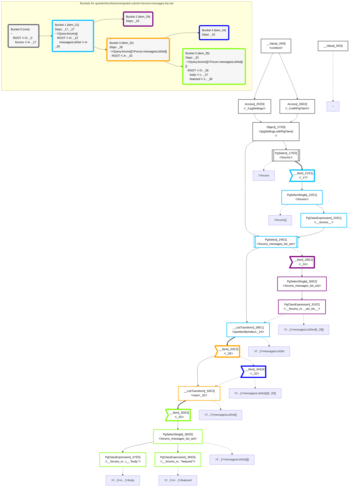

```mermaid
graph TD
    classDef path fill:#eee,stroke:#000,color:#000
    classDef plan fill:#fff,stroke-width:3px,color:#000
    classDef itemplan fill:#fff,stroke-width:6px,color:#000
    classDef sideeffectplan fill:#f00,stroke-width:6px,color:#000
    classDef bucket fill:#f6f6f6,color:#000,stroke-width:6px,text-align:left


    %% define plans
    __Value_0["__Value[_0∈0]"]:::plan
    __Value_3["__Value[_3∈0]<br />ᐸcontextᐳ"]:::plan
    PgSelect_17[["PgSelect[_17∈0]<br />ᐸforumsᐳ"]]:::plan
    __Item_21>"__Item[_21∈1]<br />ᐸ_17ᐳ"]:::itemplan
    PgSelectSingle_22["PgSelectSingle[_22∈1]<br />ᐸforumsᐳ"]:::plan
    PgClassExpression_23["PgClassExpression[_23∈1]<br />ᐸ__forums__ᐳ"]:::plan
    PgSelect_24[["PgSelect[_24∈1]<br />ᐸforums_messages_list_setᐳ"]]:::plan
    Access_25["Access[_25∈0]<br />ᐸ_3.pgSettingsᐳ"]:::plan
    Access_26["Access[_26∈0]<br />ᐸ_3.withPgClientᐳ"]:::plan
    Object_27["Object[_27∈0]<br />ᐸ{pgSettings,withPgClient}ᐳ"]:::plan
    __ListTransform_28["__ListTransform[_28∈1]<br />ᐸpartitionByIndex1:_24ᐳ"]:::plan
    __Item_29>"__Item[_29∈2]<br />ᐸ_24ᐳ"]:::itemplan
    PgSelectSingle_30["PgSelectSingle[_30∈2]<br />ᐸforums_messages_list_setᐳ"]:::plan
    PgClassExpression_31["PgClassExpression[_31∈2]<br />ᐸ__forums_m..._set_idx__ᐳ"]:::plan
    __Item_32>"__Item[_32∈3]<br />ᐸ_28ᐳ"]:::itemplan
    __ListTransform_33["__ListTransform[_33∈3]<br />ᐸeach:_32ᐳ"]:::plan
    __Item_34>"__Item[_34∈4]<br />ᐸ_32ᐳ"]:::itemplan
    __Item_35>"__Item[_35∈5]<br />ᐸ_33ᐳ"]:::itemplan
    PgSelectSingle_36["PgSelectSingle[_36∈5]<br />ᐸforums_messages_list_setᐳ"]:::plan
    PgClassExpression_37["PgClassExpression[_37∈5]<br />ᐸ__forums_m...t__.”body”ᐳ"]:::plan
    PgClassExpression_38["PgClassExpression[_38∈5]<br />ᐸ__forums_m...”featured”ᐳ"]:::plan

    %% plan dependencies
    Object_27 --> PgSelect_17
    PgSelect_17 ==> __Item_21
    __Item_21 --> PgSelectSingle_22
    PgSelectSingle_22 --> PgClassExpression_23
    Object_27 --> PgSelect_24
    PgClassExpression_23 --> PgSelect_24
    __Value_3 --> Access_25
    __Value_3 --> Access_26
    Access_25 --> Object_27
    Access_26 --> Object_27
    PgSelect_24 --> __ListTransform_28
    PgClassExpression_31 -.-> __ListTransform_28
    PgSelect_24 -.-> __Item_29
    __Item_29 --> PgSelectSingle_30
    PgSelectSingle_30 --> PgClassExpression_31
    __ListTransform_28 ==> __Item_32
    __Item_32 --> __ListTransform_33
    __Item_34 -.-> __ListTransform_33
    __Item_32 -.-> __Item_34
    __ListTransform_33 ==> __Item_35
    __Item_35 --> PgSelectSingle_36
    PgSelectSingle_36 --> PgClassExpression_37
    PgSelectSingle_36 --> PgClassExpression_38

    %% plan-to-path relationships
    P_0["~"]
    __Value_0 -.-> P_0
    P_17["ᐳforums"]
    PgSelect_17 -.-> P_17
    P_22["ᐳforums[]"]
    PgSelectSingle_22 -.-> P_22
    P_28["ᐳf…]ᐳmessagesListSet"]
    __ListTransform_28 -.-> P_28
    P_31["ᐳf…]ᐳmessagesListSet@_28[]"]
    PgClassExpression_31 -.-> P_31
    P_33["ᐳf…]ᐳmessagesListSet[]"]
    __ListTransform_33 -.-> P_33
    P_34["ᐳf…]ᐳmessagesListSet[]@_33[]"]
    __Item_34 -.-> P_34
    P_36["ᐳf…]ᐳmessagesListSet[][]"]
    PgSelectSingle_36 -.-> P_36
    P_37["ᐳf…]ᐳm…]ᐳbody"]
    PgClassExpression_37 -.-> P_37
    P_38["ᐳf…]ᐳm…]ᐳfeatured"]
    PgClassExpression_38 -.-> P_38

    %% allocate buckets
    classDef bucket0 stroke:#696969
    class __Value_0,__Value_3,PgSelect_17,Access_25,Access_26,Object_27 bucket0
    classDef bucket1 stroke:#00bfff
    class __Item_21,PgSelectSingle_22,PgClassExpression_23,PgSelect_24,__ListTransform_28 bucket1
    classDef bucket2 stroke:#7f007f
    class __Item_29,PgSelectSingle_30,PgClassExpression_31 bucket2
    classDef bucket3 stroke:#ffa500
    class __Item_32,__ListTransform_33 bucket3
    classDef bucket4 stroke:#0000ff
    class __Item_34 bucket4
    classDef bucket5 stroke:#7fff00
    class __Item_35,PgSelectSingle_36,PgClassExpression_37,PgClassExpression_38 bucket5

    subgraph "Buckets for queries/functions/computed-column-forums-messages-list-set"
    Bucket0("Bucket 0 (root)<br />~<br />⠀ROOT ᐸ-O- _0<br />⠀⠀forums ᐸ-A- _17"):::bucket
    style Bucket0 stroke:#696969
    Bucket1("Bucket 1 (item_21)<br />Deps: _17, _27<br />~ᐳQuery.forums[]<br />⠀ROOT ᐸ-O- _22<br />⠀⠀messagesListSet ᐸ-A- _28"):::bucket
    style Bucket1 stroke:#00bfff
    Bucket0 --> Bucket1
    Bucket2("Bucket 2 (item_29)<br />Deps: _24"):::bucket
    style Bucket2 stroke:#7f007f
    Bucket1 --> Bucket2
    Bucket3("Bucket 3 (item_32)<br />Deps: _28<br />~ᐳQuery.forums[]ᐳForum.messagesListSet[]<br />⠀ROOT ᐸ-A- _33"):::bucket
    style Bucket3 stroke:#ffa500
    Bucket1 --> Bucket3
    Bucket4("Bucket 4 (item_34)<br />Deps: _32"):::bucket
    style Bucket4 stroke:#0000ff
    Bucket3 --> Bucket4
    Bucket5("Bucket 5 (item_35)<br />Deps: _33<br />~ᐳQuery.forums[]ᐳForum.messagesListSet[][]<br />⠀ROOT ᐸ-O- _36<br />⠀⠀body ᐸ-L- _37<br />⠀⠀featured ᐸ-L- _38"):::bucket
    style Bucket5 stroke:#7fff00
    Bucket3 --> Bucket5
    end
```
