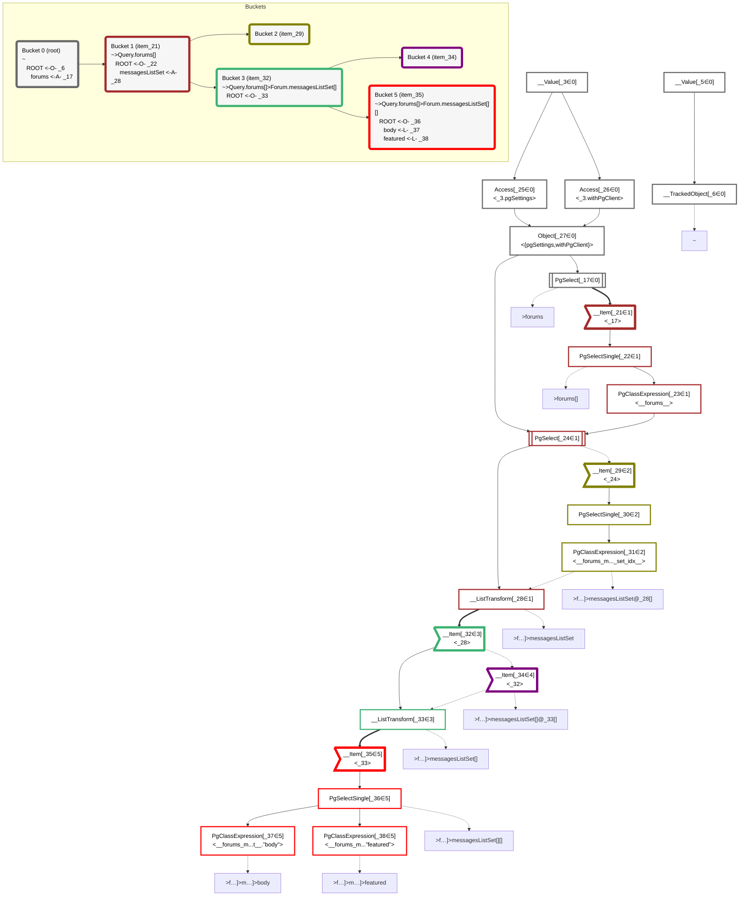

```mermaid
graph TD
    classDef path fill:#eee,stroke:#000,color:#000
    classDef plan fill:#fff,stroke-width:3px,color:#000
    classDef itemplan fill:#fff,stroke-width:6px,color:#000
    classDef sideeffectplan fill:#f00,stroke-width:6px,color:#000
    classDef bucket fill:#f6f6f6,color:#000,stroke-width:6px,text-align:left


    %% define plans
    __Value_3["__Value[_3∈0]<br /><context>"]:::plan
    __Value_5["__Value[_5∈0]<br /><rootValue>"]:::plan
    __TrackedObject_6["__TrackedObject[_6∈0]"]:::plan
    PgSelect_17[["PgSelect[_17∈0]<br /><forums>"]]:::plan
    __Item_21>"__Item[_21∈1]<br /><_17>"]:::itemplan
    PgSelectSingle_22["PgSelectSingle[_22∈1]<br /><forums>"]:::plan
    PgClassExpression_23["PgClassExpression[_23∈1]<br /><__forums__>"]:::plan
    PgSelect_24[["PgSelect[_24∈1]<br /><forums_messages_list_set>"]]:::plan
    Access_25["Access[_25∈0]<br /><_3.pgSettings>"]:::plan
    Access_26["Access[_26∈0]<br /><_3.withPgClient>"]:::plan
    Object_27["Object[_27∈0]<br /><{pgSettings,withPgClient}>"]:::plan
    __ListTransform_28["__ListTransform[_28∈1]<br /><partitionByIndex1:_24>"]:::plan
    __Item_29>"__Item[_29∈2]<br /><_24>"]:::itemplan
    PgSelectSingle_30["PgSelectSingle[_30∈2]<br /><forums_messages_list_set>"]:::plan
    PgClassExpression_31["PgClassExpression[_31∈2]<br /><__forums_m..._set_idx__>"]:::plan
    __Item_32>"__Item[_32∈3]<br /><_28>"]:::itemplan
    __ListTransform_33["__ListTransform[_33∈3]<br /><each:_32>"]:::plan
    __Item_34>"__Item[_34∈4]<br /><_32>"]:::itemplan
    __Item_35>"__Item[_35∈5]<br /><_33>"]:::itemplan
    PgSelectSingle_36["PgSelectSingle[_36∈5]<br /><forums_messages_list_set>"]:::plan
    PgClassExpression_37["PgClassExpression[_37∈5]<br /><__forums_m...t__.”body”>"]:::plan
    PgClassExpression_38["PgClassExpression[_38∈5]<br /><__forums_m...”featured”>"]:::plan

    %% plan dependencies
    __Value_5 --> __TrackedObject_6
    Object_27 --> PgSelect_17
    PgSelect_17 ==> __Item_21
    __Item_21 --> PgSelectSingle_22
    PgSelectSingle_22 --> PgClassExpression_23
    Object_27 --> PgSelect_24
    PgClassExpression_23 --> PgSelect_24
    __Value_3 --> Access_25
    __Value_3 --> Access_26
    Access_25 --> Object_27
    Access_26 --> Object_27
    PgSelect_24 --> __ListTransform_28
    PgClassExpression_31 -.-> __ListTransform_28
    PgSelect_24 -.-> __Item_29
    __Item_29 --> PgSelectSingle_30
    PgSelectSingle_30 --> PgClassExpression_31
    __ListTransform_28 ==> __Item_32
    __Item_32 --> __ListTransform_33
    __Item_34 -.-> __ListTransform_33
    __Item_32 -.-> __Item_34
    __ListTransform_33 ==> __Item_35
    __Item_35 --> PgSelectSingle_36
    PgSelectSingle_36 --> PgClassExpression_37
    PgSelectSingle_36 --> PgClassExpression_38

    %% plan-to-path relationships
    P_6["~"]
    __TrackedObject_6 -.-> P_6
    P_17[">forums"]
    PgSelect_17 -.-> P_17
    P_22[">forums[]"]
    PgSelectSingle_22 -.-> P_22
    P_28[">f…]>messagesListSet"]
    __ListTransform_28 -.-> P_28
    P_31[">f…]>messagesListSet@_28[]"]
    PgClassExpression_31 -.-> P_31
    P_33[">f…]>messagesListSet[]"]
    __ListTransform_33 -.-> P_33
    P_34[">f…]>messagesListSet[]@_33[]"]
    __Item_34 -.-> P_34
    P_36[">f…]>messagesListSet[][]"]
    PgSelectSingle_36 -.-> P_36
    P_37[">f…]>m…]>body"]
    PgClassExpression_37 -.-> P_37
    P_38[">f…]>m…]>featured"]
    PgClassExpression_38 -.-> P_38

    %% allocate buckets
    classDef bucket0 stroke:#696969
    class __Value_3,__Value_5,__TrackedObject_6,PgSelect_17,Access_25,Access_26,Object_27 bucket0
    classDef bucket1 stroke:#a52a2a
    class __Item_21,PgSelectSingle_22,PgClassExpression_23,PgSelect_24,__ListTransform_28 bucket1
    classDef bucket2 stroke:#808000
    class __Item_29,PgSelectSingle_30,PgClassExpression_31 bucket2
    classDef bucket3 stroke:#3cb371
    class __Item_32,__ListTransform_33 bucket3
    classDef bucket4 stroke:#7f007f
    class __Item_34 bucket4
    classDef bucket5 stroke:#ff0000
    class __Item_35,PgSelectSingle_36,PgClassExpression_37,PgClassExpression_38 bucket5

    subgraph Buckets
    Bucket0("Bucket 0 (root)<br />~<br />⠀ROOT <-O- _6<br />⠀⠀forums <-A- _17"):::bucket
    style Bucket0 stroke:#696969
    Bucket1("Bucket 1 (item_21)<br />~>Query.forums[]<br />⠀ROOT <-O- _22<br />⠀⠀messagesListSet <-A- _28"):::bucket
    style Bucket1 stroke:#a52a2a
    Bucket0 --> Bucket1
    Bucket2("Bucket 2 (item_29)"):::bucket
    style Bucket2 stroke:#808000
    Bucket1 --> Bucket2
    Bucket3("Bucket 3 (item_32)<br />~>Query.forums[]>Forum.messagesListSet[]<br />⠀ROOT <-O- _33"):::bucket
    style Bucket3 stroke:#3cb371
    Bucket1 --> Bucket3
    Bucket4("Bucket 4 (item_34)"):::bucket
    style Bucket4 stroke:#7f007f
    Bucket3 --> Bucket4
    Bucket5("Bucket 5 (item_35)<br />~>Query.forums[]>Forum.messagesListSet[][]<br />⠀ROOT <-O- _36<br />⠀⠀body <-L- _37<br />⠀⠀featured <-L- _38"):::bucket
    style Bucket5 stroke:#ff0000
    Bucket3 --> Bucket5
    end
```
