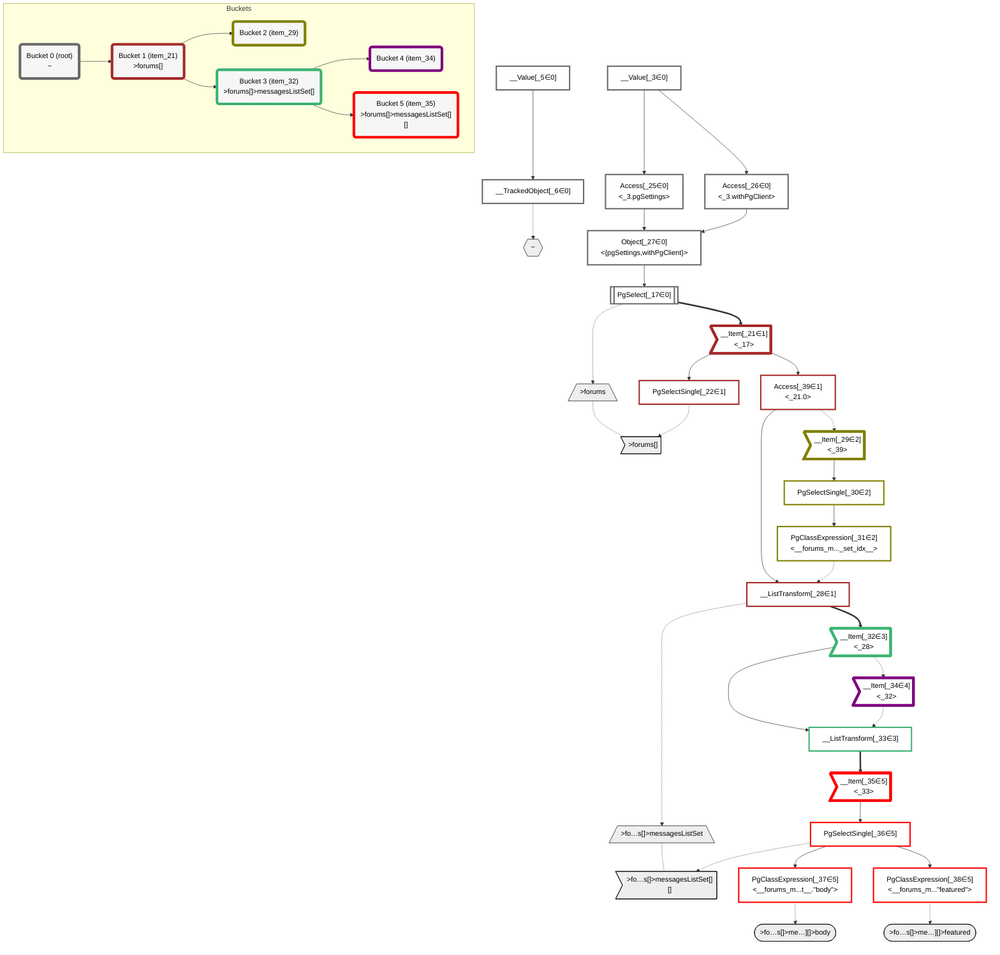

```mermaid
graph TD
    classDef path fill:#eee,stroke:#000,color:#000
    classDef plan fill:#fff,stroke-width:3px,color:#000
    classDef itemplan fill:#fff,stroke-width:6px,color:#000
    classDef sideeffectplan fill:#f00,stroke-width:6px,color:#000
    classDef bucket fill:#f6f6f6,color:#000,stroke-width:6px

    %% subgraph fields
    P1{{"~"}}:::path
    P2[/">forums"\]:::path
    P3>">forums[]"]:::path
    P2 -.- P3
    P4[/">fo…s[]>messagesListSet"\]:::path
    P5>">fo…s[]>messagesListSet[][]"]:::path
    P4 -.- P5
    P6([">fo…s[]>me…][]>body"]):::path
    %% P5 -.-> P6
    P7([">fo…s[]>me…][]>featured"]):::path
    %% P5 -.-> P7
    %% P3 -.-> P4
    %% P1 -.-> P2
    %% end

    %% define plans
    __Value_3["__Value[_3∈0]<br /><context>"]:::plan
    __Value_5["__Value[_5∈0]<br /><rootValue>"]:::plan
    __TrackedObject_6["__TrackedObject[_6∈0]"]:::plan
    PgSelect_17[["PgSelect[_17∈0]<br /><forums>"]]:::plan
    __Item_21>"__Item[_21∈1]<br /><_17>"]:::itemplan
    PgSelectSingle_22["PgSelectSingle[_22∈1]<br /><forums>"]:::plan
    Access_25["Access[_25∈0]<br /><_3.pgSettings>"]:::plan
    Access_26["Access[_26∈0]<br /><_3.withPgClient>"]:::plan
    Object_27["Object[_27∈0]<br /><{pgSettings,withPgClient}>"]:::plan
    __ListTransform_28["__ListTransform[_28∈1]<br /><partitionByIndex1:_24>"]:::plan
    __Item_29>"__Item[_29∈2]<br /><_39>"]:::itemplan
    PgSelectSingle_30["PgSelectSingle[_30∈2]<br /><forums_messages_list_set>"]:::plan
    PgClassExpression_31["PgClassExpression[_31∈2]<br /><__forums_m..._set_idx__>"]:::plan
    __Item_32>"__Item[_32∈3]<br /><_28>"]:::itemplan
    __ListTransform_33["__ListTransform[_33∈3]<br /><each:_32>"]:::plan
    __Item_34>"__Item[_34∈4]<br /><_32>"]:::itemplan
    __Item_35>"__Item[_35∈5]<br /><_33>"]:::itemplan
    PgSelectSingle_36["PgSelectSingle[_36∈5]<br /><forums_messages_list_set>"]:::plan
    PgClassExpression_37["PgClassExpression[_37∈5]<br /><__forums_m...t__.#quot;body#quot;>"]:::plan
    PgClassExpression_38["PgClassExpression[_38∈5]<br /><__forums_m...#quot;featured#quot;>"]:::plan
    Access_39["Access[_39∈1]<br /><_21.0>"]:::plan

    %% plan dependencies
    __Value_5 --> __TrackedObject_6
    Object_27 --> PgSelect_17
    PgSelect_17 ==> __Item_21
    __Item_21 --> PgSelectSingle_22
    __Value_3 --> Access_25
    __Value_3 --> Access_26
    Access_25 --> Object_27
    Access_26 --> Object_27
    Access_39 --> __ListTransform_28
    PgClassExpression_31 -.-> __ListTransform_28
    Access_39 -.-> __Item_29
    __Item_29 --> PgSelectSingle_30
    PgSelectSingle_30 --> PgClassExpression_31
    __ListTransform_28 ==> __Item_32
    __Item_32 --> __ListTransform_33
    __Item_34 -.-> __ListTransform_33
    __Item_32 -.-> __Item_34
    __ListTransform_33 ==> __Item_35
    __Item_35 --> PgSelectSingle_36
    PgSelectSingle_36 --> PgClassExpression_37
    PgSelectSingle_36 --> PgClassExpression_38
    __Item_21 --> Access_39

    %% plan-to-path relationships
    __TrackedObject_6 -.-> P1
    PgSelect_17 -.-> P2
    PgSelectSingle_22 -.-> P3
    __ListTransform_28 -.-> P4
    PgSelectSingle_36 -.-> P5
    PgClassExpression_37 -.-> P6
    PgClassExpression_38 -.-> P7

    %% allocate buckets
    classDef bucket0 stroke:#696969
    class __Value_3,__Value_5,__TrackedObject_6,PgSelect_17,Access_25,Access_26,Object_27 bucket0
    classDef bucket1 stroke:#a52a2a
    class __Item_21,PgSelectSingle_22,__ListTransform_28,Access_39 bucket1
    classDef bucket2 stroke:#808000
    class __Item_29,PgSelectSingle_30,PgClassExpression_31 bucket2
    classDef bucket3 stroke:#3cb371
    class __Item_32,__ListTransform_33 bucket3
    classDef bucket4 stroke:#7f007f
    class __Item_34 bucket4
    classDef bucket5 stroke:#ff0000
    class __Item_35,PgSelectSingle_36,PgClassExpression_37,PgClassExpression_38 bucket5

    subgraph Buckets
    Bucket0("Bucket 0 (root)<br />~"):::bucket
    style Bucket0 stroke:#696969
    Bucket1("Bucket 1 (item_21)<br />>forums[]"):::bucket
    style Bucket1 stroke:#a52a2a
    Bucket0 --> Bucket1
    Bucket2("Bucket 2 (item_29)"):::bucket
    style Bucket2 stroke:#808000
    Bucket1 --> Bucket2
    Bucket3("Bucket 3 (item_32)<br />>forums[]>messagesListSet[]"):::bucket
    style Bucket3 stroke:#3cb371
    Bucket1 --> Bucket3
    Bucket4("Bucket 4 (item_34)"):::bucket
    style Bucket4 stroke:#7f007f
    Bucket3 --> Bucket4
    Bucket5("Bucket 5 (item_35)<br />>forums[]>messagesListSet[][]"):::bucket
    style Bucket5 stroke:#ff0000
    Bucket3 --> Bucket5
    end
```
