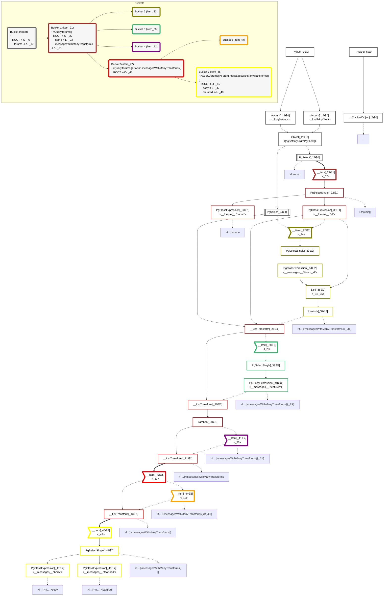

```mermaid
graph TD
    classDef path fill:#eee,stroke:#000,color:#000
    classDef plan fill:#fff,stroke-width:3px,color:#000
    classDef itemplan fill:#fff,stroke-width:6px,color:#000
    classDef sideeffectplan fill:#f00,stroke-width:6px,color:#000
    classDef bucket fill:#f6f6f6,color:#000,stroke-width:6px,text-align:left


    %% define plans
    __Value_3["__Value[_3∈0]<br /><context>"]:::plan
    __Value_5["__Value[_5∈0]<br /><rootValue>"]:::plan
    __TrackedObject_6["__TrackedObject[_6∈0]"]:::plan
    PgSelect_17[["PgSelect[_17∈0]<br /><forums>"]]:::plan
    Access_18["Access[_18∈0]<br /><_3.pgSettings>"]:::plan
    Access_19["Access[_19∈0]<br /><_3.withPgClient>"]:::plan
    Object_20["Object[_20∈0]<br /><{pgSettings,withPgClient}>"]:::plan
    __Item_21>"__Item[_21∈1]<br /><_17>"]:::itemplan
    PgSelectSingle_22["PgSelectSingle[_22∈1]<br /><forums>"]:::plan
    PgClassExpression_23["PgClassExpression[_23∈1]<br /><__forums__.”name”>"]:::plan
    PgSelect_24[["PgSelect[_24∈0]<br /><messages>"]]:::plan
    __ListTransform_28["__ListTransform[_28∈1]<br /><filter:_24>"]:::plan
    __ListTransform_29["__ListTransform[_29∈1]<br /><groupBy:_28>"]:::plan
    Lambda_30["Lambda[_30∈1]"]:::plan
    __ListTransform_31["__ListTransform[_31∈1]<br /><each:_30>"]:::plan
    __Item_32>"__Item[_32∈2]<br /><_24>"]:::itemplan
    PgSelectSingle_33["PgSelectSingle[_33∈2]<br /><messages>"]:::plan
    PgClassExpression_34["PgClassExpression[_34∈2]<br /><__messages__.”forum_id”>"]:::plan
    PgClassExpression_35["PgClassExpression[_35∈1]<br /><__forums__.”id”>"]:::plan
    List_36["List[_36∈2]<br /><_34,_35>"]:::plan
    Lambda_37["Lambda[_37∈2]"]:::plan
    __Item_38>"__Item[_38∈3]<br /><_28>"]:::itemplan
    PgSelectSingle_39["PgSelectSingle[_39∈3]<br /><messages>"]:::plan
    PgClassExpression_40["PgClassExpression[_40∈3]<br /><__messages__.”featured”>"]:::plan
    __Item_41>"__Item[_41∈4]<br /><_30>"]:::itemplan
    __Item_42>"__Item[_42∈5]<br /><_31>"]:::itemplan
    __ListTransform_43["__ListTransform[_43∈5]<br /><each:_42>"]:::plan
    __Item_44>"__Item[_44∈6]<br /><_42>"]:::itemplan
    __Item_45>"__Item[_45∈7]<br /><_43>"]:::itemplan
    PgSelectSingle_46["PgSelectSingle[_46∈7]<br /><messages>"]:::plan
    PgClassExpression_47["PgClassExpression[_47∈7]<br /><__messages__.”body”>"]:::plan
    PgClassExpression_48["PgClassExpression[_48∈7]<br /><__messages__.”featured”>"]:::plan

    %% plan dependencies
    __Value_5 --> __TrackedObject_6
    Object_20 --> PgSelect_17
    __Value_3 --> Access_18
    __Value_3 --> Access_19
    Access_18 --> Object_20
    Access_19 --> Object_20
    PgSelect_17 ==> __Item_21
    __Item_21 --> PgSelectSingle_22
    PgSelectSingle_22 --> PgClassExpression_23
    Object_20 --> PgSelect_24
    PgSelect_24 --> __ListTransform_28
    PgClassExpression_35 --> __ListTransform_28
    Lambda_37 -.-> __ListTransform_28
    __ListTransform_28 --> __ListTransform_29
    PgClassExpression_40 -.-> __ListTransform_29
    __ListTransform_29 --> Lambda_30
    Lambda_30 --> __ListTransform_31
    __Item_41 -.-> __ListTransform_31
    PgSelect_24 -.-> __Item_32
    PgClassExpression_35 --> __Item_32
    __Item_32 --> PgSelectSingle_33
    PgSelectSingle_33 --> PgClassExpression_34
    PgSelectSingle_22 --> PgClassExpression_35
    PgClassExpression_34 --> List_36
    PgClassExpression_35 --> List_36
    List_36 --> Lambda_37
    __ListTransform_28 -.-> __Item_38
    __Item_38 --> PgSelectSingle_39
    PgSelectSingle_39 --> PgClassExpression_40
    Lambda_30 -.-> __Item_41
    __ListTransform_31 ==> __Item_42
    __Item_42 --> __ListTransform_43
    __Item_44 -.-> __ListTransform_43
    __Item_42 -.-> __Item_44
    __ListTransform_43 ==> __Item_45
    __Item_45 --> PgSelectSingle_46
    PgSelectSingle_46 --> PgClassExpression_47
    PgSelectSingle_46 --> PgClassExpression_48

    %% plan-to-path relationships
    P_6["~"]
    __TrackedObject_6 -.-> P_6
    P_17[">forums"]
    PgSelect_17 -.-> P_17
    P_22[">forums[]"]
    PgSelectSingle_22 -.-> P_22
    P_23[">f…]>name"]
    PgClassExpression_23 -.-> P_23
    P_31[">f…]>messagesWithManyTransforms"]
    __ListTransform_31 -.-> P_31
    P_37[">f…]>messagesWithManyTransforms@_28[]"]
    Lambda_37 -.-> P_37
    P_40[">f…]>messagesWithManyTransforms@_29[]"]
    PgClassExpression_40 -.-> P_40
    P_41[">f…]>messagesWithManyTransforms@_31[]"]
    __Item_41 -.-> P_41
    P_43[">f…]>messagesWithManyTransforms[]"]
    __ListTransform_43 -.-> P_43
    P_44[">f…]>messagesWithManyTransforms[]@_43[]"]
    __Item_44 -.-> P_44
    P_46[">f…]>messagesWithManyTransforms[][]"]
    PgSelectSingle_46 -.-> P_46
    P_47[">f…]>m…]>body"]
    PgClassExpression_47 -.-> P_47
    P_48[">f…]>m…]>featured"]
    PgClassExpression_48 -.-> P_48

    %% allocate buckets
    classDef bucket0 stroke:#696969
    class __Value_3,__Value_5,__TrackedObject_6,PgSelect_17,Access_18,Access_19,Object_20,PgSelect_24 bucket0
    classDef bucket1 stroke:#a52a2a
    class __Item_21,PgSelectSingle_22,PgClassExpression_23,__ListTransform_28,__ListTransform_29,Lambda_30,__ListTransform_31,PgClassExpression_35 bucket1
    classDef bucket2 stroke:#808000
    class __Item_32,PgSelectSingle_33,PgClassExpression_34,List_36,Lambda_37 bucket2
    classDef bucket3 stroke:#3cb371
    class __Item_38,PgSelectSingle_39,PgClassExpression_40 bucket3
    classDef bucket4 stroke:#7f007f
    class __Item_41 bucket4
    classDef bucket5 stroke:#ff0000
    class __Item_42,__ListTransform_43 bucket5
    classDef bucket6 stroke:#ffa500
    class __Item_44 bucket6
    classDef bucket7 stroke:#ffff00
    class __Item_45,PgSelectSingle_46,PgClassExpression_47,PgClassExpression_48 bucket7

    subgraph Buckets
    Bucket0("Bucket 0 (root)<br />~<br />⠀ROOT <-O- _6<br />⠀⠀forums <-A- _17"):::bucket
    style Bucket0 stroke:#696969
    Bucket1("Bucket 1 (item_21)<br />~>Query.forums[]<br />⠀ROOT <-O- _22<br />⠀⠀name <-L- _23<br />⠀⠀messagesWithManyTransforms <-A- _31"):::bucket
    style Bucket1 stroke:#a52a2a
    Bucket0 --> Bucket1
    Bucket2("Bucket 2 (item_32)"):::bucket
    style Bucket2 stroke:#808000
    Bucket1 --> Bucket2
    Bucket3("Bucket 3 (item_38)"):::bucket
    style Bucket3 stroke:#3cb371
    Bucket1 --> Bucket3
    Bucket4("Bucket 4 (item_41)"):::bucket
    style Bucket4 stroke:#7f007f
    Bucket1 --> Bucket4
    Bucket5("Bucket 5 (item_42)<br />~>Query.forums[]>Forum.messagesWithManyTransforms[]<br />⠀ROOT <-O- _43"):::bucket
    style Bucket5 stroke:#ff0000
    Bucket1 --> Bucket5
    Bucket6("Bucket 6 (item_44)"):::bucket
    style Bucket6 stroke:#ffa500
    Bucket5 --> Bucket6
    Bucket7("Bucket 7 (item_45)<br />~>Query.forums[]>Forum.messagesWithManyTransforms[][]<br />⠀ROOT <-O- _46<br />⠀⠀body <-L- _47<br />⠀⠀featured <-L- _48"):::bucket
    style Bucket7 stroke:#ffff00
    Bucket5 --> Bucket7
    end
```
