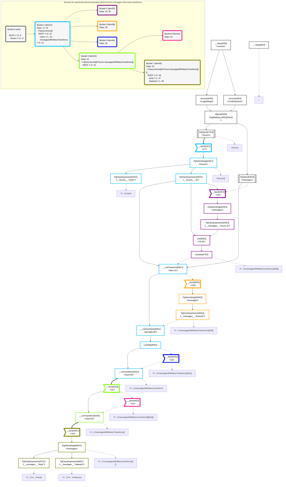

```mermaid
graph TD
    classDef path fill:#eee,stroke:#000,color:#000
    classDef plan fill:#fff,stroke-width:3px,color:#000
    classDef itemplan fill:#fff,stroke-width:6px,color:#000
    classDef sideeffectplan fill:#f00,stroke-width:6px,color:#000
    classDef bucket fill:#f6f6f6,color:#000,stroke-width:6px,text-align:left


    %% define plans
    __Value0["__Value[0∈0]"]:::plan
    PgClassExpression23["PgClassExpression[23∈1]<br />ᐸ__forums__.”name”ᐳ"]:::plan
    PgClassExpression47["PgClassExpression[47∈7]<br />ᐸ__messages__.”body”ᐳ"]:::plan
    PgClassExpression48["PgClassExpression[48∈7]<br />ᐸ__messages__.”featured”ᐳ"]:::plan
    PgSelectSingle46["PgSelectSingle[46∈7]<br />ᐸmessagesᐳ"]:::plan
    __Item45>"__Item[45∈7]<br />ᐸ43ᐳ"]:::itemplan
    __ListTransform43["__ListTransform[43∈5]<br />ᐸeach:42ᐳ"]:::plan
    __Item44>"__Item[44∈6]<br />ᐸ42ᐳ"]:::itemplan
    __Item42>"__Item[42∈5]<br />ᐸ31ᐳ"]:::itemplan
    __ListTransform31["__ListTransform[31∈1]<br />ᐸeach:30ᐳ"]:::plan
    __Item41>"__Item[41∈4]<br />ᐸ30ᐳ"]:::itemplan
    Lambda30["Lambda[30∈1]"]:::plan
    __ListTransform29["__ListTransform[29∈1]<br />ᐸgroupBy:28ᐳ"]:::plan
    PgClassExpression40["PgClassExpression[40∈3]<br />ᐸ__messages__.”featured”ᐳ"]:::plan
    PgSelectSingle39["PgSelectSingle[39∈3]<br />ᐸmessagesᐳ"]:::plan
    __Item38>"__Item[38∈3]<br />ᐸ28ᐳ"]:::itemplan
    __ListTransform28["__ListTransform[28∈1]<br />ᐸfilter:24ᐳ"]:::plan
    Lambda37["Lambda[37∈2]"]:::plan
    List36["List[36∈2]<br />ᐸ34,35ᐳ"]:::plan
    PgClassExpression34["PgClassExpression[34∈2]<br />ᐸ__messages__.”forum_id”ᐳ"]:::plan
    PgSelectSingle33["PgSelectSingle[33∈2]<br />ᐸmessagesᐳ"]:::plan
    __Item32>"__Item[32∈2]<br />ᐸ24ᐳ"]:::itemplan
    PgClassExpression35["PgClassExpression[35∈1]<br />ᐸ__forums__.”id”ᐳ"]:::plan
    PgSelectSingle22["PgSelectSingle[22∈1]<br />ᐸforumsᐳ"]:::plan
    __Item21>"__Item[21∈1]<br />ᐸ17ᐳ"]:::itemplan
    PgSelect17[["PgSelect[17∈0]<br />ᐸforumsᐳ"]]:::plan
    PgSelect24[["PgSelect[24∈0]<br />ᐸmessagesᐳ"]]:::plan
    Object20["Object[20∈0]<br />ᐸ{pgSettings,withPgClient}ᐳ"]:::plan
    Access18["Access[18∈0]<br />ᐸ3.pgSettingsᐳ"]:::plan
    Access19["Access[19∈0]<br />ᐸ3.withPgClientᐳ"]:::plan
    __Value3["__Value[3∈0]<br />ᐸcontextᐳ"]:::plan

    %% plan dependencies
    PgSelectSingle22 --> PgClassExpression23
    PgSelectSingle46 --> PgClassExpression47
    PgSelectSingle46 --> PgClassExpression48
    __Item45 --> PgSelectSingle46
    __ListTransform43 ==> __Item45
    __Item42 --> __ListTransform43
    __Item44 -.-> __ListTransform43
    __Item42 -.-> __Item44
    __ListTransform31 ==> __Item42
    Lambda30 --> __ListTransform31
    __Item41 -.-> __ListTransform31
    Lambda30 -.-> __Item41
    __ListTransform29 --> Lambda30
    __ListTransform28 --> __ListTransform29
    PgClassExpression40 -.-> __ListTransform29
    PgSelectSingle39 --> PgClassExpression40
    __Item38 --> PgSelectSingle39
    __ListTransform28 -.-> __Item38
    PgSelect24 & PgClassExpression35 --> __ListTransform28
    Lambda37 -.-> __ListTransform28
    List36 --> Lambda37
    PgClassExpression34 & PgClassExpression35 --> List36
    PgSelectSingle33 --> PgClassExpression34
    __Item32 --> PgSelectSingle33
    PgSelect24 -.-> __Item32
    PgClassExpression35 --> __Item32
    PgSelectSingle22 --> PgClassExpression35
    __Item21 --> PgSelectSingle22
    PgSelect17 ==> __Item21
    Object20 --> PgSelect17
    Object20 --> PgSelect24
    Access18 & Access19 --> Object20
    __Value3 --> Access18
    __Value3 --> Access19

    %% plan-to-path relationships
    P0["~"]
    __Value0 -.-> P0
    P17["ᐳforums"]
    PgSelect17 -.-> P17
    P22["ᐳforums[]"]
    PgSelectSingle22 -.-> P22
    P23["ᐳf…]ᐳname"]
    PgClassExpression23 -.-> P23
    P31["ᐳf…]ᐳmessagesWithManyTransforms"]
    __ListTransform31 -.-> P31
    P37["ᐳf…]ᐳmessagesWithManyTransforms@28[]"]
    Lambda37 -.-> P37
    P40["ᐳf…]ᐳmessagesWithManyTransforms@29[]"]
    PgClassExpression40 -.-> P40
    P41["ᐳf…]ᐳmessagesWithManyTransforms@31[]"]
    __Item41 -.-> P41
    P43["ᐳf…]ᐳmessagesWithManyTransforms[]"]
    __ListTransform43 -.-> P43
    P44["ᐳf…]ᐳmessagesWithManyTransforms[]@43[]"]
    __Item44 -.-> P44
    P46["ᐳf…]ᐳmessagesWithManyTransforms[][]"]
    PgSelectSingle46 -.-> P46
    P47["ᐳf…]ᐳm…]ᐳbody"]
    PgClassExpression47 -.-> P47
    P48["ᐳf…]ᐳm…]ᐳfeatured"]
    PgClassExpression48 -.-> P48

    subgraph "Buckets for queries/functions/computed-column-forums-messages-with-many-transforms"
    Bucket0("Bucket 0 (root)<br />~<br />⠀ROOT ᐸ-O- 0<br />⠀⠀forums ᐸ-A- 17"):::bucket
    classDef bucket0 stroke:#696969
    class Bucket0,__Value0,__Value3,PgSelect17,Access18,Access19,Object20,PgSelect24 bucket0
    Bucket1("Bucket 1 (item21)<br />Deps: 17, 24<br />~ᐳQuery.forums[]<br />⠀ROOT ᐸ-O- 22<br />⠀⠀name ᐸ-L- 23<br />⠀⠀messagesWithManyTransforms ᐸ-A- 31"):::bucket
    classDef bucket1 stroke:#00bfff
    class Bucket1,__Item21,PgSelectSingle22,PgClassExpression23,__ListTransform28,__ListTransform29,Lambda30,__ListTransform31,PgClassExpression35 bucket1
    Bucket2("Bucket 2 (item32)<br />Deps: 24, 35"):::bucket
    classDef bucket2 stroke:#7f007f
    class Bucket2,__Item32,PgSelectSingle33,PgClassExpression34,List36,Lambda37 bucket2
    Bucket3("Bucket 3 (item38)<br />Deps: 28"):::bucket
    classDef bucket3 stroke:#ffa500
    class Bucket3,__Item38,PgSelectSingle39,PgClassExpression40 bucket3
    Bucket4("Bucket 4 (item41)<br />Deps: 30"):::bucket
    classDef bucket4 stroke:#0000ff
    class Bucket4,__Item41 bucket4
    Bucket5("Bucket 5 (item42)<br />Deps: 31<br />~ᐳQuery.forums[]ᐳForum.messagesWithManyTransforms[]<br />⠀ROOT ᐸ-A- 43"):::bucket
    classDef bucket5 stroke:#7fff00
    class Bucket5,__Item42,__ListTransform43 bucket5
    Bucket6("Bucket 6 (item44)<br />Deps: 42"):::bucket
    classDef bucket6 stroke:#ff1493
    class Bucket6,__Item44 bucket6
    Bucket7("Bucket 7 (item45)<br />Deps: 43<br />~ᐳQuery.forums[]ᐳForum.messagesWithManyTransforms[][]<br />⠀ROOT ᐸ-O- 46<br />⠀⠀body ᐸ-L- 47<br />⠀⠀featured ᐸ-L- 48"):::bucket
    classDef bucket7 stroke:#808000
    class Bucket7,__Item45,PgSelectSingle46,PgClassExpression47,PgClassExpression48 bucket7
    Bucket0 --> Bucket1
    Bucket1 --> Bucket2 & Bucket3 & Bucket4 & Bucket5
    Bucket5 --> Bucket6 & Bucket7
    end
```
