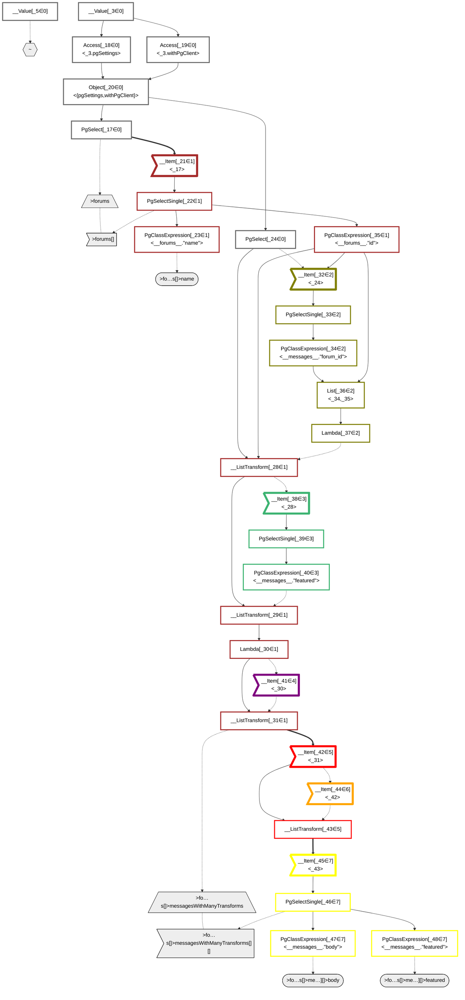

```mermaid
graph TD
    classDef path fill:#eee,stroke:#000,color:#000
    classDef plan fill:#fff,stroke-width:3px,color:#000
    classDef itemplan fill:#fff,stroke-width:6px,color:#000
    classDef sideeffectplan fill:#f00,stroke-width:6px,color:#000

    %% subgraph fields
    P1{{"~"}}:::path
    P2[/">forums"\]:::path
    P3>">forums[]"]:::path
    P2 -.- P3
    P4([">fo…s[]>name"]):::path
    %% P3 -.-> P4
    P5[/">fo…s[]>messagesWithManyTransforms"\]:::path
    P6>">fo…s[]>messagesWithManyTransforms[][]"]:::path
    P5 -.- P6
    P7([">fo…s[]>me…][]>body"]):::path
    %% P6 -.-> P7
    P8([">fo…s[]>me…][]>featured"]):::path
    %% P6 -.-> P8
    %% P3 -.-> P5
    %% P1 -.-> P2
    %% end

    %% define plans
    __Value_3["__Value[_3∈0]<br /><context>"]:::plan
    __Value_5["__Value[_5∈0]<br /><rootValue>"]:::plan
    PgSelect_17["PgSelect[_17∈0]<br /><forums>"]:::plan
    Access_18["Access[_18∈0]<br /><_3.pgSettings>"]:::plan
    Access_19["Access[_19∈0]<br /><_3.withPgClient>"]:::plan
    Object_20["Object[_20∈0]<br /><{pgSettings,withPgClient}>"]:::plan
    __Item_21>"__Item[_21∈1]<br /><_17>"]:::itemplan
    PgSelectSingle_22["PgSelectSingle[_22∈1]<br /><forums>"]:::plan
    PgClassExpression_23["PgClassExpression[_23∈1]<br /><__forums__.#quot;name#quot;>"]:::plan
    PgSelect_24["PgSelect[_24∈0]<br /><messages>"]:::plan
    __ListTransform_28["__ListTransform[_28∈1]<br /><filter:_24>"]:::plan
    __ListTransform_29["__ListTransform[_29∈1]<br /><groupBy:_28>"]:::plan
    Lambda_30["Lambda[_30∈1]"]:::plan
    __ListTransform_31["__ListTransform[_31∈1]<br /><each:_30>"]:::plan
    __Item_32>"__Item[_32∈2]<br /><_24>"]:::itemplan
    PgSelectSingle_33["PgSelectSingle[_33∈2]<br /><messages>"]:::plan
    PgClassExpression_34["PgClassExpression[_34∈2]<br /><__messages__.#quot;forum_id#quot;>"]:::plan
    PgClassExpression_35["PgClassExpression[_35∈1]<br /><__forums__.#quot;id#quot;>"]:::plan
    List_36["List[_36∈2]<br /><_34,_35>"]:::plan
    Lambda_37["Lambda[_37∈2]"]:::plan
    __Item_38>"__Item[_38∈3]<br /><_28>"]:::itemplan
    PgSelectSingle_39["PgSelectSingle[_39∈3]<br /><messages>"]:::plan
    PgClassExpression_40["PgClassExpression[_40∈3]<br /><__messages__.#quot;featured#quot;>"]:::plan
    __Item_41>"__Item[_41∈4]<br /><_30>"]:::itemplan
    __Item_42>"__Item[_42∈5]<br /><_31>"]:::itemplan
    __ListTransform_43["__ListTransform[_43∈5]<br /><each:_42>"]:::plan
    __Item_44>"__Item[_44∈6]<br /><_42>"]:::itemplan
    __Item_45>"__Item[_45∈7]<br /><_43>"]:::itemplan
    PgSelectSingle_46["PgSelectSingle[_46∈7]<br /><messages>"]:::plan
    PgClassExpression_47["PgClassExpression[_47∈7]<br /><__messages__.#quot;body#quot;>"]:::plan
    PgClassExpression_48["PgClassExpression[_48∈7]<br /><__messages__.#quot;featured#quot;>"]:::plan

    %% plan dependencies
    Object_20 --> PgSelect_17
    __Value_3 --> Access_18
    __Value_3 --> Access_19
    Access_18 --> Object_20
    Access_19 --> Object_20
    PgSelect_17 ==> __Item_21
    __Item_21 --> PgSelectSingle_22
    PgSelectSingle_22 --> PgClassExpression_23
    Object_20 --> PgSelect_24
    PgSelect_24 --> __ListTransform_28
    PgClassExpression_35 --> __ListTransform_28
    Lambda_37 -.-> __ListTransform_28
    __ListTransform_28 --> __ListTransform_29
    PgClassExpression_40 -.-> __ListTransform_29
    __ListTransform_29 --> Lambda_30
    Lambda_30 --> __ListTransform_31
    __Item_41 -.-> __ListTransform_31
    PgSelect_24 -.-> __Item_32
    PgClassExpression_35 --> __Item_32
    __Item_32 --> PgSelectSingle_33
    PgSelectSingle_33 --> PgClassExpression_34
    PgSelectSingle_22 --> PgClassExpression_35
    PgClassExpression_34 --> List_36
    PgClassExpression_35 --> List_36
    List_36 --> Lambda_37
    __ListTransform_28 -.-> __Item_38
    __Item_38 --> PgSelectSingle_39
    PgSelectSingle_39 --> PgClassExpression_40
    Lambda_30 -.-> __Item_41
    __ListTransform_31 ==> __Item_42
    __Item_42 --> __ListTransform_43
    __Item_44 -.-> __ListTransform_43
    __Item_42 -.-> __Item_44
    __ListTransform_43 ==> __Item_45
    __Item_45 --> PgSelectSingle_46
    PgSelectSingle_46 --> PgClassExpression_47
    PgSelectSingle_46 --> PgClassExpression_48

    %% plan-to-path relationships
    __Value_5 -.-> P1
    PgSelect_17 -.-> P2
    PgSelectSingle_22 -.-> P3
    PgClassExpression_23 -.-> P4
    __ListTransform_31 -.-> P5
    PgSelectSingle_46 -.-> P6
    PgClassExpression_47 -.-> P7
    PgClassExpression_48 -.-> P8

    %% allocate buckets
    classDef bucket0 stroke:#696969
    class __Value_3,__Value_5,PgSelect_17,Access_18,Access_19,Object_20,PgSelect_24 bucket0
    classDef bucket1 stroke:#a52a2a
    class __Item_21,PgSelectSingle_22,PgClassExpression_23,__ListTransform_28,__ListTransform_29,Lambda_30,__ListTransform_31,PgClassExpression_35 bucket1
    classDef bucket2 stroke:#808000
    class __Item_32,PgSelectSingle_33,PgClassExpression_34,List_36,Lambda_37 bucket2
    classDef bucket3 stroke:#3cb371
    class __Item_38,PgSelectSingle_39,PgClassExpression_40 bucket3
    classDef bucket4 stroke:#7f007f
    class __Item_41 bucket4
    classDef bucket5 stroke:#ff0000
    class __Item_42,__ListTransform_43 bucket5
    classDef bucket6 stroke:#ffa500
    class __Item_44 bucket6
    classDef bucket7 stroke:#ffff00
    class __Item_45,PgSelectSingle_46,PgClassExpression_47,PgClassExpression_48 bucket7
```
