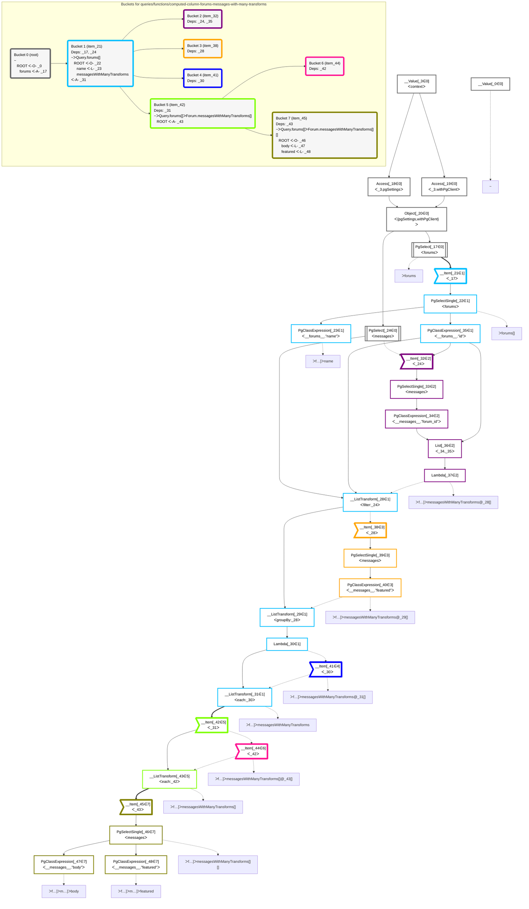

```mermaid
graph TD
    classDef path fill:#eee,stroke:#000,color:#000
    classDef plan fill:#fff,stroke-width:3px,color:#000
    classDef itemplan fill:#fff,stroke-width:6px,color:#000
    classDef sideeffectplan fill:#f00,stroke-width:6px,color:#000
    classDef bucket fill:#f6f6f6,color:#000,stroke-width:6px,text-align:left


    %% define plans
    __Value_0["__Value[_0∈0]"]:::plan
    __Value_3["__Value[_3∈0]<br />ᐸcontextᐳ"]:::plan
    PgSelect_17[["PgSelect[_17∈0]<br />ᐸforumsᐳ"]]:::plan
    Access_18["Access[_18∈0]<br />ᐸ_3.pgSettingsᐳ"]:::plan
    Access_19["Access[_19∈0]<br />ᐸ_3.withPgClientᐳ"]:::plan
    Object_20["Object[_20∈0]<br />ᐸ{pgSettings,withPgClient}ᐳ"]:::plan
    __Item_21>"__Item[_21∈1]<br />ᐸ_17ᐳ"]:::itemplan
    PgSelectSingle_22["PgSelectSingle[_22∈1]<br />ᐸforumsᐳ"]:::plan
    PgClassExpression_23["PgClassExpression[_23∈1]<br />ᐸ__forums__.”name”ᐳ"]:::plan
    PgSelect_24[["PgSelect[_24∈0]<br />ᐸmessagesᐳ"]]:::plan
    __ListTransform_28["__ListTransform[_28∈1]<br />ᐸfilter:_24ᐳ"]:::plan
    __ListTransform_29["__ListTransform[_29∈1]<br />ᐸgroupBy:_28ᐳ"]:::plan
    Lambda_30["Lambda[_30∈1]"]:::plan
    __ListTransform_31["__ListTransform[_31∈1]<br />ᐸeach:_30ᐳ"]:::plan
    __Item_32>"__Item[_32∈2]<br />ᐸ_24ᐳ"]:::itemplan
    PgSelectSingle_33["PgSelectSingle[_33∈2]<br />ᐸmessagesᐳ"]:::plan
    PgClassExpression_34["PgClassExpression[_34∈2]<br />ᐸ__messages__.”forum_id”ᐳ"]:::plan
    PgClassExpression_35["PgClassExpression[_35∈1]<br />ᐸ__forums__.”id”ᐳ"]:::plan
    List_36["List[_36∈2]<br />ᐸ_34,_35ᐳ"]:::plan
    Lambda_37["Lambda[_37∈2]"]:::plan
    __Item_38>"__Item[_38∈3]<br />ᐸ_28ᐳ"]:::itemplan
    PgSelectSingle_39["PgSelectSingle[_39∈3]<br />ᐸmessagesᐳ"]:::plan
    PgClassExpression_40["PgClassExpression[_40∈3]<br />ᐸ__messages__.”featured”ᐳ"]:::plan
    __Item_41>"__Item[_41∈4]<br />ᐸ_30ᐳ"]:::itemplan
    __Item_42>"__Item[_42∈5]<br />ᐸ_31ᐳ"]:::itemplan
    __ListTransform_43["__ListTransform[_43∈5]<br />ᐸeach:_42ᐳ"]:::plan
    __Item_44>"__Item[_44∈6]<br />ᐸ_42ᐳ"]:::itemplan
    __Item_45>"__Item[_45∈7]<br />ᐸ_43ᐳ"]:::itemplan
    PgSelectSingle_46["PgSelectSingle[_46∈7]<br />ᐸmessagesᐳ"]:::plan
    PgClassExpression_47["PgClassExpression[_47∈7]<br />ᐸ__messages__.”body”ᐳ"]:::plan
    PgClassExpression_48["PgClassExpression[_48∈7]<br />ᐸ__messages__.”featured”ᐳ"]:::plan

    %% plan dependencies
    Object_20 --> PgSelect_17
    __Value_3 --> Access_18
    __Value_3 --> Access_19
    Access_18 --> Object_20
    Access_19 --> Object_20
    PgSelect_17 ==> __Item_21
    __Item_21 --> PgSelectSingle_22
    PgSelectSingle_22 --> PgClassExpression_23
    Object_20 --> PgSelect_24
    PgSelect_24 --> __ListTransform_28
    PgClassExpression_35 --> __ListTransform_28
    Lambda_37 -.-> __ListTransform_28
    __ListTransform_28 --> __ListTransform_29
    PgClassExpression_40 -.-> __ListTransform_29
    __ListTransform_29 --> Lambda_30
    Lambda_30 --> __ListTransform_31
    __Item_41 -.-> __ListTransform_31
    PgSelect_24 -.-> __Item_32
    PgClassExpression_35 --> __Item_32
    __Item_32 --> PgSelectSingle_33
    PgSelectSingle_33 --> PgClassExpression_34
    PgSelectSingle_22 --> PgClassExpression_35
    PgClassExpression_34 --> List_36
    PgClassExpression_35 --> List_36
    List_36 --> Lambda_37
    __ListTransform_28 -.-> __Item_38
    __Item_38 --> PgSelectSingle_39
    PgSelectSingle_39 --> PgClassExpression_40
    Lambda_30 -.-> __Item_41
    __ListTransform_31 ==> __Item_42
    __Item_42 --> __ListTransform_43
    __Item_44 -.-> __ListTransform_43
    __Item_42 -.-> __Item_44
    __ListTransform_43 ==> __Item_45
    __Item_45 --> PgSelectSingle_46
    PgSelectSingle_46 --> PgClassExpression_47
    PgSelectSingle_46 --> PgClassExpression_48

    %% plan-to-path relationships
    P_0["~"]
    __Value_0 -.-> P_0
    P_17["ᐳforums"]
    PgSelect_17 -.-> P_17
    P_22["ᐳforums[]"]
    PgSelectSingle_22 -.-> P_22
    P_23["ᐳf…]ᐳname"]
    PgClassExpression_23 -.-> P_23
    P_31["ᐳf…]ᐳmessagesWithManyTransforms"]
    __ListTransform_31 -.-> P_31
    P_37["ᐳf…]ᐳmessagesWithManyTransforms@_28[]"]
    Lambda_37 -.-> P_37
    P_40["ᐳf…]ᐳmessagesWithManyTransforms@_29[]"]
    PgClassExpression_40 -.-> P_40
    P_41["ᐳf…]ᐳmessagesWithManyTransforms@_31[]"]
    __Item_41 -.-> P_41
    P_43["ᐳf…]ᐳmessagesWithManyTransforms[]"]
    __ListTransform_43 -.-> P_43
    P_44["ᐳf…]ᐳmessagesWithManyTransforms[]@_43[]"]
    __Item_44 -.-> P_44
    P_46["ᐳf…]ᐳmessagesWithManyTransforms[][]"]
    PgSelectSingle_46 -.-> P_46
    P_47["ᐳf…]ᐳm…]ᐳbody"]
    PgClassExpression_47 -.-> P_47
    P_48["ᐳf…]ᐳm…]ᐳfeatured"]
    PgClassExpression_48 -.-> P_48

    %% allocate buckets
    classDef bucket0 stroke:#696969
    class __Value_0,__Value_3,PgSelect_17,Access_18,Access_19,Object_20,PgSelect_24 bucket0
    classDef bucket1 stroke:#00bfff
    class __Item_21,PgSelectSingle_22,PgClassExpression_23,__ListTransform_28,__ListTransform_29,Lambda_30,__ListTransform_31,PgClassExpression_35 bucket1
    classDef bucket2 stroke:#7f007f
    class __Item_32,PgSelectSingle_33,PgClassExpression_34,List_36,Lambda_37 bucket2
    classDef bucket3 stroke:#ffa500
    class __Item_38,PgSelectSingle_39,PgClassExpression_40 bucket3
    classDef bucket4 stroke:#0000ff
    class __Item_41 bucket4
    classDef bucket5 stroke:#7fff00
    class __Item_42,__ListTransform_43 bucket5
    classDef bucket6 stroke:#ff1493
    class __Item_44 bucket6
    classDef bucket7 stroke:#808000
    class __Item_45,PgSelectSingle_46,PgClassExpression_47,PgClassExpression_48 bucket7

    subgraph "Buckets for queries/functions/computed-column-forums-messages-with-many-transforms"
    Bucket0("Bucket 0 (root)<br />~<br />⠀ROOT ᐸ-O- _0<br />⠀⠀forums ᐸ-A- _17"):::bucket
    style Bucket0 stroke:#696969
    Bucket1("Bucket 1 (item_21)<br />Deps: _17, _24<br />~ᐳQuery.forums[]<br />⠀ROOT ᐸ-O- _22<br />⠀⠀name ᐸ-L- _23<br />⠀⠀messagesWithManyTransforms ᐸ-A- _31"):::bucket
    style Bucket1 stroke:#00bfff
    Bucket0 --> Bucket1
    Bucket2("Bucket 2 (item_32)<br />Deps: _24, _35"):::bucket
    style Bucket2 stroke:#7f007f
    Bucket1 --> Bucket2
    Bucket3("Bucket 3 (item_38)<br />Deps: _28"):::bucket
    style Bucket3 stroke:#ffa500
    Bucket1 --> Bucket3
    Bucket4("Bucket 4 (item_41)<br />Deps: _30"):::bucket
    style Bucket4 stroke:#0000ff
    Bucket1 --> Bucket4
    Bucket5("Bucket 5 (item_42)<br />Deps: _31<br />~ᐳQuery.forums[]ᐳForum.messagesWithManyTransforms[]<br />⠀ROOT ᐸ-A- _43"):::bucket
    style Bucket5 stroke:#7fff00
    Bucket1 --> Bucket5
    Bucket6("Bucket 6 (item_44)<br />Deps: _42"):::bucket
    style Bucket6 stroke:#ff1493
    Bucket5 --> Bucket6
    Bucket7("Bucket 7 (item_45)<br />Deps: _43<br />~ᐳQuery.forums[]ᐳForum.messagesWithManyTransforms[][]<br />⠀ROOT ᐸ-O- _46<br />⠀⠀body ᐸ-L- _47<br />⠀⠀featured ᐸ-L- _48"):::bucket
    style Bucket7 stroke:#808000
    Bucket5 --> Bucket7
    end
```
