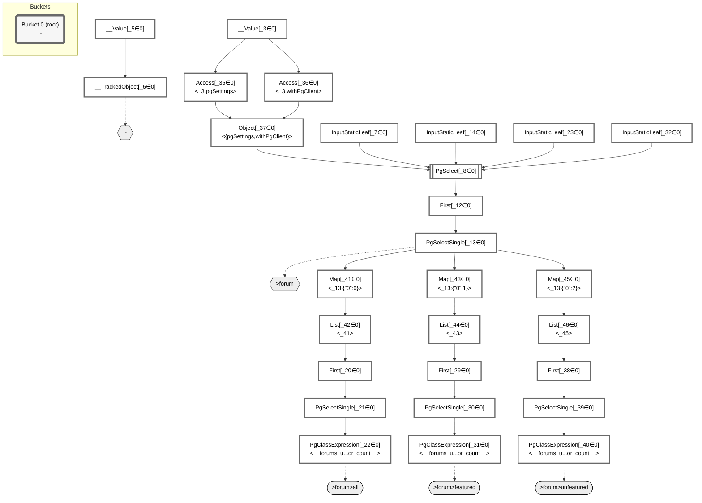

```mermaid
graph TD
    classDef path fill:#eee,stroke:#000,color:#000
    classDef plan fill:#fff,stroke-width:3px,color:#000
    classDef itemplan fill:#fff,stroke-width:6px,color:#000
    classDef sideeffectplan fill:#f00,stroke-width:6px,color:#000
    classDef bucket fill:#f6f6f6,color:#000,stroke-width:6px

    %% subgraph fields
    P1{{"~"}}:::path
    P2{{">forum"}}:::path
    P3([">forum>all"]):::path
    %% P2 -.-> P3
    P4([">forum>featured"]):::path
    %% P2 -.-> P4
    P5([">forum>unfeatured"]):::path
    %% P2 -.-> P5
    %% P1 -.-> P2
    %% end

    %% define plans
    __Value_3["__Value[_3∈0]<br /><context>"]:::plan
    __Value_5["__Value[_5∈0]<br /><rootValue>"]:::plan
    __TrackedObject_6["__TrackedObject[_6∈0]"]:::plan
    InputStaticLeaf_7["InputStaticLeaf[_7∈0]"]:::plan
    PgSelect_8[["PgSelect[_8∈0]<br /><forums>"]]:::plan
    First_12["First[_12∈0]"]:::plan
    PgSelectSingle_13["PgSelectSingle[_13∈0]<br /><forums>"]:::plan
    InputStaticLeaf_14["InputStaticLeaf[_14∈0]"]:::plan
    First_20["First[_20∈0]"]:::plan
    PgSelectSingle_21["PgSelectSingle[_21∈0]<br /><forums_unique_author_count>"]:::plan
    PgClassExpression_22["PgClassExpression[_22∈0]<br /><__forums_u...or_count__>"]:::plan
    InputStaticLeaf_23["InputStaticLeaf[_23∈0]"]:::plan
    First_29["First[_29∈0]"]:::plan
    PgSelectSingle_30["PgSelectSingle[_30∈0]<br /><forums_unique_author_count>"]:::plan
    PgClassExpression_31["PgClassExpression[_31∈0]<br /><__forums_u...or_count__>"]:::plan
    InputStaticLeaf_32["InputStaticLeaf[_32∈0]"]:::plan
    Access_35["Access[_35∈0]<br /><_3.pgSettings>"]:::plan
    Access_36["Access[_36∈0]<br /><_3.withPgClient>"]:::plan
    Object_37["Object[_37∈0]<br /><{pgSettings,withPgClient}>"]:::plan
    First_38["First[_38∈0]"]:::plan
    PgSelectSingle_39["PgSelectSingle[_39∈0]<br /><forums_unique_author_count>"]:::plan
    PgClassExpression_40["PgClassExpression[_40∈0]<br /><__forums_u...or_count__>"]:::plan
    Map_41["Map[_41∈0]<br /><_13:{#quot;0#quot;:0}>"]:::plan
    List_42["List[_42∈0]<br /><_41>"]:::plan
    Map_43["Map[_43∈0]<br /><_13:{#quot;0#quot;:1}>"]:::plan
    List_44["List[_44∈0]<br /><_43>"]:::plan
    Map_45["Map[_45∈0]<br /><_13:{#quot;0#quot;:2}>"]:::plan
    List_46["List[_46∈0]<br /><_45>"]:::plan

    %% plan dependencies
    __Value_5 --> __TrackedObject_6
    Object_37 --> PgSelect_8
    InputStaticLeaf_7 --> PgSelect_8
    InputStaticLeaf_14 --> PgSelect_8
    InputStaticLeaf_23 --> PgSelect_8
    InputStaticLeaf_32 --> PgSelect_8
    PgSelect_8 --> First_12
    First_12 --> PgSelectSingle_13
    List_42 --> First_20
    First_20 --> PgSelectSingle_21
    PgSelectSingle_21 --> PgClassExpression_22
    List_44 --> First_29
    First_29 --> PgSelectSingle_30
    PgSelectSingle_30 --> PgClassExpression_31
    __Value_3 --> Access_35
    __Value_3 --> Access_36
    Access_35 --> Object_37
    Access_36 --> Object_37
    List_46 --> First_38
    First_38 --> PgSelectSingle_39
    PgSelectSingle_39 --> PgClassExpression_40
    PgSelectSingle_13 --> Map_41
    Map_41 --> List_42
    PgSelectSingle_13 --> Map_43
    Map_43 --> List_44
    PgSelectSingle_13 --> Map_45
    Map_45 --> List_46

    %% plan-to-path relationships
    __TrackedObject_6 -.-> P1
    PgSelectSingle_13 -.-> P2
    PgClassExpression_22 -.-> P3
    PgClassExpression_31 -.-> P4
    PgClassExpression_40 -.-> P5

    %% allocate buckets
    classDef bucket0 stroke:#696969
    class __Value_3,__Value_5,__TrackedObject_6,InputStaticLeaf_7,PgSelect_8,First_12,PgSelectSingle_13,InputStaticLeaf_14,First_20,PgSelectSingle_21,PgClassExpression_22,InputStaticLeaf_23,First_29,PgSelectSingle_30,PgClassExpression_31,InputStaticLeaf_32,Access_35,Access_36,Object_37,First_38,PgSelectSingle_39,PgClassExpression_40,Map_41,List_42,Map_43,List_44,Map_45,List_46 bucket0

    subgraph Buckets
    Bucket0("Bucket 0 (root)<br />~"):::bucket
    style Bucket0 stroke:#696969
    end
```
