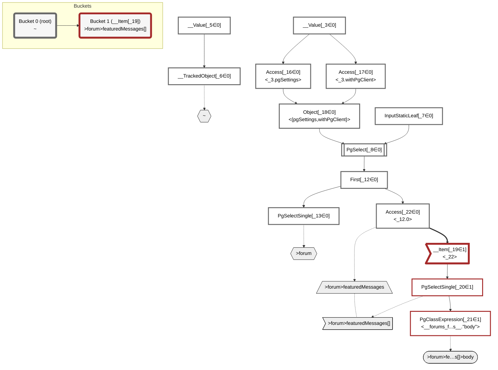

```mermaid
graph TD
    classDef path fill:#eee,stroke:#000,color:#000
    classDef plan fill:#fff,stroke-width:3px,color:#000
    classDef itemplan fill:#fff,stroke-width:6px,color:#000
    classDef sideeffectplan fill:#f00,stroke-width:6px,color:#000
    classDef bucket fill:#f6f6f6,color:#000,stroke-width:6px

    %% subgraph fields
    P1{{"~"}}:::path
    P2{{">forum"}}:::path
    P3[/">forum>featuredMessages"\]:::path
    P4>">forum>featuredMessages[]"]:::path
    P3 -.- P4
    P5([">forum>fe…s[]>body"]):::path
    %% P4 -.-> P5
    %% P2 -.-> P3
    %% P1 -.-> P2
    %% end

    %% define plans
    __Value_3["__Value[_3∈0]<br /><context>"]:::plan
    __Value_5["__Value[_5∈0]<br /><rootValue>"]:::plan
    __TrackedObject_6["__TrackedObject[_6∈0]"]:::plan
    InputStaticLeaf_7["InputStaticLeaf[_7∈0]"]:::plan
    PgSelect_8[["PgSelect[_8∈0]<br /><forums>"]]:::plan
    First_12["First[_12∈0]"]:::plan
    PgSelectSingle_13["PgSelectSingle[_13∈0]<br /><forums>"]:::plan
    Access_16["Access[_16∈0]<br /><_3.pgSettings>"]:::plan
    Access_17["Access[_17∈0]<br /><_3.withPgClient>"]:::plan
    Object_18["Object[_18∈0]<br /><{pgSettings,withPgClient}>"]:::plan
    __Item_19>"__Item[_19∈1]<br /><_22>"]:::itemplan
    PgSelectSingle_20["PgSelectSingle[_20∈1]<br /><forums_featured_messages>"]:::plan
    PgClassExpression_21["PgClassExpression[_21∈1]<br /><__forums_f...s__.#quot;body#quot;>"]:::plan
    Access_22["Access[_22∈0]<br /><_12.0>"]:::plan

    %% plan dependencies
    __Value_5 --> __TrackedObject_6
    Object_18 --> PgSelect_8
    InputStaticLeaf_7 --> PgSelect_8
    PgSelect_8 --> First_12
    First_12 --> PgSelectSingle_13
    __Value_3 --> Access_16
    __Value_3 --> Access_17
    Access_16 --> Object_18
    Access_17 --> Object_18
    Access_22 ==> __Item_19
    __Item_19 --> PgSelectSingle_20
    PgSelectSingle_20 --> PgClassExpression_21
    First_12 --> Access_22

    %% plan-to-path relationships
    __TrackedObject_6 -.-> P1
    PgSelectSingle_13 -.-> P2
    Access_22 -.-> P3
    PgSelectSingle_20 -.-> P4
    PgClassExpression_21 -.-> P5

    %% allocate buckets
    classDef bucket0 stroke:#696969
    class __Value_3,__Value_5,__TrackedObject_6,InputStaticLeaf_7,PgSelect_8,First_12,PgSelectSingle_13,Access_16,Access_17,Object_18,Access_22 bucket0
    classDef bucket1 stroke:#a52a2a
    class __Item_19,PgSelectSingle_20,PgClassExpression_21 bucket1

    subgraph Buckets
    Bucket0("Bucket 0 (root)<br />~"):::bucket
    style Bucket0 stroke:#696969
    Bucket1("Bucket 1 (__Item[_19])<br />>forum>featuredMessages[]"):::bucket
    style Bucket1 stroke:#a52a2a
    Bucket0 --> Bucket1
    end
```
