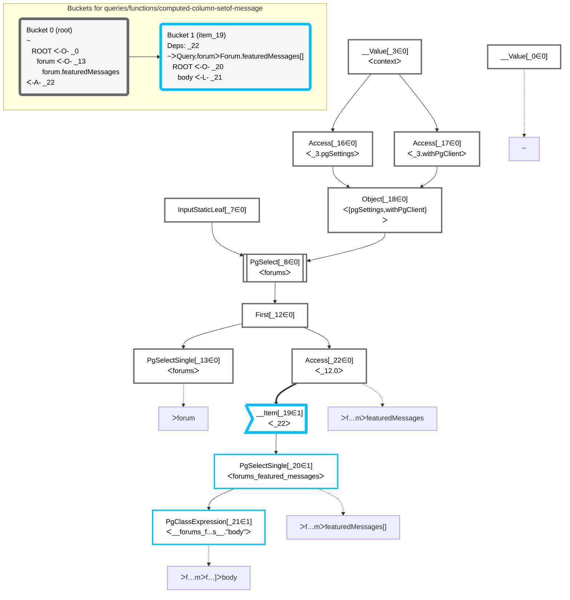

```mermaid
graph TD
    classDef path fill:#eee,stroke:#000,color:#000
    classDef plan fill:#fff,stroke-width:3px,color:#000
    classDef itemplan fill:#fff,stroke-width:6px,color:#000
    classDef sideeffectplan fill:#f00,stroke-width:6px,color:#000
    classDef bucket fill:#f6f6f6,color:#000,stroke-width:6px,text-align:left


    %% define plans
    __Value_0["__Value[_0∈0]"]:::plan
    __Value_3["__Value[_3∈0]<br />ᐸcontextᐳ"]:::plan
    InputStaticLeaf_7["InputStaticLeaf[_7∈0]"]:::plan
    PgSelect_8[["PgSelect[_8∈0]<br />ᐸforumsᐳ"]]:::plan
    First_12["First[_12∈0]"]:::plan
    PgSelectSingle_13["PgSelectSingle[_13∈0]<br />ᐸforumsᐳ"]:::plan
    Access_16["Access[_16∈0]<br />ᐸ_3.pgSettingsᐳ"]:::plan
    Access_17["Access[_17∈0]<br />ᐸ_3.withPgClientᐳ"]:::plan
    Object_18["Object[_18∈0]<br />ᐸ{pgSettings,withPgClient}ᐳ"]:::plan
    __Item_19>"__Item[_19∈1]<br />ᐸ_22ᐳ"]:::itemplan
    PgSelectSingle_20["PgSelectSingle[_20∈1]<br />ᐸforums_featured_messagesᐳ"]:::plan
    PgClassExpression_21["PgClassExpression[_21∈1]<br />ᐸ__forums_f...s__.”body”ᐳ"]:::plan
    Access_22["Access[_22∈0]<br />ᐸ_12.0ᐳ"]:::plan

    %% plan dependencies
    Object_18 --> PgSelect_8
    InputStaticLeaf_7 --> PgSelect_8
    PgSelect_8 --> First_12
    First_12 --> PgSelectSingle_13
    __Value_3 --> Access_16
    __Value_3 --> Access_17
    Access_16 --> Object_18
    Access_17 --> Object_18
    Access_22 ==> __Item_19
    __Item_19 --> PgSelectSingle_20
    PgSelectSingle_20 --> PgClassExpression_21
    First_12 --> Access_22

    %% plan-to-path relationships
    P_0["~"]
    __Value_0 -.-> P_0
    P_13["ᐳforum"]
    PgSelectSingle_13 -.-> P_13
    P_20["ᐳf…mᐳfeaturedMessages[]"]
    PgSelectSingle_20 -.-> P_20
    P_21["ᐳf…mᐳf…]ᐳbody"]
    PgClassExpression_21 -.-> P_21
    P_22["ᐳf…mᐳfeaturedMessages"]
    Access_22 -.-> P_22

    %% allocate buckets
    classDef bucket0 stroke:#696969
    class __Value_0,__Value_3,InputStaticLeaf_7,PgSelect_8,First_12,PgSelectSingle_13,Access_16,Access_17,Object_18,Access_22 bucket0
    classDef bucket1 stroke:#00bfff
    class __Item_19,PgSelectSingle_20,PgClassExpression_21 bucket1

    subgraph "Buckets for queries/functions/computed-column-setof-message"
    Bucket0("Bucket 0 (root)<br />~<br />⠀ROOT ᐸ-O- _0<br />⠀⠀forum ᐸ-O- _13<br />⠀⠀⠀forum.featuredMessages ᐸ-A- _22"):::bucket
    style Bucket0 stroke:#696969
    Bucket1("Bucket 1 (item_19)<br />Deps: _22<br />~ᐳQuery.forumᐳForum.featuredMessages[]<br />⠀ROOT ᐸ-O- _20<br />⠀⠀body ᐸ-L- _21"):::bucket
    style Bucket1 stroke:#00bfff
    Bucket0 --> Bucket1
    end
```
