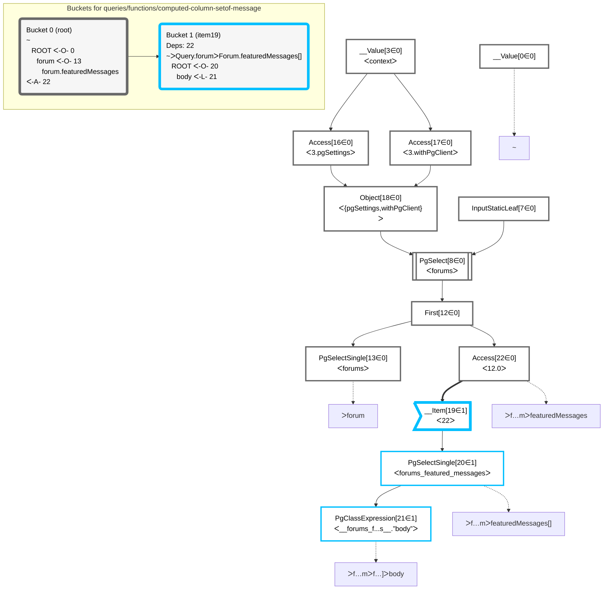

```mermaid
graph TD
    classDef path fill:#eee,stroke:#000,color:#000
    classDef plan fill:#fff,stroke-width:3px,color:#000
    classDef itemplan fill:#fff,stroke-width:6px,color:#000
    classDef sideeffectplan fill:#f00,stroke-width:6px,color:#000
    classDef bucket fill:#f6f6f6,color:#000,stroke-width:6px,text-align:left


    %% define plans
    __Value0["__Value[0∈0]"]:::plan
    PgSelectSingle13["PgSelectSingle[13∈0]<br />ᐸforumsᐳ"]:::plan
    PgClassExpression21["PgClassExpression[21∈1]<br />ᐸ__forums_f...s__.”body”ᐳ"]:::plan
    PgSelectSingle20["PgSelectSingle[20∈1]<br />ᐸforums_featured_messagesᐳ"]:::plan
    __Item19>"__Item[19∈1]<br />ᐸ22ᐳ"]:::itemplan
    Access22["Access[22∈0]<br />ᐸ12.0ᐳ"]:::plan
    First12["First[12∈0]"]:::plan
    PgSelect8[["PgSelect[8∈0]<br />ᐸforumsᐳ"]]:::plan
    Object18["Object[18∈0]<br />ᐸ{pgSettings,withPgClient}ᐳ"]:::plan
    Access16["Access[16∈0]<br />ᐸ3.pgSettingsᐳ"]:::plan
    Access17["Access[17∈0]<br />ᐸ3.withPgClientᐳ"]:::plan
    __Value3["__Value[3∈0]<br />ᐸcontextᐳ"]:::plan
    InputStaticLeaf7["InputStaticLeaf[7∈0]"]:::plan

    %% plan dependencies
    First12 --> PgSelectSingle13
    PgSelectSingle20 --> PgClassExpression21
    __Item19 --> PgSelectSingle20
    Access22 ==> __Item19
    First12 --> Access22
    PgSelect8 --> First12
    Object18 & InputStaticLeaf7 --> PgSelect8
    Access16 & Access17 --> Object18
    __Value3 --> Access16
    __Value3 --> Access17

    %% plan-to-path relationships
    P0["~"]
    __Value0 -.-> P0
    P13["ᐳforum"]
    PgSelectSingle13 -.-> P13
    P20["ᐳf…mᐳfeaturedMessages[]"]
    PgSelectSingle20 -.-> P20
    P21["ᐳf…mᐳf…]ᐳbody"]
    PgClassExpression21 -.-> P21
    P22["ᐳf…mᐳfeaturedMessages"]
    Access22 -.-> P22

    subgraph "Buckets for queries/functions/computed-column-setof-message"
    Bucket0("Bucket 0 (root)<br />~<br />⠀ROOT ᐸ-O- 0<br />⠀⠀forum ᐸ-O- 13<br />⠀⠀⠀forum.featuredMessages ᐸ-A- 22"):::bucket
    classDef bucket0 stroke:#696969
    class Bucket0,__Value0,__Value3,InputStaticLeaf7,PgSelect8,First12,PgSelectSingle13,Access16,Access17,Object18,Access22 bucket0
    Bucket1("Bucket 1 (item19)<br />Deps: 22<br />~ᐳQuery.forumᐳForum.featuredMessages[]<br />⠀ROOT ᐸ-O- 20<br />⠀⠀body ᐸ-L- 21"):::bucket
    classDef bucket1 stroke:#00bfff
    class Bucket1,__Item19,PgSelectSingle20,PgClassExpression21 bucket1
    Bucket0 --> Bucket1
    end
```
