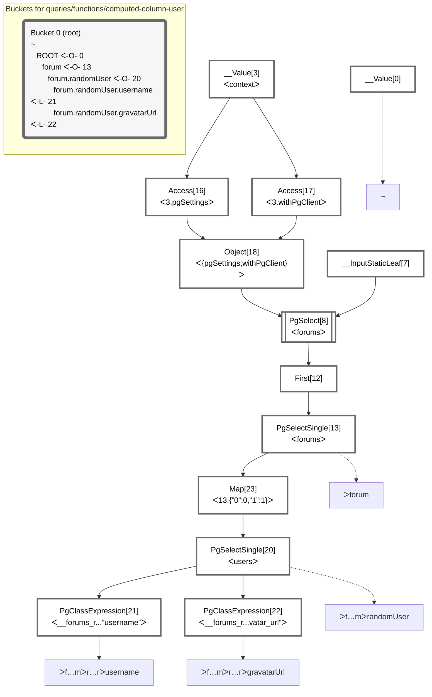

```mermaid
graph TD
    classDef path fill:#eee,stroke:#000,color:#000
    classDef plan fill:#fff,stroke-width:3px,color:#000
    classDef itemplan fill:#fff,stroke-width:6px,color:#000
    classDef sideeffectplan fill:#f00,stroke-width:6px,color:#000
    classDef bucket fill:#f6f6f6,color:#000,stroke-width:6px,text-align:left


    %% define plans
    __Value0["__Value[0]"]:::plan
    PgClassExpression21["PgClassExpression[21]<br />ᐸ__forums_r...”username”ᐳ"]:::plan
    PgClassExpression22["PgClassExpression[22]<br />ᐸ__forums_r...vatar_url”ᐳ"]:::plan
    PgSelectSingle20["PgSelectSingle[20]<br />ᐸusersᐳ"]:::plan
    Map23["Map[23]<br />ᐸ13:{”0”:0,”1”:1}ᐳ"]:::plan
    PgSelectSingle13["PgSelectSingle[13]<br />ᐸforumsᐳ"]:::plan
    First12["First[12]"]:::plan
    PgSelect8[["PgSelect[8]<br />ᐸforumsᐳ"]]:::plan
    Object18["Object[18]<br />ᐸ{pgSettings,withPgClient}ᐳ"]:::plan
    Access16["Access[16]<br />ᐸ3.pgSettingsᐳ"]:::plan
    Access17["Access[17]<br />ᐸ3.withPgClientᐳ"]:::plan
    __Value3["__Value[3]<br />ᐸcontextᐳ"]:::plan
    __InputStaticLeaf7["__InputStaticLeaf[7]"]:::plan

    %% plan dependencies
    PgSelectSingle20 --> PgClassExpression21
    PgSelectSingle20 --> PgClassExpression22
    Map23 --> PgSelectSingle20
    PgSelectSingle13 --> Map23
    First12 --> PgSelectSingle13
    PgSelect8 --> First12
    Object18 & __InputStaticLeaf7 --> PgSelect8
    Access16 & Access17 --> Object18
    __Value3 --> Access16
    __Value3 --> Access17

    %% plan-to-path relationships
    P0["~"]
    __Value0 -.-> P0
    P13["ᐳforum"]
    PgSelectSingle13 -.-> P13
    P20["ᐳf…mᐳrandomUser"]
    PgSelectSingle20 -.-> P20
    P21["ᐳf…mᐳr…rᐳusername"]
    PgClassExpression21 -.-> P21
    P22["ᐳf…mᐳr…rᐳgravatarUrl"]
    PgClassExpression22 -.-> P22

    subgraph "Buckets for queries/functions/computed-column-user"
    Bucket0("Bucket 0 (root)<br />~<br />⠀ROOT ᐸ-O- 0<br />⠀⠀forum ᐸ-O- 13<br />⠀⠀⠀forum.randomUser ᐸ-O- 20<br />⠀⠀⠀⠀forum.randomUser.username ᐸ-L- 21<br />⠀⠀⠀⠀forum.randomUser.gravatarUrl ᐸ-L- 22"):::bucket
    classDef bucket0 stroke:#696969
    class Bucket0,__Value0,__Value3,__InputStaticLeaf7,PgSelect8,First12,PgSelectSingle13,Access16,Access17,Object18,PgSelectSingle20,PgClassExpression21,PgClassExpression22,Map23 bucket0
    end
```
