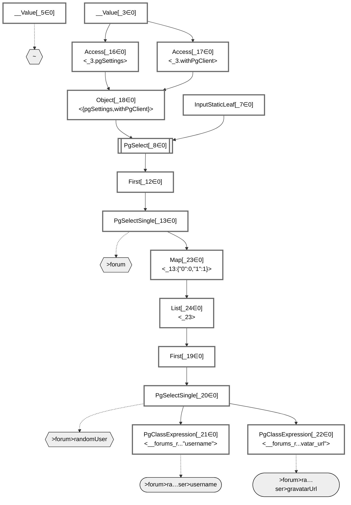

```mermaid
graph TD
    classDef path fill:#eee,stroke:#000,color:#000
    classDef plan fill:#fff,stroke-width:3px,color:#000
    classDef itemplan fill:#fff,stroke-width:6px,color:#000
    classDef sideeffectplan fill:#f00,stroke-width:6px,color:#000

    %% subgraph fields
    P1{{"~"}}:::path
    P2{{">forum"}}:::path
    P3{{">forum>randomUser"}}:::path
    P4([">forum>ra…ser>username"]):::path
    %% P3 -.-> P4
    P5([">forum>ra…ser>gravatarUrl"]):::path
    %% P3 -.-> P5
    %% P2 -.-> P3
    %% P1 -.-> P2
    %% end

    %% define plans
    __Value_3["__Value[_3∈0]<br /><context>"]:::plan
    __Value_5["__Value[_5∈0]<br /><rootValue>"]:::plan
    InputStaticLeaf_7["InputStaticLeaf[_7∈0]"]:::plan
    PgSelect_8[["PgSelect[_8∈0]<br /><forums>"]]:::plan
    First_12["First[_12∈0]"]:::plan
    PgSelectSingle_13["PgSelectSingle[_13∈0]<br /><forums>"]:::plan
    Access_16["Access[_16∈0]<br /><_3.pgSettings>"]:::plan
    Access_17["Access[_17∈0]<br /><_3.withPgClient>"]:::plan
    Object_18["Object[_18∈0]<br /><{pgSettings,withPgClient}>"]:::plan
    First_19["First[_19∈0]"]:::plan
    PgSelectSingle_20["PgSelectSingle[_20∈0]<br /><users>"]:::plan
    PgClassExpression_21["PgClassExpression[_21∈0]<br /><__forums_r...#quot;username#quot;>"]:::plan
    PgClassExpression_22["PgClassExpression[_22∈0]<br /><__forums_r...vatar_url#quot;>"]:::plan
    Map_23["Map[_23∈0]<br /><_13:{#quot;0#quot;:0,#quot;1#quot;:1}>"]:::plan
    List_24["List[_24∈0]<br /><_23>"]:::plan

    %% plan dependencies
    Object_18 --> PgSelect_8
    InputStaticLeaf_7 --> PgSelect_8
    PgSelect_8 --> First_12
    First_12 --> PgSelectSingle_13
    __Value_3 --> Access_16
    __Value_3 --> Access_17
    Access_16 --> Object_18
    Access_17 --> Object_18
    List_24 --> First_19
    First_19 --> PgSelectSingle_20
    PgSelectSingle_20 --> PgClassExpression_21
    PgSelectSingle_20 --> PgClassExpression_22
    PgSelectSingle_13 --> Map_23
    Map_23 --> List_24

    %% plan-to-path relationships
    __Value_5 -.-> P1
    PgSelectSingle_13 -.-> P2
    PgSelectSingle_20 -.-> P3
    PgClassExpression_21 -.-> P4
    PgClassExpression_22 -.-> P5

    %% allocate buckets
    classDef bucket0 stroke:#696969
    class __Value_3,__Value_5,InputStaticLeaf_7,PgSelect_8,First_12,PgSelectSingle_13,Access_16,Access_17,Object_18,First_19,PgSelectSingle_20,PgClassExpression_21,PgClassExpression_22,Map_23,List_24 bucket0
```
