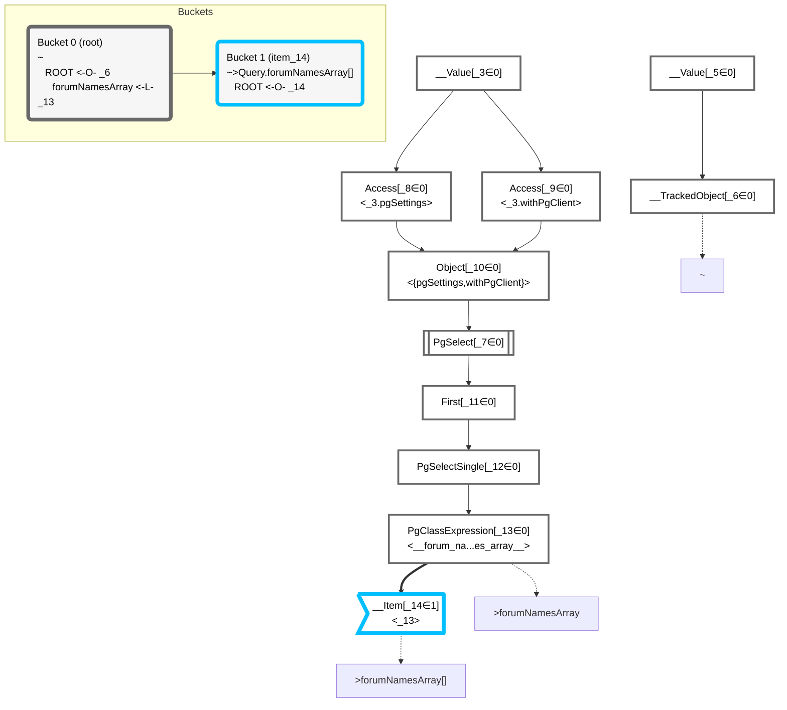

```mermaid
graph TD
    classDef path fill:#eee,stroke:#000,color:#000
    classDef plan fill:#fff,stroke-width:3px,color:#000
    classDef itemplan fill:#fff,stroke-width:6px,color:#000
    classDef sideeffectplan fill:#f00,stroke-width:6px,color:#000
    classDef bucket fill:#f6f6f6,color:#000,stroke-width:6px,text-align:left


    %% define plans
    __Value_3["__Value[_3∈0]<br /><context>"]:::plan
    __Value_5["__Value[_5∈0]<br /><rootValue>"]:::plan
    __TrackedObject_6["__TrackedObject[_6∈0]"]:::plan
    PgSelect_7[["PgSelect[_7∈0]<br /><forum_names_array>"]]:::plan
    Access_8["Access[_8∈0]<br /><_3.pgSettings>"]:::plan
    Access_9["Access[_9∈0]<br /><_3.withPgClient>"]:::plan
    Object_10["Object[_10∈0]<br /><{pgSettings,withPgClient}>"]:::plan
    First_11["First[_11∈0]"]:::plan
    PgSelectSingle_12["PgSelectSingle[_12∈0]<br /><forum_names_array>"]:::plan
    PgClassExpression_13["PgClassExpression[_13∈0]<br /><__forum_na...es_array__>"]:::plan
    __Item_14>"__Item[_14∈1]<br /><_13>"]:::itemplan

    %% plan dependencies
    __Value_5 --> __TrackedObject_6
    Object_10 --> PgSelect_7
    __Value_3 --> Access_8
    __Value_3 --> Access_9
    Access_8 --> Object_10
    Access_9 --> Object_10
    PgSelect_7 --> First_11
    First_11 --> PgSelectSingle_12
    PgSelectSingle_12 --> PgClassExpression_13
    PgClassExpression_13 ==> __Item_14

    %% plan-to-path relationships
    P_6["~"]
    __TrackedObject_6 -.-> P_6
    P_13[">forumNamesArray"]
    PgClassExpression_13 -.-> P_13
    P_14[">forumNamesArray[]"]
    __Item_14 -.-> P_14

    %% allocate buckets
    classDef bucket0 stroke:#696969
    class __Value_3,__Value_5,__TrackedObject_6,PgSelect_7,Access_8,Access_9,Object_10,First_11,PgSelectSingle_12,PgClassExpression_13 bucket0
    classDef bucket1 stroke:#00bfff
    class __Item_14 bucket1

    subgraph Buckets
    Bucket0("Bucket 0 (root)<br />~<br />⠀ROOT <-O- _6<br />⠀⠀forumNamesArray <-L- _13"):::bucket
    style Bucket0 stroke:#696969
    Bucket1("Bucket 1 (item_14)<br />~>Query.forumNamesArray[]<br />⠀ROOT <-O- _14"):::bucket
    style Bucket1 stroke:#00bfff
    Bucket0 --> Bucket1
    end
```
