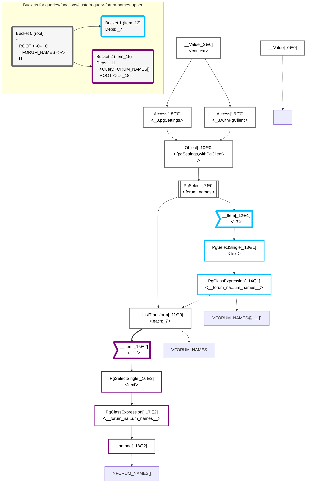

```mermaid
graph TD
    classDef path fill:#eee,stroke:#000,color:#000
    classDef plan fill:#fff,stroke-width:3px,color:#000
    classDef itemplan fill:#fff,stroke-width:6px,color:#000
    classDef sideeffectplan fill:#f00,stroke-width:6px,color:#000
    classDef bucket fill:#f6f6f6,color:#000,stroke-width:6px,text-align:left


    %% define plans
    __Value_0["__Value[_0∈0]"]:::plan
    Lambda_18["Lambda[_18∈2]"]:::plan
    PgClassExpression_17["PgClassExpression[_17∈2]<br />ᐸ__forum_na...um_names__ᐳ"]:::plan
    PgSelectSingle_16["PgSelectSingle[_16∈2]<br />ᐸtextᐳ"]:::plan
    __Item_15>"__Item[_15∈2]<br />ᐸ_11ᐳ"]:::itemplan
    __ListTransform_11["__ListTransform[_11∈0]<br />ᐸeach:_7ᐳ"]:::plan
    PgClassExpression_14["PgClassExpression[_14∈1]<br />ᐸ__forum_na...um_names__ᐳ"]:::plan
    PgSelectSingle_13["PgSelectSingle[_13∈1]<br />ᐸtextᐳ"]:::plan
    __Item_12>"__Item[_12∈1]<br />ᐸ_7ᐳ"]:::itemplan
    PgSelect_7[["PgSelect[_7∈0]<br />ᐸforum_namesᐳ"]]:::plan
    Object_10["Object[_10∈0]<br />ᐸ{pgSettings,withPgClient}ᐳ"]:::plan
    Access_8["Access[_8∈0]<br />ᐸ_3.pgSettingsᐳ"]:::plan
    Access_9["Access[_9∈0]<br />ᐸ_3.withPgClientᐳ"]:::plan
    __Value_3["__Value[_3∈0]<br />ᐸcontextᐳ"]:::plan

    %% plan dependencies
    PgClassExpression_17 --> Lambda_18
    PgSelectSingle_16 --> PgClassExpression_17
    __Item_15 --> PgSelectSingle_16
    __ListTransform_11 ==> __Item_15
    PgSelect_7 --> __ListTransform_11
    PgClassExpression_14 -.-> __ListTransform_11
    PgSelectSingle_13 --> PgClassExpression_14
    __Item_12 --> PgSelectSingle_13
    PgSelect_7 -.-> __Item_12
    Object_10 --> PgSelect_7
    Access_8 & Access_9 --> Object_10
    __Value_3 --> Access_8
    __Value_3 --> Access_9

    %% plan-to-path relationships
    P_0["~"]
    __Value_0 -.-> P_0
    P_11["ᐳFORUM_NAMES"]
    __ListTransform_11 -.-> P_11
    P_14["ᐳFORUM_NAMES@_11[]"]
    PgClassExpression_14 -.-> P_14
    P_18["ᐳFORUM_NAMES[]"]
    Lambda_18 -.-> P_18

    subgraph "Buckets for queries/functions/custom-query-forum-names-upper"
    Bucket0("Bucket 0 (root)<br />~<br />⠀ROOT ᐸ-O- _0<br />⠀⠀FORUM_NAMES ᐸ-A- _11"):::bucket
    classDef bucket0 stroke:#696969
    class Bucket0,__Value_0,__Value_3,PgSelect_7,Access_8,Access_9,Object_10,__ListTransform_11 bucket0
    Bucket1("Bucket 1 (item_12)<br />Deps: _7"):::bucket
    classDef bucket1 stroke:#00bfff
    class Bucket1,__Item_12,PgSelectSingle_13,PgClassExpression_14 bucket1
    Bucket2("Bucket 2 (item_15)<br />Deps: _11<br />~ᐳQuery.FORUM_NAMES[]<br />⠀ROOT ᐸ-L- _18"):::bucket
    classDef bucket2 stroke:#7f007f
    class Bucket2,__Item_15,PgSelectSingle_16,PgClassExpression_17,Lambda_18 bucket2
    Bucket0 --> Bucket1 & Bucket2
    end
```
