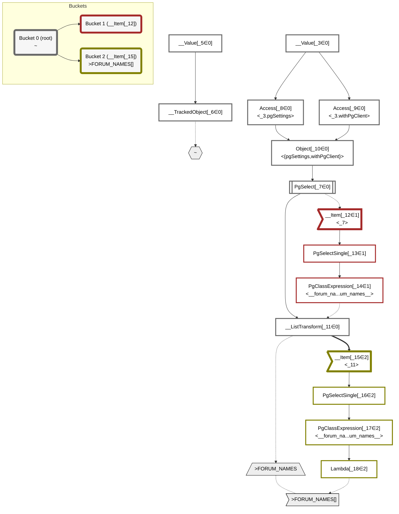

```mermaid
graph TD
    classDef path fill:#eee,stroke:#000,color:#000
    classDef plan fill:#fff,stroke-width:3px,color:#000
    classDef itemplan fill:#fff,stroke-width:6px,color:#000
    classDef sideeffectplan fill:#f00,stroke-width:6px,color:#000
    classDef bucket fill:#f6f6f6,color:#000,stroke-width:6px

    %% subgraph fields
    P1{{"~"}}:::path
    P2[/">FORUM_NAMES"\]:::path
    P3>">FORUM_NAMES[]"]:::path
    P2 -.- P3
    %% P1 -.-> P2
    %% end

    %% define plans
    __Value_3["__Value[_3∈0]<br /><context>"]:::plan
    __Value_5["__Value[_5∈0]<br /><rootValue>"]:::plan
    __TrackedObject_6["__TrackedObject[_6∈0]"]:::plan
    PgSelect_7[["PgSelect[_7∈0]<br /><forum_names>"]]:::plan
    Access_8["Access[_8∈0]<br /><_3.pgSettings>"]:::plan
    Access_9["Access[_9∈0]<br /><_3.withPgClient>"]:::plan
    Object_10["Object[_10∈0]<br /><{pgSettings,withPgClient}>"]:::plan
    __ListTransform_11["__ListTransform[_11∈0]<br /><each:_7>"]:::plan
    __Item_12>"__Item[_12∈1]<br /><_7>"]:::itemplan
    PgSelectSingle_13["PgSelectSingle[_13∈1]<br /><text>"]:::plan
    PgClassExpression_14["PgClassExpression[_14∈1]<br /><__forum_na...um_names__>"]:::plan
    __Item_15>"__Item[_15∈2]<br /><_11>"]:::itemplan
    PgSelectSingle_16["PgSelectSingle[_16∈2]<br /><text>"]:::plan
    PgClassExpression_17["PgClassExpression[_17∈2]<br /><__forum_na...um_names__>"]:::plan
    Lambda_18["Lambda[_18∈2]"]:::plan

    %% plan dependencies
    __Value_5 --> __TrackedObject_6
    Object_10 --> PgSelect_7
    __Value_3 --> Access_8
    __Value_3 --> Access_9
    Access_8 --> Object_10
    Access_9 --> Object_10
    PgSelect_7 --> __ListTransform_11
    PgClassExpression_14 -.-> __ListTransform_11
    PgSelect_7 -.-> __Item_12
    __Item_12 --> PgSelectSingle_13
    PgSelectSingle_13 --> PgClassExpression_14
    __ListTransform_11 ==> __Item_15
    __Item_15 --> PgSelectSingle_16
    PgSelectSingle_16 --> PgClassExpression_17
    PgClassExpression_17 --> Lambda_18

    %% plan-to-path relationships
    __TrackedObject_6 -.-> P1
    __ListTransform_11 -.-> P2
    Lambda_18 -.-> P3

    %% allocate buckets
    classDef bucket0 stroke:#696969
    class __Value_3,__Value_5,__TrackedObject_6,PgSelect_7,Access_8,Access_9,Object_10,__ListTransform_11 bucket0
    classDef bucket1 stroke:#a52a2a
    class __Item_12,PgSelectSingle_13,PgClassExpression_14 bucket1
    classDef bucket2 stroke:#808000
    class __Item_15,PgSelectSingle_16,PgClassExpression_17,Lambda_18 bucket2

    subgraph Buckets
    Bucket0("Bucket 0 (root)<br />~"):::bucket
    style Bucket0 stroke:#696969
    Bucket1("Bucket 1 (__Item[_12])<br />"):::bucket
    style Bucket1 stroke:#a52a2a
    Bucket0 --> Bucket1
    Bucket2("Bucket 2 (__Item[_15])<br />>FORUM_NAMES[]"):::bucket
    style Bucket2 stroke:#808000
    Bucket0 --> Bucket2
    end
```
