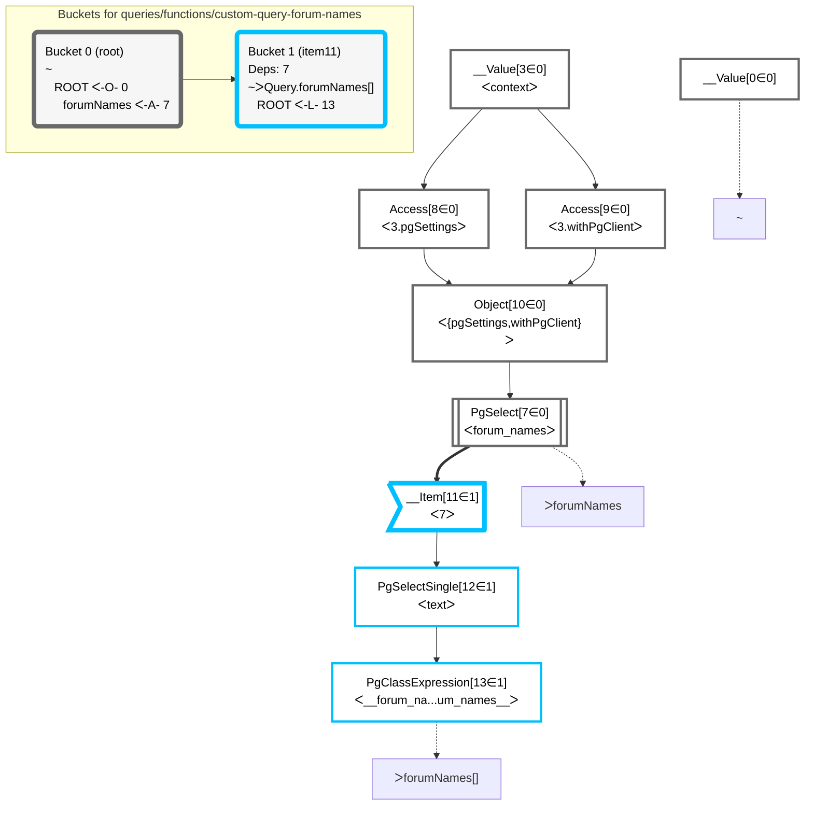

```mermaid
graph TD
    classDef path fill:#eee,stroke:#000,color:#000
    classDef plan fill:#fff,stroke-width:3px,color:#000
    classDef itemplan fill:#fff,stroke-width:6px,color:#000
    classDef sideeffectplan fill:#f00,stroke-width:6px,color:#000
    classDef bucket fill:#f6f6f6,color:#000,stroke-width:6px,text-align:left


    %% define plans
    __Value0["__Value[0∈0]"]:::plan
    PgClassExpression13["PgClassExpression[13∈1]<br />ᐸ__forum_na...um_names__ᐳ"]:::plan
    PgSelectSingle12["PgSelectSingle[12∈1]<br />ᐸtextᐳ"]:::plan
    __Item11>"__Item[11∈1]<br />ᐸ7ᐳ"]:::itemplan
    PgSelect7[["PgSelect[7∈0]<br />ᐸforum_namesᐳ"]]:::plan
    Object10["Object[10∈0]<br />ᐸ{pgSettings,withPgClient}ᐳ"]:::plan
    Access8["Access[8∈0]<br />ᐸ3.pgSettingsᐳ"]:::plan
    Access9["Access[9∈0]<br />ᐸ3.withPgClientᐳ"]:::plan
    __Value3["__Value[3∈0]<br />ᐸcontextᐳ"]:::plan

    %% plan dependencies
    PgSelectSingle12 --> PgClassExpression13
    __Item11 --> PgSelectSingle12
    PgSelect7 ==> __Item11
    Object10 --> PgSelect7
    Access8 & Access9 --> Object10
    __Value3 --> Access8
    __Value3 --> Access9

    %% plan-to-path relationships
    P0["~"]
    __Value0 -.-> P0
    P7["ᐳforumNames"]
    PgSelect7 -.-> P7
    P13["ᐳforumNames[]"]
    PgClassExpression13 -.-> P13

    subgraph "Buckets for queries/functions/custom-query-forum-names"
    Bucket0("Bucket 0 (root)<br />~<br />⠀ROOT ᐸ-O- 0<br />⠀⠀forumNames ᐸ-A- 7"):::bucket
    classDef bucket0 stroke:#696969
    class Bucket0,__Value0,__Value3,PgSelect7,Access8,Access9,Object10 bucket0
    Bucket1("Bucket 1 (item11)<br />Deps: 7<br />~ᐳQuery.forumNames[]<br />⠀ROOT ᐸ-L- 13"):::bucket
    classDef bucket1 stroke:#00bfff
    class Bucket1,__Item11,PgSelectSingle12,PgClassExpression13 bucket1
    Bucket0 --> Bucket1
    end
```
